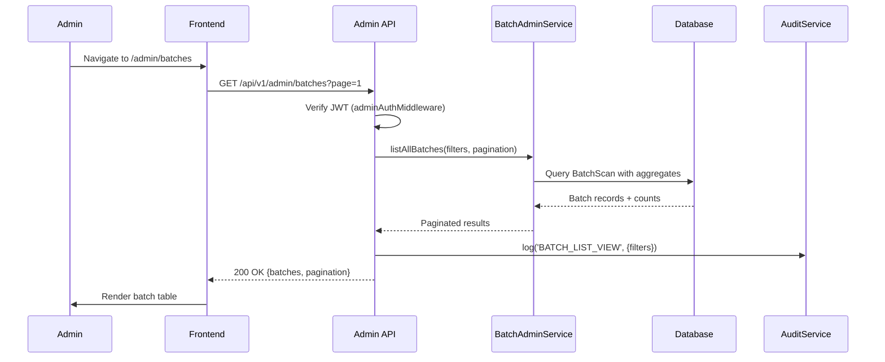
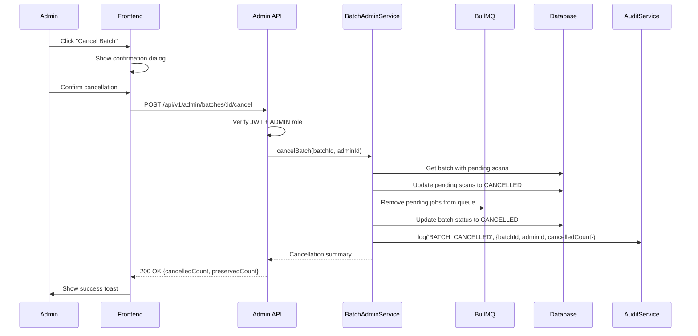

# Design Document: Admin Batch Management

## Overview

This design extends the admin panel with comprehensive batch management capabilities. The architecture adds new admin API endpoints for batch operations, a new frontend route for batch management, and integrates batch context into existing scan management views.

**Design Philosophy**: Extend the existing admin module patterns. Reuse existing authentication, audit logging, and UI component patterns. No modifications to user-facing batch functionality.

## Steering Document Alignment

### Technical Standards (tech.md)
- **Backend**: Node.js/TypeScript with Fastify (existing admin patterns)
- **Database**: PostgreSQL with Prisma ORM (existing batch schema)
- **Frontend**: Next.js 14 with React 18, TailwindCSS, shadcn/ui (existing admin UI)
- **API Design**: RESTful with Zod validation (follows admin module patterns)
- **Authentication**: JWT-based admin auth with cookie storage

### Project Structure (structure.md)
- **API**: `apps/api/src/modules/admin/batch-admin.service.ts` - new admin service
- **Frontend Pages**: `apps/web/src/app/admin/batches/` - new admin batch pages
- **Frontend Components**: `apps/web/src/components/admin/batch/` - batch admin UI
- **API Types**: Extend `apps/api/src/modules/admin/admin.schema.ts`

## Code Reuse Analysis

### Existing Components to Leverage

| Component | Location | How It Will Be Used |
|-----------|----------|---------------------|
| `adminAuthMiddleware` | `apps/api/src/modules/admin/admin.middleware.ts` | Protect all batch admin endpoints |
| `requireSuperAdmin` | `apps/api/src/modules/admin/admin.middleware.ts` | Gate delete operations |
| `logAuditEvent` | `apps/api/src/modules/admin/audit.service.ts` | Log all batch admin actions |
| `scan-admin.service.ts` | `apps/api/src/modules/admin/scan-admin.service.ts` | Pattern reference for batch-admin.service |
| `ScanTable` | `apps/web/src/components/admin/ScanTable.tsx` | Pattern for BatchTable component |
| `AdminLayout` | `apps/web/src/app/admin/layout.tsx` | Wrap batch pages |
| `paginationSchema` | `apps/api/src/modules/admin/admin.schema.ts` | Reuse for batch pagination |
| `BatchService` | `apps/api/src/modules/batches/batch.service.ts` | Reuse aggregation logic |
| `BatchProgress` | `apps/web/src/components/features/batch/BatchProgress.tsx` | Adapt for admin view |

### Integration Points

| Existing System | Integration Approach |
|-----------------|---------------------|
| Admin Navigation | Add "Batches" menu item in admin sidebar |
| Audit Logging | Log all batch operations (view, cancel, delete, export) |
| Scan List View | Add batch indicator column and filter |
| Scan Detail View | Add batch context section |
| Dashboard | Extend with batch metrics widgets |
| PDF Export | Reuse batch-export.service.ts for admin exports |

## Architecture

### High-Level Architecture

```
┌─────────────────────────────────────────────────────────────┐
│                      Admin Frontend                          │
│  ┌─────────────┐  ┌─────────────┐  ┌─────────────────────┐ │
│  │ /admin/     │  │ /admin/     │  │ /admin/batches/{id} │ │
│  │ batches     │  │ scans       │  │                     │ │
│  │ (list)      │  │ (+batch     │  │ (detail view)       │ │
│  │             │  │  context)   │  │                     │ │
│  └──────┬──────┘  └──────┬──────┘  └──────────┬──────────┘ │
└─────────┼────────────────┼────────────────────┼─────────────┘
          │                │                    │
          ▼                ▼                    ▼
┌─────────────────────────────────────────────────────────────┐
│                     Admin API Layer                          │
│  ┌─────────────────────────────────────────────────────────┐│
│  │              batch-admin.controller.ts                   ││
│  │  GET  /admin/batches           - List all batches       ││
│  │  GET  /admin/batches/:id       - Batch details          ││
│  │  POST /admin/batches/:id/cancel - Cancel batch          ││
│  │  DELETE /admin/batches/:id     - Delete batch           ││
│  │  GET  /admin/batches/:id/export - Export batch          ││
│  │  POST /admin/batches/:id/retry - Retry failed scans     ││
│  └─────────────────────────────────────────────────────────┘│
└─────────────────────────────────────────────────────────────┘
          │                │                    │
          ▼                ▼                    ▼
┌─────────────────────────────────────────────────────────────┐
│                    Service Layer                             │
│  ┌────────────────────┐  ┌─────────────────────────────────┐│
│  │ batch-admin.service│  │ audit.service                   ││
│  │ - listAllBatches() │  │ - log(action, details)          ││
│  │ - getBatchDetails()│  └─────────────────────────────────┘│
│  │ - cancelBatch()    │                                     │
│  │ - deleteBatch()    │                                     │
│  │ - retryFailedScans()│                                    │
│  └────────────────────┘                                     │
└─────────────────────────────────────────────────────────────┘
          │
          ▼
┌─────────────────────────────────────────────────────────────┐
│                    Database Layer                            │
│  ┌─────────────┐  ┌──────────┐  ┌────────────┐            │
│  │ BatchScan   │──│ Scan     │──│ ScanResult │            │
│  │ table       │  │ table    │  │ table      │            │
│  └─────────────┘  └──────────┘  └────────────┘            │
└─────────────────────────────────────────────────────────────┘
```

### Admin Batch List Flow



### Admin Batch Cancel Flow



## Components and Interfaces

### Component 1: BatchAdminService

- **Purpose**: Admin-specific batch operations with cross-session access
- **Location**: `apps/api/src/modules/admin/batch-admin.service.ts`
- **Reuses**: Database queries from BatchService, patterns from scan-admin.service

```typescript
interface BatchAdminService {
  // List all batches across all sessions with filtering
  listAllBatches(
    filters: BatchListFilters,
    pagination: PaginationInput
  ): Promise<PaginatedBatchList>;

  // Get comprehensive batch details for admin view
  getBatchDetails(batchId: string): Promise<BatchAdminDetails>;

  // Cancel a batch (admin override - no session check)
  cancelBatch(batchId: string, adminId: string): Promise<CancelResult>;

  // Delete batch and all associated data
  deleteBatch(batchId: string, adminId: string): Promise<DeleteResult>;

  // Retry all failed scans in a batch
  retryFailedScans(batchId: string, adminId: string): Promise<RetryResult>;

  // Export batch for admin (no session check)
  exportBatch(batchId: string, format: 'pdf' | 'json' | 'csv'): Promise<Buffer>;

  // Get batch metrics for dashboard
  getBatchMetrics(): Promise<BatchMetrics>;
}

interface BatchListFilters {
  status?: BatchStatus;
  startDate?: Date;
  endDate?: Date;
  homepageUrl?: string;
  sessionId?: string;
}

interface BatchAdminDetails {
  batch: BatchScan;
  scans: ScanWithIssueCount[];
  aggregate: AggregateStats;
  topCriticalUrls: TopCriticalUrl[];
  sessionInfo: SessionInfo | null;
}
```

### Component 2: BatchAdminController

- **Purpose**: Admin API endpoints for batch management
- **Location**: `apps/api/src/modules/admin/batch-admin.controller.ts`
- **Reuses**: Admin middleware chain, Zod schemas, audit logging

```typescript
// Endpoints registered under /api/v1/admin
GET    /admin/batches              // List all batches (paginated, filtered)
GET    /admin/batches/:id          // Get batch details
POST   /admin/batches/:id/cancel   // Cancel running batch
DELETE /admin/batches/:id          // Delete batch (SUPER_ADMIN only)
GET    /admin/batches/:id/export   // Export batch results
POST   /admin/batches/:id/retry    // Retry failed scans
GET    /admin/dashboard/batches    // Batch metrics for dashboard
```

### Component 3: Admin Batch List Page

- **Purpose**: Display all batches with filtering and actions
- **Location**: `apps/web/src/app/admin/batches/page.tsx`
- **Reuses**: AdminLayout, table patterns from ScanTable

```typescript
// Page structure
export default function AdminBatchesPage() {
  return (
    <AdminLayout>
      <PageHeader title="Batch Management" />
      <BatchFilters />
      <BatchSummaryBar />
      <BatchTable />
      <Pagination />
    </AdminLayout>
  );
}

// Sub-components
interface BatchTableProps {
  batches: AdminBatch[];
  onRowClick: (batchId: string) => void;
  onCancel: (batchId: string) => void;
  onDelete: (batchId: string) => void;
}
```

### Component 4: Admin Batch Detail Page

- **Purpose**: Comprehensive batch view with admin actions
- **Location**: `apps/web/src/app/admin/batches/[id]/page.tsx`
- **Reuses**: BatchProgress patterns, issue display components

```typescript
// Page structure
export default function AdminBatchDetailPage({ params }: { params: { id: string } }) {
  return (
    <AdminLayout>
      <BatchHeader batch={batch} />
      <BatchActions batch={batch} />
      <BatchOverview batch={batch} aggregate={aggregate} />
      <CriticalUrlsCard urls={topCriticalUrls} />
      <BatchScanList scans={scans} />
    </AdminLayout>
  );
}

// Action buttons based on batch state
interface BatchActionsProps {
  batch: BatchAdminDetails;
  onCancel: () => void;
  onDelete: () => void;
  onRetry: () => void;
  onExport: (format: 'pdf' | 'json' | 'csv') => void;
}
```

### Component 5: useAdminBatches Hook

- **Purpose**: Data fetching for admin batch operations
- **Location**: `apps/web/src/hooks/useAdminBatches.ts`
- **Reuses**: React Query patterns from existing admin hooks

```typescript
interface UseAdminBatchesReturn {
  batches: AdminBatch[];
  pagination: PaginationMeta;
  isLoading: boolean;
  error: string | null;
  filters: BatchListFilters;
  setFilters: (filters: BatchListFilters) => void;
  refetch: () => void;
}

interface UseAdminBatchDetailReturn {
  batch: BatchAdminDetails | null;
  isLoading: boolean;
  error: string | null;
  cancelBatch: () => Promise<void>;
  deleteBatch: () => Promise<void>;
  retryFailed: () => Promise<void>;
  exportBatch: (format: 'pdf' | 'json' | 'csv') => Promise<void>;
}

function useAdminBatches(filters?: BatchListFilters): UseAdminBatchesReturn;
function useAdminBatchDetail(batchId: string): UseAdminBatchDetailReturn;
```

### Component 6: Scan Table Enhancement

- **Purpose**: Add batch context to existing scan list
- **Location**: Modify `apps/web/src/components/admin/ScanTable.tsx`

```typescript
// New column in scan table
interface ScanTableColumn {
  // ... existing columns ...
  batchInfo?: {
    batchId: string;
    homepageUrl: string;
    position: string; // e.g., "3/10"
  };
}

// New filter option
interface ScanFilters {
  // ... existing filters ...
  batchFilter: 'all' | 'batched' | 'non-batched' | string; // specific batchId
}
```

## Data Models

### API Request/Response Schemas

```typescript
// Admin Batch List Request
interface AdminBatchListRequest {
  page?: number;           // Default: 1
  limit?: number;          // Default: 20, max: 100
  status?: BatchStatus;
  startDate?: string;      // ISO date
  endDate?: string;        // ISO date
  homepageUrl?: string;    // Partial match
  sessionId?: string;      // Exact match
}

// Admin Batch List Response
interface AdminBatchListResponse {
  batches: AdminBatchSummary[];
  pagination: {
    page: number;
    limit: number;
    total: number;
    totalPages: number;
  };
  summary: {
    totalBatches: number;
    totalUrls: number;
    aggregateIssues: AggregateStats;
  };
}

interface AdminBatchSummary {
  id: string;
  homepageUrl: string;
  totalUrls: number;
  completedCount: number;
  failedCount: number;
  status: BatchStatus;
  wcagLevel: WcagLevel;
  totalIssues: number;
  criticalCount: number;
  seriousCount: number;
  moderateCount: number;
  minorCount: number;
  sessionId: string | null;
  createdAt: string;
  completedAt: string | null;
}

// Admin Batch Detail Response
interface AdminBatchDetailResponse {
  batch: {
    id: string;
    homepageUrl: string;
    wcagLevel: WcagLevel;
    status: BatchStatus;
    totalUrls: number;
    completedCount: number;
    failedCount: number;
    discoveryId: string | null;
    createdAt: string;
    completedAt: string | null;
    cancelledAt: string | null;
  };
  aggregate: {
    totalIssues: number;
    criticalCount: number;
    seriousCount: number;
    moderateCount: number;
    minorCount: number;
    passedChecks: number;
  };
  scans: Array<{
    id: string;
    url: string;
    pageTitle: string | null;
    status: ScanStatus;
    errorMessage: string | null;
    completedAt: string | null;
    issueCount?: {
      total: number;
      critical: number;
      serious: number;
      moderate: number;
      minor: number;
    };
  }>;
  topCriticalUrls: Array<{
    url: string;
    pageTitle: string | null;
    criticalCount: number;
  }>;
  session: {
    id: string;
    fingerprint: string;
    createdAt: string;
  } | null;
}

// Cancel Batch Response
interface CancelBatchResponse {
  batchId: string;
  status: 'CANCELLED';
  cancelledCount: number;
  preservedCount: number;
  message: string;
}

// Delete Batch Response
interface DeleteBatchResponse {
  batchId: string;
  deletedScans: number;
  deletedIssues: number;
  message: string;
}

// Retry Failed Response
interface RetryFailedResponse {
  batchId: string;
  retriedCount: number;
  jobIds: string[];
  message: string;
}

// Batch Metrics for Dashboard
interface BatchMetricsResponse {
  totals: {
    today: number;
    thisWeek: number;
    thisMonth: number;
  };
  averages: {
    urlsPerBatch: number;
    processingTimeMs: number;
    completionRate: number;
  };
  recentBatches: Array<{
    id: string;
    homepageUrl: string;
    status: BatchStatus;
    progress: string; // "X/Y"
    createdAt: string;
  }>;
  trends: Array<{
    date: string;
    batchCount: number;
    avgUrls: number;
    completionRate: number;
  }>;
}
```

### Zod Validation Schemas

```typescript
// apps/api/src/modules/admin/admin.schema.ts (extensions)

export const batchListQuerySchema = z.object({
  page: z.coerce.number().min(1).default(1),
  limit: z.coerce.number().min(1).max(100).default(20),
  status: z.enum(['PENDING', 'RUNNING', 'COMPLETED', 'FAILED', 'CANCELLED', 'STALE']).optional(),
  startDate: z.string().datetime().optional(),
  endDate: z.string().datetime().optional(),
  homepageUrl: z.string().optional(),
  sessionId: z.string().uuid().optional(),
});

export const batchIdParamSchema = z.object({
  id: z.string().uuid(),
});

export const batchExportQuerySchema = z.object({
  format: z.enum(['pdf', 'json', 'csv']).default('pdf'),
});
```

## Error Handling

### Error Scenarios

| Scenario | HTTP Status | Error Code | Admin Response |
|----------|-------------|------------|----------------|
| Batch not found | 404 | `BATCH_NOT_FOUND` | Show "Batch not found" error page |
| Unauthorized access | 401 | `UNAUTHORIZED` | Redirect to login |
| Insufficient role (delete) | 403 | `FORBIDDEN` | Show "Permission denied" message |
| Cancel already completed | 400 | `INVALID_STATE` | Show "Cannot cancel completed batch" |
| Delete in progress | 409 | `CONFLICT` | Show "Cannot delete running batch" |
| Rate limit exceeded (retry) | 429 | `RATE_LIMIT` | Show rate limit message with cooldown |
| Export generation failed | 500 | `EXPORT_FAILED` | Show retry option with error details |
| Database error | 500 | `INTERNAL_ERROR` | Show generic error with support contact |

### Error Recovery

1. **Failed List Load**: Show error banner with retry button
2. **Failed Action**: Toast notification with specific error, allow retry
3. **Partial Export**: Notify which scans couldn't be exported
4. **Session Timeout**: Redirect to login, preserve current URL for redirect back

## Testing Strategy

### Unit Testing

| Component | Test Focus | Location |
|-----------|------------|----------|
| `BatchAdminService` | CRUD operations, filtering, pagination | `batch-admin.service.test.ts` |
| `BatchAdminController` | Request validation, auth, response format | `batch-admin.controller.test.ts` |
| `useAdminBatches` | Data fetching, error handling | `useAdminBatches.test.ts` |
| `BatchTable` | Rendering, sorting, actions | `BatchTable.test.tsx` |

### Integration Testing

| Test Scenario | Description |
|---------------|-------------|
| List batches with filters | Verify filtering by status, date, URL |
| Batch detail load | Verify all data loads including aggregates |
| Cancel batch flow | Verify cancellation updates all scans |
| Delete batch flow | Verify cascade delete of all data |
| Export formats | Verify PDF, JSON, CSV generation |

### End-to-End Testing (Playwright)

| Test Flow | Steps |
|-----------|-------|
| Admin batch list | Login, navigate, verify table, apply filters |
| Batch detail view | Click batch, verify all sections load |
| Cancel batch | Find running batch, cancel, verify status update |
| Delete batch | SUPER_ADMIN login, delete batch, verify removal |
| Export batch | Complete batch, export each format, verify downloads |

## Security Considerations

1. **Authentication**: All endpoints require valid admin JWT
2. **Authorization**: Delete requires SUPER_ADMIN role
3. **Audit Trail**: All actions logged with admin ID, timestamp, details
4. **Session Bypass**: Admin can view/manage batches without owning session
5. **Rate Limit Respect**: Retry operations check original user's rate limit
6. **XSS Prevention**: Export content sanitized before PDF generation
7. **CSRF Protection**: All mutation endpoints require valid session

### Audit Log Format

```typescript
interface BatchAuditLog {
  action: 'BATCH_VIEW' | 'BATCH_LIST' | 'BATCH_CANCEL' | 'BATCH_DELETE' | 'BATCH_RETRY' | 'BATCH_EXPORT';
  adminId: string;
  batchId: string;
  timestamp: Date;
  details: {
    // Action-specific details
    affectedScans?: number;
    exportFormat?: string;
    filters?: BatchListFilters;
  };
  ipAddress: string;
  userAgent: string;
}
```

## Performance Considerations

1. **Batch List Query**: Indexed by status, createdAt; aggregate in subquery
2. **Batch Detail Query**: Single query with JOIN for scans and issues
3. **Dashboard Metrics**: Cached 5 minutes, refreshed on demand
4. **Export Generation**: Async for large batches (>20 URLs)
5. **Pagination**: Default 20, max 100 to limit payload size

### Caching Strategy

```typescript
// Dashboard metrics cache
const BATCH_METRICS_CACHE_KEY = 'admin:batch:metrics';
const BATCH_METRICS_TTL = 300; // 5 minutes

// Batch list summary cache (per filter combination)
const BATCH_SUMMARY_CACHE_KEY = (filters: string) => `admin:batch:summary:${filters}`;
const BATCH_SUMMARY_TTL = 60; // 1 minute
```

## UI/UX Considerations

### Batch List Page Layout

```
┌─────────────────────────────────────────────────────────────────┐
│ Admin > Batches                                                  │
├─────────────────────────────────────────────────────────────────┤
│ ┌─────────────────────────────────────────────────────────────┐ │
│ │ Filters: [Status ▼] [Date Range] [URL Search...] [Clear]   │ │
│ └─────────────────────────────────────────────────────────────┘ │
│ ┌─────────────────────────────────────────────────────────────┐ │
│ │ Summary: 156 batches | 2,340 URLs | 12,450 issues          │ │
│ └─────────────────────────────────────────────────────────────┘ │
│ ┌─────────────────────────────────────────────────────────────┐ │
│ │ Homepage URL     │ URLs │ Status    │ Issues │ Created     │ │
│ ├─────────────────────────────────────────────────────────────┤ │
│ │ example.com      │ 10   │ ✅ Done   │ 45     │ 2h ago      │ │
│ │ shop.example.com │ 25   │ 🔄 3/25   │ -      │ 1h ago      │ │
│ │ blog.test.com    │ 5    │ ❌ Failed │ 12     │ 3h ago      │ │
│ └─────────────────────────────────────────────────────────────┘ │
│ [< Prev] Page 1 of 8 [Next >]                                    │
└─────────────────────────────────────────────────────────────────┘
```

### Batch Detail Page Layout

```
┌─────────────────────────────────────────────────────────────────┐
│ Admin > Batches > example.com                          [Actions]│
│                                              [Cancel] [Delete] │
├─────────────────────────────────────────────────────────────────┤
│ ┌────────────────────────┐ ┌────────────────────────────────┐  │
│ │ Batch Info             │ │ Aggregate Statistics           │  │
│ │ ID: abc-123            │ │ Total Issues: 45               │  │
│ │ WCAG: AA               │ │ ├ Critical: 5                  │  │
│ │ Status: COMPLETED      │ │ ├ Serious: 12                  │  │
│ │ URLs: 10/10            │ │ ├ Moderate: 18                 │  │
│ │ Created: Dec 29, 10:00 │ │ └ Minor: 10                    │  │
│ └────────────────────────┘ │ Passed: 456                    │  │
│                            └────────────────────────────────┘  │
│ ┌─────────────────────────────────────────────────────────────┐│
│ │ ⚠️ Top Critical URLs                                        ││
│ │ 1. /checkout (3 critical) - Payment form issues            ││
│ │ 2. /login (2 critical) - Form accessibility                ││
│ └─────────────────────────────────────────────────────────────┘│
│ ┌─────────────────────────────────────────────────────────────┐│
│ │ Scans (10)                                    [Export ▼]   ││
│ ├─────────────────────────────────────────────────────────────┤│
│ │ URL                │ Status │ Issues │ Actions             ││
│ │ example.com/       │ ✅     │ 8      │ [View Scan]         ││
│ │ example.com/about  │ ✅     │ 5      │ [View Scan]         ││
│ │ example.com/error  │ ❌     │ -      │ [View Error]        ││
│ └─────────────────────────────────────────────────────────────┘│
└─────────────────────────────────────────────────────────────────┘
```

## Migration Plan

1. **Database**: No schema changes required (uses existing BatchScan table)
2. **API**: Add new endpoints under `/api/v1/admin/batches/`
3. **Frontend**: Add new admin pages and components
4. **Navigation**: Add "Batches" item to admin sidebar
5. **Scan Enhancement**: Add batch column to existing scan table
6. **Dashboard**: Add batch metrics widgets
7. **Testing**: Add E2E tests for admin batch flows

### Rollout Strategy

1. **Phase 1**: Batch list and detail view (read-only)
2. **Phase 2**: Admin actions (cancel, delete, retry)
3. **Phase 3**: Dashboard integration and export
4. **Phase 4**: Scan list enhancement with batch context
