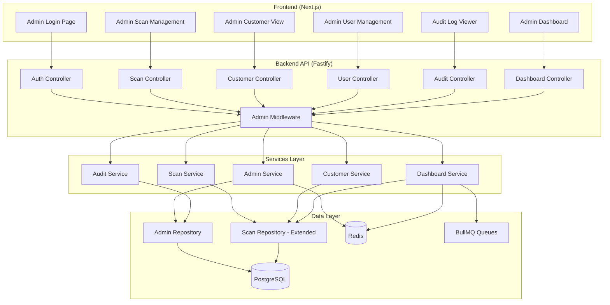
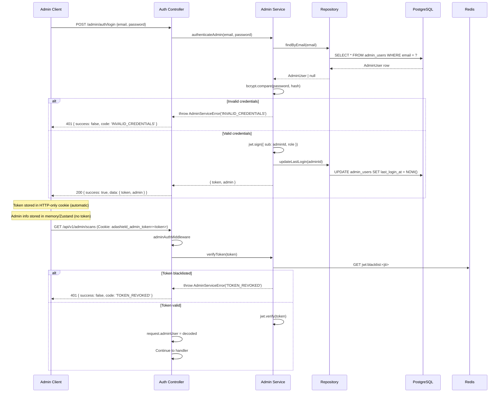
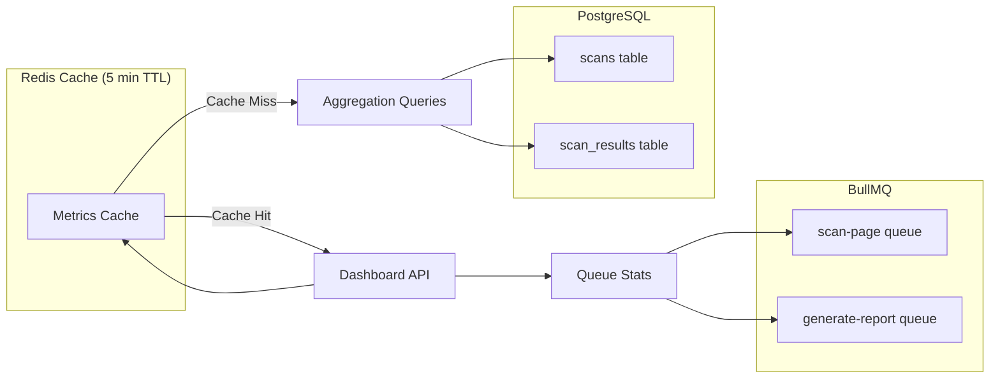

# Design Document: Admin Module

## Overview

The Admin Module provides administrative capabilities for ADAShield, enabling authorized administrators to manage all scans in the system, track customers by email, view analytics, and maintain audit logs. This design extends the existing guest session architecture with a parallel admin authentication layer that coexists without breaking current functionality.

The module consists of:
- **Backend**: New `admin` module in `apps/api/src/modules/admin/` with JWT-based authentication
- **Frontend**: New `/admin` route group in `apps/web/src/app/admin/` with dedicated dashboard
- **Database**: New Prisma models for `AdminUser` and `AuditLog`

## Steering Document Alignment

### Technical Standards (tech.md)

| Standard | Implementation |
|----------|----------------|
| **Fastify Framework** | All admin routes use Fastify with preHandler middleware chain |
| **Zod Validation** | Request schemas use Zod for type-safe validation |
| **Prisma ORM** | AdminUser and AuditLog models in existing schema |
| **JWT Authentication** | HS256 algorithm with configurable secret via env vars |
| **bcrypt Hashing** | Cost factor 12 for password hashing (per tech.md security requirements) |
| **Redis Caching** | JWT blacklist and dashboard metrics caching |
| **React Query** | Admin API calls use React Query for server state |
| **Zustand** | Admin auth state management in dedicated store |
| **TailwindCSS + shadcn/ui** | Admin UI follows existing design system |

### Project Structure (structure.md)

```
apps/api/src/modules/admin/
├── admin.controller.ts      # Route handlers
├── admin.service.ts         # Business logic
├── admin.repository.ts      # Data access
├── admin.schema.ts          # Zod validation
├── admin.types.ts           # TypeScript interfaces
├── admin.middleware.ts      # JWT auth middleware
└── index.ts                 # Module exports

apps/web/src/app/admin/
├── layout.tsx               # Admin layout with sidebar
├── page.tsx                 # Dashboard (redirect target)
├── login/page.tsx           # Login page
├── dashboard/page.tsx       # Analytics dashboard
├── scans/page.tsx           # Scan management
├── scans/[id]/page.tsx      # Scan detail
├── customers/page.tsx       # Customer list
├── customers/[email]/page.tsx  # Customer detail
├── users/page.tsx           # Admin user management
└── audit/page.tsx           # Audit log viewer

apps/web/src/components/admin/
├── AdminSidebar.tsx
├── AdminHeader.tsx
├── ScanTable.tsx
├── CustomerTable.tsx
├── AuditLogTable.tsx
├── DashboardMetrics.tsx
└── DashboardCharts.tsx

apps/web/src/stores/admin-auth.ts  # Admin auth state
apps/web/src/lib/admin-api.ts      # Admin API client
```

## Code Reuse Analysis

### Existing Components to Leverage

| Component | Location | How Used |
|-----------|----------|----------|
| **Session Middleware Pattern** | `apps/api/src/shared/middleware/session.ts` | JWT middleware follows same preHandler pattern |
| **Redis Keys Pattern** | `apps/api/src/shared/constants/redis-keys.ts` | Add admin-specific keys (JWT blacklist, metrics cache) |
| **API Response Wrapper** | All controllers | Reuse `{ success, data, error, code }` format |
| **Error Class Pattern** | `scan.service.ts` | Create `AdminServiceError` with same structure |
| **Zod Schema Pattern** | `scan.schema.ts` | Follow same validation patterns |
| **API Client Pattern** | `apps/web/src/lib/api.ts` | Extend with admin endpoints |
| **shadcn/ui Components** | `apps/web/src/components/ui/` | Reuse Button, Table, Card, Input, Dialog |
| **Prisma Client** | `packages/database` | Extend existing schema |

### Integration Points

| System | Integration Method |
|--------|-------------------|
| **Existing Scans** | Query via `scan.repository.ts` patterns, add admin-specific filters |
| **Redis Cache** | Use existing `getRedisClient()` for JWT blacklist and metrics |
| **PostgreSQL** | Add models to existing `schema.prisma` with proper indexes |
| **BullMQ** | Query queue stats for dashboard system health |
| **Existing Session** | Admin JWT coexists with guest session cookies (different auth header) |

## Architecture

### System Architecture



### Authentication Flow



### Admin Dashboard Data Flow



## Components and Interfaces

### Component 1: Admin Authentication Middleware

- **Purpose**: Validate JWT tokens on all admin routes
- **File**: `apps/api/src/modules/admin/admin.middleware.ts`
- **Interfaces**:
  ```typescript
  interface AdminTokenPayload {
    sub: string;       // Admin user ID
    email: string;
    role: AdminRole;
    iat: number;
    exp: number;
    jti: string;       // Unique token ID for blacklisting
  }

  // Fastify extension
  declare module 'fastify' {
    interface FastifyRequest {
      adminUser?: AdminTokenPayload;
    }
  }

  export const adminAuthMiddleware: preHandlerHookHandler;
  ```
- **Dependencies**: `jsonwebtoken`, Redis client, env config
- **Reuses**: Session middleware pattern from `session.ts`

### Component 2: Admin Service

- **Purpose**: Core business logic for admin operations
- **File**: `apps/api/src/modules/admin/admin.service.ts`
- **Interfaces**:
  ```typescript
  class AdminServiceError extends Error {
    constructor(
      message: string,
      public readonly code: AdminErrorCode,
      public override readonly cause?: Error
    );
  }

  type AdminErrorCode =
    | 'INVALID_CREDENTIALS'
    | 'ADMIN_NOT_FOUND'
    | 'ADMIN_DEACTIVATED'
    | 'EMAIL_EXISTS'
    | 'TOKEN_REVOKED'
    | 'TOKEN_EXPIRED'
    | 'RATE_LIMIT_EXCEEDED'
    | 'UNAUTHORIZED';

  interface AdminService {
    // Authentication
    login(email: string, password: string): Promise<LoginResult>;
    logout(token: string): Promise<void>;
    verifyToken(token: string): Promise<AdminTokenPayload>;

    // User Management
    createAdmin(data: CreateAdminInput): Promise<AdminUser>;
    listAdmins(pagination: PaginationInput): Promise<PaginatedResult<AdminUser>>;
    updateAdmin(id: string, data: UpdateAdminInput): Promise<AdminUser>;
    deactivateAdmin(id: string): Promise<void>;
    resetPassword(id: string): Promise<string>; // Returns temp password

    // Audit
    logAction(adminId: string, action: AuditAction, details: AuditDetails): Promise<void>;
  }
  ```
- **Dependencies**: Admin Repository, Redis, bcrypt, jsonwebtoken
- **Reuses**: Error class pattern from `ScanServiceError`

### Component 3: Scan Management Service

- **Purpose**: Admin-level scan operations with system-wide visibility
- **File**: `apps/api/src/modules/admin/scan-admin.service.ts`
- **Interfaces**:
  ```typescript
  interface ScanAdminService {
    listAllScans(filters: ScanFilters, pagination: PaginationInput): Promise<PaginatedResult<ScanWithDetails>>;
    getScanDetails(scanId: string): Promise<ScanWithFullDetails>;
    deleteScan(scanId: string, softDelete: boolean): Promise<void>;
    retryScan(scanId: string): Promise<Scan>;
  }

  interface ScanFilters {
    status?: ScanStatus[];
    dateFrom?: Date;
    dateTo?: Date;
    email?: string;
    url?: string;
  }
  ```
- **Dependencies**: Existing scan.repository.ts (extended), BullMQ
- **Reuses**: Existing `ScanRepository` patterns

### Component 4: Customer Service

- **Purpose**: Aggregate and manage customers by email
- **File**: `apps/api/src/modules/admin/customer.service.ts`
- **Interfaces**:
  ```typescript
  interface CustomerSummary {
    email: string;
    totalScans: number;
    firstScanAt: Date;
    lastScanAt: Date;
    avgIssuesPerScan: number;
  }

  interface CustomerService {
    listCustomers(filters: CustomerFilters, pagination: PaginationInput): Promise<PaginatedResult<CustomerSummary>>;
    getCustomerScans(email: string, pagination: PaginationInput): Promise<PaginatedResult<Scan>>;
    searchByEmail(query: string): Promise<CustomerSummary[]>;
    exportCustomers(format: 'csv' | 'json'): Promise<Buffer>;
  }

  interface CustomerFilters {
    scanCountMin?: number;
    scanCountMax?: number;
    dateFrom?: Date;
    dateTo?: Date;
  }
  ```
- **Dependencies**: Scan repository
- **Reuses**: Aggregation patterns from existing result.service.ts

### Component 5: Dashboard Service

- **Purpose**: Analytics and system health metrics
- **File**: `apps/api/src/modules/admin/dashboard.service.ts`
- **Interfaces**:
  ```typescript
  interface DashboardMetrics {
    scans: {
      today: number;
      thisWeek: number;
      thisMonth: number;
      total: number;
    };
    successRate: number;           // Percentage
    activeSessions: number;        // Guest sessions
    uniqueCustomers: number;       // Unique emails
    avgScanDuration: number;       // milliseconds
  }

  interface ScanTrend {
    date: string;                  // ISO date
    count: number;
    successCount: number;
    failedCount: number;
  }

  interface IssueDistribution {
    critical: number;
    serious: number;
    moderate: number;
    minor: number;
  }

  interface TopDomain {
    domain: string;
    scanCount: number;
    lastScanned: Date;
  }

  interface SystemHealth {
    queues: {
      scanPage: { waiting: number; active: number; completed: number; failed: number };
      generateReport: { waiting: number; active: number; completed: number; failed: number };
    };
    redis: { status: 'ok' | 'error'; latencyMs: number };
    database: { status: 'ok' | 'error'; latencyMs: number };
    errorRate24h: number;
  }

  interface DashboardService {
    getMetrics(): Promise<DashboardMetrics>;
    getScanTrends(days: number): Promise<ScanTrend[]>;
    getIssueDistribution(): Promise<IssueDistribution>;
    getTopDomains(limit: number): Promise<TopDomain[]>;
    getSystemHealth(): Promise<SystemHealth>;
  }
  ```
- **Dependencies**: Scan repository, BullMQ, Redis
- **Reuses**: Caching patterns from session middleware

### Component 6: Audit Service

- **Purpose**: Log and retrieve admin actions
- **File**: `apps/api/src/modules/admin/audit.service.ts`
- **Interfaces**:
  ```typescript
  type AuditAction =
    | 'ADMIN_LOGIN'
    | 'ADMIN_LOGOUT'
    | 'ADMIN_CREATE'
    | 'ADMIN_UPDATE'
    | 'ADMIN_DEACTIVATE'
    | 'SCAN_DELETE'
    | 'SCAN_RETRY'
    | 'CUSTOMER_EXPORT'
    | 'AUDIT_EXPORT';

  interface AuditDetails {
    targetId?: string;
    targetType?: string;
    before?: Record<string, unknown>;
    after?: Record<string, unknown>;
    metadata?: Record<string, unknown>;
  }

  interface AuditEntry {
    id: string;
    adminId: string;
    adminEmail: string;
    action: AuditAction;
    targetId?: string;
    targetType?: string;
    details: AuditDetails;
    ipAddress: string;
    userAgent: string;
    createdAt: Date;
  }

  interface AuditService {
    log(entry: CreateAuditInput): Promise<void>;
    list(filters: AuditFilters, pagination: PaginationInput): Promise<PaginatedResult<AuditEntry>>;
    export(filters: AuditFilters, format: 'csv' | 'json'): Promise<Buffer>;
  }
  ```
- **Dependencies**: Audit repository
- **Reuses**: Async logging pattern (non-blocking)

### Component 7: Admin Frontend Components

- **Purpose**: React components for admin UI
- **Files**: `apps/web/src/components/admin/`
- **Interfaces**:
  ```typescript
  // AdminSidebar.tsx
  interface AdminSidebarProps {
    currentPath: string;
  }

  // ScanTable.tsx
  interface ScanTableProps {
    scans: Scan[];
    onDelete: (id: string) => void;
    onRetry: (id: string) => void;
    isLoading: boolean;
  }

  // CustomerTable.tsx
  interface CustomerTableProps {
    customers: CustomerSummary[];
    onExport: (format: 'csv' | 'json') => void;
    isLoading: boolean;
  }

  // DashboardMetrics.tsx
  interface DashboardMetricsProps {
    metrics: DashboardMetrics;
    isLoading: boolean;
  }

  // DashboardCharts.tsx
  interface DashboardChartsProps {
    trends: ScanTrend[];
    issueDistribution: IssueDistribution;
    isLoading: boolean;
  }
  ```
- **Dependencies**: shadcn/ui, Recharts, React Query
- **Reuses**: Existing shadcn/ui components (Table, Card, Button, Dialog)

## Data Models

### AdminUser Model

```prisma
enum AdminRole {
  ADMIN
  SUPER_ADMIN
}

model AdminUser {
  id            String      @id @default(uuid()) @db.Uuid
  email         String      @unique @db.VarChar(255)
  passwordHash  String      @db.VarChar(255)
  role          AdminRole   @default(ADMIN)
  isActive      Boolean     @default(true)
  mustChangePassword Boolean @default(false)
  lastLoginAt   DateTime?   @db.Timestamptz
  createdAt     DateTime    @default(now()) @db.Timestamptz
  updatedAt     DateTime    @updatedAt @db.Timestamptz
  createdById   String?     @db.Uuid

  createdBy     AdminUser?  @relation("AdminCreator", fields: [createdById], references: [id])
  createdAdmins AdminUser[] @relation("AdminCreator")
  auditLogs     AuditLog[]

  @@index([email])
  @@index([isActive])
  @@map("admin_users")
}
```

### AuditLog Model

```prisma
model AuditLog {
  id          String   @id @default(uuid()) @db.Uuid
  adminId     String   @db.Uuid
  action      String   @db.VarChar(50)
  targetId    String?  @db.Uuid
  targetType  String?  @db.VarChar(50)
  details     Json     @default("{}")
  ipAddress   String   @db.VarChar(45)  // IPv6 max length
  userAgent   String   @db.Text
  createdAt   DateTime @default(now()) @db.Timestamptz

  admin       AdminUser @relation(fields: [adminId], references: [id])

  @@index([adminId])
  @@index([action])
  @@index([createdAt])
  @@index([targetType, targetId])
  @@map("audit_logs")
}
```

### Extended Scan Model (no changes, just new indexes)

```prisma
model Scan {
  // ... existing fields

  @@index([email])           // Already exists
  @@index([status, createdAt])  // Compound index for admin filtering
  @@index([url])             // For domain search
}
```

### Redis Keys (additions)

```typescript
export const AdminRedisKeys = {
  JWT_BLACKLIST: {
    build: (jti: string) => `admin:jwt:blacklist:${jti}`,
    ttl: 86400,  // 24 hours (match JWT expiry)
  },
  DASHBOARD_METRICS: {
    build: () => `admin:dashboard:metrics`,
    ttl: 300,    // 5 minutes
  },
  DASHBOARD_TRENDS: {
    build: (days: number) => `admin:dashboard:trends:${days}`,
    ttl: 300,
  },
  LOGIN_ATTEMPTS: {
    build: (ip: string) => `admin:login:attempts:${ip}`,
    ttl: 900,    // 15 minutes
  },
};
```

## API Endpoints

**Base Path**: `/api/v1/admin` (follows existing API versioning pattern)

### Authentication Endpoints

| Method | Path | Description | Auth Required |
|--------|------|-------------|---------------|
| POST | `/api/v1/admin/auth/login` | Authenticate admin | No |
| POST | `/api/v1/admin/auth/logout` | Invalidate token | Yes |
| GET | `/api/v1/admin/auth/me` | Get current admin | Yes |
| PUT | `/api/v1/admin/auth/password` | Change own password | Yes |

### Admin User Management

| Method | Path | Description | Auth Required |
|--------|------|-------------|---------------|
| GET | `/api/v1/admin/users` | List all admins | Yes |
| POST | `/api/v1/admin/users` | Create admin | Yes (SUPER_ADMIN) |
| GET | `/api/v1/admin/users/:id` | Get admin details | Yes |
| PUT | `/api/v1/admin/users/:id` | Update admin | Yes |
| DELETE | `/api/v1/admin/users/:id` | Deactivate admin | Yes (SUPER_ADMIN) |
| POST | `/api/v1/admin/users/:id/reset-password` | Reset password | Yes (SUPER_ADMIN) |

### Scan Management

| Method | Path | Description | Auth Required |
|--------|------|-------------|---------------|
| GET | `/api/v1/admin/scans` | List all scans | Yes |
| GET | `/api/v1/admin/scans/:id` | Get scan details | Yes |
| DELETE | `/api/v1/admin/scans/:id` | Delete scan | Yes |
| POST | `/api/v1/admin/scans/:id/retry` | Retry failed scan | Yes |

### Customer Management

| Method | Path | Description | Auth Required |
|--------|------|-------------|---------------|
| GET | `/api/v1/admin/customers` | List customers | Yes |
| GET | `/api/v1/admin/customers/:email` | Get customer details | Yes |
| GET | `/api/v1/admin/customers/:email/scans` | Get customer's scans | Yes |
| GET | `/api/v1/admin/customers/export` | Export customer data | Yes |

### Dashboard & Analytics

| Method | Path | Description | Auth Required |
|--------|------|-------------|---------------|
| GET | `/api/v1/admin/dashboard/metrics` | Get key metrics | Yes |
| GET | `/api/v1/admin/dashboard/trends` | Get scan trends | Yes |
| GET | `/api/v1/admin/dashboard/issues` | Get issue distribution | Yes |
| GET | `/api/v1/admin/dashboard/domains` | Get top domains | Yes |
| GET | `/api/v1/admin/dashboard/health` | Get system health | Yes |

### Audit Logs

| Method | Path | Description | Auth Required |
|--------|------|-------------|---------------|
| GET | `/api/v1/admin/audit` | List audit logs | Yes |
| GET | `/api/v1/admin/audit/export` | Export audit logs | Yes |

## Error Handling

### Error Scenarios

1. **Invalid Credentials**
   - **Handling**: Return 401 without revealing which field was wrong
   - **User Impact**: Generic "Invalid email or password" message
   - **Rate Limiting**: Track attempts per IP, block after 5 in 15 min

2. **Token Expired**
   - **Handling**: Return 401 with `TOKEN_EXPIRED` code
   - **User Impact**: Redirect to login with "Session expired" message
   - **Frontend**: Clear stored token, show login modal

3. **Token Revoked (Logout)**
   - **Handling**: Return 401 with `TOKEN_REVOKED` code
   - **User Impact**: Immediate logout on all tabs
   - **Implementation**: Check JWT blacklist in Redis

4. **Admin Deactivated**
   - **Handling**: Return 403 with `ADMIN_DEACTIVATED` code
   - **User Impact**: "Your account has been deactivated" message
   - **Audit**: Log deactivation event

5. **Unauthorized Action**
   - **Handling**: Return 403 with `UNAUTHORIZED` code
   - **User Impact**: "You don't have permission" message
   - **Examples**: ADMIN trying to create users (SUPER_ADMIN required)

6. **Resource Not Found**
   - **Handling**: Return 404 with specific code (`SCAN_NOT_FOUND`, `ADMIN_NOT_FOUND`)
   - **User Impact**: "Resource not found" with appropriate context

### Error Response Format

```typescript
// Follows existing pattern
{
  success: false,
  error: "Error message",
  code: "ERROR_CODE",
  details?: { ... }  // For validation errors
}
```

### Error Code to HTTP Status Mapping

```typescript
function getAdminErrorStatus(code: AdminErrorCode): number {
  switch (code) {
    case 'INVALID_CREDENTIALS':
    case 'TOKEN_EXPIRED':
    case 'TOKEN_REVOKED':
      return 401;
    case 'ADMIN_DEACTIVATED':
    case 'UNAUTHORIZED':
      return 403;
    case 'ADMIN_NOT_FOUND':
    case 'SCAN_NOT_FOUND':
      return 404;
    case 'EMAIL_EXISTS':
      return 409;
    case 'RATE_LIMIT_EXCEEDED':
      return 429;
    default:
      return 500;
  }
}
```

## Database Optimization Strategy

### Index Strategy for Admin Queries

```prisma
// Optimized indexes for common admin query patterns
model Scan {
  // ... existing fields

  // Compound indexes for admin filtering (most common queries)
  @@index([status, createdAt])           // Filter by status + sort by date
  @@index([email, createdAt])            // Customer scan lookup
  @@index([createdAt, status])           // Dashboard trends
  @@index([url])                         // Domain search (for top domains)
}

model AuditLog {
  // Compound indexes for audit filtering
  @@index([adminId, createdAt])          // Admin activity lookup
  @@index([action, createdAt])           // Action type filtering
  @@index([createdAt])                   // Archival queries
}
```

### Query Optimization Patterns

```typescript
// Efficient cursor-based pagination for large datasets
interface PaginationInput {
  cursor?: string;        // Last item ID for cursor pagination
  limit: number;          // Max 100, default 20
  sortBy?: string;        // Field to sort by
  sortOrder?: 'asc' | 'desc';
}

// Use Prisma's efficient count estimation for large tables
async function getApproximateCount(model: string): Promise<number> {
  // For tables > 10K rows, use pg_stat estimate instead of COUNT(*)
  const result = await prisma.$queryRaw`
    SELECT reltuples::bigint AS estimate
    FROM pg_class
    WHERE relname = ${model}
  `;
  return result[0]?.estimate ?? 0;
}

// Aggregation with date truncation for trends
async function getScanTrends(days: number): Promise<ScanTrend[]> {
  return prisma.$queryRaw`
    SELECT
      DATE_TRUNC('day', "createdAt") as date,
      COUNT(*) as count,
      SUM(CASE WHEN status = 'COMPLETED' THEN 1 ELSE 0 END) as "successCount",
      SUM(CASE WHEN status = 'FAILED' THEN 1 ELSE 0 END) as "failedCount"
    FROM scans
    WHERE "createdAt" >= NOW() - INTERVAL '${days} days'
    GROUP BY DATE_TRUNC('day', "createdAt")
    ORDER BY date DESC
  `;
}
```

### Caching Strategy

| Data | Cache Key | TTL | Invalidation |
|------|-----------|-----|--------------|
| Dashboard metrics | `admin:dashboard:metrics` | 5 min | Time-based |
| Scan trends | `admin:dashboard:trends:{days}` | 5 min | Time-based |
| Issue distribution | `admin:dashboard:issues` | 5 min | Time-based |
| Top domains | `admin:dashboard:domains` | 5 min | Time-based |
| System health | No cache | - | Real-time |

### Performance Targets

| Operation | Target (p95) | Strategy |
|-----------|--------------|----------|
| List scans | < 500ms | Cursor pagination + indexes |
| Dashboard metrics | < 200ms | Redis cache |
| Customer aggregation | < 500ms | Indexed GROUP BY |
| Audit log query | < 300ms | Compound indexes |
| Export (10K records) | < 5s | Streaming response |

## Security Considerations

### JWT Configuration

```typescript
interface JWTConfig {
  secret: string;          // From env: JWT_SECRET (min 32 chars)
  algorithm: 'HS256';      // HS256 chosen for simplicity; RS256 considered but adds key management complexity
  expiresIn: '24h';
  issuer: 'adashield';
}
```

**Algorithm Choice Rationale**: HS256 is selected for Phase 1 due to simpler secret management. RS256 is preferred for distributed systems but requires key rotation infrastructure. Migration path to RS256 is available in Phase 2 if multi-service auth is needed.

### JWT Storage Strategy (SECURITY CRITICAL)

**Storage Method**: HTTP-only secure cookie (NOT localStorage)

```typescript
// Login response sets HTTP-only cookie
const ADMIN_TOKEN_COOKIE = 'adashield_admin_token';

function setAdminTokenCookie(reply: FastifyReply, token: string): void {
  reply.setCookie(ADMIN_TOKEN_COOKIE, token, {
    httpOnly: true,           // Prevents XSS access
    secure: isProduction,     // HTTPS only in production
    sameSite: 'strict',       // CSRF protection
    maxAge: 86400,            // 24 hours
    path: '/api/v1/admin',    // Only sent to admin routes
  });
}
```

**Frontend Auth Flow**:
- Login: API sets HTTP-only cookie, frontend stores admin info (not token) in memory/Zustand
- Requests: Browser automatically sends cookie with `credentials: 'include'`
- Logout: API clears cookie + adds token to blacklist

### Password Requirements

```typescript
// Zod schema for password validation
const passwordSchema = z.string()
  .min(12, 'Password must be at least 12 characters')
  .regex(/[A-Z]/, 'Password must contain uppercase letter')
  .regex(/[a-z]/, 'Password must contain lowercase letter')
  .regex(/[0-9]/, 'Password must contain number')
  .regex(/[!@#$%^&*(),.?":{}|<>]/, 'Password must contain special character');
```

- bcrypt cost factor: 12
- Temporary passwords: 16 random characters, 24-hour expiration, must change on login
- Password reset: Temporary password returned only once in API response (no email in Phase 1)

### Rate Limiting Implementation

```typescript
// Rate limit middleware for login endpoint
export const loginRateLimitMiddleware: preHandlerHookHandler = async (request, reply) => {
  const ip = request.ip;
  const key = AdminRedisKeys.LOGIN_ATTEMPTS.build(ip);
  const redis = getRedisClient();

  const attempts = await redis.incr(key);
  if (attempts === 1) {
    await redis.expire(key, AdminRedisKeys.LOGIN_ATTEMPTS.ttl);
  }

  if (attempts > 5) {
    const ttl = await redis.ttl(key);
    return reply.code(429).send({
      success: false,
      error: 'Too many login attempts. Please try again later.',
      code: 'RATE_LIMIT_EXCEEDED',
      retryAfter: ttl,
    });
  }
};
```

| Endpoint | Limit | Window | Error Code |
|----------|-------|--------|------------|
| `/api/v1/admin/auth/login` | 5 attempts | 15 minutes | RATE_LIMIT_EXCEEDED |
| All other admin routes | 100 requests | 1 minute | RATE_LIMIT_EXCEEDED |

### CORS Configuration

```typescript
// Admin API only accepts requests from same origin
const adminCorsConfig = {
  origin: process.env.ADMIN_ALLOWED_ORIGIN || env.CORS_ORIGIN,
  credentials: true,  // Required for cookie-based auth
};
```

### Audit Data Sanitization

```typescript
// Sensitive fields to exclude from audit logs
const SENSITIVE_FIELDS = ['password', 'passwordHash', 'token', 'secret'];

function sanitizeAuditDetails(details: AuditDetails): AuditDetails {
  const sanitized = { ...details };
  for (const field of SENSITIVE_FIELDS) {
    if (sanitized.before?.[field]) sanitized.before[field] = '[REDACTED]';
    if (sanitized.after?.[field]) sanitized.after[field] = '[REDACTED]';
  }
  return sanitized;
}
```

### Audit Log Archival Strategy

```typescript
// Scheduled job for audit log archival (runs daily at 2 AM)
interface AuditArchivalConfig {
  retentionDays: 90;           // Keep in database for 90 days
  archiveDestination: 's3';    // Archive to S3 cold storage
  archiveBucket: 'adashield-audit-archive';
  archivePrefix: 'audit-logs/';
  compressionFormat: 'gzip';
}

// Archive job implementation
async function archiveOldAuditLogs(): Promise<void> {
  const cutoffDate = subDays(new Date(), 90);

  // 1. Export old logs to S3
  const oldLogs = await prisma.auditLog.findMany({
    where: { createdAt: { lt: cutoffDate } },
    orderBy: { createdAt: 'asc' },
  });

  if (oldLogs.length > 0) {
    const archiveKey = `audit-logs/${format(cutoffDate, 'yyyy-MM')}.json.gz`;
    await uploadToS3(gzip(JSON.stringify(oldLogs)), archiveKey);

    // 2. Delete archived logs from database
    await prisma.auditLog.deleteMany({
      where: { createdAt: { lt: cutoffDate } },
    });
  }
}
```

## Testing Strategy

### Unit Testing

- **Service Layer**: Mock repositories, test business logic
- **Middleware**: Test token validation, error cases
- **Controllers**: Test request validation, response formatting
- **Coverage Target**: 80%

### Key Test Cases

```typescript
describe('AdminService', () => {
  describe('login', () => {
    it('should return token for valid credentials');
    it('should throw INVALID_CREDENTIALS for wrong password');
    it('should throw ADMIN_DEACTIVATED for inactive admin');
    it('should update lastLoginAt on successful login');
    it('should log ADMIN_LOGIN audit event');
  });

  describe('verifyToken', () => {
    it('should return payload for valid token');
    it('should throw TOKEN_EXPIRED for expired token');
    it('should throw TOKEN_REVOKED for blacklisted token');
  });
});
```

### Integration Testing

- **Auth Flow**: Login → Access protected route → Logout
- **CRUD Operations**: Create admin → Update → Deactivate
- **Scan Management**: List → Filter → Delete → Retry
- **Dashboard**: Metrics calculation accuracy

### End-to-End Testing

- **Login Flow**: Form submission, error states, redirect
- **Dashboard**: Data loading, chart rendering
- **Tables**: Pagination, sorting, filtering
- **Export**: CSV/JSON download verification

---

## Build Sequence

1. **Database Schema**: Add AdminUser and AuditLog models
2. **Core Services**: Admin service, auth middleware
3. **API Routes**: Authentication endpoints
4. **Scan/Customer Services**: Admin-level access
5. **Dashboard Service**: Metrics and analytics
6. **Audit Service**: Logging infrastructure
7. **Frontend Auth**: Login page, auth store
8. **Frontend Layout**: Admin shell, sidebar
9. **Frontend Pages**: Dashboard, scans, customers, users, audit
10. **Testing**: Unit, integration, E2E tests

---

*Document Version: 1.0*
*Created: December 2024*
*Status: Draft - Pending Approval*
