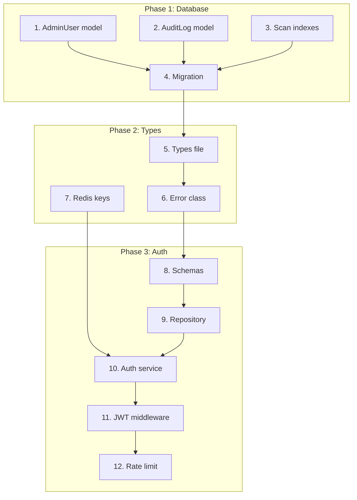

# Implementation Plan: Admin Module

## Task Overview

The Admin Module implementation follows a bottom-up approach: database schema first, then backend services and APIs, and finally the frontend. This ensures each layer has its dependencies ready before implementation.

**Total Tasks**: 52 atomic tasks organized into 10 phases
**Estimated Effort**: Each task is 15-30 minutes for an experienced developer

## Steering Document Compliance

### Structure (structure.md)
- All API files follow `apps/api/src/modules/admin/` organization
- Frontend follows `apps/web/src/app/admin/` App Router structure
- Naming: kebab-case files, PascalCase components, camelCase functions

### Technical (tech.md)
- Fastify with preHandler middleware chain
- Zod for request validation
- Prisma for database operations
- JWT with HTTP-only cookies
- React Query for server state, Zustand for auth state

## Atomic Task Requirements
**Each task must meet these criteria for optimal agent execution:**
- **File Scope**: Touches 1-3 related files maximum
- **Time Boxing**: Completable in 15-30 minutes
- **Single Purpose**: One testable outcome per task
- **Specific Files**: Must specify exact files to create/modify
- **Agent-Friendly**: Clear input/output with minimal context switching

---

## Phase 1: Database Schema

- [ ] 1. Add AdminRole enum and AdminUser model to Prisma schema
  - File: `apps/api/prisma/schema.prisma`
  - Add `AdminRole` enum with ADMIN, SUPER_ADMIN values
  - Add `AdminUser` model with id, email, passwordHash, role, isActive, mustChangePassword, lastLoginAt, createdAt, updatedAt, createdById
  - Add self-referential relation for createdBy
  - Add indexes on email and isActive
  - Purpose: Define admin user data structure
  - _Requirements: 2.1, 2.2_

- [ ] 2. Add AuditLog model to Prisma schema
  - File: `apps/api/prisma/schema.prisma`
  - Add `AuditLog` model with id, adminId, action, targetId, targetType, details (Json), ipAddress, userAgent, createdAt
  - Add relation to AdminUser
  - Add indexes on adminId, action, createdAt, and compound (targetType, targetId)
  - Purpose: Define audit trail data structure
  - _Requirements: 6.1, 6.2_

- [ ] 3. Add compound indexes to Scan model for admin queries
  - File: `apps/api/prisma/schema.prisma`
  - Add `@@index([status, createdAt])` for status filtering
  - Add `@@index([email, createdAt])` for customer lookup
  - Add `@@index([url])` for domain search
  - Purpose: Optimize admin scan queries
  - _Requirements: 3.1, 3.2, NFR-Performance_

- [ ] 4. Generate and run Prisma migration
  - Files: `apps/api/prisma/migrations/`, `packages/database/`
  - Run `pnpm prisma migrate dev --name add_admin_module`
  - Verify migration applies successfully
  - Purpose: Apply database schema changes
  - _Requirements: 1.1, 2.1, 6.1_

---

## Phase 2: Core Types and Utilities

- [ ] 5. Create admin types file with TypeScript interfaces
  - File: `apps/api/src/modules/admin/admin.types.ts`
  - Define `AdminTokenPayload`, `AdminErrorCode`, `CreateAdminInput`, `UpdateAdminInput`, `LoginResult`
  - Define `AuditAction`, `AuditDetails`, `CreateAuditInput`
  - Purpose: Establish type safety for admin module
  - _Leverage: `apps/api/src/modules/scans/scan.types.ts`_
  - _Requirements: 1.1, 2.1, 6.1_

- [ ] 6. Create admin error class in admin service file
  - File: `apps/api/src/modules/admin/admin.service.ts` (create with error class only)
  - Create `AdminServiceError` class extending Error with code and cause properties
  - Follow existing `ScanServiceError` pattern
  - Purpose: Consistent error handling for admin operations
  - _Leverage: `apps/api/src/modules/scans/scan.service.ts` (lines 27-36)_
  - _Requirements: 1.2, 1.4_

- [ ] 7. Add admin Redis keys constants
  - File: `apps/api/src/shared/constants/redis-keys.ts` (modify)
  - Add `AdminRedisKeys` object with JWT_BLACKLIST, DASHBOARD_METRICS, DASHBOARD_TRENDS, LOGIN_ATTEMPTS
  - Include TTL values for each key type
  - Purpose: Centralize admin cache key management
  - _Leverage: existing `RedisKeys` pattern in same file_
  - _Requirements: 1.3, 5.1, NFR-Performance_

---

## Phase 3: Admin Authentication

- [ ] 8. Create admin Zod validation schemas
  - File: `apps/api/src/modules/admin/admin.schema.ts`
  - Create `loginSchema` with email and password validation
  - Create `passwordSchema` with complexity requirements (12+ chars, uppercase, lowercase, number, special)
  - Create `createAdminSchema`, `updateAdminSchema`
  - Purpose: Request validation for admin endpoints
  - _Leverage: `apps/api/src/modules/scans/scan.schema.ts`_
  - _Requirements: 1.1, 2.1, NFR-Security_

- [ ] 9. Create admin repository with user CRUD operations
  - File: `apps/api/src/modules/admin/admin.repository.ts`
  - Implement `findByEmail`, `findById`, `create`, `update`, `listAdmins` with pagination
  - Create `AdminRepositoryError` class
  - Purpose: Data access layer for admin users
  - _Leverage: `apps/api/src/modules/scans/scan.repository.ts`_
  - _Requirements: 2.1, 2.2, 2.3_

- [ ] 10. Implement admin service authentication methods
  - File: `apps/api/src/modules/admin/admin.service.ts` (extend)
  - Add `login` method with bcrypt password verification and JWT generation
  - Add `logout` method to blacklist token in Redis
  - Add `verifyToken` method checking blacklist
  - Purpose: Core authentication business logic
  - _Leverage: `apps/api/src/shared/middleware/session.ts` (cookie pattern)_
  - _Requirements: 1.1, 1.2, 1.3, 1.5_

- [ ] 11. Create admin JWT auth middleware
  - File: `apps/api/src/modules/admin/admin.middleware.ts`
  - Extract token from HTTP-only cookie
  - Verify JWT and check blacklist
  - Attach `adminUser` to request object
  - Extend Fastify types in `apps/api/src/types/fastify.d.ts`
  - Purpose: Protect admin routes with JWT auth
  - _Leverage: `apps/api/src/shared/middleware/session.ts`_
  - _Requirements: 1.1, 1.3, NFR-Security_

- [ ] 12. Create login rate limit middleware
  - File: `apps/api/src/modules/admin/admin.middleware.ts` (extend)
  - Implement `loginRateLimitMiddleware` checking Redis for attempt count
  - Return 429 with retryAfter when limit exceeded (5 attempts/15 min)
  - Purpose: Prevent brute force attacks on login
  - _Leverage: `apps/api/src/shared/middleware/rate-limit.ts`_
  - _Requirements: NFR-Security (rate limiting)_

---

## Phase 4: Admin API Routes

- [ ] 13. Create auth controller with login endpoint
  - File: `apps/api/src/modules/admin/admin.controller.ts`
  - Implement POST `/api/v1/admin/auth/login` with rate limit middleware
  - Set HTTP-only cookie on successful login
  - Return admin info (not token) in response body
  - Purpose: Admin login API endpoint
  - _Leverage: `apps/api/src/modules/scans/scan.controller.ts`_
  - _Requirements: 1.1, 1.2_

- [ ] 14. Add logout and me endpoints to auth controller
  - File: `apps/api/src/modules/admin/admin.controller.ts` (extend)
  - Implement POST `/api/v1/admin/auth/logout` clearing cookie and blacklisting token
  - Implement GET `/api/v1/admin/auth/me` returning current admin
  - Implement PUT `/api/v1/admin/auth/password` for password change
  - Purpose: Complete auth API
  - _Requirements: 1.3, 1.5_

- [ ] 15. Add list and create admin user endpoints
  - File: `apps/api/src/modules/admin/admin.controller.ts` (extend)
  - Implement GET `/api/v1/admin/users` with pagination
  - Implement POST `/api/v1/admin/users` with SUPER_ADMIN check and email uniqueness validation
  - Purpose: Admin user listing and creation
  - _Requirements: 2.1, 2.2, 2.5_

- [ ] 15b. Add update and deactivate admin user endpoints
  - File: `apps/api/src/modules/admin/admin.controller.ts` (extend)
  - Implement GET `/api/v1/admin/users/:id` for single admin details
  - Implement PUT `/api/v1/admin/users/:id` for updates
  - Implement DELETE `/api/v1/admin/users/:id` for deactivation with SUPER_ADMIN check
  - Purpose: Admin user modification
  - _Requirements: 2.3, 2.4_

- [ ] 15c. Add password reset endpoint
  - File: `apps/api/src/modules/admin/admin.controller.ts` (extend)
  - Implement POST `/api/v1/admin/users/:id/reset-password` with SUPER_ADMIN check
  - Generate secure 16-char temp password, set mustChangePassword flag
  - Purpose: Admin password reset functionality
  - _Requirements: 2.6_

- [ ] 16. Register admin routes in Fastify
  - File: `apps/api/src/modules/admin/index.ts`
  - Export route registration function
  - File: `apps/api/src/index.ts` (modify)
  - Register admin routes with API prefix
  - Purpose: Wire up admin module to server
  - _Leverage: `apps/api/src/modules/scans/index.ts`_
  - _Requirements: 1.1_

---

## Phase 5: Scan and Customer Admin Services

- [ ] 17. Create scan admin service with list and filter methods
  - File: `apps/api/src/modules/admin/scan-admin.service.ts`
  - Implement `listAllScans` with status, date, email, url filters
  - Implement `getScanDetails` with full related data
  - Purpose: Admin scan visibility
  - _Leverage: `apps/api/src/modules/scans/scan.repository.ts`_
  - _Requirements: 3.1, 3.2, 3.3, 3.4, 3.5_

- [ ] 18. Add scan delete and retry to scan admin service
  - File: `apps/api/src/modules/admin/scan-admin.service.ts` (extend)
  - Implement `deleteScan` with soft delete option
  - Implement `retryScan` queueing new job via BullMQ
  - Purpose: Admin scan management actions
  - _Leverage: `apps/worker/src/queues/`_
  - _Requirements: 3.6, 3.7_

- [ ] 19. Create customer service with aggregation methods
  - File: `apps/api/src/modules/admin/customer.service.ts`
  - Implement `listCustomers` aggregating scans by email with stats
  - Implement `getCustomerScans` returning scans for email
  - Implement `searchByEmail` with partial matching
  - Purpose: Customer tracking functionality
  - _Leverage: `apps/api/src/modules/results/result.service.ts`_
  - _Requirements: 4.1, 4.2, 4.3_

- [ ] 20. Add customer filter and export to customer service
  - File: `apps/api/src/modules/admin/customer.service.ts` (extend)
  - Implement filtering by scan count range and date range
  - Implement `exportCustomers` generating CSV/JSON buffer
  - Purpose: Customer filtering and export
  - _Requirements: 4.4, 4.5, 4.6_

- [ ] 21. Add scan management endpoints to controller
  - File: `apps/api/src/modules/admin/admin.controller.ts` (extend)
  - Implement GET/DELETE `/api/v1/admin/scans` and `/api/v1/admin/scans/:id`
  - Implement POST `/api/v1/admin/scans/:id/retry`
  - Purpose: Scan management API
  - _Requirements: 3.1, 3.5, 3.6, 3.7_

- [ ] 22. Add customer endpoints to controller
  - File: `apps/api/src/modules/admin/admin.controller.ts` (extend)
  - Implement GET `/api/v1/admin/customers`, `/api/v1/admin/customers/:email`
  - Implement GET `/api/v1/admin/customers/:email/scans`, `/api/v1/admin/customers/export`
  - Purpose: Customer management API
  - _Requirements: 4.1, 4.2, 4.3, 4.6_

---

## Phase 6: Dashboard and Audit Services

- [ ] 23. Create dashboard service with metrics methods
  - File: `apps/api/src/modules/admin/dashboard.service.ts`
  - Implement `getMetrics` with Redis caching (5-min TTL)
  - Calculate today/week/month scan counts, success rate, active sessions, unique customers
  - Purpose: Dashboard key metrics
  - _Leverage: `apps/api/src/shared/middleware/session.ts` (Redis pattern)_
  - _Requirements: 5.1_

- [ ] 24. Add scan trends method to dashboard service
  - File: `apps/api/src/modules/admin/dashboard.service.ts` (extend)
  - Implement `getScanTrends` with DATE_TRUNC aggregation for daily counts
  - Include success/failed breakdown per day
  - Add Redis caching with 5-min TTL
  - Purpose: Dashboard scan trend data
  - _Requirements: 5.2, NFR-Performance_

- [ ] 24b. Add issue distribution and top domains to dashboard service
  - File: `apps/api/src/modules/admin/dashboard.service.ts` (extend)
  - Implement `getIssueDistribution` counting by severity (critical, serious, moderate, minor)
  - Implement `getTopDomains` extracting and grouping by domain from URLs
  - Purpose: Dashboard issue and domain analytics
  - _Requirements: 5.3, 5.4_

- [ ] 25. Add system health to dashboard service
  - File: `apps/api/src/modules/admin/dashboard.service.ts` (extend)
  - Implement `getSystemHealth` checking BullMQ queues, Redis, database
  - Calculate error rate from failed scans in last 24h
  - Purpose: System health monitoring
  - _Leverage: `apps/worker/src/queues/`_
  - _Requirements: 5.5_

- [ ] 26. Create audit service with logging and query methods
  - File: `apps/api/src/modules/admin/audit.service.ts`
  - Implement `log` with async write and data sanitization
  - Implement `list` with filters (date, admin, action type) and pagination
  - Purpose: Audit trail management
  - _Requirements: 6.1, 6.2_

- [ ] 27. Add audit export to audit service
  - File: `apps/api/src/modules/admin/audit.service.ts` (extend)
  - Implement `export` generating CSV/JSON buffer
  - Purpose: Audit log export
  - _Requirements: 6.3_

- [ ] 28. Add dashboard endpoints to controller
  - File: `apps/api/src/modules/admin/admin.controller.ts` (extend)
  - Implement GET `/api/v1/admin/dashboard/metrics`
  - Implement GET `/api/v1/admin/dashboard/trends`
  - Implement GET `/api/v1/admin/dashboard/issues`
  - Implement GET `/api/v1/admin/dashboard/domains`
  - Implement GET `/api/v1/admin/dashboard/health`
  - Purpose: Dashboard analytics API
  - _Requirements: 5.1, 5.2, 5.3, 5.4, 5.5_

- [ ] 28b. Add audit log endpoints to controller
  - File: `apps/api/src/modules/admin/admin.controller.ts` (extend)
  - Implement GET `/api/v1/admin/audit` with filters (date, admin, action)
  - Implement GET `/api/v1/admin/audit/export` for CSV/JSON export
  - Purpose: Audit log API
  - _Requirements: 6.2, 6.3_

---

## Phase 7: Frontend Authentication

- [ ] 29. Create admin auth Zustand store
  - File: `apps/web/src/stores/admin-auth.ts`
  - Store admin info (not token), isAuthenticated, isLoading states
  - Add login, logout, checkAuth actions
  - Purpose: Admin auth state management
  - _Leverage: existing Zustand patterns in `apps/web/src/stores/`_
  - _Requirements: 7.1_

- [ ] 30. Create admin API client with auth methods
  - File: `apps/web/src/lib/admin-api.ts`
  - Create base `adminApiClient` function with `credentials: 'include'`
  - Add auth methods: login, logout, getMe, changePassword
  - Purpose: Admin authentication API calls
  - _Leverage: `apps/web/src/lib/api.ts`_
  - _Requirements: 7.1_

- [ ] 30b. Add admin data API methods
  - File: `apps/web/src/lib/admin-api.ts` (extend)
  - Add methods for users, scans, customers endpoints
  - Add methods for dashboard and audit endpoints
  - Purpose: Complete admin API client
  - _Requirements: 7.3_

- [ ] 31. Create admin login page
  - File: `apps/web/src/app/admin/login/page.tsx`
  - Create login form with email/password inputs
  - Handle validation errors and rate limit errors
  - Redirect to dashboard on success
  - Purpose: Admin login UI
  - _Leverage: `apps/web/src/components/ui/` (shadcn components)_
  - _Requirements: 7.1_

---

## Phase 8: Frontend Layout

- [ ] 32. Create admin layout with auth check
  - File: `apps/web/src/app/admin/layout.tsx`
  - Check auth state, redirect to login if not authenticated
  - Wrap children in admin shell with sidebar and header
  - Handle session expiration with redirect to login
  - Purpose: Admin layout wrapper
  - _Leverage: `apps/web/src/app/layout.tsx`_
  - _Requirements: 7.1, 7.4_

- [ ] 33. Create admin sidebar component
  - File: `apps/web/src/components/admin/AdminSidebar.tsx`
  - Navigation links: Dashboard, Scans, Customers, Users, Audit Log
  - Highlight active route
  - Purpose: Admin navigation
  - _Leverage: `apps/web/src/components/ui/` (shadcn)_
  - _Requirements: 7.2_

- [ ] 34. Create admin header component
  - File: `apps/web/src/components/admin/AdminHeader.tsx`
  - Display current admin email
  - Add logout button
  - Purpose: Admin header bar
  - _Requirements: 7.2_

---

## Phase 9: Frontend Pages

- [ ] 35. Create dashboard page with metrics cards
  - File: `apps/web/src/app/admin/dashboard/page.tsx`
  - File: `apps/web/src/components/admin/DashboardMetrics.tsx`
  - Display scan counts, success rate, active sessions, unique customers
  - Purpose: Dashboard metrics display
  - _Leverage: `apps/web/src/components/ui/card.tsx`_
  - _Requirements: 5.1, 7.1_

- [ ] 36. Add charts to dashboard page
  - File: `apps/web/src/components/admin/DashboardCharts.tsx`
  - Add scan trends line chart using Recharts
  - Add issue distribution pie chart
  - Purpose: Dashboard visualizations
  - _Leverage: Recharts library_
  - _Requirements: 5.2, 5.3_

- [ ] 37. Create ScanTable component
  - File: `apps/web/src/components/admin/ScanTable.tsx`
  - Display scans in table with status, date, email, URL columns
  - Add sortable column headers
  - Include delete and retry action buttons
  - Purpose: Reusable scan table component
  - _Leverage: `apps/web/src/components/ui/table.tsx`_
  - _Requirements: 3.5, 7.3, NFR-Usability_

- [ ] 37b. Create scans list page with filters
  - File: `apps/web/src/app/admin/scans/page.tsx`
  - Add filter controls for status, date range, email search
  - Add pagination controls
  - Use ScanTable component for display
  - Purpose: Scan management page
  - _Requirements: 3.1, 3.2, 3.3, 3.4, 7.3_

- [ ] 38. Create scan detail page
  - File: `apps/web/src/app/admin/scans/[id]/page.tsx`
  - Display full scan data with results and issues
  - Add delete and retry action buttons
  - Purpose: Scan detail view
  - _Requirements: 3.5, 3.6, 3.7, 7.4_

- [ ] 39. Create customers list page
  - File: `apps/web/src/app/admin/customers/page.tsx`
  - File: `apps/web/src/components/admin/CustomerTable.tsx`
  - Display customers with scan count, first/last scan date
  - Add search and filter controls
  - Add export button (CSV/JSON)
  - Purpose: Customer tracking UI
  - _Requirements: 4.1, 4.3, 4.4, 4.5, 4.6, 7.3_

- [ ] 40. Create customer detail page
  - File: `apps/web/src/app/admin/customers/[email]/page.tsx`
  - Display customer scans list
  - Purpose: Customer scan history view
  - _Requirements: 4.2_

- [ ] 41. Create AdminUserTable component
  - File: `apps/web/src/components/admin/AdminUserTable.tsx`
  - Display admin users in table with email, role, status, last login columns
  - Add action buttons for edit, deactivate, reset password
  - Purpose: Reusable admin user table component
  - _Leverage: `apps/web/src/components/ui/table.tsx`_
  - _Requirements: 2.2, 7.3_

- [ ] 41b. Create admin users page with create dialog
  - File: `apps/web/src/app/admin/users/page.tsx`
  - Use AdminUserTable component
  - Add "Create Admin" button opening dialog
  - Implement create form with email, password, role fields
  - Purpose: Admin user management page
  - _Requirements: 2.1, 2.2, 2.3, 2.4, 2.6, 7.3_

- [ ] 42. Create audit log page
  - File: `apps/web/src/app/admin/audit/page.tsx`
  - File: `apps/web/src/components/admin/AuditLogTable.tsx`
  - Display audit entries with filters
  - Add export button
  - Purpose: Audit log viewer UI
  - _Requirements: 6.2, 6.3, 7.3_

- [ ] 43. Create admin root page redirect
  - File: `apps/web/src/app/admin/page.tsx`
  - Redirect to /admin/dashboard
  - Purpose: Default admin route
  - _Requirements: 7.1_

---

## Phase 10: Testing

- [ ] 44. Create admin service unit tests
  - File: `apps/api/src/modules/admin/__tests__/admin.service.test.ts`
  - Test login with valid/invalid credentials
  - Test logout and token blacklisting
  - Test admin CRUD operations
  - Purpose: Verify admin service logic
  - _Leverage: existing test patterns_
  - _Requirements: 1.1, 1.2, 2.1_

- [ ] 45. Create admin API integration tests
  - File: `apps/api/src/modules/admin/__tests__/admin.controller.test.ts`
  - Test auth flow: login → access protected route → logout
  - Test rate limiting on login
  - Test CRUD operations with proper auth
  - Purpose: Verify API endpoints work correctly
  - _Leverage: existing test patterns_
  - _Requirements: 1.1, 1.2, 1.3, 2.1_

---

## Task Dependencies

---

*Document Version: 1.0*
*Created: December 2024*
*Status: Draft - Pending Approval*
