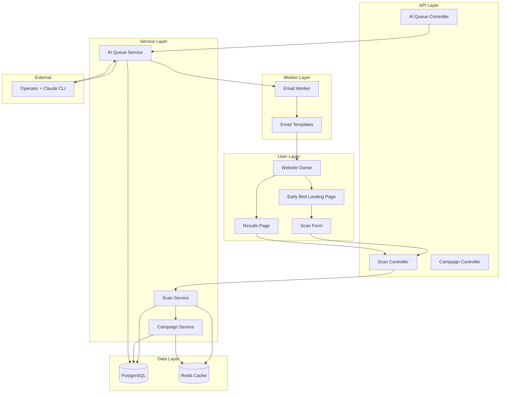
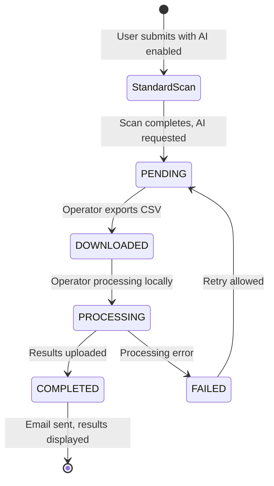
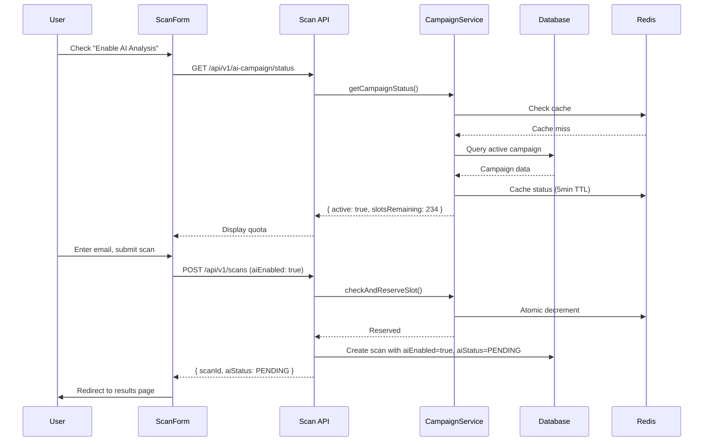

# AI Early Bird Scan - Design Document

## Overview

The AI Early Bird Scan feature extends ADAShield's existing scan infrastructure to support AI-enhanced accessibility analysis through a limited-time campaign. This design leverages the established three-layer architecture (Controller → Service → Repository), existing email notification system, and admin module patterns.

**Key Design Decisions:**
- **Extend, don't replace**: AI fields added to existing Scan and Issue models
- **Batch processing model**: Operator downloads pending scans, processes locally via Claude Code CLI, uploads results
- **Campaign-driven quota**: New AiCampaign model tracks token budget and status
- **Integrated UX**: AI status seamlessly integrated into existing scan flow and results page

## Steering Document Alignment

### Technical Standards (tech.md)

| Standard | Implementation |
|----------|----------------|
| **Three-Layer Architecture** | AiCampaign follows Controller → Service → Repository pattern |
| **TypeScript Strict Mode** | All new types use strict null checks and explicit typing |
| **Fastify Framework** | New routes registered via existing plugin pattern |
| **Prisma ORM** | Schema extensions use existing migration patterns |
| **BullMQ Queues** | Email notifications use existing queue infrastructure |
| **Redis Caching** | Campaign quota cached with 5-minute TTL for fast lookups |
| **Zod Validation** | All API inputs validated with Zod schemas |

### Project Structure (structure.md)

| Convention | Application |
|------------|-------------|
| **Module Structure** | New `ai-campaign/` module in `apps/api/src/modules/` |
| **File Naming** | `ai-campaign.service.ts`, `ai-campaign.controller.ts`, etc. |
| **Type Definitions** | `ai-campaign.types.ts` for interfaces |
| **Error Classes** | `AiCampaignError` with `code` property pattern |
| **Test Colocation** | Tests alongside source files: `*.test.ts` |
| **Frontend Components** | New components in `components/features/ai/` |

## Code Reuse Analysis

### Existing Components to Leverage

| Component | Location | How It Will Be Used |
|-----------|----------|---------------------|
| **ScanRepository** | `modules/scans/scan.repository.ts` | Extend with AI status queries |
| **ScanService** | `modules/scans/scan.service.ts` | Extend `createScan()` to set `aiEnabled` |
| **EmailTemplates** | `worker/processors/notifier/email-templates.ts` | Add AI report email template |
| **EmailRouter** | `worker/processors/notifier/email-router.ts` | Reuse for AI email delivery |
| **QueueService** | `shared/queue/queue.service.ts` | Queue email notifications |
| **RedisKeys** | `shared/constants/redis-keys.ts` | Add campaign quota cache keys |
| **AdminController** | `modules/admin/admin.controller.ts` | Extend with AI queue endpoints |
| **ScanForm** | `components/features/scan/ScanForm.tsx` | Extend with AI checkbox |

### Integration Points

| System | Integration Method |
|--------|-------------------|
| **Scan Creation** | Hook into existing `scanService.createScan()` |
| **Results Display** | Extend `ScanResult` component with AI sections |
| **Email Delivery** | Use existing `addEmailJob()` queue method |
| **Admin Auth** | Reuse existing admin middleware chain |
| **Session Tracking** | Use existing `guestSessionId` from cookies |

## Architecture

### System Context Diagram



### AI Scan Lifecycle



### Component Interaction Flow



## Components and Interfaces

### Backend Components

#### 1. AiCampaignService

**Purpose:** Manage AI campaign quota, status, and slot reservations

**Location:** `apps/api/src/modules/ai-campaign/ai-campaign.service.ts`

**Interfaces:**
```typescript
interface AiCampaignService {
  // Public campaign status (cached)
  getCampaignStatus(): Promise<CampaignStatusResponse>;

  // Check if slots available and reserve one atomically (uses Lua script)
  checkAndReserveSlotAtomic(): Promise<SlotReservationResult>;

  // Release slot if scan fails before AI processing
  releaseSlot(scanId: string): Promise<void>;

  // Deduct tokens after AI processing complete
  deductTokens(scanId: string, tokensUsed: number): Promise<void>;

  // Admin: Get detailed campaign metrics
  getCampaignMetrics(): Promise<CampaignMetrics>;

  // Admin: Update campaign settings
  updateCampaign(data: UpdateCampaignData): Promise<AiCampaign>;
}

interface SlotReservationResult {
  reserved: boolean;
  slotsRemaining: number;
  reason?: 'success' | 'quota_depleted' | 'campaign_inactive';
}

interface CampaignStatusResponse {
  active: boolean;
  slotsRemaining: number;
  totalSlots: number;
  percentRemaining: number;
  urgencyLevel: 'normal' | 'limited' | 'almost_gone' | 'final' | 'depleted';
  message: string;
}
```

**Atomic Slot Reservation (Lua Script):**
```lua
-- Lua script for atomic slot reservation to prevent race conditions
-- Key: ai:campaign:slots:available
-- Returns: { reserved: 0|1, remaining: number }

local available = tonumber(redis.call('GET', KEYS[1]) or '0')
if available > 0 then
  local remaining = redis.call('DECR', KEYS[1])
  return {1, remaining}
else
  return {0, 0}
end
```

**Dependencies:** Prisma, Redis, AiCampaignRepository

**Reuses:** Redis caching pattern from `scan.service.ts`

#### Slot Lifecycle Management

**Purpose:** Ensure reserved slots are properly tracked and released when scans fail

**Lifecycle States:**
```
Available → Reserved → Consumed (tokens deducted)
              ↓
           Released (on scan failure)
```

**Release Triggers:**
1. **Scan Failure:** When scan status becomes FAILED before AI processing
2. **Stale Cleanup:** Background job releases slots for scans stuck in PENDING > 48 hours
3. **Manual Release:** Admin can release slots via queue management UI

**Background Cleanup Job:**
```typescript
// Runs every 6 hours via cron
async function cleanupStaleAiSlots(): Promise<void> {
  const staleScans = await prisma.scan.findMany({
    where: {
      aiEnabled: true,
      aiStatus: 'PENDING',
      createdAt: { lt: subHours(new Date(), 48) }
    }
  });

  for (const scan of staleScans) {
    await prisma.scan.update({
      where: { id: scan.id },
      data: { aiStatus: 'FAILED', aiSummary: 'Processing timeout - slot released' }
    });
    await campaignService.releaseSlot(scan.id);
  }
}
```

#### 2. AiQueueService

**Purpose:** Handle CSV export/import for operator batch processing

**Location:** `apps/api/src/modules/ai-campaign/ai-queue.service.ts`

**Interfaces:**
```typescript
interface AiQueueService {
  // Export pending scans to CSV
  exportPendingScans(): Promise<{ csv: string; count: number; scanIds: string[] }>;

  // Import AI results from CSV
  importAiResults(csv: string): Promise<ImportResult>;

  // Get queue statistics
  getQueueStats(): Promise<QueueStats>;

  // List scans by AI status with filtering
  listAiScans(filters: AiScanFilters): Promise<PaginatedResult<AiScanListItem>>;

  // Retry failed scan
  retryFailedScan(scanId: string): Promise<void>;
}

interface ImportResult {
  success: boolean;
  processed: number;
  failed: number;
  errors: Array<{ scanId: string; error: string }>;
  tokensDeducted: number;
}

interface AiScanFilters {
  status?: AiStatus[];
  dateFrom?: Date;
  dateTo?: Date;
  cursor?: string;
  limit?: number;
}
```

**Dependencies:** Prisma, AiCampaignService, QueueService (for email)

**Reuses:** CSV parsing patterns, atomic transaction pattern

#### 3. Extended ScanService

**Purpose:** Extend existing scan creation to support AI opt-in

**Location:** `apps/api/src/modules/scans/scan.service.ts` (modified)

**Extended Interface:**
```typescript
// Extend existing CreateScanData
interface CreateScanData {
  // ... existing fields
  aiEnabled?: boolean;  // NEW: Opt into AI enhancement
}

// Extend existing ScanWithResult
interface ScanWithResult {
  // ... existing fields
  aiEnabled: boolean;
  aiStatus: AiStatus | null;
  aiSummary: string | null;
  aiRemediationPlan: string | null;
  // ... other AI fields
}
```

**Changes:**
1. `createScan()`: If `aiEnabled=true`, call `campaignService.checkAndReserveSlot()`
2. `getScanResult()`: Include AI fields in response
3. Add `getAiStatus(scanId)` for polling AI progress

#### 4. AiEmailService

**Purpose:** Generate and send AI-enhanced report emails

**Location:** `apps/worker/src/processors/notifier/ai-email.service.ts`

**Interfaces:**
```typescript
interface AiEmailService {
  // Generate combined report email content
  generateCombinedReportEmail(scan: ScanWithAiResult): EmailContent;

  // Queue email for delivery
  queueAiReportEmail(scanId: string, email: string): Promise<void>;
}

interface ScanWithAiResult {
  id: string;
  url: string;
  email: string;
  wcagLevel: string;
  createdAt: Date;
  aiSummary: string;
  aiRemediationPlan: string;
  issues: Array<IssueWithAi>;
  scanResult: ScanResult;
}

interface IssueWithAi {
  // ... existing issue fields
  aiExplanation: string;
  aiFixSuggestion: string;
  aiPriority: number;
}
```

**Reuses:** `email-templates.ts` patterns, `EmailRouter`

### Frontend Components

#### 5. AiEnhancementSection

**Purpose:** AI opt-in checkbox with campaign status on scan form

**Location:** `apps/web/src/components/features/ai/AiEnhancementSection.tsx`

**Props:**
```typescript
interface AiEnhancementSectionProps {
  enabled: boolean;
  onEnabledChange: (enabled: boolean) => void;
  onEmailRequired: (required: boolean) => void;
  preSelected?: boolean;  // From ?ai=1 query param
}
```

**State:** Fetches campaign status via `useCampaignStatus()` hook

**Reuses:** UI patterns from existing form sections, shadcn/ui components

#### 6. AiStatusBadge

**Purpose:** Display AI processing status on results page

**Location:** `apps/web/src/components/features/ai/AiStatusBadge.tsx`

**Props:**
```typescript
interface AiStatusBadgeProps {
  status: AiStatus;
  email?: string;
  onRefresh?: () => void;
}
```

**Displays:** Spinner, progress message, completion checkmark based on status

#### 7. AiIssueEnhancement

**Purpose:** Display AI explanation and fix suggestion for each issue

**Location:** `apps/web/src/components/features/ai/AiIssueEnhancement.tsx`

**Props:**
```typescript
interface AiIssueEnhancementProps {
  aiExplanation: string | null;
  aiFixSuggestion: string | null;
  aiPriority: number | null;
  status: AiStatus;
}
```

**Displays:** Skeleton loader when pending, AI content when complete

#### 8. EarlyBirdLandingPage

**Purpose:** Promotional landing page for AI Early Bird campaign

**Location:** `apps/web/src/app/early-bird/page.tsx`

**Sections:**
- Hero with value proposition
- How it works (3-step flow)
- Feature benefits list
- Campaign quota progress bar
- CTA button to scan form

### Frontend Hooks

#### 9. useCampaignStatus

**Purpose:** Fetch and cache campaign status

**Location:** `apps/web/src/hooks/useCampaignStatus.ts`

**Interface:**
```typescript
interface UseCampaignStatusReturn {
  status: CampaignStatusResponse | null;
  isLoading: boolean;
  error: string | null;
  refetch: () => void;
}
```

**Caching:** React Query with 30-second stale time

#### 10. useAiScanStatus

**Purpose:** Poll for AI status updates on results page

**Location:** `apps/web/src/hooks/useAiScanStatus.ts`

**Interface:**
```typescript
interface UseAiScanStatusReturn {
  aiStatus: AiStatus;
  aiData: AiScanData | null;
  isPolling: boolean;
  stopPolling: () => void;
}
```

**Polling Behavior:**
```typescript
// Polling strategy with exponential backoff
const POLLING_CONFIG = {
  initialInterval: 30_000,    // 30 seconds initial
  maxInterval: 120_000,       // 2 minutes max
  backoffMultiplier: 1.5,     // Increase interval by 50% each poll
  maxRetries: 3,              // Network error retries
  retryDelay: 5_000,          // 5 second delay between retries
};

// Stop conditions
const shouldStopPolling = (status: AiStatus) =>
  status === 'COMPLETED' || status === 'FAILED';

// Network error handling
const handlePollError = async (error: Error, retryCount: number) => {
  if (retryCount < POLLING_CONFIG.maxRetries) {
    await sleep(POLLING_CONFIG.retryDelay);
    return 'retry';
  }
  return 'stop'; // Stop polling after max retries
};
```

**Hook Implementation:**
```typescript
function useAiScanStatus(scanId: string, aiEnabled: boolean) {
  const [aiStatus, setAiStatus] = useState<AiStatus>('PENDING');
  const [aiData, setAiData] = useState<AiScanData | null>(null);
  const [isPolling, setIsPolling] = useState(aiEnabled);
  const intervalRef = useRef(POLLING_CONFIG.initialInterval);

  useEffect(() => {
    if (!aiEnabled || !isPolling) return;

    const poll = async () => {
      const response = await api.scans.getAiStatus(scanId);
      setAiStatus(response.aiStatus);
      if (response.aiStatus === 'COMPLETED') {
        setAiData(response.aiData);
      }
      if (shouldStopPolling(response.aiStatus)) {
        setIsPolling(false);
      } else {
        // Increase interval for next poll
        intervalRef.current = Math.min(
          intervalRef.current * POLLING_CONFIG.backoffMultiplier,
          POLLING_CONFIG.maxInterval
        );
      }
    };

    const timer = setInterval(poll, intervalRef.current);
    return () => clearInterval(timer);
  }, [scanId, aiEnabled, isPolling]);

  return { aiStatus, aiData, isPolling, stopPolling: () => setIsPolling(false) };
}
```

## Data Models

### Extended Scan Model (Prisma)

```prisma
model Scan {
  // ... existing fields ...

  // AI Enhancement Fields
  aiEnabled        Boolean   @default(false)
  aiStatus         AiStatus?
  aiSummary        String?   @db.Text
  aiRemediationPlan String?  @db.Text
  aiProcessedAt    DateTime?
  aiInputTokens    Int?
  aiOutputTokens   Int?
  aiTotalTokens    Int?
  aiModel          String?
  aiProcessingTime Int?      // seconds

  @@index([aiEnabled, aiStatus])
  @@index([aiEnabled, createdAt])
}

enum AiStatus {
  PENDING
  DOWNLOADED
  PROCESSING
  COMPLETED
  FAILED
}
```

### Extended Issue Model (Prisma)

```prisma
model Issue {
  // ... existing fields ...

  // AI Enhancement Fields
  aiExplanation   String? @db.Text
  aiFixSuggestion String? @db.Text
  aiPriority      Int?    // 1-10 business impact score
}
```

### New AiCampaign Model (Prisma)

```prisma
model AiCampaign {
  id               String           @id @default(uuid())
  name             String           @unique
  totalTokenBudget Int
  usedTokens       Int              @default(0)
  reservedSlots    Int              @default(0)
  avgTokensPerScan Int              @default(5000)
  status           AiCampaignStatus @default(ACTIVE)
  startsAt         DateTime
  endsAt           DateTime?
  createdAt        DateTime         @default(now())
  updatedAt        DateTime         @updatedAt

  // Audit trail
  auditLogs        AiCampaignAudit[]

  @@index([status, startsAt])
}

enum AiCampaignStatus {
  ACTIVE
  PAUSED
  DEPLETED
  ENDED
}

model AiCampaignAudit {
  id         String      @id @default(uuid())
  campaignId String
  campaign   AiCampaign  @relation(fields: [campaignId], references: [id])
  action     String      // 'CREATED', 'PAUSED', 'RESUMED', 'BUDGET_ADDED', 'STATUS_CHANGED'
  details    Json?
  adminId    String
  createdAt  DateTime    @default(now())

  @@index([campaignId, createdAt])
}
```

### Redis Cache Keys

```typescript
// Add to apps/api/src/shared/constants/redis-keys.ts

AI_CAMPAIGN_STATUS: {
  pattern: 'ai:campaign:status',
  build: () => 'ai:campaign:status',
  ttl: 300,  // 5 minutes
},

AI_CAMPAIGN_SLOTS: {
  pattern: 'ai:campaign:slots',
  build: () => 'ai:campaign:slots:reserved',
  ttl: 3600,  // 1 hour
},

AI_SCAN_STATUS: {
  pattern: 'ai:scan:status',
  build: (scanId: string) => `ai:scan:${scanId}:status`,
  ttl: 86400,  // 24 hours
},
```

### CSV Export Format

```csv
scan_id,url,email,wcag_level,issues_json,created_at,page_title
uuid-1,https://example.com,user@email.com,AA,"[{...issues...}]",2025-01-15T10:30:00Z,Example Site
```

### CSV Import Format

```csv
scan_id,ai_summary,ai_remediation_plan,ai_issues_json,tokens_used,ai_model,processing_time
uuid-1,"Executive summary...","1. Fix contrast...","{...enhanced issues...}",4500,claude-3-opus,45
```

### CSV Validation Rules

**File-Level Validation:**
| Rule | Validation | Error Message |
|------|------------|---------------|
| Max file size | ≤ 10MB | "CSV file exceeds maximum size of 10MB" |
| File type | `.csv` extension, `text/csv` MIME | "Invalid file type. Please upload a CSV file" |
| Encoding | UTF-8 | "File must be UTF-8 encoded" |
| Max rows | ≤ 1000 per import | "Maximum 1000 rows per import" |

**Column Validation:**
| Column | Type | Required | Validation Rules | Error Message |
|--------|------|----------|------------------|---------------|
| `scan_id` | UUID | Yes | Must exist in Scan table, aiEnabled=true, aiStatus=DOWNLOADED | "Scan {id} not found or not eligible for AI import" |
| `ai_summary` | String | Yes | 10-10000 characters | "Summary must be 10-10000 characters" |
| `ai_remediation_plan` | String | Yes | 10-50000 characters | "Remediation plan required" |
| `ai_issues_json` | JSON | Yes | Valid JSON array matching issue IDs | "Invalid issues JSON format" |
| `tokens_used` | Integer | Yes | > 0 AND < 100000 | "tokens_used must be positive integer < 100000" |
| `ai_model` | String | Yes | Non-empty, max 50 chars | "Model name required" |
| `processing_time` | Integer | Yes | ≥ 0 AND < 3600 | "Processing time must be 0-3600 seconds" |

**Business Logic Validation:**
```typescript
interface CsvRowValidation {
  // Check scan exists and is in correct state
  validateScanEligibility(scanId: string): Promise<ValidationResult>;

  // Validate issue IDs in ai_issues_json match scan's actual issues
  validateIssueMapping(scanId: string, aiIssuesJson: string): Promise<ValidationResult>;

  // Check tokens don't exceed remaining campaign budget
  validateTokenBudget(tokensUsed: number): Promise<ValidationResult>;
}

// All-or-nothing import - transaction rollback on any failure
const importResults = await prisma.$transaction(async (tx) => {
  const results: ImportRowResult[] = [];
  for (const row of parsedRows) {
    const validation = await validateRow(row);
    if (!validation.valid) {
      throw new AiCampaignError(
        `Row ${row.index}: ${validation.error}`,
        AiCampaignErrorCode.INVALID_CSV
      );
    }
    results.push(await processRow(tx, row));
  }
  return results;
});
```

## API Endpoints

### Public Endpoints

| Method | Endpoint | Description |
|--------|----------|-------------|
| GET | `/api/v1/ai-campaign/status` | Get campaign status (cached) |
| GET | `/api/v1/scans/:id/ai-status` | Get AI processing status |

### Admin Endpoints

| Method | Endpoint | Description |
|--------|----------|-------------|
| GET | `/api/v1/admin/ai-campaign` | Get campaign metrics |
| PATCH | `/api/v1/admin/ai-campaign` | Update campaign settings |
| POST | `/api/v1/admin/ai-campaign/pause` | Pause campaign |
| POST | `/api/v1/admin/ai-campaign/resume` | Resume campaign |
| GET | `/api/v1/admin/ai-queue` | List AI scans with filters |
| GET | `/api/v1/admin/ai-queue/export` | Export pending scans CSV |
| POST | `/api/v1/admin/ai-queue/import` | Import AI results CSV |
| GET | `/api/v1/admin/ai-queue/stats` | Get queue statistics |
| POST | `/api/v1/admin/ai-queue/:scanId/retry` | Retry failed scan |

## Error Handling

### Error Scenarios

#### 1. Campaign Quota Depleted
- **Scenario:** User tries to enable AI when quota is 0
- **Detection:** `campaignService.checkAndReserveSlot()` returns false
- **Handling:** Return 409 Conflict with message
- **User Impact:** AI checkbox disabled, "Campaign ended" message shown

#### 2. CSV Import Validation Failure
- **Scenario:** Uploaded CSV has invalid scan IDs or malformed data
- **Detection:** Validation loop catches errors per row
- **Handling:** Rollback transaction, return detailed error list
- **User Impact:** Admin sees specific errors per row, can fix and retry

#### 3. AI Status Update Race Condition
- **Scenario:** Multiple operators try to export same pending scans
- **Detection:** Atomic update with WHERE clause check
- **Handling:** Only first export succeeds, others get empty result
- **User Impact:** Operators coordinate via queue stats display

#### 4. Email Delivery Failure
- **Scenario:** Email provider fails to send AI report
- **Detection:** Email job throws error
- **Handling:** BullMQ retry with exponential backoff (3 attempts)
- **User Impact:** Delayed email, can view results on web

#### 5. Scan Completion Without AI Slot
- **Scenario:** Slot reserved but scan fails before AI processing
- **Detection:** Scan status becomes FAILED
- **Handling:** Release reserved slot via campaign service
- **User Impact:** Slot returned to pool for other users

### Error Classes

```typescript
// apps/api/src/modules/ai-campaign/ai-campaign.errors.ts

export class AiCampaignError extends Error {
  constructor(
    message: string,
    public code: AiCampaignErrorCode,
    public cause?: Error
  ) {
    super(message);
    this.name = 'AiCampaignError';
  }
}

export enum AiCampaignErrorCode {
  CAMPAIGN_NOT_FOUND = 'CAMPAIGN_NOT_FOUND',
  CAMPAIGN_INACTIVE = 'CAMPAIGN_INACTIVE',
  QUOTA_DEPLETED = 'QUOTA_DEPLETED',
  INVALID_CSV = 'INVALID_CSV',
  SCAN_NOT_FOUND = 'SCAN_NOT_FOUND',
  SCAN_NOT_AI_ENABLED = 'SCAN_NOT_AI_ENABLED',
  IMPORT_FAILED = 'IMPORT_FAILED',
}
```

## Testing Strategy

### Unit Testing

**Coverage Target:** 90%+ for services, 80%+ for controllers

**Key Test Files:**
- `ai-campaign.service.test.ts` - Campaign quota logic, slot reservation
- `ai-queue.service.test.ts` - CSV parsing, import validation
- `ai-email.service.test.ts` - Email template generation

**Mocking Strategy:**
- Mock Prisma client for database operations
- Mock Redis for cache operations
- Mock QueueService for email queuing

**Example Test Cases:**
```typescript
describe('AiCampaignService', () => {
  describe('checkAndReserveSlot', () => {
    it('should return true when slots available');
    it('should return false when quota depleted');
    it('should decrement Redis counter atomically');
    it('should handle Redis failure gracefully');
  });

  describe('getCampaignStatus', () => {
    it('should return cached status when available');
    it('should fetch from DB on cache miss');
    it('should calculate urgency level correctly');
  });
});
```

### Integration Testing

**Key Flows:**
1. Full scan creation with AI enabled → quota deduction → status tracking
2. CSV export → status update to DOWNLOADED
3. CSV import → issue updates → email queuing → token deduction
4. Campaign pause/resume → UI updates

**Database Setup:**
- Use test database with migrations applied
- Seed with test campaign and sample scans
- Clean up after each test suite

### End-to-End Testing

**Test Files:**
- `e2e/ai-early-bird.spec.ts` - Main user flow
- `e2e/ai-admin-queue.spec.ts` - Admin CSV workflow

**Key Scenarios:**
1. User visits landing page → clicks CTA → form pre-selects AI → submits → sees pending status
2. User submits scan with AI → results page shows AI pending → refreshes → sees AI content
3. Admin exports CSV → uploads results → user receives email
4. Campaign depletes → UI shows "Campaign ended" → AI checkbox disabled

**Playwright Configuration:**
```typescript
// apps/web/e2e/ai-early-bird.spec.ts
test('should show AI enhancement option when campaign active', async ({ page }) => {
  await page.goto('/');
  await expect(page.getByText('Enable AI-Powered Analysis')).toBeVisible();
  await expect(page.getByText('slots remaining')).toBeVisible();
});
```

### Error Scenario E2E Tests

```typescript
// apps/web/e2e/ai-early-bird-errors.spec.ts

test.describe('AI Early Bird Error Scenarios', () => {
  test('should handle quota depletion during scan submission', async ({ page }) => {
    // Setup: Mock campaign status to show 1 slot remaining
    await page.route('**/api/v1/ai-campaign/status', async (route) => {
      await route.fulfill({
        json: { active: true, slotsRemaining: 1, urgencyLevel: 'final' }
      });
    });

    await page.goto('/?ai=1');
    await page.fill('[data-testid="url-input"]', 'https://example.com');
    await page.fill('[data-testid="email-input"]', 'test@example.com');

    // Mock slot reservation failure (someone took last slot)
    await page.route('**/api/v1/scans', async (route) => {
      await route.fulfill({
        status: 409,
        json: { error: 'Campaign quota depleted', code: 'QUOTA_DEPLETED' }
      });
    });

    await page.click('[data-testid="submit-scan"]');

    // Verify graceful error handling
    await expect(page.getByText('Campaign quota depleted')).toBeVisible();
    await expect(page.getByText('Standard scan still available')).toBeVisible();
  });

  test('should handle CSV import validation errors', async ({ page }) => {
    await loginAsAdmin(page);
    await page.goto('/admin/ai-queue');

    // Upload CSV with invalid data
    const invalidCsv = 'scan_id,ai_summary,tokens_used\ninvalid-uuid,short,-100';
    await page.setInputFiles('[data-testid="csv-upload"]', {
      name: 'results.csv',
      mimeType: 'text/csv',
      buffer: Buffer.from(invalidCsv)
    });

    await page.click('[data-testid="import-btn"]');

    // Verify error details shown
    await expect(page.getByText('Import failed')).toBeVisible();
    await expect(page.getByText('Scan invalid-uuid not found')).toBeVisible();
    await expect(page.getByText('tokens_used must be positive')).toBeVisible();
  });

  test('should handle email delivery failure gracefully', async ({ page }) => {
    // Setup: Complete AI processing but email fails
    await loginAsAdmin(page);

    // Import valid results
    await importValidAiResults(page);

    // Mock email queue to show failure
    await page.goto('/admin/ai-queue');
    await expect(page.getByText('Email pending retry')).toBeVisible();

    // Verify manual retry option available
    await expect(page.getByRole('button', { name: 'Retry Email' })).toBeVisible();
  });

  test('should show campaign ended state correctly', async ({ page }) => {
    await page.route('**/api/v1/ai-campaign/status', async (route) => {
      await route.fulfill({
        json: { active: false, slotsRemaining: 0, urgencyLevel: 'depleted' }
      });
    });

    await page.goto('/');

    // AI section should show ended state
    await expect(page.getByText('Campaign ended')).toBeVisible();
    await expect(page.getByRole('checkbox', { name: /AI/ })).toBeDisabled();

    // Early bird landing page should show ended state
    await page.goto('/early-bird');
    await expect(page.getByText('Campaign has ended')).toBeVisible();
    await expect(page.getByText('Join waitlist')).toBeVisible();
  });

  test('should handle network errors during AI status polling', async ({ page }) => {
    await page.goto('/scan/test-scan-id');

    // First poll succeeds
    let pollCount = 0;
    await page.route('**/api/v1/scans/*/ai-status', async (route) => {
      pollCount++;
      if (pollCount <= 2) {
        await route.fulfill({ json: { aiStatus: 'PENDING' } });
      } else {
        await route.abort('failed');
      }
    });

    // Wait for polling to start
    await page.waitForTimeout(35000);

    // Should show error state after retries exhausted
    await expect(page.getByText('Unable to check AI status')).toBeVisible();
    await expect(page.getByRole('button', { name: 'Retry' })).toBeVisible();
  });
});

// apps/web/e2e/ai-accessibility.spec.ts
test.describe('AI Early Bird Accessibility', () => {
  test('should meet WCAG 2.2 AA standards', async ({ page }) => {
    await page.goto('/early-bird');

    // Run axe accessibility scan
    const accessibilityScanResults = await new AxeBuilder({ page })
      .withTags(['wcag2a', 'wcag2aa', 'wcag22aa'])
      .analyze();

    expect(accessibilityScanResults.violations).toEqual([]);
  });

  test('AI enhancement section should be keyboard navigable', async ({ page }) => {
    await page.goto('/');

    // Tab to AI checkbox
    await page.keyboard.press('Tab');
    await page.keyboard.press('Tab');
    await page.keyboard.press('Tab'); // Assuming 3 tabs to reach AI section

    // Should be focusable
    await expect(page.locator(':focus')).toHaveAttribute('data-testid', 'ai-checkbox');

    // Space should toggle
    await page.keyboard.press('Space');
    await expect(page.getByTestId('ai-checkbox')).toBeChecked();
  });
});
```

## Security Considerations

### Data Protection

| Data | Protection | Implementation |
|------|------------|----------------|
| Email addresses | Encryption at rest | Application-level AES-256-GCM |
| CSV exports | Admin auth required | JWT validation middleware |
| AI results | Input sanitization | Zod schema validation |
| Campaign tokens | Atomic operations | Redis DECR with Lua script |
| CSV uploads | File validation | Size limits + virus scanning |

### Email Encryption Implementation

**Strategy:** Application-level encryption using AES-256-GCM for email addresses

```typescript
// apps/api/src/shared/utils/encryption.ts
import { createCipheriv, createDecipheriv, randomBytes } from 'crypto';

const ALGORITHM = 'aes-256-gcm';
const IV_LENGTH = 16;
const AUTH_TAG_LENGTH = 16;

// Key stored in environment variable (32 bytes for AES-256)
const ENCRYPTION_KEY = Buffer.from(process.env.EMAIL_ENCRYPTION_KEY!, 'hex');

export function encryptEmail(email: string): string {
  const iv = randomBytes(IV_LENGTH);
  const cipher = createCipheriv(ALGORITHM, ENCRYPTION_KEY, iv);

  let encrypted = cipher.update(email, 'utf8', 'hex');
  encrypted += cipher.final('hex');

  const authTag = cipher.getAuthTag();

  // Format: iv:authTag:encryptedData (all hex encoded)
  return `${iv.toString('hex')}:${authTag.toString('hex')}:${encrypted}`;
}

export function decryptEmail(encryptedEmail: string): string {
  const [ivHex, authTagHex, encrypted] = encryptedEmail.split(':');

  const iv = Buffer.from(ivHex, 'hex');
  const authTag = Buffer.from(authTagHex, 'hex');
  const decipher = createDecipheriv(ALGORITHM, ENCRYPTION_KEY, iv);
  decipher.setAuthTag(authTag);

  let decrypted = decipher.update(encrypted, 'hex', 'utf8');
  decrypted += decipher.final('utf8');

  return decrypted;
}
```

**Key Management:**
- Encryption key stored in `EMAIL_ENCRYPTION_KEY` environment variable
- Key rotation: Manual rotation every 90 days
- Rotation process: Re-encrypt all existing emails with new key during maintenance window
- Key derivation: Generate using `openssl rand -hex 32`

**CSV Upload Security:**
- Maximum file size: 10MB (enforced at Fastify level)
- CSRF protection: Verify `Origin` header matches allowed domains
- Content-Type validation: Must be `text/csv` or `application/csv`
- Sanitization: Strip any non-CSV content before parsing

### Rate Limiting

| Endpoint | Limit | Window |
|----------|-------|--------|
| Campaign status | 60/min | Per IP |
| Scan creation (AI) | 5/min | Per session |
| CSV export | 10/hour | Per admin |
| CSV import | 5/hour | Per admin |

### Audit Logging

All admin operations logged to `AiCampaignAudit` table:
- Campaign status changes
- Budget modifications
- CSV exports (with scan count)
- CSV imports (with success/failure counts)

## Performance Considerations

### Caching Strategy

| Data | Cache Duration | Invalidation |
|------|----------------|--------------|
| Campaign status | 5 minutes | On budget change |
| Scan AI status | 24 hours | On status update |
| Queue stats | 1 minute | On export/import |

### Database Optimization

**Indexes Added:**
- `Scan(aiEnabled, aiStatus)` - Filter AI scans
- `Scan(aiEnabled, createdAt)` - Sort by date for export
- `AiCampaign(status, startsAt)` - Find active campaign

**Query Optimization:**
- CSV export uses cursor-based pagination (500 per batch)
- Campaign status uses single row lookup with caching
- Admin queue list uses composite index

### Scalability

| Metric | Target | Strategy |
|--------|--------|----------|
| Concurrent AI requests | 1000+ | Redis slot reservation |
| CSV export size | 500+ scans | Streaming response |
| CSV import size | 500+ results | Transaction batching |
| Campaign quota updates | Atomic | Redis DECR operation |

## Migration Strategy

### Database Migration

```sql
-- 001_add_ai_fields_to_scan.sql
ALTER TABLE "Scan" ADD COLUMN "aiEnabled" BOOLEAN DEFAULT false;
ALTER TABLE "Scan" ADD COLUMN "aiStatus" TEXT;
ALTER TABLE "Scan" ADD COLUMN "aiSummary" TEXT;
-- ... other AI fields

CREATE INDEX "Scan_aiEnabled_aiStatus_idx" ON "Scan"("aiEnabled", "aiStatus");

-- 002_add_ai_fields_to_issue.sql
ALTER TABLE "Issue" ADD COLUMN "aiExplanation" TEXT;
ALTER TABLE "Issue" ADD COLUMN "aiFixSuggestion" TEXT;
ALTER TABLE "Issue" ADD COLUMN "aiPriority" INTEGER;

-- 003_create_ai_campaign.sql
CREATE TABLE "AiCampaign" (
  -- ... full schema
);
```

### Feature Flag

```typescript
// Initially deploy behind feature flag
const AI_EARLY_BIRD_ENABLED = process.env.AI_EARLY_BIRD_ENABLED === 'true';

// In ScanForm component
{AI_EARLY_BIRD_ENABLED && <AiEnhancementSection ... />}
```

### Rollout Plan

1. **Phase 1:** Deploy database migrations (backward compatible)
2. **Phase 2:** Deploy backend services with feature flag OFF
3. **Phase 3:** Deploy frontend with feature flag OFF
4. **Phase 4:** Enable feature flag for internal testing
5. **Phase 5:** Enable for production, monitor metrics
6. **Phase 6:** Remove feature flag after successful campaign

### Rollback Plan

**Scenario 1: Issues discovered during internal testing (Phase 4)**
```bash
# Simply disable the feature flag
AI_EARLY_BIRD_ENABLED=false

# No database changes needed - migrations are backward compatible
# Restart services to apply
```

**Scenario 2: Issues discovered in production (Phase 5)**

| Severity | Action | Timeline |
|----------|--------|----------|
| **Critical** (data loss, security) | Immediate rollback | < 15 minutes |
| **High** (broken functionality) | Rollback after assessment | < 1 hour |
| **Medium** (degraded UX) | Hotfix or scheduled rollback | < 24 hours |
| **Low** (cosmetic) | Fix forward | Next release |

**Rollback Procedure:**
```bash
# 1. Disable feature flag immediately
export AI_EARLY_BIRD_ENABLED=false

# 2. Deploy previous frontend version (if UI issues)
pnpm deploy:web --version=previous

# 3. For backend issues, restart with flag disabled
# No code rollback needed if only flag-gated

# 4. If AI scans exist and need preservation:
# - Keep schema intact (new fields are nullable)
# - AI sections simply won't display on frontend
# - Users can still access standard scan results

# 5. Communication
# - Update /early-bird page to show "Temporarily unavailable"
# - Send status update email if campaign was active
```

**Database Rollback (only if critical schema issues):**
```sql
-- CAUTION: Only run if no AI scans have been processed
-- This will lose all AI-related data

-- Drop AI fields from Scan (if truly needed)
ALTER TABLE "Scan" DROP COLUMN IF EXISTS "aiEnabled";
ALTER TABLE "Scan" DROP COLUMN IF EXISTS "aiStatus";
-- ... other AI columns

-- Drop AiCampaign table
DROP TABLE IF EXISTS "AiCampaignAudit";
DROP TABLE IF EXISTS "AiCampaign";
```

**Preservation Strategy (Preferred):**
If AI scans exist, preserve data and disable feature:
1. Set campaign status to ENDED in database
2. Disable feature flag
3. AI fields remain but are not displayed
4. Users can still view standard results
5. Resume campaign later by re-enabling flag

### Data Retention Policy

| Data Type | Retention | After Campaign Ends |
|-----------|-----------|---------------------|
| AI scan results | 90 days | Archive to S3, delete from primary DB |
| Campaign metrics | Indefinite | Keep for analytics |
| Email addresses | 30 days post-campaign | Delete per GDPR |
| Operator CSV exports | 7 days | Auto-delete |

### Monitoring and Alerting

**Key Metrics to Monitor:**
```typescript
// Prometheus metrics for campaign health
const AI_METRICS = {
  // Counter: Total AI scan requests
  ai_scan_requests_total: new Counter({ name: 'ai_scan_requests_total' }),

  // Gauge: Current campaign slots remaining
  ai_campaign_slots_remaining: new Gauge({ name: 'ai_campaign_slots_remaining' }),

  // Histogram: CSV import processing time
  ai_csv_import_duration_seconds: new Histogram({ name: 'ai_csv_import_duration_seconds' }),

  // Counter: Email delivery success/failure
  ai_email_delivery_total: new Counter({
    name: 'ai_email_delivery_total',
    labelNames: ['status'] // 'success', 'failed', 'retry'
  }),
};
```

**Alert Thresholds:**
| Metric | Warning | Critical |
|--------|---------|----------|
| Quota remaining | < 20% | < 5% |
| Email delivery failure rate | > 5% | > 20% |
| CSV import failure rate | > 10% | > 30% |
| Average processing time | > 60 seconds | > 120 seconds |

---

*Design Version: 1.1*
*Last Updated: January 2025*
*Aligned with: requirements.md v1.0*
*Validation: Addressed all critical feedback from spec-design-validator*
