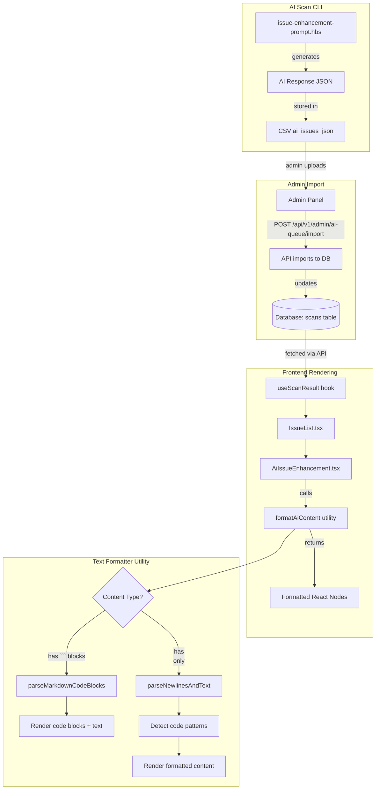

# Design Document

## Overview

This design improves the readability of AI-generated fix suggestions in the scan results UI. The solution has two parts:

1. **AI Prompt Enhancement** (tools/ai-scan-cli): Update the prompt template to enforce consistent markdown formatting with triple backticks for code blocks
2. **Frontend Text Formatter** (apps/web): Create an intelligent text formatting utility that handles both markdown-formatted and legacy plain-text content

## Steering Document Alignment

### Technical Standards (tech.md)
- Uses React functional components with TypeScript
- Follows existing patterns in `AiIssueEnhancement.tsx`
- Utility functions placed in `lib/` directory following kebab-case naming

### Project Structure (structure.md)
- New utility: `apps/web/src/lib/text-formatter.ts`
- Tests: `apps/web/src/lib/__tests__/text-formatter.test.ts`
- Component remains in: `apps/web/src/components/features/ai/AiIssueEnhancement.tsx`
- Prompt template: `tools/ai-scan-cli/templates/issue-enhancement-prompt.hbs`

## Code Reuse Analysis

### Existing Components to Leverage
- **`formatCodeInText()`** in `AiIssueEnhancement.tsx`: Current function handles backtick code blocks - will be enhanced and moved to utility
- **`cn()` utility** in `lib/utils.ts`: For combining Tailwind classes in formatted elements
- **Tailwind styles**: Existing code block styles (`bg-gray-900`, `text-gray-100`, etc.)

### Integration Points
- **AiIssueEnhancement.tsx**: Will import new formatter utility
- **issue-enhancement-prompt.hbs**: Will be updated to enforce markdown formatting
- **Existing AI data**: Must handle legacy data without breaking changes

## Architecture



## Components and Interfaces

### Component 1: Text Formatter Utility

- **Purpose:** Parse and format AI-generated text into React nodes with proper styling
- **File:** `apps/web/src/lib/text-formatter.ts`
- **Interfaces:**

```typescript
/**
 * Options for text formatting
 */
export interface FormatOptions {
  /** Enable URL detection and linking (default: true) */
  linkUrls?: boolean;
  /** Enable "Before/After" section detection (default: true) */
  detectSections?: boolean;
  /** Enable automatic code pattern detection (default: true) */
  autoDetectCode?: boolean;
}

/**
 * Formats AI-generated text into React nodes
 * Handles:
 * - Markdown code blocks (```)
 * - Inline code (`)
 * - Newlines (\n)
 * - Before/After sections
 * - URLs as clickable links
 * - Auto-detected HTML/CSS code
 *
 * @param text - Raw text from AI response
 * @param options - Formatting options
 * @returns Array of React nodes
 */
export function formatAiContent(
  text: string,
  options?: FormatOptions
): React.ReactNode;
```

- **Dependencies:** React, cn() utility
- **Reuses:** Logic from existing `formatCodeInText()` function

### Component 2: Updated AiIssueEnhancement

- **Purpose:** Display AI-enhanced issue analysis with properly formatted fix suggestions
- **File:** `apps/web/src/components/features/ai/AiIssueEnhancement.tsx`
- **Changes:**
  - Replace inline `formatCodeInText()` with imported `formatAiContent()`
  - Apply to both `explanation` and `fixSuggestion` fields
- **Dependencies:** text-formatter utility

### Component 3: Updated AI Prompt Template

- **Purpose:** Generate AI responses with consistent markdown formatting
- **File:** `tools/ai-scan-cli/templates/issue-enhancement-prompt.hbs`
- **Changes:**
  - Add explicit instructions to use triple backticks for all code
  - Provide clearer formatting examples
  - Enforce consistent section structure

## Data Models

### Existing: AiIssueData (no changes)
```typescript
interface AiIssueData {
  issueId: string;
  explanation: string;      // Plain text, may contain \n
  fixSuggestion: string;    // Text with code examples, may contain \n
  priority: number;         // 1-10
}
```

### Formatting Rules (internal to utility)
```typescript
// Patterns for content detection
const PATTERNS = {
  // Markdown code blocks: ```code```
  CODE_BLOCK: /(```[\s\S]*?```)/g,

  // Inline code: `code`
  INLINE_CODE: /(`[^`]+`)/g,

  // URLs: https://... or http://...
  URL: /(https?:\/\/[^\s<>"')\]]+)/g,

  // Section headers: Before:, After:, Step 1:, etc.
  SECTION_HEADER: /^(Before|After|Step \d+|Option \d+):?\s*/im,

  // HTML tags: <tag>...</tag> or <tag />
  HTML_CODE: /(<[a-z][a-z0-9]*(?:\s[^>]*)?>[\s\S]*?<\/[a-z][a-z0-9]*>|<[a-z][a-z0-9]*(?:\s[^>]*)?\/?>)/gi,

  // CSS rules: .class { ... } or selector { ... }
  CSS_CODE: /([.#]?[a-z][a-z0-9_-]*\s*\{[^}]+\})/gi,
};
```

## Error Handling

### Error Scenarios

1. **Null/undefined input**
   - **Handling:** Return empty array `[]`
   - **User Impact:** Nothing displayed (safe fallback)

2. **Empty string input**
   - **Handling:** Return empty array `[]`
   - **User Impact:** Nothing displayed (safe fallback)

3. **Malformed markdown (unmatched backticks)**
   - **Handling:** Treat as plain text with newline formatting
   - **User Impact:** Content still readable, just without code styling

4. **Very long content (>10KB)**
   - **Handling:** Process normally, rely on container scrolling
   - **User Impact:** May see horizontal scroll on code blocks

## Testing Strategy

### Unit Testing

**File:** `apps/web/src/lib/__tests__/text-formatter.test.ts`

Test cases:
- Markdown code blocks are rendered as `<pre><code>`
- Inline code is rendered with code styling
- Newlines are converted to `<br />` or paragraph breaks
- Double newlines create paragraph separation
- URLs are converted to clickable links with security attributes
- "Before:" and "After:" sections are properly labeled
- HTML patterns are auto-detected and styled
- CSS patterns are auto-detected and styled
- Empty/null input returns empty array
- Mixed content (text + code + URLs) is handled correctly
- Legacy content without markdown is still formatted

### Integration Testing

**File:** `apps/web/src/components/features/ai/AiIssueEnhancement.test.tsx`

Test cases:
- Component renders formatted explanation
- Component renders formatted fix suggestion
- Loading state still works
- Priority indicator still works
- Existing tests continue to pass

### End-to-End Testing

Manual verification:
- View scan with AI enhancement at `/scan/{id}`
- Expand issue to see "How to Fix It" section
- Verify code blocks have syntax highlighting appearance
- Verify "Before/After" sections are clearly separated
- Verify URLs are clickable and open in new tab
- Test on mobile viewport for responsiveness

## Visual Design

### Code Block Styling
```css
/* Existing styles from AiIssueEnhancement.tsx */
.code-block {
  @apply mt-2 mb-2 p-3 rounded-md overflow-x-auto;
  @apply bg-gray-900 text-gray-100 text-sm;
  @apply border border-gray-700;
}

.inline-code {
  @apply px-1.5 py-0.5 rounded text-sm;
  @apply bg-gray-900 text-gray-100;
  @apply border border-gray-700;
}
```

### Section Headers (new)
```css
.section-header {
  @apply font-semibold text-gray-800 mt-3 mb-1;
}

.before-section {
  @apply border-l-4 border-red-300 pl-3 my-2;
}

.after-section {
  @apply border-l-4 border-green-300 pl-3 my-2;
}
```

### Link Styling
```css
.ai-link {
  @apply text-purple-600 hover:text-purple-800 underline;
  @apply break-all; /* Handle long URLs */
}
```

## Implementation Sequence

1. **Create text formatter utility** with comprehensive tests
2. **Update AiIssueEnhancement component** to use new utility
3. **Update AI prompt template** to enforce markdown formatting
4. **Verify backward compatibility** with existing scan data

---

**Document Created**: 2026-01-17
**Status**: Ready for Review
