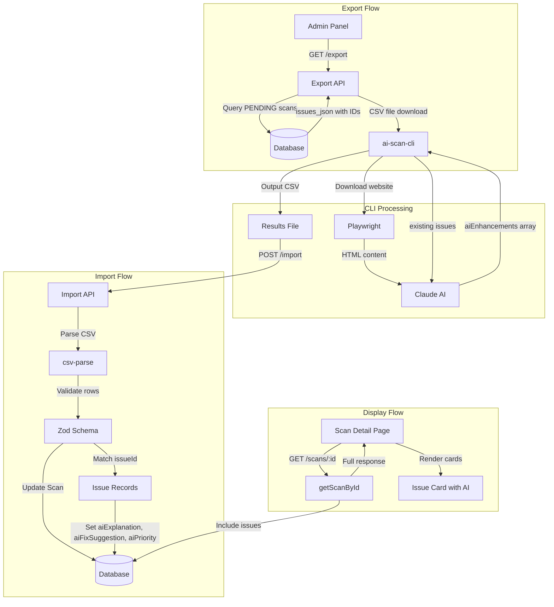
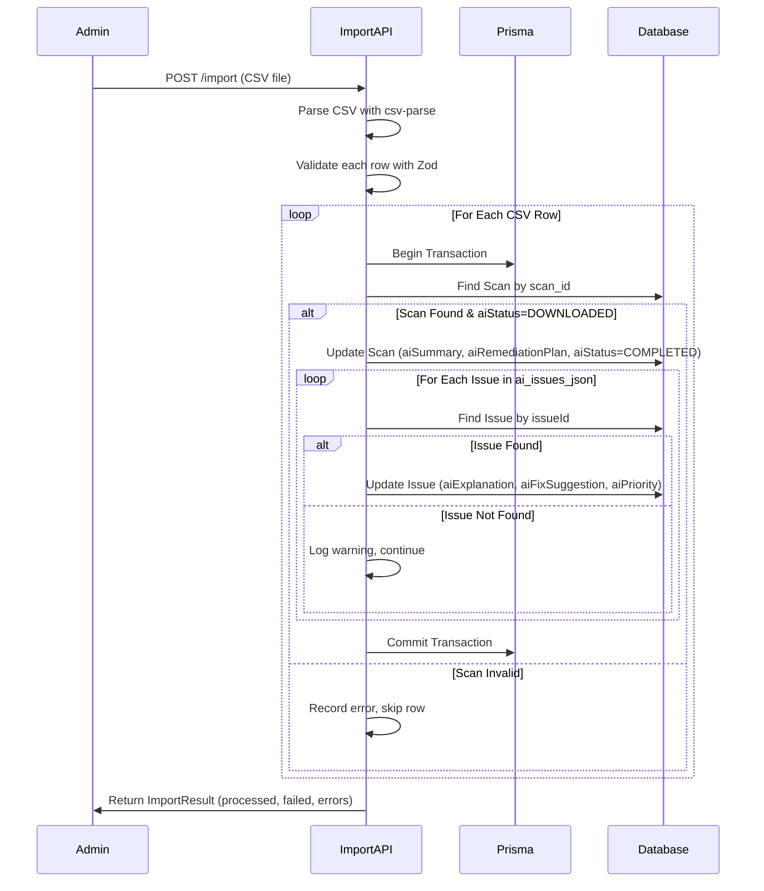

# Design Document: AI Scan Merge Results

## Overview

This design ensures AI scan results generated by the ai-scan-cli tool properly merge with existing axe-core scan results, enabling a unified view in the scan detail pages. The system follows a batch workflow: Export → CLI Process → Import, where AI enhancements are added to existing Issue records.

## Steering Document Alignment

### Technical Standards (tech.md)

- **Backend**: Node.js/TypeScript with Fastify, following existing API patterns
- **Database**: PostgreSQL via Prisma ORM, extending existing Issue model
- **Frontend**: Next.js 14 with React, TailwindCSS, shadcn/ui components
- **Validation**: Zod schemas for API request validation
- **Queue**: BullMQ for background job processing (email notifications)
- **Error Handling**: Use standard AppError, ValidationError, NotFoundError patterns

### Project Structure (structure.md)

- **API Modules**: `apps/api/src/modules/ai-campaign/` for import/export logic
- **Web Components**: `apps/web/src/components/features/` for UI components
- **CLI Tool**: `tools/ai-scan-cli/` for batch AI processing
- **Naming**: kebab-case files, PascalCase components, camelCase functions

## Code Reuse Analysis

### Existing Components to Leverage

| Component | Location | Usage |
|-----------|----------|-------|
| `AiSummarySection` | `apps/web/src/components/features/ai/` | Display AI summary and remediation plan |
| `AiStatusBadge` | `apps/web/src/components/features/ai/` | Show AI processing status |
| `IssueList` | `apps/web/src/components/features/results/` | Already accepts AI fields |
| `flattenIssues` | `apps/web/src/app/scan/[id]/page.tsx` | Transforms issues with AI data |
| `updateIssuesWithAi` | `apps/api/src/modules/ai-campaign/ai-queue.service.ts` | Merge AI data into Issues |

### Integration Points

| System | Integration |
|--------|-------------|
| **Prisma Issue Model** | AI fields already exist: `aiExplanation`, `aiFixSuggestion`, `aiPriority` |
| **Import API** | `/api/v1/admin/ai-queue/import` - POST with CSV file |
| **Export API** | `/api/v1/admin/ai-queue/export` - GET returns CSV with `issues_json` |
| **Scan Detail API** | `/api/v1/admin/scans/:id` - Returns scan with issues via `getScanById()` |

## Architecture

### System Architecture Diagram



### Import Merge Sequence Diagram



## Components and Interfaces

### Component 1: CLI Result Transformer

- **Purpose**: Transform Claude AI output to API-compatible CSV format
- **File**: `tools/ai-scan-cli/src/result-transformer.ts`
- **Status**: ✅ Already correctly implemented
- **Key Function**:
  ```typescript
  function getAiIssuesJson(result: ScanResult): string {
    // Enhancement mode: use aiEnhancements array
    if (result.aiEnhancements && result.aiEnhancements.length > 0) {
      return JSON.stringify(result.aiEnhancements);
    }
    // Legacy mode: convert issues to enhancement format
    const legacyEnhancements: AiIssueEnhancement[] = result.issues.map(...)
    return JSON.stringify(legacyEnhancements);
  }
  ```

### Component 2: Import API Merge Logic

- **Purpose**: Merge AI enhancements into existing Issue records
- **File**: `apps/api/src/modules/ai-campaign/ai-queue.service.ts`
- **Function**: `updateIssuesWithAi()` (lines 559-609)
- **Status**: ✅ Already implemented
- **Transaction Strategy**:
  - Scan-level updates are ATOMIC (all fields update or none)
  - Issue-level updates are BEST-EFFORT (continue on individual failures)
  - Warnings logged for mismatched issue IDs
- **Interface**:
  ```typescript
  async updateIssuesWithAi(
    scanId: string,
    aiIssuesJson: AiIssueEnhancement[],
    tx?: Prisma.TransactionClient
  ): Promise<number>  // Returns count of successfully updated issues
  ```

### Component 3: Admin Scan Detail - Issue Interface (Needs Update)

- **Purpose**: Display axe-core AND AI data for each issue
- **File**: `apps/web/src/app/admin/scans/[id]/page.tsx`
- **Current State**: `Issue` interface (lines 33-45) missing AI fields
- **Required Changes**:

```typescript
// CURRENT (missing AI fields)
interface Issue {
  id: string;
  ruleId: string;
  impact: 'CRITICAL' | 'SERIOUS' | 'MODERATE' | 'MINOR';
  description: string;
  helpText: string;
  helpUrl: string;
  wcagCriteria: string[];
  htmlSnippet: string | null;
  cssSelector: string | null;
  nodes: any;
  createdAt: string;
}

// UPDATED (with AI fields)
interface Issue {
  id: string;
  ruleId: string;
  impact: 'CRITICAL' | 'SERIOUS' | 'MODERATE' | 'MINOR';
  description: string;
  helpText: string;
  helpUrl: string;
  wcagCriteria: string[];
  htmlSnippet: string | null;
  cssSelector: string | null;
  nodes: any;
  createdAt: string;
  // AI Enhancement Fields
  aiExplanation: string | null;
  aiFixSuggestion: string | null;
  aiPriority: number | null;
}
```

### Component 4: Issue Card AI Display (Needs Implementation)

- **Purpose**: Render AI data alongside axe-core data in issue cards
- **File**: `apps/web/src/app/admin/scans/[id]/page.tsx` (lines 670-754)
- **Required Changes**: Add AI sections after existing issue content

```tsx
{/* Existing axe-core content... */}

{/* AI Enhancement Section - Only show if AI data exists */}
{(issue.aiExplanation || issue.aiFixSuggestion || issue.aiPriority) && (
  <div className="mt-4 pt-4 border-t border-gray-200">
    <div className="flex items-center gap-2 mb-2">
      <Sparkles className="h-4 w-4 text-purple-600" />
      <span className="text-sm font-medium text-purple-800">AI Analysis</span>
      {issue.aiPriority && (
        <span className="px-2 py-0.5 rounded text-xs font-semibold bg-purple-100 text-purple-800">
          Priority: {issue.aiPriority}/10
        </span>
      )}
    </div>

    {issue.aiExplanation && (
      <div className="mb-3">
        <label className="block text-xs font-medium text-gray-700 mb-1">
          AI Explanation
        </label>
        <p className="text-sm text-gray-700 bg-purple-50 p-2 rounded">
          {issue.aiExplanation}
        </p>
      </div>
    )}

    {issue.aiFixSuggestion && (
      <div>
        <label className="block text-xs font-medium text-gray-700 mb-1">
          AI Fix Suggestion
        </label>
        <pre className="text-xs font-mono bg-gray-900 text-gray-100 p-3 rounded overflow-x-auto whitespace-pre-wrap">
          {issue.aiFixSuggestion}
        </pre>
      </div>
    )}
  </div>
)}
```

### Component 5: Scan API Response (Verification Needed)

- **Purpose**: Ensure API returns AI fields when fetching scan issues
- **File**: `apps/api/src/modules/scans/scan.repository.ts`
- **Function**: `getScanById()` (line 164)
- **Verification**: Prisma `include` must not exclude AI fields from Issue

## Data Models

### Issue Model (Prisma Schema)

```prisma
// apps/api/prisma/schema.prisma
model Issue {
  id               String      @id @default(uuid())
  scanResultId     String
  ruleId           String
  wcagCriteria     String[]
  impact           IssueImpact
  description      String
  helpText         String
  helpUrl          String
  htmlSnippet      String?
  cssSelector      String?
  nodes            Json
  createdAt        DateTime    @default(now())

  // AI Enhancement Fields (nullable - populated by import)
  aiExplanation    String?     @db.Text
  aiFixSuggestion  String?     @db.Text
  aiPriority       Int?        @db.SmallInt  // 1-10 scale

  scanResult       ScanResult  @relation(fields: [scanResultId], references: [id])
}
```

### AiIssueEnhancement Interface

```typescript
// Used by CLI output and Import API
interface AiIssueEnhancement {
  issueId: string;         // Must match Issue.id from database
  aiExplanation: string;   // Plain language explanation
  aiFixSuggestion: string; // Code fix recommendation
  aiPriority: number;      // 1-10 business impact score
}
```

### CSV Import Row Schema

```typescript
// apps/api/src/modules/ai-campaign/ai-campaign.schema.ts
const csvImportRowSchema = z.object({
  scan_id: z.string().uuid(),
  ai_summary: z.string().min(10).max(10000),
  ai_remediation_plan: z.string().min(10).max(50000),
  ai_issues_json: z.string().refine(isValidJson, {
    message: 'ai_issues_json must be valid JSON'
  }),
  tokens_used: z.coerce.number().int().min(1).max(100000),
  ai_model: z.string().max(50),
  processing_time: z.coerce.number().int().min(0).max(3600),
});
```

### Import Result Interface

```typescript
// apps/api/src/modules/ai-campaign/ai-campaign.types.ts
interface ImportResult {
  success: boolean;           // True if no failures
  processed: number;          // Count of successfully imported scans
  failed: number;             // Count of failed imports
  errors: Array<{
    scanId: string;
    error: string;
  }>;
  tokensDeducted: number;     // Total tokens subtracted from campaign
}
```

## Error Handling

### Error Scenarios

| Scenario | Handling | Logging | User Impact |
|----------|----------|---------|-------------|
| **Issue ID Mismatch** | Skip issue, continue processing | `logger.warn('Issue not found', { issueId, scanId })` | Import succeeds, some issues not enhanced |
| **Scan Not Found** | Reject row with SCAN_NOT_FOUND | `logger.error('Scan not found', { scanId })` | Row fails, others continue |
| **Invalid AI Status** | Reject row with INVALID_AI_STATUS | `logger.warn('Invalid status', { scanId, status })` | Row fails, clear error message |
| **JSON Parse Error** | Reject row with VALIDATION_FAILED | `logger.error('JSON parse failed', { scanId })` | Row fails, error in response |
| **Database Error** | Rollback transaction, reject row | `logger.error('DB error', { scanId, error })` | Row fails, data integrity preserved |

### Transaction Boundaries

- **Per-Scan Atomic**: Each CSV row processed in its own transaction
- **Scan Update**: All scan-level fields update or none (atomic)
- **Issue Updates**: Best-effort within transaction; partial success allowed
- **Rollback Trigger**: Database error or validation failure

### Error Response Format

```typescript
// Example import response with partial failure
{
  success: false,
  processed: 8,
  failed: 2,
  errors: [
    { scanId: "abc-123", error: "SCAN_NOT_FOUND" },
    { scanId: "def-456", error: "INVALID_AI_STATUS: Current status is COMPLETED" }
  ],
  tokensDeducted: 28000
}
```

## Testing Strategy

### Unit Testing

| Test Target | File | Key Tests |
|-------------|------|-----------|
| Result Transformer | `result-transformer.test.ts` | `getAiIssuesJson()` outputs correct format |
| CSV Parser | `csv-parser.test.ts` | Parses `issues_json` to `existingIssues` |
| Import Validation | `ai-campaign.schema.test.ts` | Validates CSV rows against schema |

### Integration Testing

| Test Flow | Description | Assertions |
|-----------|-------------|------------|
| Export → Import | Create scan, export, mock CLI output, import | Issue records have AI fields populated |
| Partial Failure | Import CSV with mixed valid/invalid rows | Successful rows processed, errors returned |
| ID Mismatch | Import with non-existent issueId | Warning logged, other issues updated |

### End-to-End Testing

| Scenario | Steps | Expected Result |
|----------|-------|-----------------|
| Full Workflow | Export → CLI (test mode) → Import → View | AI data visible in scan detail |
| UI Display | Load scan with AI data | Each issue shows aiExplanation, aiFixSuggestion, aiPriority |
| Graceful Degradation | Load scan without AI data | AI sections hidden, no errors |

## Performance Considerations

### Database Optimization

- **Batch Issue Updates**: Use Prisma `updateMany` where possible
- **Index Verification**: Ensure `Issue.id` has index for lookup performance
- **Transaction Size**: Keep per-scan transactions small (typically <100 issues)

### Expected Performance

| Operation | Target | Notes |
|-----------|--------|-------|
| Import 100 scans | <60 seconds | Per requirements |
| Issue update (per issue) | <10ms | Individual Prisma update |
| Scan detail page load | <2 seconds | Including AI data |

## Security Considerations

### File Handling

- CSV files processed in memory (streaming parser)
- No server-side file storage after import completes
- Temporary files cleaned up on request completion

### Input Validation

- All CSV fields validated with Zod before processing
- AI fields sanitized (no HTML injection in aiExplanation/aiFixSuggestion)
- SQL injection prevented by Prisma parameterized queries
