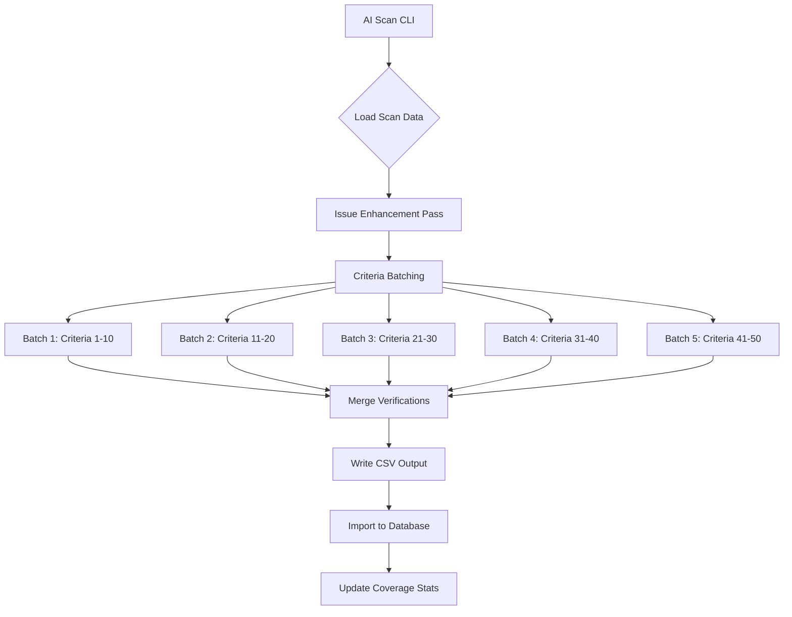
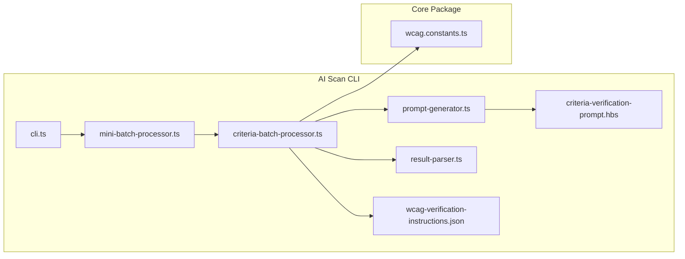
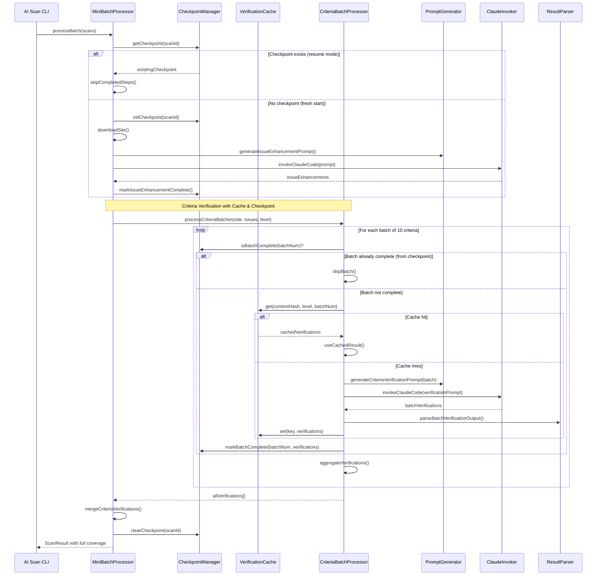

# Design Document: AI WCAG Criteria Verification

## Overview

This design describes the implementation of systematic AI verification for ALL WCAG criteria (50 for AA level) by extending the existing AI scan CLI tool with batch-based criteria verification. The solution introduces a new verification pass that processes criteria in batches of 8-10, using structured prompts with criterion-specific verification instructions.

## Steering Document Alignment

### Technical Standards (tech.md)
- Uses TypeScript with strict typing for all new interfaces
- Follows existing Handlebars template pattern for prompts
- Integrates with existing Prisma schema (CriteriaVerification table)
- Uses existing CSV export/import workflow

### Project Structure (structure.md)
- New files in `tools/ai-scan-cli/src/` following existing naming conventions
- New template in `tools/ai-scan-cli/templates/`
- New data file in `tools/ai-scan-cli/data/`
- Follows existing module patterns (types.ts, prompt-generator.ts, result-parser.ts)

## Code Reuse Analysis

### Existing Components to Leverage
- **prompt-generator.ts**: Extend with `generateCriteriaVerificationPrompt()` function
- **result-parser.ts**: Extend `parseCriteriaVerifications()` to handle batch results
- **claude-invoker.ts**: Reuse `invokeClaudeCode()` for verification batches
- **mini-batch-processor.ts**: Reference batch processing patterns for criteria batches
- **wcag.constants.ts**: Use existing `WCAG_CRITERIA` and `UNTESTABLE_CRITERIA` data

### Integration Points
- **CSV Export**: Add criteria verifications to `ai_criteria_verifications_json` column
- **CSV Import**: `storeCriteriaVerifications()` already handles storage
- **Coverage Service**: Existing `calculateCoverageFromVerifications()` recalculates coverage

## Architecture

### High-Level Flow



### Component Architecture



## Components and Interfaces

### Component 1: CriteriaBatchProcessor

- **Purpose**: Orchestrates batch processing of WCAG criteria verification
- **File**: `tools/ai-scan-cli/src/criteria-batch-processor.ts`
- **Interfaces**:
  ```typescript
  interface CriteriaBatchProcessorOptions {
    batchSize: number;          // Default: 10
    delayBetweenBatches: number; // Default: 2000ms
    timeout: number;            // Default: 120000ms
  }

  interface CriteriaBatchResult {
    batchNumber: number;
    criteriaVerified: number;
    verifications: AiCriteriaVerification[];
    tokensUsed: number;
    durationMs: number;
    errors: string[];
  }

  class CriteriaBatchProcessor {
    constructor(logger: Logger, options?: CriteriaBatchProcessorOptions);

    async processCriteriaBatches(
      downloadedSite: DownloadedSite,
      existingIssues: ExistingIssue[],
      wcagLevel: WcagLevel
    ): Promise<CriteriaBatchResult[]>;
  }
  ```
- **Dependencies**: prompt-generator.ts, claude-invoker.ts, result-parser.ts
- **Reuses**: Logger, DownloadedSite types, invokeClaudeCode()

### Component 2: Criteria Verification Prompt Generator

- **Purpose**: Generate structured prompts for batch criteria verification
- **File**: `tools/ai-scan-cli/src/prompt-generator.ts` (extend existing)
- **Interfaces**:
  ```typescript
  interface CriteriaVerificationContext {
    scanId: string;
    url: string;
    wcagLevel: string;
    pageTitle: string;
    htmlContent?: string;
    accessibilitySnapshot?: string;
    criteriaBatch: CriterionVerificationInstruction[];
    existingIssueIds: string[];
  }

  interface CriterionVerificationInstruction {
    criterionId: string;
    title: string;
    description: string;
    whatToCheck: string;
    passCondition: string;
    failIndicators: string;
    requiresManualReview: boolean;
  }

  function generateCriteriaVerificationPrompt(
    downloadedSite: DownloadedSite,
    criteriaBatch: CriterionVerificationInstruction[],
    existingIssueIds: string[],
    maxHtmlLength?: number
  ): Promise<string>;
  ```
- **Dependencies**: wcag-verification-instructions.json
- **Reuses**: Handlebars templating, existing template loading patterns

### Component 3: WCAG Verification Instructions Repository

- **Purpose**: Data-driven repository of verification instructions per criterion
- **File**: `tools/ai-scan-cli/data/wcag-verification-instructions.json`
- **Structure**:
  ```json
  {
    "version": "2.1",
    "criteria": {
      "1.1.1": {
        "criterionId": "1.1.1",
        "title": "Non-text Content",
        "description": "All non-text content has a text alternative",
        "whatToCheck": "Check all , <svg>, <canvas>, <video>, <audio> elements for appropriate alternatives",
        "passCondition": "All images have descriptive alt text, decorative images use alt=\"\", media has alternatives",
        "failIndicators": "Missing alt attributes, empty alt on informative images, missing media alternatives",
        "requiresManualReview": false
      },
      "1.2.1": {
        "criterionId": "1.2.1",
        "title": "Audio-only and Video-only (Prerecorded)",
        "description": "Alternative for time-based media or audio description provided",
        "whatToCheck": "Check for audio/video elements without text alternatives",
        "passCondition": "Transcripts provided for audio, text alternatives for video",
        "failIndicators": "Media without transcripts or alternatives",
        "requiresManualReview": true
      }
    }
  }
  ```
- **Dependencies**: None (pure data)
- **Reuses**: WCAG_CRITERIA structure from wcag.constants.ts

### Component 4: Criteria Verification Prompt Template

- **Purpose**: Handlebars template for structured verification prompts
- **File**: `tools/ai-scan-cli/templates/criteria-verification-prompt.hbs`
- **Template Structure**:
  ```handlebars
  You are an expert WCAG accessibility auditor. Verify the following {{criteriaBatch.length}} WCAG criteria against the provided page content.

  ## Page Context
  - URL: {{url}}
  - Title: {{pageTitle}}
  - WCAG Level: {{wcagLevel}}

  ## Criteria to Verify

  {{#each criteriaBatch}}
  ### {{this.criterionId}} - {{this.title}}
  **Description**: {{this.description}}
  **What to Check**: {{this.whatToCheck}}
  **Pass Condition**: {{this.passCondition}}
  **Fail Indicators**: {{this.failIndicators}}
  {{#if this.requiresManualReview}}⚠️ Note: This criterion may require manual review for full verification.{{/if}}

  {{/each}}

  ## HTML Content
  ```html
  {{htmlContent}}
  ```

  ## Output Format
  Return a JSON array with one object per criterion:
  ```json
  {
    "criteriaVerifications": [
      {
        "criterionId": "1.1.1",
        "status": "AI_VERIFIED_PASS|AI_VERIFIED_FAIL|NOT_TESTED",
        "confidence": 85,
        "reasoning": "Brief explanation of the verification result",
        "relatedIssueIds": ["issue-id-1"] // Only if status is FAIL and related to existing issues
      }
    ]
  }
  ```
  ```
- **Dependencies**: CriteriaVerificationContext
- **Reuses**: Existing Handlebars helpers

### Component 5: Result Parser Extension

- **Purpose**: Parse batch verification results from AI output
- **File**: `tools/ai-scan-cli/src/result-parser.ts` (extend existing)
- **Interfaces**:
  ```typescript
  interface BatchVerificationResult {
    criteriaVerifications: AiCriteriaVerification[];
  }

  function parseBatchVerificationOutput(output: string): BatchVerificationResult;
  ```
- **Dependencies**: Existing extraction utilities
- **Reuses**: extractJsonFromMarkdown(), normalizeCriteriaVerification()

### Component 6: Mini-Batch Processor Extension

- **Purpose**: Integrate criteria verification into the scan processing workflow
- **File**: `tools/ai-scan-cli/src/mini-batch-processor.ts` (extend existing)
- **Changes**:
  - Add `processCriteriaVerification` option to MiniBatchProcessorOptions
  - After issue enhancement, call CriteriaBatchProcessor
  - Merge criteria verifications into ScanResult
- **Dependencies**: CriteriaBatchProcessor
- **Reuses**: All existing processing logic

### Component 7: Criteria Verification Checkpoint Manager

- **Purpose**: Track progress of criteria verification batches for resumable processing
- **File**: `tools/ai-scan-cli/src/criteria-checkpoint-manager.ts`
- **Interfaces**:
  ```typescript
  interface CriteriaCheckpoint {
    /** Scan ID being verified */
    scanId: string;
    /** URL being scanned */
    url: string;
    /** WCAG level (A, AA, AAA) */
    wcagLevel: WcagLevel;
    /** Total number of criteria batches */
    totalBatches: number;
    /** Completed batch numbers (0-indexed) */
    completedBatches: number[];
    /** Verifications collected so far */
    partialVerifications: AiCriteriaVerification[];
    /** Issue enhancement already completed */
    issueEnhancementComplete: boolean;
    /** Issue enhancement result (if complete) */
    issueEnhancementResult?: {
      aiSummary: string;
      aiRemediationPlan: string;
      aiEnhancements: AiIssueEnhancement[];
      tokensUsed: number;
    };
    /** Timestamp when processing started */
    startedAt: string;
    /** Timestamp of last update */
    updatedAt: string;
    /** Total tokens used so far */
    tokensUsed: number;
  }

  class CriteriaCheckpointManager {
    constructor(checkpointDir?: string);

    /** Get checkpoint for a scan (returns null if not found) */
    async getCheckpoint(scanId: string): Promise<CriteriaCheckpoint | null>;

    /** Initialize new checkpoint for a scan */
    initCheckpoint(scanId: string, url: string, wcagLevel: WcagLevel, totalBatches: number): CriteriaCheckpoint;

    /** Save checkpoint to disk (atomic write) */
    async saveCheckpoint(checkpoint: CriteriaCheckpoint): Promise<void>;

    /** Mark a batch as completed and save verifications */
    async markBatchComplete(
      scanId: string,
      batchNumber: number,
      verifications: AiCriteriaVerification[],
      tokensUsed: number
    ): Promise<void>;

    /** Mark issue enhancement as complete */
    async markIssueEnhancementComplete(
      scanId: string,
      result: CriteriaCheckpoint['issueEnhancementResult']
    ): Promise<void>;

    /** Delete checkpoint after successful completion */
    async clearCheckpoint(scanId: string): Promise<void>;

    /** Get list of incomplete batches for resuming */
    getIncompleteBatches(checkpoint: CriteriaCheckpoint): number[];

    /** Check if a batch is already completed */
    isBatchComplete(checkpoint: CriteriaCheckpoint, batchNumber: number): boolean;
  }
  ```
- **Dependencies**: fs/promises
- **Reuses**: Atomic write pattern from existing CheckpointManager

### Component 8: Criteria Verification Cache

- **Purpose**: Cache AI verification results to avoid re-processing identical content
- **File**: `tools/ai-scan-cli/src/criteria-verification-cache.ts`
- **Interfaces**:
  ```typescript
  interface CacheKey {
    /** Hash of HTML content (SHA-256, first 16 chars) */
    contentHash: string;
    /** WCAG level */
    wcagLevel: WcagLevel;
    /** Batch number (criteria set) */
    batchNumber: number;
  }

  interface CacheEntry {
    /** Cache key for lookup */
    key: CacheKey;
    /** Cached verifications */
    verifications: AiCriteriaVerification[];
    /** Tokens used for this verification */
    tokensUsed: number;
    /** AI model used */
    aiModel: string;
    /** When this entry was created */
    createdAt: string;
    /** When this entry expires (TTL) */
    expiresAt: string;
  }

  interface CacheStats {
    hits: number;
    misses: number;
    hitRate: number;
    entriesCount: number;
    totalSavedTokens: number;
  }

  class CriteriaVerificationCache {
    constructor(options?: {
      cacheDir?: string;        // Default: .ai-scan-cache/
      ttlDays?: number;         // Default: 7 days
      maxEntries?: number;      // Default: 1000
    });

    /** Generate cache key from content and parameters */
    generateKey(htmlContent: string, wcagLevel: WcagLevel, batchNumber: number): CacheKey;

    /** Get cached verifications (returns null if not cached or expired) */
    async get(key: CacheKey): Promise<CacheEntry | null>;

    /** Store verifications in cache */
    async set(
      key: CacheKey,
      verifications: AiCriteriaVerification[],
      tokensUsed: number,
      aiModel: string
    ): Promise<void>;

    /** Check if a valid cache entry exists */
    async has(key: CacheKey): Promise<boolean>;

    /** Clear expired entries */
    async cleanup(): Promise<number>;

    /** Clear all cache entries */
    async clearAll(): Promise<void>;

    /** Get cache statistics */
    getStats(): CacheStats;

    /** Warm up cache by loading index into memory */
    async warmup(): Promise<void>;
  }
  ```
- **Dependencies**: crypto (for hashing), fs/promises
- **Reuses**: None (new functionality)

**Cache Storage Structure**:
```
.ai-scan-cache/
├── index.json           # Quick lookup index
├── entries/
│   ├── abc123_AA_0.json # Cache entry files
│   ├── def456_AA_1.json
│   └── ...
└── stats.json           # Cache statistics
```

## Data Models

### CriterionVerificationInstruction
```typescript
interface CriterionVerificationInstruction {
  criterionId: string;       // "1.1.1"
  title: string;             // "Non-text Content"
  description: string;       // Full WCAG description
  whatToCheck: string;       // Specific elements/patterns to examine
  passCondition: string;     // What constitutes a pass
  failIndicators: string;    // What indicates failure
  requiresManualReview: boolean; // If true, confidence should be lower
}
```

### CriteriaBatchResult
```typescript
interface CriteriaBatchResult {
  batchNumber: number;
  criteriaVerified: number;
  verifications: AiCriteriaVerification[];
  tokensUsed: number;
  durationMs: number;
  errors: string[];
}
```

### Extended ScanResult
```typescript
interface ScanResult {
  // ... existing fields ...

  /** AI verifications for WCAG criteria - now includes all criteria */
  criteriaVerifications?: AiCriteriaVerification[];

  /** Token usage breakdown */
  tokenUsage?: {
    issueEnhancement: number;
    criteriaVerification: number;
    total: number;
  };
}
```

## Sequence Diagram



## Error Handling

### Error Scenarios

1. **Batch Processing Timeout**
   - **Handling**: Mark all criteria in batch as NOT_TESTED, continue with next batch
   - **User Impact**: Reduced coverage for that batch, logged warning

2. **AI Returns Malformed JSON**
   - **Handling**: Retry once with simplified prompt, then mark batch as NOT_TESTED
   - **User Impact**: Logged error, partial coverage

3. **Rate Limit Hit**
   - **Handling**: Exponential backoff (60s, 120s, 240s), retry up to 3 times
   - **User Impact**: Longer processing time, logged warning

4. **All Batches Fail**
   - **Handling**: Return existing axe-core verifications only, log error
   - **User Impact**: Coverage remains at axe-core baseline (~28%), error notification

5. **Missing HTML Content**
   - **Handling**: Use accessibility snapshot only, lower confidence scores
   - **User Impact**: Some criteria marked NOT_TESTED

## Testing Strategy

### Unit Testing
- **CriteriaBatchProcessor**: Test batch creation, merging, error handling
- **Prompt Generator**: Test template rendering with various batch sizes
- **Result Parser**: Test JSON extraction from various AI output formats
- Test files: `*.test.ts` alongside source files

### Integration Testing
- End-to-end test with mock AI responses
- Test full workflow: CSV input → AI processing → CSV output
- Verify coverage statistics update correctly

### End-to-End Testing
- Run against sample page with known accessibility issues
- Verify criteria coverage increases from ~28% to ~80%
- Test with different WCAG levels (A, AA)

## Configuration

### Environment Variables
```bash
# Batch size for criteria verification (default: 10)
AI_CRITERIA_BATCH_SIZE=10

# Delay between batches in milliseconds (default: 2000)
AI_CRITERIA_BATCH_DELAY=2000

# Enable/disable criteria verification (default: true)
AI_CRITERIA_VERIFICATION_ENABLED=true

# Timeout per batch in milliseconds (default: 120000)
AI_CRITERIA_BATCH_TIMEOUT=120000
```

### CLI Options
```bash
# Skip criteria verification (faster, issue enhancement only)
ai-scan --skip-criteria-verification

# Custom batch size
ai-scan --criteria-batch-size 8

# Verbose logging for criteria verification
ai-scan --verbose-criteria

# Resume from checkpoint (automatic if checkpoint exists)
ai-scan --resume

# Force fresh start (ignore existing checkpoints)
ai-scan --fresh

# Disable cache (always call AI, useful for testing)
ai-scan --no-cache

# Clear cache before processing
ai-scan --clear-cache

# Show cache statistics
ai-scan --cache-stats

# Custom checkpoint directory
ai-scan --checkpoint-dir ./checkpoints

# Custom cache directory
ai-scan --cache-dir ./cache

# Cache TTL in days (default: 7)
ai-scan --cache-ttl 14
```

## Performance Considerations

### Token Budget
| Component | Tokens per Scan |
|-----------|-----------------|
| Issue Enhancement | ~4,000 |
| Criteria Batch 1 | ~4,000 |
| Criteria Batch 2 | ~4,000 |
| Criteria Batch 3 | ~4,000 |
| Criteria Batch 4 | ~4,000 |
| Criteria Batch 5 | ~4,000 |
| **Total** | ~24,000 |

### Time Budget
| Component | Time per Scan |
|-----------|---------------|
| Issue Enhancement | ~30s |
| Criteria Batches (5x) | ~150s (30s each) |
| Delays (5x) | ~10s |
| **Total** | ~3-4 minutes |

### Optimization Strategies
1. **Parallel Batches**: Process 2 batches concurrently (if rate limits allow)
2. **Smart Batching**: Group related criteria together to reduce context switching
3. **Cache Instructions**: Load verification instructions once at startup
4. **Skip Verified**: Don't re-verify criteria already verified by axe-core

## Migration Plan

### Phase 1: Add Infrastructure (No Breaking Changes)
1. Create wcag-verification-instructions.json
2. Add criteria-verification-prompt.hbs template
3. Add CriteriaBatchProcessor class
4. Extend prompt-generator.ts

### Phase 2: Integration (Opt-in)
1. Add `--enable-criteria-verification` flag
2. Extend mini-batch-processor.ts with conditional criteria verification
3. Test with subset of scans

### Phase 3: Default On
1. Enable criteria verification by default
2. Add `--skip-criteria-verification` flag for opt-out
3. Update documentation

## File Summary

| File | Action | Description |
|------|--------|-------------|
| `tools/ai-scan-cli/data/wcag-verification-instructions.json` | CREATE | Verification instructions for all 50 AA criteria |
| `tools/ai-scan-cli/templates/criteria-verification-prompt.hbs` | CREATE | Handlebars template for verification prompts |
| `tools/ai-scan-cli/src/criteria-batch-processor.ts` | CREATE | Orchestrates batch verification processing |
| `tools/ai-scan-cli/src/criteria-checkpoint-manager.ts` | CREATE | Track progress for resumable processing |
| `tools/ai-scan-cli/src/criteria-verification-cache.ts` | CREATE | Cache verification results to avoid re-processing |
| `tools/ai-scan-cli/src/prompt-generator.ts` | MODIFY | Add generateCriteriaVerificationPrompt() |
| `tools/ai-scan-cli/src/result-parser.ts` | MODIFY | Add parseBatchVerificationOutput() |
| `tools/ai-scan-cli/src/mini-batch-processor.ts` | MODIFY | Integrate criteria verification with cache/checkpoint |
| `tools/ai-scan-cli/src/cli.ts` | MODIFY | Add cache/checkpoint CLI options |
| `tools/ai-scan-cli/src/types.ts` | MODIFY | Add CriteriaBatchResult, CriteriaCheckpoint, CacheEntry types |

## Cache and Checkpoint Behavior

### Checkpoint Behavior

```
┌─────────────────────────────────────────────────────────────────┐
│                     Checkpoint Resume Flow                       │
├─────────────────────────────────────────────────────────────────┤
│  1. CLI starts → Check for checkpoint file                      │
│  2. If checkpoint exists:                                        │
│     - Load partial verifications                                 │
│     - Skip completed batches                                     │
│     - Resume from next incomplete batch                          │
│  3. If no checkpoint:                                            │
│     - Initialize new checkpoint                                  │
│     - Start from batch 0                                         │
│  4. After each batch:                                            │
│     - Save verifications to checkpoint                           │
│     - Mark batch as complete                                     │
│  5. On completion:                                               │
│     - Delete checkpoint file                                     │
│     - Return full results                                        │
└─────────────────────────────────────────────────────────────────┘
```

**Checkpoint File Location**: `.ai-scan-checkpoints/{scanId}.json`

**Recovery Scenarios**:
- Process killed mid-batch → Resume from that batch
- Network timeout → Retry batch, resume from checkpoint
- Machine restart → Resume from last completed batch

### Cache Behavior

```
┌─────────────────────────────────────────────────────────────────┐
│                       Cache Lookup Flow                          │
├─────────────────────────────────────────────────────────────────┤
│  1. Generate cache key:                                          │
│     key = SHA256(htmlContent)[:16] + wcagLevel + batchNumber    │
│  2. Check cache:                                                 │
│     - If hit + not expired → Use cached verifications           │
│     - If miss or expired → Call AI, cache result                │
│  3. Cache benefits:                                              │
│     - Same page re-scanned → Instant results                    │
│     - Token savings tracked in stats                             │
│     - TTL prevents stale results                                 │
└─────────────────────────────────────────────────────────────────┘
```

**Cache Key Components**:
- `contentHash`: SHA-256 of HTML content (first 16 chars)
- `wcagLevel`: A, AA, or AAA
- `batchNumber`: 0-4 for 50 criteria in 10-criteria batches

**Cache Invalidation**:
- TTL expiration (default: 7 days)
- Manual clear via `--clear-cache`
- Content change (different hash)

### Token Savings Estimation

| Scenario | Without Cache | With Cache | Savings |
|----------|---------------|------------|---------|
| First scan | 24,000 tokens | 24,000 tokens | 0% |
| Re-scan same page | 24,000 tokens | 0 tokens | 100% |
| Re-scan similar page (50% overlap) | 24,000 tokens | 12,000 tokens | 50% |
| Batch of 10 same pages | 240,000 tokens | 24,000 tokens | 90% |
