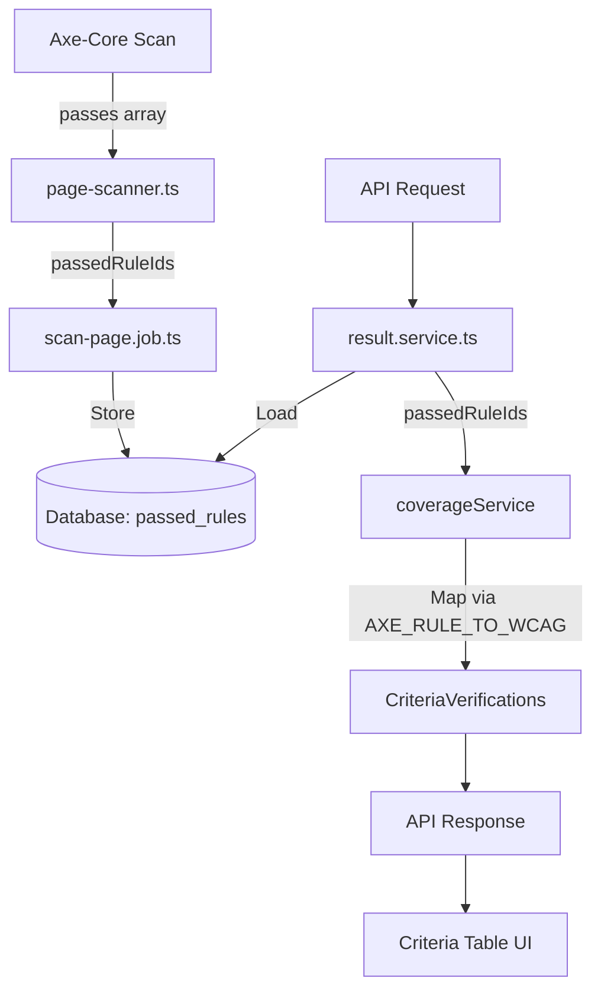
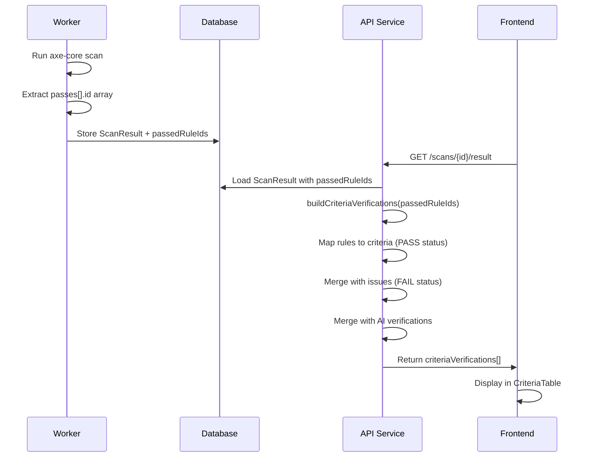

# Design Document: Axe-Core Criteria Mapping

## Overview

This feature modifies the scan processing pipeline to capture and store axe-core's passed rule IDs, then use this data to accurately build WCAG criteria verifications. The design minimizes changes by leveraging existing infrastructure (AXE_RULE_TO_WCAG mapping, CriteriaVerification model, coverage service).

## Steering Document Alignment

### Technical Standards (tech.md)
- Uses existing Prisma ORM patterns for database changes
- Follows established worker job processing patterns
- Leverages existing TypeScript interfaces in `@adashield/core`
- Uses existing coverage service methods (extends, doesn't replace)

### Project Structure (structure.md)
- Database schema changes in `apps/api/prisma/schema.prisma`
- Worker changes in `apps/worker/src/processors/scanner/` and `apps/worker/src/jobs/`
- Type definitions in `packages/core/src/types/`
- Service changes in `apps/api/src/modules/results/`

## Design Decisions

### Decision 1: Store Rule IDs Only (Not Node Counts)

**Requirement 1.AC2** states: "store the count of DOM nodes that passed each rule". After analysis, we've decided to store only rule IDs without per-rule node counts for these reasons:

1. **Criteria-level verification needs only pass/fail status** - Whether 1 node or 100 nodes passed a rule, the criterion status is the same (PASS)
2. **Simpler data model** - `String[]` vs `{ ruleId: string; nodeCount: number }[]`
3. **Smaller storage footprint** - Typical scans have 50-80 passed rules, saving ~1KB per scan
4. **Existing `passedChecks: Int` preserves total count** - The aggregate count is still available

**Alternative considered:** Store `passedRuleDetails: Json` with node counts. Rejected due to added complexity with no user-facing benefit.

## Code Reuse Analysis

### Existing Components to Leverage
- **AXE_RULE_TO_WCAG constant**: Already maps 80+ axe rules to WCAG criteria (`packages/core/src/constants/wcag.constants.ts`)
- **CriteriaVerification model**: Already exists in database schema, stores criterion status
- **coverageService.buildCriteriaVerifications()**: Already designed to accept `passedChecks: string[]` (rule IDs)
- **coverageService.mapPassedChecksToCriteria()**: Already implements rule-to-criteria mapping
- **result-mapper.ts**: Already has `extractWcagCriteria()` function for mapping

### Integration Points
- **scan-page.job.ts**: Where scan results are persisted to database
- **page-scanner.ts**: Where axe-core results are available (passes array exists)
- **result.service.ts**: Where criteria verifications are built for API response
- **ScanResultsTabs component**: Already displays criteria table (no UI changes needed)

## Architecture

### Data Flow



### Processing Flow



## Components and Interfaces

### Component 1: Database Schema Extension

- **Purpose:** Store passed rule IDs with scan results
- **Approach:** Add `passedRuleIds` column to existing `ScanResult` model (simpler than new table)
- **Dependencies:** Prisma, PostgreSQL
- **Reuses:** Existing ScanResult model

```prisma
model ScanResult {
  // Existing fields...
  passedChecks       Int      @default(0)
  inapplicableChecks Int      @default(0)

  // NEW: Store actual rule IDs
  passedRuleIds      String[] @default([])  // e.g., ["color-contrast", "image-alt"]

  // Existing relations...
}
```

### Component 2: Worker Scanner Enhancement

- **Purpose:** Extract and return passed rule IDs from axe-core results
- **Interfaces:** Modified `ScanResult` type to include `passedRuleIds: string[]`
- **Dependencies:** axe-core types, page-scanner.ts
- **Reuses:** Existing scanner infrastructure

```typescript
// packages/core/src/types/scan.types.ts
export interface ScanResult {
  issues: MappedIssue[];
  passes: number;           // Keep for backward compat
  passedRuleIds: string[];  // NEW: actual rule IDs
  inapplicable: number;
}
```

**Implementation in page-scanner.ts:**
```typescript
// apps/worker/src/processors/scanner/page-scanner.ts
// In the scanPage() function, modify the return statement:

return {
  issues: mappedIssues,
  passes: axeResults.passes.length,
  passedRuleIds: axeResults.passes.map((pass) => pass.id),  // NEW: extract rule IDs
  inapplicable: axeResults.inapplicable.length,
};
```

### Component 3: Job Processor Update

- **Purpose:** Persist passed rule IDs to database
- **Interfaces:** Uses updated Prisma client with new field
- **Dependencies:** scan-page.job.ts, Prisma
- **Reuses:** Existing job processing pattern

```typescript
// In scan-page.job.ts - createScanResult()
await prisma.scanResult.create({
  data: {
    // existing fields...
    passedChecks: scanResult.passes,
    passedRuleIds: scanResult.passedRuleIds,  // NEW
  }
});
```

### Component 4: Coverage Service Integration

- **Purpose:** Use actual rule IDs instead of estimation
- **Interfaces:** Modified `buildCriteriaVerifications()` call
- **Dependencies:** coverage.service.ts, result.service.ts
- **Reuses:** Existing `mapPassedChecksToCriteria()` method (already implemented!)

```typescript
// In result.service.ts - formatResult()
criteriaVerifications = coverageService.buildCriteriaVerifications({
  issues: mappedIssues,
  wcagLevel: scan.wcagLevel,
  passedChecks: scanResult.passedRuleIds,  // Use actual IDs, not empty array
  aiVerifications: storedAiVerifications,
  aiModel: scan.aiModel,
});
```

**Specific change location:**
```typescript
// apps/api/src/modules/results/result.service.ts
// Change from (around line 348):
passedChecks: [],  // No specific rule IDs available in legacy data

// To:
passedChecks: scanResult.scanResult?.passedRuleIds ?? [],  // Use stored rule IDs
```

### Component 5: Summary Statistics Alignment

- **Purpose:** Ensure Summary section shows criteria-level counts consistent with Criteria Table
- **Interfaces:** No new interfaces needed - uses existing `enhancedCoverage` data
- **Dependencies:** result.service.ts, ScanCoverageCard, ResultsSummary components
- **Reuses:** Existing `enhancedCoverage` computation in `buildCriteriaVerifications()`

**Key Insight:** The Summary "Passed" count comes from `result.summary.passed` which is the axe-core rule count. After this feature:
- Criteria Table will show accurate PASS/FAIL from axe-core + AI
- Summary already uses `enhancedCoverage.breakdown` for criteria-level display
- No UI changes needed - `buildCriteriaVerifications()` output already feeds `enhancedCoverage`

**Statistics Flow:**
```
passedRuleIds → buildCriteriaVerifications() → criteriaVerifications[]
                                             ↓
                              enhancedCoverage.breakdown.passed (criteria count)
                              enhancedCoverage.breakdown.failed (criteria count)
```

## Data Models

### ScanResult (Modified)

```typescript
interface ScanResult {
  id: string;
  scanId: string;
  totalIssues: number;
  criticalCount: number;
  seriousCount: number;
  moderateCount: number;
  minorCount: number;
  passedChecks: number;        // Count (kept for backward compat)
  passedRuleIds: string[];     // NEW: ["color-contrast", "image-alt", ...]
  inapplicableChecks: number;
  createdAt: Date;
}
```

### CriteriaVerification (Unchanged)

```typescript
interface CriteriaVerification {
  criterionId: string;         // e.g., "1.4.3"
  status: CriteriaStatus;      // PASS | FAIL | AI_VERIFIED_PASS | AI_VERIFIED_FAIL | NOT_TESTED
  scanner: string;             // "axe-core" | "AI" | "axe-core + AI" | "N/A"
  issueIds?: string[];
  confidence?: number;
  reasoning?: string;
}
```

### Status Precedence Logic

```
Priority (highest to lowest):
1. AI_VERIFIED_FAIL  - AI found issue
2. AI_VERIFIED_PASS  - AI confirmed pass
3. FAIL              - axe-core found issue
4. PASS              - axe-core rule passed
5. NOT_TESTED        - No data
```

## Error Handling

### Error Scenarios

1. **Axe-core passes array is empty**
   - **Handling:** Store empty array `[]`, passedChecks = 0
   - **User Impact:** None - criteria show as NOT_TESTED (current behavior)

2. **Unknown rule ID in passes array**
   - **Handling:** Skip rules not in AXE_RULE_TO_WCAG mapping, log warning
   - **User Impact:** None - unmapped rules don't affect criteria table

3. **Database storage fails for passedRuleIds**
   - **Handling:** Transaction rollback, retry job, or store with empty array
   - **User Impact:** Falls back to estimation mode (current behavior)

4. **Legacy scan without passedRuleIds**
   - **Handling:** `computeVerificationsFromLegacyData()` already handles this
   - **User Impact:** None - existing scans work unchanged

## Testing Strategy

### Unit Testing

**coverage.service.test.ts:**
- Test `buildCriteriaVerifications()` with actual rule IDs
- Test precedence: FAIL overrides PASS
- Test precedence: AI_VERIFIED_* overrides axe-core
- Test rule-to-criteria mapping accuracy

**page-scanner.test.ts:**
- Test extraction of rule IDs from `axeResults.passes[]`
- Test handling of empty passes array
- Test that `passedRuleIds` matches `passes` count

**result-mapper.test.ts:**
- Test extraction of rule IDs from axe passes array
- Test handling of empty passes array

### Integration Testing

**scan-page.job.test.ts:**
- Test passedRuleIds storage in database
- Test backward compatibility with existing scans

**result.service.test.ts:**
- Test end-to-end: stored rules → criteria verifications
- Test API response structure unchanged

### End-to-End Testing

**criteria-coverage.spec.ts:**
- Verify criteria table shows PASS status for axe-core passed criteria
- Verify scanner field shows correct source
- Verify counts match between Summary and Criteria Table

## Migration Strategy

### Database Migration

```sql
-- Migration: Add passedRuleIds column
ALTER TABLE scan_results
ADD COLUMN "passedRuleIds" TEXT[] DEFAULT '{}';

-- No data migration needed - new scans will populate
-- Old scans work via computeVerificationsFromLegacyData()
```

### Rollback Plan

1. Remove `passedRuleIds` column from schema
2. Revert worker changes (don't extract rule IDs)
3. Service automatically falls back to estimation mode
