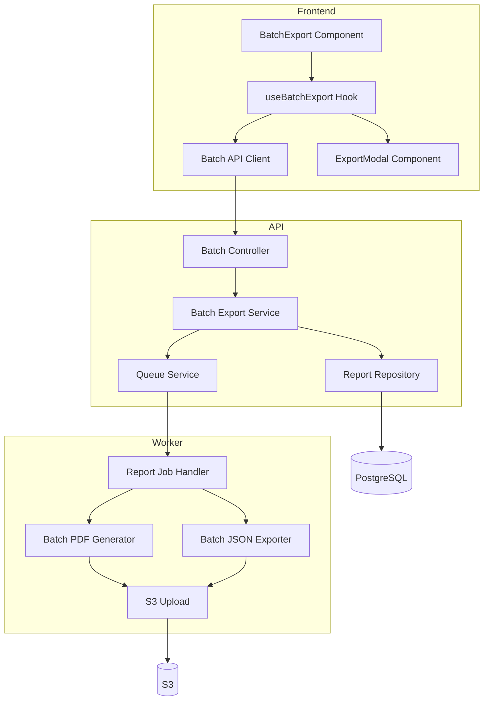
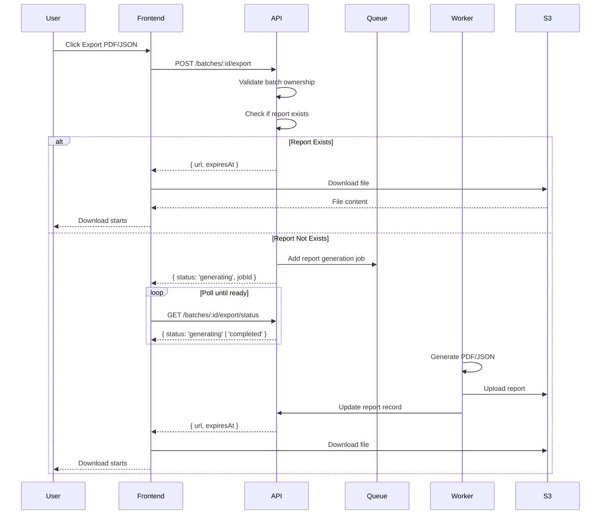
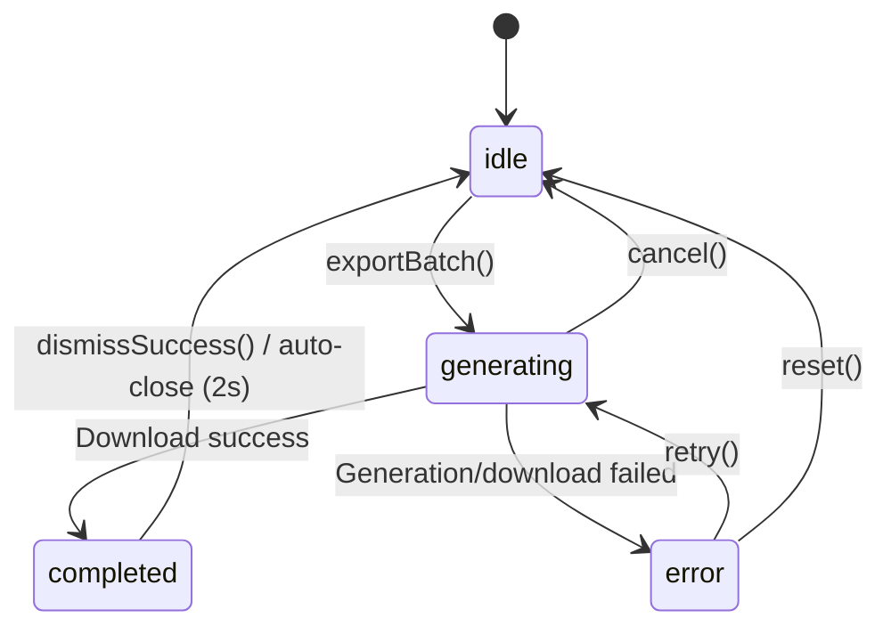

# Design Document: Batch Scan Export

## Overview

This feature extends the existing export functionality to support batch scan exports in PDF and JSON formats. The design builds upon the existing single scan export infrastructure while addressing the unique requirements of batch scans, including aggregate statistics, per-URL breakdowns, and detailed issue reports.

## Steering Document Alignment

### Technical Standards (tech.md)

| Standard | Alignment |
|----------|-----------|
| **Backend Framework** | Fastify with Zod validation (existing pattern) |
| **PDF Generation** | PDFKit via worker package (existing pattern) |
| **Storage** | S3 with presigned URLs (existing pattern) |
| **Frontend** | React hooks with React Query (existing pattern) |
| **TypeScript** | Strict mode with proper type definitions |

### Project Structure (structure.md)

| Convention | Implementation |
|------------|----------------|
| **API Module** | `apps/api/src/modules/batches/` - extend existing batch module |
| **Worker Processors** | `apps/worker/src/processors/reporter/` - add batch JSON exporter |
| **Frontend Hooks** | `apps/web/src/hooks/useBatchExport.ts` - new hook following useExport pattern |
| **Components** | `apps/web/src/components/features/batch/` - extend BatchExport component |

## Code Reuse Analysis

### Existing Components to Leverage

| Component | Location | How It Will Be Used |
|-----------|----------|---------------------|
| `batch-export.service.ts` | `apps/api/src/modules/batches/` | Extend with async generation and S3 upload |
| `batch-pdf-generator.ts` | `apps/worker/src/processors/reporter/` | Enhance to include detailed per-URL issues |
| `json-exporter.ts` | `apps/worker/src/processors/reporter/` | Reference for batch JSON export structure |
| `useExport.ts` | `apps/web/src/hooks/` | Clone and adapt for batch-specific behavior |
| `ExportModal.tsx` | `apps/web/src/components/features/export/` | Reuse modal UI pattern |
| `pdf-templates.ts` | `apps/worker/src/processors/reporter/` | Reuse styling, colors, fonts, sanitization |

### Integration Points

| System | Integration Approach |
|--------|---------------------|
| **Batch API** | Extend existing `/api/v1/batches/:id/export` endpoint |
| **Admin API** | Add new `/api/v1/admin/batches/:id/export` endpoint |
| **S3 Storage** | Use existing upload utilities with batch-specific keys |
| **Report Model** | Use existing Report model with batchId association |

## Architecture

### Component Architecture



### Export Flow Sequence



## Components and Interfaces

### Component 1: Enhanced Batch Export Service

- **Purpose**: Orchestrates batch report generation with async job support
- **File**: `apps/api/src/modules/batches/batch-export.service.ts`
- **Interfaces**:
  ```typescript
  interface BatchExportRequest {
    batchId: string;
    format: 'pdf' | 'json';
    guestSessionId?: string;  // For user exports
    adminId?: string;         // For admin exports
  }

  interface BatchExportResponse {
    status: 'ready' | 'generating';
    url?: string;
    expiresAt?: string;
    jobId?: string;
  }

  function requestBatchExport(req: BatchExportRequest): Promise<BatchExportResponse>;
  function getBatchExportStatus(batchId: string, format: 'pdf' | 'json'): Promise<BatchExportResponse>;
  ```
- **Dependencies**: Report Repository, Queue Service, S3 Utils
- **Reuses**: Existing `generateBatchPdf()`, S3 upload utilities

### Component 2: Batch JSON Exporter

- **Purpose**: Generates structured JSON reports for batch scans
- **File**: `apps/worker/src/processors/reporter/batch-json-exporter.ts`
- **Interfaces**:
  ```typescript
  interface BatchJsonReport {
    version: '1.0';
    generatedAt: string;
    tool: { name: 'ADAShield'; version: string };
    batch: {
      id: string;
      homepageUrl: string;
      wcagLevel: string;
      totalUrls: number;
      completedCount: number;
      failedCount: number;
      createdAt: string;
      completedAt: string;
    };
    aggregate: {
      totalIssues: number;
      bySeverity: { critical: number; serious: number; moderate: number; minor: number };
      passedChecks: number;
    };
    disclaimer: string;
    urls: Array<{
      scanId: string;
      url: string;
      pageTitle: string | null;
      status: string;
      issues: Array<IssueDetail>;  // Full issue details
    }>;
  }

  function generateBatchJsonReport(input: BatchJsonInput): BatchJsonReport;
  function exportBatchJson(input: BatchJsonInput): Promise<{ buffer: Buffer; key: string }>;
  function uploadBatchJsonToS3(buffer: Buffer, key: string): Promise<string>;
  ```
- **Dependencies**: S3 Utils, Batch Service Types
- **Reuses**: `json-exporter.ts` patterns, `sanitizeText()` utilities

### Component 3: Enhanced Batch PDF Generator

- **Purpose**: Generate comprehensive PDF reports with detailed per-URL issues
- **File**: `apps/worker/src/processors/reporter/batch-pdf-generator.ts`
- **Interfaces**:
  ```typescript
  interface BatchPdfInputEnhanced extends BatchPdfInput {
    urlBreakdowns?: Array<{
      scanId: string;
      url: string;
      pageTitle: string | null;
      issues: Array<{
        severity: string;
        count: number;
        details: Array<IssueDetail>;
      }>;
    }>;
    includeDetailedIssues?: boolean;  // Default: true for full report
  }
  ```
- **Dependencies**: PDFKit, pdf-templates utilities
- **Reuses**: Existing `generateBatchPdfReport()`, styling from `pdf-templates.ts`

### Component 4: useBatchExport Hook

- **Purpose**: Frontend state management for batch export operations
- **File**: `apps/web/src/hooks/useBatchExport.ts`
- **Interfaces**:
  ```typescript
  interface UseBatchExportReturn {
    exportBatch: (batchId: string, format: 'pdf' | 'json') => Promise<boolean>;
    state: ExportState;  // Reuse from useExport
    cancel: () => void;
    reset: () => void;
    isExporting: boolean;
    canExport: boolean;
    // Success confirmation (Requirement 4, AC5)
    showSuccessConfirmation: boolean;
    dismissSuccess: () => void;
  }

  function useBatchExport(batchStatus: string): UseBatchExportReturn;
  ```
- **Dependencies**: Batch API client, React state
- **Reuses**: `useExport.ts` patterns (polling, cancellation, download)

**State Machine Diagram:**



### Component 5: BatchExport Component Enhancement

- **Purpose**: UI for batch export with format selection and status
- **File**: `apps/web/src/components/features/batch/BatchExport.tsx`
- **Props**:
  ```typescript
  interface BatchExportProps {
    batchId: string;
    status: BatchStatus;
    className?: string;
  }
  ```
- **Dependencies**: useBatchExport hook, ExportModal
- **Reuses**: ExportModal component, Button components from shadcn/ui

**Accessibility Implementation (Requirement 3, AC4 - WCAG 2.2 AA):**

```typescript
// Accessibility requirements for BatchExport component:

// 1. Export buttons with proper ARIA labels
<button
  aria-label="Export batch results as PDF"
  aria-disabled={!canExport}
  title={!canExport ? "Export is only available for completed batches" : undefined}
>
  Export PDF
</button>

// 2. Disabled state tooltip (Requirement 3, AC3)
{!canExport && (
  <Tooltip content="Export is only available for completed batches">
    <span className="cursor-not-allowed">...</span>
  </Tooltip>
)}

// 3. Modal accessibility (from ExportModal)
<div
  role="dialog"
  aria-modal="true"
  aria-labelledby="export-modal-title"
  aria-describedby="export-modal-description"
>
  // Focus trap implementation
  // ESC key to close
  // Tab cycling within modal
</div>

// 4. Screen reader announcements for status changes
<div role="status" aria-live="polite" className="sr-only">
  {state.status === 'generating' && 'Generating export, please wait...'}
  {state.status === 'completed' && 'Export completed successfully. Download started.'}
  {state.status === 'error' && `Export failed: ${state.error}`}
</div>

// 5. Keyboard navigation
// - Enter/Space to activate buttons
// - Escape to close modal
// - Tab to cycle through interactive elements
```

### Component 6: Admin Batch Export Controller

- **Purpose**: Admin-only batch export without session restrictions
- **File**: `apps/api/src/modules/admin/batch-admin.controller.ts`
- **Endpoints**:
  - `GET /api/v1/admin/batches/:id/export?format=pdf|json` - Generate/get export
  - `GET /api/v1/admin/batches/:id/export/status` - Check generation status
- **Dependencies**: Batch Export Service, Admin Auth Middleware
- **Reuses**: Existing admin middleware, batch export service

## Data Models

### BatchReport (Extension to Report Model)

```prisma
// Extend existing Report model usage
// Reports can now reference batchId instead of scanId

model Report {
  id            String   @id @default(cuid())
  scanId        String?  // Optional - for single scan reports
  batchId       String?  // New - for batch reports
  format        ReportFormat
  storageKey    String?
  storageUrl    String?
  fileSizeBytes Int?
  status        ReportStatus @default(PENDING)
  createdAt     DateTime @default(now())
  expiresAt     DateTime?

  scan          Scan?    @relation(fields: [scanId], references: [id])
  batch         BatchScan? @relation(fields: [batchId], references: [id])

  @@unique([scanId, format])
  @@unique([batchId, format])  // New unique constraint
}

enum ReportStatus {
  PENDING
  GENERATING
  COMPLETED
  FAILED
}
```

### Database Migration Strategy

The existing Report model requires migration to support batch reports:

```sql
-- Migration: 20251230_add_batch_report_support

-- Step 1: Add ReportStatus enum
CREATE TYPE "ReportStatus" AS ENUM ('PENDING', 'GENERATING', 'COMPLETED', 'FAILED');

-- Step 2: Make scanId nullable (currently required)
ALTER TABLE "Report" ALTER COLUMN "scan_id" DROP NOT NULL;

-- Step 3: Add batchId column
ALTER TABLE "Report" ADD COLUMN "batch_id" UUID REFERENCES "BatchScan"("id") ON DELETE CASCADE;

-- Step 4: Add status column with default for existing records
ALTER TABLE "Report" ADD COLUMN "status" "ReportStatus" DEFAULT 'COMPLETED';

-- Step 5: Add unique constraint for batch reports
ALTER TABLE "Report" ADD CONSTRAINT "Report_batch_id_format_key" UNIQUE ("batch_id", "format");

-- Step 6: Add check constraint - must have scanId OR batchId
ALTER TABLE "Report" ADD CONSTRAINT "Report_scan_or_batch_check"
  CHECK (("scan_id" IS NOT NULL) OR ("batch_id" IS NOT NULL));

-- Step 7: Create index for batch lookup
CREATE INDEX "Report_batch_id_idx" ON "Report"("batch_id");
```

**Prisma Migration Command:**
```bash
npx prisma migrate dev --name add_batch_report_support
```

### S3 Key Structure

```
reports/
├── {scanId}/
│   ├── report.pdf      # Single scan PDF
│   └── report.json     # Single scan JSON
└── batch-{batchId}/
    ├── report.pdf      # Batch PDF
    └── report.json     # Batch JSON
```

## Error Handling

### Error Scenarios

| Scenario | Handling | User Impact |
|----------|----------|-------------|
| **Batch not completed** | Return 409 Conflict | "Export is only available for completed batches" |
| **Batch not found** | Return 404 Not Found | "Batch scan not found" |
| **Unauthorized access** | Return 403 Forbidden | "You don't have permission to export this batch" |
| **PDF generation failure** | Queue retry (3 attempts), then fail | "Failed to generate report. Please try again." |
| **S3 upload failure** | Retry with exponential backoff | "Failed to save report. Please try again." |
| **Network error during download** | Allow retry from frontend | "Download failed. Click to retry." |
| **Report expired** | Regenerate automatically | Transparent to user (slight delay) |

### Error Response Format

```typescript
interface ExportErrorResponse {
  success: false;
  error: string;
  code: 'BATCH_NOT_COMPLETED' | 'BATCH_NOT_FOUND' | 'UNAUTHORIZED' |
        'GENERATION_FAILED' | 'UPLOAD_FAILED' | 'INTERNAL_ERROR';
  message?: string;  // User-friendly message
}
```

## Testing Strategy

### Unit Testing

| Component | Test Focus | Location |
|-----------|------------|----------|
| `batch-export.service.ts` | Request validation, job queuing, status checks | `apps/api/src/modules/batches/__tests__/` |
| `batch-json-exporter.ts` | JSON structure, sanitization, edge cases | `apps/worker/src/processors/reporter/` |
| `useBatchExport.ts` | State transitions, polling, cancellation | `apps/web/src/hooks/` |

### Integration Testing

| Flow | Test Cases |
|------|------------|
| **PDF Export** | Complete batch → Request export → Poll status → Download file |
| **JSON Export** | Complete batch → Request export → Verify structure → Download |
| **Admin Export** | Admin auth → Any batch → Export without session check |
| **Error Handling** | Incomplete batch → Verify 409 response |

### End-to-End Testing

| Scenario | Steps |
|----------|-------|
| **User batch export flow** | Create batch → Wait for completion → Export PDF → Verify download |
| **Admin batch export** | Login as admin → Navigate to batch → Export JSON → Verify |
| **Export cancellation** | Start export → Cancel → Verify state reset |
| **Network failure recovery** | Start export → Simulate failure → Retry → Success |

## Queue Infrastructure

### Batch Report Job Schema

The batch export feature uses BullMQ (existing queue infrastructure) for async report generation.

**Job Definition:**

```typescript
// Job name: 'batch-report'
// Queue: 'report-queue' (same as single scan reports)

interface BatchReportJobData {
  batchId: string;
  format: 'pdf' | 'json';
  requestedBy: 'user' | 'admin';
  requesterId: string;      // guestSessionId or adminId
  requestedAt: string;      // ISO 8601 timestamp
}

interface BatchReportJobResult {
  success: boolean;
  storageKey?: string;
  storageUrl?: string;
  fileSizeBytes?: number;
  error?: string;
}
```

**Job Registration:**

```typescript
// apps/worker/src/jobs/batch-report.job.ts
import { Job } from 'bullmq';

export const BATCH_REPORT_JOB_NAME = 'batch-report';

export async function processBatchReportJob(
  job: Job<BatchReportJobData>
): Promise<BatchReportJobResult> {
  const { batchId, format, requestedBy, requesterId } = job.data;

  // 1. Fetch batch results from database
  // 2. Generate PDF or JSON based on format
  // 3. Upload to S3
  // 4. Update Report record in database
  // 5. Return result
}
```

**Job Options:**

```typescript
const jobOptions = {
  attempts: 3,                    // Retry up to 3 times
  backoff: {
    type: 'exponential',
    delay: 5000,                  // Start with 5s delay
  },
  removeOnComplete: 100,          // Keep last 100 completed jobs
  removeOnFail: 50,               // Keep last 50 failed jobs
};
```

## API Endpoints

### API Strategy Note

The existing `GET /api/v1/batches/:id/export` endpoint (batch.controller.ts:842) returns files directly (synchronous). This design enhances it with:

1. **Async generation** for large batches via job queue
2. **Report caching** via Report model to avoid regeneration
3. **Status endpoint** for polling during generation

The existing GET endpoint will be modified to:
- Check if Report exists → return presigned URL
- If not exists → queue job, return `{ status: 'generating', jobId }`

### User Batch Export

```yaml
GET /api/v1/batches/:id/export (Enhanced - existing endpoint):
  description: Request batch export or get existing report
  params:
    id: string (batch ID)
  query:
    format: 'pdf' | 'json' (default: 'pdf')
  headers:
    x-guest-session-id: string
  response:
    200 (Report ready):
      success: true
      data:
        status: 'ready'
        url: string (presigned S3 URL)
        expiresAt: string (ISO 8601)
        fileSizeBytes: number
    202 (Generation started):
      success: true
      data:
        status: 'generating'
        jobId: string
        message: 'Report generation started'
    409 (Batch not completed):
      success: false
      error: 'Batch not completed'
      code: 'BATCH_NOT_COMPLETED'
    403 (Unauthorized):
      success: false
      error: 'Unauthorized'
      code: 'UNAUTHORIZED'

GET /api/v1/batches/:id/export/status (New endpoint):
  description: Check export generation status
  params:
    id: string
  query:
    format: 'pdf' | 'json'
  headers:
    x-guest-session-id: string
  response:
    200:
      success: true
      data:
        status: 'pending' | 'generating' | 'completed' | 'failed'
        url?: string (if completed)
        expiresAt?: string (if completed)
        fileSizeBytes?: number (if completed)
        error?: string (if failed)
```

### Admin Batch Export

```yaml
GET /api/v1/admin/batches/:id/export (New endpoint):
  description: Admin batch export (bypasses session check)
  auth: Admin JWT required
  params:
    id: string
  query:
    format: 'pdf' | 'json'
  response: Same as user endpoint
  notes:
    - Bypasses guest session ownership check
    - Logs export action for audit (Requirement 5, AC3)

GET /api/v1/admin/batches/:id/export/status (New endpoint):
  description: Admin export status check
  auth: Admin JWT required
  params:
    id: string
  query:
    format: 'pdf' | 'json'
  response: Same as user status endpoint
```

## Performance Considerations

### PDF Generation Optimization

- **Large batches (50+ URLs)**: Generate in worker process to avoid API timeout
- **Memory management**: Stream PDF generation to avoid memory spikes
- **Caching**: Cache generated reports for 1 hour (presigned URL expiry)

### JSON Generation Optimization

- **Streaming**: Use streaming JSON for large result sets
- **Compression**: Consider gzip for JSON files > 1MB
- **Selective data**: Option to exclude detailed issues for quick exports

### Frontend Optimization

- **Polling backoff**: Exponential backoff (1s → 5s max) to reduce API load
- **Cancellation**: Proper cleanup on component unmount
- **Progress indication**: Show generation progress if available

---

*Design Version: 1.0*
*Created: December 2024*
