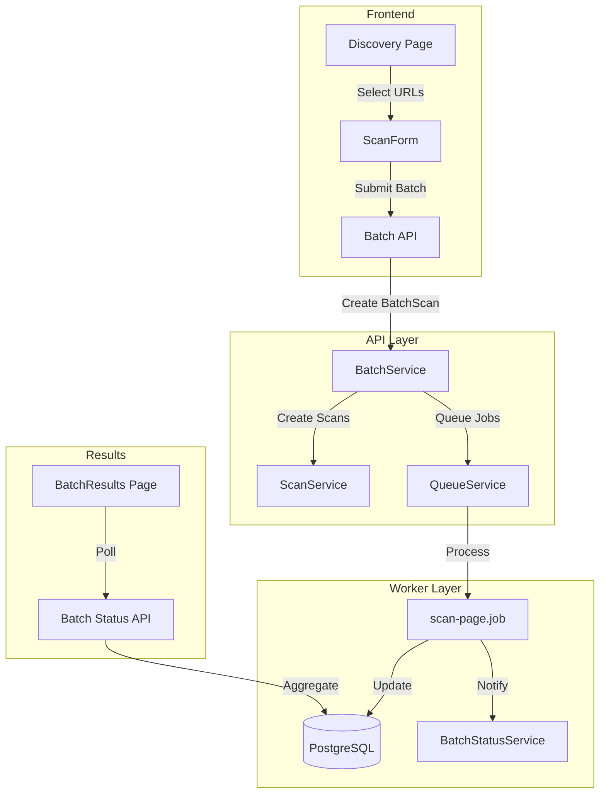
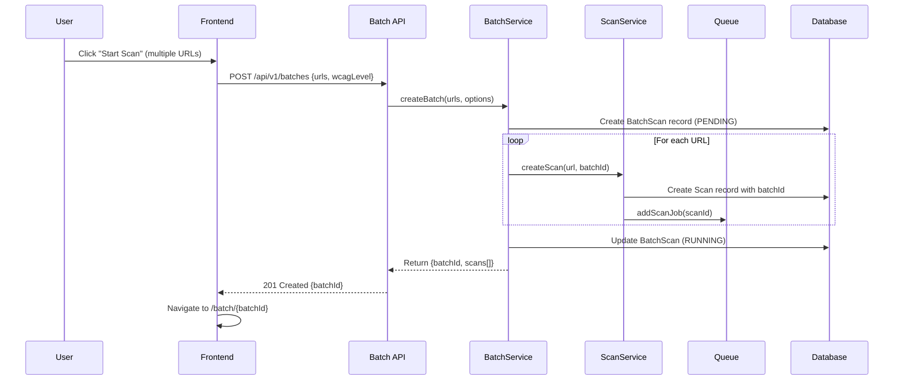
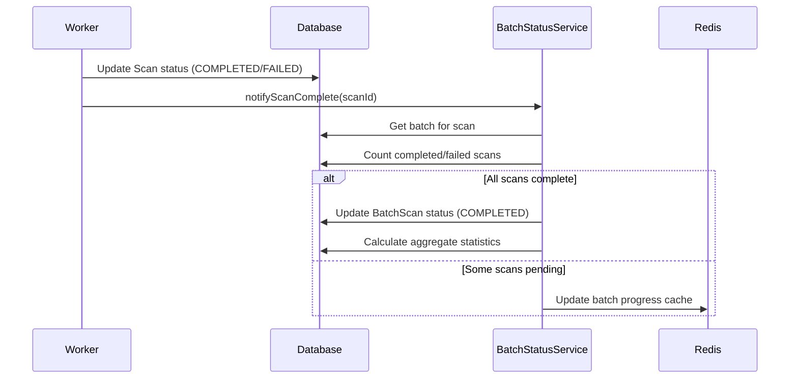
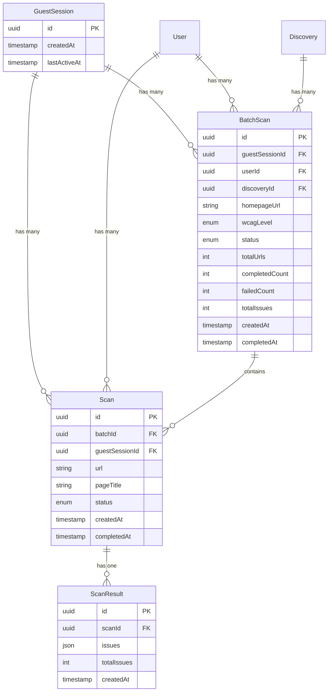

# Design Document: Batch URL Scanning

## Overview

This design enables batch URL scanning by introducing a `BatchScan` entity that groups multiple individual scans together. The architecture leverages the existing scan infrastructure - individual scans are still processed by the current worker, but they're now linked to a parent batch for aggregate tracking and display.

**Design Philosophy**: Extend, don't replace. The existing single-scan flow remains unchanged; batch scanning adds a coordination layer on top.

## Steering Document Alignment

### Technical Standards (tech.md)
- **Backend**: Node.js/TypeScript with Fastify (existing stack)
- **Database**: PostgreSQL with Prisma ORM (existing)
- **Queue**: BullMQ with Redis (existing infrastructure)
- **Frontend**: Next.js 14 with React 18, TailwindCSS, shadcn/ui (existing)
- **API Design**: RESTful with Zod validation (follows existing patterns)

### Project Structure (structure.md)
- **API Module**: `apps/api/src/modules/batches/` - new module following existing pattern
- **Frontend Components**: `apps/web/src/components/features/batch/` - new feature folder
- **Shared Types**: `packages/core/src/types/batch.types.ts` - shared type definitions
- **Hooks**: `apps/web/src/hooks/useBatch.ts` - React Query integration

## Code Reuse Analysis

### Existing Components to Leverage

| Component | Location | How It Will Be Used |
|-----------|----------|---------------------|
| `ScanService` | `apps/api/src/modules/scans/scan.service.ts` | Reuse `createScan()` for individual scans within batch |
| `ScanRepository` | `apps/api/src/modules/scans/scan.repository.ts` | Extend to support batch ID filtering |
| `QueueService` | `apps/api/src/shared/queue/queue.service.ts` | Reuse `addScanJob()` for queueing batch items |
| `scan-page.job.ts` | `apps/worker/src/jobs/scan-page.job.ts` | No changes - processes individual scans as before |
| `useScan` hook | `apps/web/src/hooks/useScan.ts` | Pattern reference for `useBatch` hook |
| `ScanProgress` | `apps/web/src/components/features/scan/ScanProgress.tsx` | Extend for batch progress display |
| `ResultsSummary` | `apps/web/src/components/features/results/ResultsSummary.tsx` | Reuse for aggregate batch summary |
| `IssueList` | `apps/web/src/components/features/results/IssueList.tsx` | Reuse for per-URL issue display |
| `ExportButton` | `apps/web/src/components/features/export/ExportButton.tsx` | Extend for batch export |
| `pdf-generator.ts` | `apps/worker/src/processors/reporter/pdf-generator.ts` | Extend for batch PDF reports |

### Integration Points

| Existing System | Integration Approach |
|-----------------|---------------------|
| Discovery Feature | Read `sessionStorage['discovery:selectedPages']` for selected URLs (key verified in `apps/web/src/app/discovery/page.tsx:177`) |
| Session Management | Batch linked to `guestSessionId` like individual scans |
| Rate Limiting | Extend `apps/api/src/shared/middleware/rate-limit.ts` to count URLs in batch |
| Scan Worker | **Modification required**: Add `BatchStatusService.notifyScanComplete()` call after scan completion in `apps/worker/src/jobs/scan-page.job.ts` |

### Worker Integration Detail

The existing `scan-page.job.ts` needs modification at the completion stage:

```typescript
// apps/worker/src/jobs/scan-page.job.ts - ADD after existing completion logic (~line 150)
// After: await scanRepository.updateStatus(scanId, 'COMPLETED', ...)

// Notify batch system of scan completion
if (scan.batchId) {
  await batchStatusService.notifyScanComplete(scanId, 'COMPLETED');
}
```

This is the ONLY worker modification needed - the scan processing logic remains unchanged.

### Stale Batch Detection

Batches that exceed 24 hours without completion are marked STALE. This is implemented via a scheduled job:

```typescript
// apps/api/src/jobs/batch-stale-checker.job.ts
// Runs every hour via node-cron

interface StaleBatchCheckerJob {
  // Check for stale batches and update status
  async run(): Promise<void> {
    const staleThreshold = new Date(Date.now() - 24 * 60 * 60 * 1000);

    await prisma.batchScan.updateMany({
      where: {
        status: { in: ['PENDING', 'RUNNING'] },
        createdAt: { lt: staleThreshold },
      },
      data: {
        status: 'STALE',
        updatedAt: new Date(),
      },
    });
  }
}

// Registration in apps/api/src/index.ts
import cron from 'node-cron';
cron.schedule('0 * * * *', () => staleBatchChecker.run()); // Every hour
```

The frontend displays a warning banner when batch status is STALE:
- "This batch scan has been running for over 24 hours and may not complete."
- Partial results remain accessible
- User can choose to cancel the stale batch

## Architecture

### High-Level Flow



### Batch Scan Creation Flow



### Batch Status Update Flow



## Components and Interfaces

### Component 1: BatchService

- **Purpose**: Orchestrates batch creation, status tracking, and aggregation
- **Location**: `apps/api/src/modules/batches/batch.service.ts`
- **Reuses**: `ScanService`, `QueueService`, `ScanRepository`

```typescript
interface BatchService {
  // Create a new batch with multiple URLs
  createBatch(input: CreateBatchInput): Promise<BatchScan>;

  // Get batch status with individual scan statuses
  getBatchStatus(batchId: string): Promise<BatchStatus>;

  // Get aggregated results for completed batch
  getBatchResults(batchId: string): Promise<BatchResults>;

  // Cancel a running batch
  cancelBatch(batchId: string): Promise<void>;

  // List batches for a session
  listBatches(sessionId: string, pagination: PaginationInput): Promise<PaginatedBatches>;

  // Called by worker when scan completes
  updateScanStatus(scanId: string, status: ScanStatus): Promise<void>;
}
```

### Component 2: BatchController

- **Purpose**: HTTP endpoints for batch operations
- **Location**: `apps/api/src/modules/batches/batch.controller.ts`
- **Reuses**: Existing middleware (reCAPTCHA, rate-limit, session)

```typescript
// Endpoints
POST   /api/v1/batches           // Create batch
GET    /api/v1/batches/:id       // Get batch status
GET    /api/v1/batches/:id/results  // Get batch results
POST   /api/v1/batches/:id/cancel   // Cancel batch
GET    /api/v1/batches           // List batches for session
```

### Component 3: BatchResults Page

- **Purpose**: Display batch progress and aggregated results
- **Location**: `apps/web/src/app/batch/[id]/page.tsx`
- **Reuses**: `ResultsSummary`, `IssueList`, `ScanProgress`, `ExportButton`

```typescript
interface BatchResultsPageProps {
  params: { id: string };
}

// Sub-components
- BatchProgress: Overall progress bar and URL status list
- BatchSummary: Aggregate issue counts (reuses ResultsSummary pattern)
- BatchUrlList: Per-URL breakdown with expandable details
- BatchExport: Export all results (extends ExportButton)
```

### Component 4: useBatch Hook

- **Purpose**: React Query hook for batch data fetching and polling
- **Location**: `apps/web/src/hooks/useBatch.ts`
- **Reuses**: Pattern from `useScan.ts`, `useDiscovery.ts`

```typescript
interface UseBatchOptions {
  pollInterval?: number;  // Default: 2000ms
  enabled?: boolean;
}

interface UseBatchReturn {
  batch: BatchStatus | null;
  results: BatchResults | null;
  isLoading: boolean;
  error: string | null;
  cancelBatch: () => Promise<void>;
  refetch: () => void;
}

function useBatch(batchId: string, options?: UseBatchOptions): UseBatchReturn;
```

### Component 5: Batch History Page

- **Purpose**: Display past batch scans grouped by session
- **Location**: `apps/web/src/app/history/page.tsx` (extend existing)
- **Reuses**: Existing history page layout and patterns

```typescript
// History page displays batches as grouped entries, not individual scans
interface BatchHistoryItem {
  batchId: string;
  homepageUrl: string;
  totalUrls: number;
  status: BatchStatus;
  aggregateIssueCount: number;  // Sum of all URL issues
  createdAt: string;
  completedAt?: string;
}

// UI Layout:
// ┌─────────────────────────────────────────────────────────┐
// │ 📊 Scan History                                         │
// ├─────────────────────────────────────────────────────────┤
// │ ┌─────────────────────────────────────────────────────┐ │
// │ │ 🌐 example.com (10 pages)                           │ │
// │ │ Status: ✅ Completed | Issues: 45 | Dec 28, 2025    │ │
// │ │ [View Results]                                       │ │
// │ └─────────────────────────────────────────────────────┘ │
// │ ┌─────────────────────────────────────────────────────┐ │
// │ │ 🌐 shop.example.com (5 pages)                       │ │
// │ │ Status: 🔄 Running (3/5) | Dec 28, 2025            │ │
// │ │ [View Progress]                                      │ │
// │ └─────────────────────────────────────────────────────┘ │
// └─────────────────────────────────────────────────────────┘

// Click on batch navigates to /batch/{id}
// Single scans (batchId = null) displayed separately
```

### Component 6: Batch PDF Generator

- **Purpose**: Generate combined PDF report for batch results
- **Location**: `apps/worker/src/processors/reporter/batch-pdf-generator.ts`
- **Reuses**: Existing `pdf-generator.ts` utilities, `pdf-templates.ts`

```typescript
interface BatchPdfGenerator {
  generate(batchId: string): Promise<Buffer>;
}

// Report sections:
// 1. Cover page with batch metadata
// 2. Executive summary (aggregate stats)
// 3. Per-URL breakdown
// 4. Detailed issues by URL
// 5. Transparency disclaimer
```

## Data Models

### Entity Relationship Diagram



### BatchScan Model (New)

```prisma
model BatchScan {
  id              String        @id @default(uuid()) @db.Uuid
  guestSessionId  String?       @db.Uuid
  userId          String?       @db.Uuid

  // Batch metadata
  homepageUrl     String        @db.VarChar(2048)
  wcagLevel       WcagLevel     @default(AA)
  discoveryId     String?       @db.Uuid

  // Status tracking
  status          BatchStatus   @default(PENDING)
  totalUrls       Int
  completedCount  Int           @default(0)
  failedCount     Int           @default(0)

  // Aggregate results (computed on completion)
  totalIssues     Int?
  criticalCount   Int?
  seriousCount    Int?
  moderateCount   Int?
  minorCount      Int?

  // Timestamps
  createdAt       DateTime      @default(now())
  updatedAt       DateTime      @updatedAt
  completedAt     DateTime?
  cancelledAt     DateTime?

  // Relations
  guestSession    GuestSession? @relation(fields: [guestSessionId], references: [id])
  user            User?         @relation(fields: [userId], references: [id])
  discovery       Discovery?    @relation(fields: [discoveryId], references: [id])
  scans           Scan[]

  @@index([guestSessionId])
  @@index([status])
  @@index([createdAt])
}

enum BatchStatus {
  PENDING
  RUNNING
  COMPLETED
  FAILED
  CANCELLED
  STALE
}
```

### Scan Model (Modified)

```prisma
model Scan {
  // ... existing fields ...

  // New field for batch association
  batchId         String?       @db.Uuid
  batch           BatchScan?    @relation(fields: [batchId], references: [id])

  // New field for page title (from discovery)
  pageTitle       String?       @db.VarChar(500)

  @@index([batchId])  // New index
}
```

### API Request/Response Schemas

```typescript
// Create Batch Request
interface CreateBatchRequest {
  urls: string[];           // 1-50 URLs
  wcagLevel?: 'A' | 'AA' | 'AAA';
  email?: string;
  recaptchaToken: string;
  discoveryId?: string;     // Optional link to discovery
  pageTitles?: Record<string, string>; // URL -> title mapping
}

// Create Batch Response
interface CreateBatchResponse {
  batchId: string;
  status: BatchStatus;
  totalUrls: number;
  scans: Array<{
    scanId: string;
    url: string;
    status: ScanStatus;
  }>;
}

// Batch Status Response
interface BatchStatusResponse {
  batchId: string;
  status: BatchStatus;
  homepageUrl: string;
  wcagLevel: WcagLevel;
  totalUrls: number;
  completedCount: number;
  failedCount: number;
  progress: number;  // 0-100
  scans: Array<{
    scanId: string;
    url: string;
    pageTitle?: string;
    status: ScanStatus;
    errorMessage?: string;
  }>;
  createdAt: string;
  completedAt?: string;
}

// Batch Results Response
interface BatchResultsResponse {
  batchId: string;
  status: BatchStatus;
  homepageUrl: string;
  wcagLevel: WcagLevel;
  summary: {
    totalUrls: number;
    completedUrls: number;
    failedUrls: number;
    totalIssues: number;
    criticalCount: number;
    seriousCount: number;
    moderateCount: number;
    minorCount: number;
    passedChecks: number;
  };
  urlResults: Array<{
    scanId: string;
    url: string;
    pageTitle?: string;
    status: ScanStatus;
    errorMessage?: string;
    issues?: {
      total: number;
      critical: number;
      serious: number;
      moderate: number;
      minor: number;
    };
  }>;
  topCriticalUrls: Array<{
    url: string;
    criticalCount: number;
  }>;
  createdAt: string;
  completedAt?: string;
}
```

## Error Handling

### Error Scenarios

| Scenario | HTTP Status | Error Code | User Impact |
|----------|-------------|------------|-------------|
| Batch size exceeds 50 URLs | 400 | `BATCH_SIZE_EXCEEDED` | Form shows error, user reduces selection |
| Rate limit exceeded (100 URLs/hour) | 429 | `RATE_LIMIT_EXCEEDED` | Form shows retry time, user waits |
| URL validation fails | 400 | `INVALID_URLS` | Form shows which URLs are invalid |
| Session expired | 401 | `SESSION_EXPIRED` | Redirect to home, start fresh |
| Batch not found | 404 | `BATCH_NOT_FOUND` | Show "batch not found" page |
| Individual scan fails | N/A | Logged per scan | Shown in results as failed URL |
| All scans fail | N/A | Batch marked FAILED | Error summary displayed |
| Batch stale (>24 hours) | N/A | Batch marked STALE | Warning shown, partial results available |

### Error Recovery

1. **Individual Scan Failure**: Other scans continue, failure logged with reason
2. **Worker Crash**: Pending jobs remain in queue, picked up on restart
3. **API Crash**: Batch state persisted in DB, frontend can resume polling
4. **Browser Close**: User can return to `/batch/{id}` to see results

## Testing Strategy

### Unit Testing

| Component | Test Focus | Location |
|-----------|------------|----------|
| `BatchService` | Batch creation, status updates, aggregation | `apps/api/src/modules/batches/batch.service.test.ts` |
| `BatchController` | Request validation, response format | `apps/api/src/modules/batches/batch.controller.test.ts` |
| `useBatch` hook | Polling, state management, error handling | `apps/web/src/hooks/useBatch.test.ts` |
| `BatchProgress` | Progress calculation, UI states | `apps/web/src/components/features/batch/BatchProgress.test.tsx` |

### Integration Testing

| Test Scenario | Description |
|---------------|-------------|
| Create batch with valid URLs | Verify all scans created and queued |
| Create batch with invalid URLs | Verify rejection with proper error |
| Poll batch status | Verify progress updates correctly |
| Complete batch flow | End-to-end from creation to results |
| Cancel running batch | Verify cancellation and preserved results |
| Batch export PDF | Verify PDF generation with all sections |

### End-to-End Testing (Playwright)

| Test Flow | Steps |
|-----------|-------|
| Discovery → Batch → Results | Discover pages, select, scan, verify results |
| Batch progress display | Create batch, verify progress updates in UI |
| Batch cancellation | Start batch, cancel, verify partial results |
| Batch export | Complete batch, export PDF, verify download |
| Error handling | Submit invalid URLs, verify error display |

## Security Considerations

1. **SSRF Protection**: All URLs validated through existing `validateUrl()` utility
2. **Rate Limiting**: Extended to count all URLs in batch (see Rate Limiting Implementation below)
3. **Session Binding**: Batches linked to guest session, not accessible cross-session
4. **XSS Prevention**: HTML in scan results sanitized before PDF export
5. **reCAPTCHA**: Required for batch creation (reuses existing integration)
6. **Session Authorization**: All batch endpoints validate session ownership

### Session Authorization Implementation

Every batch endpoint validates that the requesting session owns the batch:

```typescript
// apps/api/src/modules/batches/batch.service.ts

async getBatchStatus(batchId: string, sessionId: string): Promise<BatchStatus> {
  const batch = await this.batchRepository.findById(batchId);

  if (!batch) {
    throw new NotFoundError('BATCH_NOT_FOUND', 'Batch not found');
  }

  // Verify session ownership
  if (batch.guestSessionId !== sessionId && batch.userId !== sessionId) {
    throw new ForbiddenError('ACCESS_DENIED', 'You do not have access to this batch');
  }

  return this.formatBatchStatus(batch);
}

// Applied to all batch endpoints:
// - GET /api/v1/batches/:id
// - GET /api/v1/batches/:id/results
// - POST /api/v1/batches/:id/cancel
// - GET /api/v1/batches/:id/export
```

### Rate Limiting Implementation

Rate limiting counts all URLs across all batch operations within a session's hourly window:

```typescript
// apps/api/src/shared/middleware/rate-limit.ts (extended)

interface BatchRateLimitConfig {
  maxUrlsPerHour: 100;        // Total URLs scanned per hour
  maxBatchesPerHour: 2;        // Maximum batch submissions per hour
  windowMs: 3600000;           // 1 hour in milliseconds
}

async function checkBatchRateLimit(sessionId: string, urlCount: number): Promise<void> {
  const key = `ratelimit:batch:${sessionId}`;
  const now = Date.now();
  const windowStart = now - 3600000; // 1 hour ago

  // Get current usage from Redis
  const usage = await redis.get(key);
  const { urlsUsed, batchCount, windowStartTime } = JSON.parse(usage || '{}');

  // Reset if window expired
  if (!windowStartTime || windowStartTime < windowStart) {
    await redis.set(key, JSON.stringify({
      urlsUsed: urlCount,
      batchCount: 1,
      windowStartTime: now,
    }), 'EX', 3600);
    return;
  }

  // Check limits
  if (urlsUsed + urlCount > 100) {
    const resetTime = new Date(windowStartTime + 3600000);
    throw new RateLimitError('RATE_LIMIT_EXCEEDED',
      `URL limit exceeded. Try again after ${resetTime.toLocaleTimeString()}`);
  }

  if (batchCount >= 2) {
    throw new RateLimitError('RATE_LIMIT_EXCEEDED',
      'Maximum 2 batches per hour. Please wait before creating another batch.');
  }

  // Update usage
  await redis.set(key, JSON.stringify({
    urlsUsed: urlsUsed + urlCount,
    batchCount: batchCount + 1,
    windowStartTime,
  }), 'EX', 3600);
}
```

**Rate Limit Response Format**:
```json
{
  "error": "RATE_LIMIT_EXCEEDED",
  "message": "URL limit exceeded. Try again after 2:30 PM",
  "retryAfter": 1800,
  "limits": {
    "urlsUsed": 95,
    "urlsRemaining": 5,
    "batchesUsed": 2,
    "batchesRemaining": 0,
    "resetAt": "2025-12-29T14:30:00Z"
  }
}
```

## Performance Considerations

1. **Parallel Processing**: 5-10 concurrent scans per batch (configurable)
2. **Progress Caching**: Redis cache for batch progress (reduces DB queries)
3. **Lazy Aggregation**: Results aggregated on completion, not per-scan
4. **Efficient Polling**: Client polls every 2s, server response <200ms
5. **Database Indexes**: Added on `batchId`, `status`, `createdAt`

## Migration Plan

1. **Database Migration**: Add `BatchScan` table, add `batchId` to `Scan`
2. **Backward Compatibility**: Existing scans have `batchId = null`
3. **API Versioning**: New endpoints under `/api/v1/batches/`
4. **Frontend**: New route `/batch/[id]`, existing `/scan/[id]` unchanged
5. **Rollback**: Migration reversible, batch features can be disabled via feature flag
