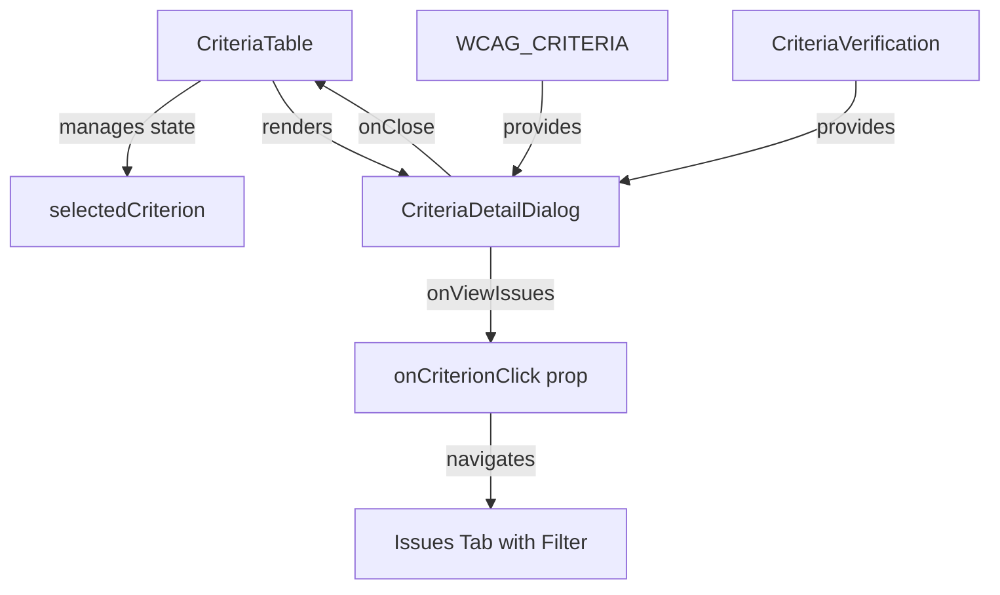
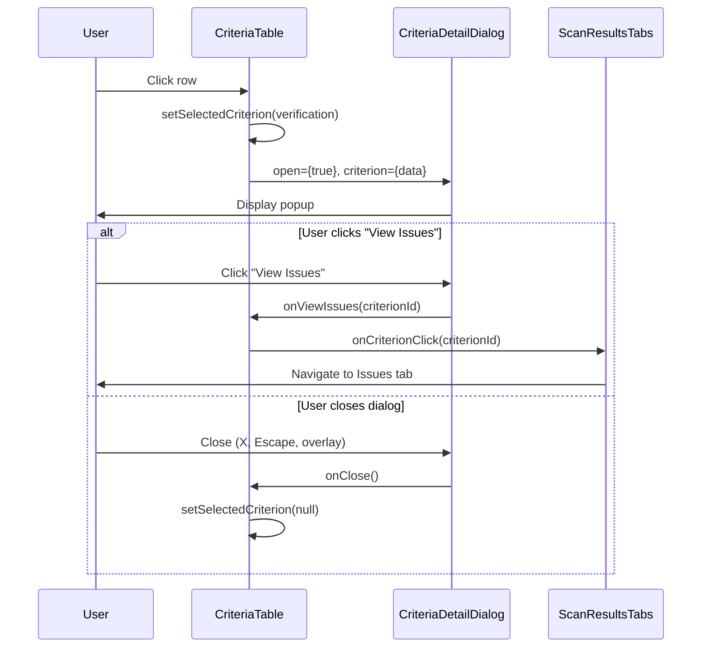

# Design Document: Criteria Detail Popup

## Overview

This feature adds a `CriteriaDetailDialog` component that displays detailed information about a WCAG criterion when users click on a row in the CriteriaTable. The design follows a minimal-change approach by:
1. Creating a new reusable dialog component
2. Modifying CriteriaTable to manage dialog state and handle all row clicks
3. Leveraging existing UI components (Dialog, Badge) and data interfaces (CriteriaVerification, WCAG_CRITERIA)

## Steering Document Alignment

### Technical Standards (tech.md)
- Uses React functional components with hooks (useState)
- Follows existing component patterns in the compliance feature folder
- Leverages Radix UI primitives via existing Dialog component
- TypeScript interfaces for all props

### Project Structure (structure.md)
- New component placed in `apps/web/src/components/features/compliance/`
- Follows naming convention: `CriteriaDetailDialog.tsx`
- Exports added to existing `index.ts` barrel file
- Test file follows pattern: `CriteriaDetailDialog.test.tsx`

## Code Reuse Analysis

### Existing Components to Leverage
- **Dialog (Radix UI)**: `apps/web/src/components/ui/dialog.tsx` - Full dialog infrastructure with overlay, close button, animations
- **Badge**: Status badges with existing color schemes
- **CriteriaTable**: Existing row click handling for FAIL statuses - extend to all statuses
- **getStatusBadge()**: Existing function in CriteriaTable.tsx for status styling

### Existing Data/Constants
- **WCAG_CRITERIA**: `apps/web/src/lib/wcag-constants.ts` - Criterion titles and descriptions
- **CriteriaVerification interface**: Already defined in CriteriaTable.tsx with all needed fields

### Integration Points
- **CriteriaTable.tsx**: Add dialog state management and render CriteriaDetailDialog
- **ScanResultsTabs.tsx**: Pass onCriterionClick for "View Issues" navigation (already exists)

## Architecture

### Component Interaction Flow



### Data Flow



## Components and Interfaces

### Component 1: CriteriaDetailDialog

- **Purpose:** Display comprehensive criterion details in a modal dialog
- **Location:** `apps/web/src/components/features/compliance/CriteriaDetailDialog.tsx`
- **Reuses:** Dialog, DialogContent, DialogHeader, DialogTitle, DialogDescription, Badge

#### Props Interface

```typescript
export interface CriteriaDetailDialogProps {
  /** Whether the dialog is open */
  open: boolean;
  /** Callback when dialog should close */
  onClose: () => void;
  /** The criterion verification data to display */
  criterion: CriteriaVerification | null;
  /** AI model name for display (optional) */
  aiModel?: string;
  /** Callback when user wants to view related issues */
  onViewIssues?: (criterionId: string) => void;
}
```

#### Internal Structure

```typescript
// CriteriaDetailDialog.tsx
export function CriteriaDetailDialog({
  open,
  onClose,
  criterion,
  aiModel,
  onViewIssues,
}: CriteriaDetailDialogProps) {
  if (!criterion) return null;

  // Get WCAG criterion metadata
  const wcagInfo = WCAG_CRITERIA[criterion.criterionId];
  const title = wcagInfo?.title || 'Unknown Criterion';
  const description = wcagInfo?.description || 'No description available';
  const level = wcagInfo?.level || 'A';

  // Status helpers
  const isFailed = criterion.status === 'FAIL' || criterion.status === 'AI_VERIFIED_FAIL';
  const isAiVerified = criterion.status.startsWith('AI_VERIFIED');
  const hasIssues = isFailed && criterion.issueIds && criterion.issueIds.length > 0;

  return (
    <Dialog open={open} onOpenChange={(isOpen) => !isOpen && onClose()}>
      <DialogContent className="max-w-md">
        {/* Header with criterion ID and level */}
        {/* Status section */}
        {/* Scanner info */}
        {/* AI reasoning (if available) */}
        {/* View Issues button (if failed) */}
      </DialogContent>
    </Dialog>
  );
}
```

### Component 2: CriteriaTable (Modified)

- **Purpose:** Manage dialog state and make all rows clickable
- **Location:** `apps/web/src/components/features/compliance/CriteriaTable.tsx`
- **Changes:** Add state for selected criterion, modify row click handler, render dialog

#### State Addition

```typescript
// Inside CriteriaTable component
const [selectedCriterion, setSelectedCriterion] = useState<
  (CriteriaVerification & { title: string; description: string; level: WCAGLevel }) | null
>(null);
```

#### Modified Row Click Handler

```typescript
// Replace existing handleRowClick
const handleRowClick = (verification: EnrichedVerification) => {
  setSelectedCriterion(verification);
};

// New handler for "View Issues" from dialog
const handleViewIssues = (criterionId: string) => {
  setSelectedCriterion(null); // Close dialog first
  onCriterionClick?.(criterionId); // Then navigate
};
```

#### Dialog Render

```typescript
// Add at end of CriteriaTable return, before closing </div>
<CriteriaDetailDialog
  open={selectedCriterion !== null}
  onClose={() => setSelectedCriterion(null)}
  criterion={selectedCriterion}
  aiModel={aiModel}
  onViewIssues={onCriterionClick ? handleViewIssues : undefined}
/>
```

## Data Models

### EnrichedVerification (Extended)

```typescript
// Already exists in CriteriaTable, used for dialog
interface EnrichedVerification extends CriteriaVerification {
  title: string;      // From WCAG_CRITERIA
  description: string; // From WCAG_CRITERIA
  level: WCAGLevel;   // From WCAG_CRITERIA
}
```

### CriteriaVerification (Existing - No Changes)

```typescript
interface CriteriaVerification {
  criterionId: string;      // e.g., "1.4.3"
  status: CriteriaStatus;   // PASS | FAIL | AI_VERIFIED_PASS | AI_VERIFIED_FAIL | NOT_TESTED
  scanner: ScannerSource;   // "axe-core" | "axe-core + AI" | "N/A"
  issueIds?: string[];      // IDs of related issues
  confidence?: number;      // AI confidence 0-100
  reasoning?: string;       // AI explanation
}
```

## Error Handling

### Error Scenarios

1. **Missing WCAG criterion data**
   - **Handling:** Use fallback values ("Unknown Criterion", "No description available")
   - **User Impact:** Dialog still opens with available data, graceful degradation

2. **Null criterion passed to dialog**
   - **Handling:** Early return `if (!criterion) return null;`
   - **User Impact:** Dialog simply doesn't render

3. **Missing AI reasoning when AI-verified**
   - **Handling:** Conditionally render reasoning section only when data exists
   - **User Impact:** Section not shown, no error displayed

4. **onViewIssues not provided**
   - **Handling:** Don't render "View Issues" button if callback is undefined
   - **User Impact:** Button not shown for contexts where navigation isn't supported

## Testing Strategy

### Unit Testing

**CriteriaDetailDialog.test.tsx:**
- Test renders criterion ID and title correctly
- Test renders all status types with correct styling
- Test renders WCAG level badge
- Test "View Issues" button only appears for failed statuses
- Test onViewIssues callback is called with correct criterionId
- Test onClose is called when dialog closes
- Test handles missing WCAG criterion data gracefully
- Test AI reasoning section appears when data exists

**CriteriaTable.test.tsx (additions):**
- Test clicking any row opens the dialog
- Test dialog closes when close button clicked
- Test "View Issues" navigates and closes dialog

### Integration Testing

**ScanResultsTabs integration:**
- Test clicking failed criterion in table → dialog opens → "View Issues" → navigates to issues tab with filter

### End-to-End Testing

**criteria-detail-popup.spec.ts:**
- Navigate to scan results page
- Click on a PASS criterion → verify dialog shows correct info
- Click on a FAIL criterion → verify dialog shows issue count
- Click "View Issues" → verify navigation to issues tab
- Test keyboard navigation (Escape to close)
- Test mobile viewport display

## UI Layout

### Dialog Content Structure

```
┌────────────────────────────────────────┐
│ [X]                                    │
│                                        │
│  1.4.3 Contrast (Minimum)      [AA]   │
│  ─────────────────────────────────────│
│                                        │
│  Text has a contrast ratio of at      │
│  least 4.5:1 (3:1 for large text)     │
│                                        │
│  ─────────────────────────────────────│
│                                        │
│  Status: [✓ Pass]  or  [✗ Fail (3)]  │
│  Scanner: axe-core                     │
│                                        │
│  ─────────────────────────────────────│
│  (If AI verified)                      │
│  AI Confidence: ████████░░ 85%        │
│                                        │
│  AI Reasoning:                         │
│  "The text contrast ratio was         │
│  measured at 7.2:1 which exceeds..."  │
│                                        │
│  ─────────────────────────────────────│
│  (If failed with issues)              │
│            [ View 3 Related Issues ]   │
│                                        │
└────────────────────────────────────────┘
```
