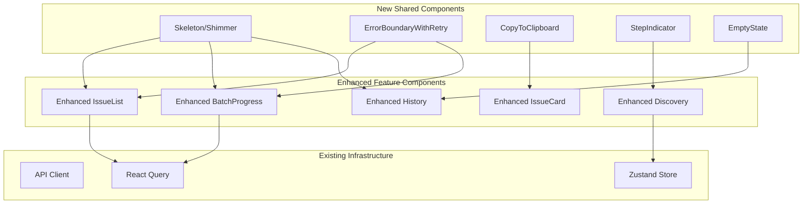
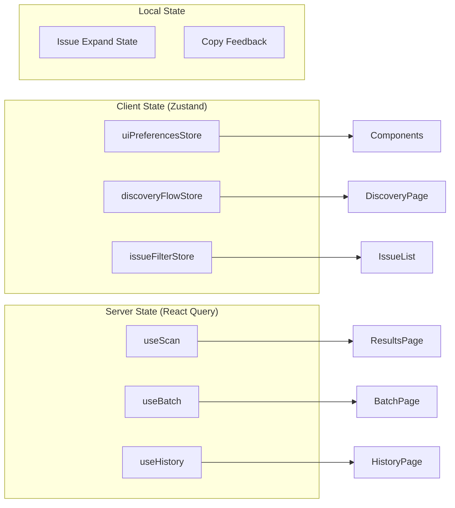
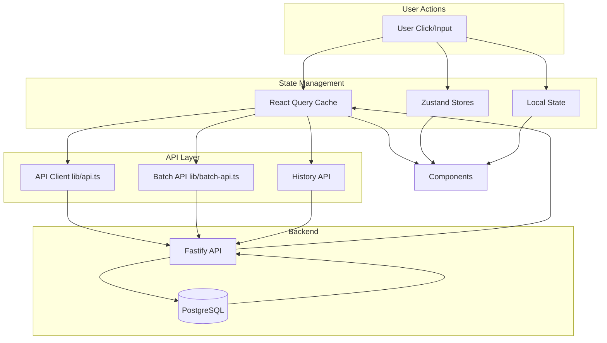

# Customer UI/UX Improvement Design Document

## Overview

This design document outlines the technical implementation for enhancing the customer-facing UI/UX of ADAShield. The improvements focus on loading states, error handling, issue management, discovery flow, batch visibility, mobile optimization, and visual consistency. All components will follow existing project patterns and leverage current infrastructure.

## Steering Document Alignment

### Technical Standards (tech.md)
- **React 18 + Next.js 14**: All components use App Router patterns
- **TypeScript strict mode**: Full type safety for all new components
- **TailwindCSS + shadcn/ui**: Consistent with existing styling approach
- **React Query**: Server state management for data fetching
- **Zustand**: Client state for UI state management
- **Zod**: Validation schemas shared with backend

### Project Structure (structure.md)
- New components placed in `apps/web/src/components/features/` by domain
- Shared UI components in `apps/web/src/components/ui/`
- Custom hooks in `apps/web/src/hooks/`
- Utility functions in `apps/web/src/lib/`
- Tests co-located with components (*.test.tsx)

## Code Reuse Analysis

### Existing Components to Leverage
- **`components/ui/button.tsx`**: Base button with loading states (extend for spinner)
- **`components/ui/progress.tsx`**: Progress bar component (extend for skeleton)
- **`components/ui/badge.tsx`**: Severity badges (standardize colors)
- **`components/ui/alert.tsx`**: Alert component (use for error states)
- **`components/features/results/IssueCard.tsx`**: Existing issue display (enhance)
- **`components/features/scan/ScanProgress.tsx`**: Progress patterns (reuse)
- **`components/features/discovery/DiscoveryProgress.tsx`**: Step patterns (extend)

### Existing Hooks to Leverage
- **`hooks/useScan.ts`**: Polling pattern for scan status
- **`hooks/useBatch.ts`**: Batch status management
- **`hooks/useExport.ts`**: Export functionality patterns
- **`hooks/useAnalytics.ts`**: Event tracking integration

### Integration Points
- **API client (`lib/api.ts`)**: Existing fetch patterns with error handling
- **Batch API (`lib/batch-api.ts`)**: Batch operations
- **Discovery API (`lib/discovery-api.ts`)**: Discovery flow
- **Analytics (`lib/analytics.ts`)**: Event tracking for new interactions

## Architecture

### Component Architecture Overview



### State Management Architecture



## Components and Interfaces

### Component 1: Skeleton Components

**Purpose:** Provide shimmer/skeleton loading states matching content layout
**Location:** `apps/web/src/components/ui/skeleton.tsx`

**Interfaces:**
```typescript
interface SkeletonProps {
  className?: string;
  variant?: 'text' | 'circular' | 'rectangular' | 'card';
  width?: string | number;
  height?: string | number;
  animation?: 'pulse' | 'wave' | 'none';
}

interface SkeletonCardProps {
  lines?: number;
  showAvatar?: boolean;
  showAction?: boolean;
}
```

**Dependencies:** TailwindCSS animations
**Reuses:** Existing Tailwind animation utilities

**Skeleton Variants:**
- `IssueCardSkeleton`: Matches IssueCard layout
- `HistoryItemSkeleton`: Matches HistoryCard layout
- `BatchUrlSkeleton`: Matches BatchUrlList item
- `ResultsSummarySkeleton`: Matches ResultsSummary grid

---

### Component 2: ErrorBoundaryWithRetry

**Purpose:** Enhanced error boundary with retry capability and contextual messaging
**Location:** `apps/web/src/components/ErrorBoundaryWithRetry.tsx`

**Interfaces:**
```typescript
interface ErrorBoundaryProps {
  children: React.ReactNode;
  fallback?: React.ReactNode;
  onRetry?: () => void;
  onError?: (error: Error, errorInfo: ErrorInfo) => void;
  retryLabel?: string;
  showDetails?: boolean;
}

interface ErrorDisplayProps {
  error: Error;
  errorType: 'network' | 'timeout' | 'server' | 'unknown';
  action: string;
  onRetry: () => void;
  retryLabel?: string;
}
```

**Dependencies:** React error boundary API
**Reuses:** Existing `ErrorBoundary.tsx` (enhance, not replace)

**Error Type Detection:**
```typescript
function classifyError(error: Error): ErrorType {
  if (error.name === 'TypeError' && error.message.includes('fetch')) {
    return 'network';
  }
  if (error.message.includes('timeout') || error.message.includes('aborted')) {
    return 'timeout';
  }
  if (error.message.includes('500') || error.message.includes('502')) {
    return 'server';
  }
  return 'unknown';
}
```

---

### Component 3: CopyToClipboard

**Purpose:** One-click copy functionality with visual feedback
**Location:** `apps/web/src/components/ui/copy-button.tsx`

**Interfaces:**
```typescript
interface CopyButtonProps {
  text: string;
  label?: string;
  variant?: 'icon' | 'button' | 'inline';
  size?: 'sm' | 'md' | 'lg';
  onCopy?: () => void;
  onError?: (error: Error) => void;
  successDuration?: number; // ms, default 2000
}
```

**Dependencies:** Clipboard API, existing Button component
**Reuses:** `components/ui/button.tsx`

**Clipboard Fallback:**
```typescript
async function copyToClipboard(text: string): Promise<boolean> {
  try {
    await navigator.clipboard.writeText(text);
    return true;
  } catch {
    // Fallback: show selectable modal
    return false;
  }
}
```

---

### Component 4: StepIndicator

**Purpose:** Visual progress indicator for multi-step flows
**Location:** `apps/web/src/components/ui/step-indicator.tsx`

**Interfaces:**
```typescript
interface Step {
  id: string;
  label: string;
  description?: string;
}

interface StepIndicatorProps {
  steps: Step[];
  currentStep: number;
  variant?: 'horizontal' | 'vertical';
  size?: 'sm' | 'md' | 'lg';
  showLabels?: boolean;
  onStepClick?: (stepIndex: number) => void;
  allowNavigation?: boolean;
}
```

**Dependencies:** None (pure UI component)
**Reuses:** Tailwind utilities, existing color tokens

**Visual States:**
- Completed: Filled circle with checkmark, connected line
- Current: Highlighted circle with step number, pulsing animation
- Upcoming: Empty circle with step number, muted color

---

### Component 5: Enhanced IssueList

**Purpose:** Improved issue browsing with expand/collapse, filtering, and scroll preservation
**Location:** `apps/web/src/components/features/results/IssueList.tsx` (enhance existing)

**Interfaces:**
```typescript
interface IssueListProps {
  issues: Issue[];
  isLoading?: boolean;
  defaultExpanded?: boolean;
  showFilters?: boolean;
  maxInitialDisplay?: number;
  onIssueClick?: (issue: Issue) => void;
}

interface IssueFilters {
  severity: ('critical' | 'serious' | 'moderate' | 'minor')[];
  search: string;
}

// New hook for issue list state
interface UseIssueListState {
  expandedIds: Set<string>;
  filters: IssueFilters;
  toggleExpand: (id: string) => void;
  expandAll: () => void;
  collapseAll: () => void;
  setFilters: (filters: Partial<IssueFilters>) => void;
}
```

**Dependencies:** Existing IssueCard, React Query
**Reuses:** `IssueCard.tsx`, `useScanResult.ts`

**Features:**
- Expand All / Collapse All buttons
- Severity filter chips
- Issue count by severity summary
- Scroll position preservation on expand
- Virtualization for 50+ issues (react-window)

---

### Component 6: Enhanced BatchProgress

**Purpose:** Improved batch scan visibility with status grouping and aggregate stats
**Location:** `apps/web/src/components/features/batch/BatchProgress.tsx` (enhance existing)

**Interfaces:**
```typescript
interface EnhancedBatchProgressProps {
  batchId: string;
  showAggregateStats?: boolean;
  groupByStatus?: boolean;
  allowPartialView?: boolean;
}

interface BatchAggregateStats {
  totalUrls: number;
  completedUrls: number;
  failedUrls: number;
  totalIssues: number;
  issuesBySeverity: Record<Severity, number>;
  averageIssuesPerPage: number;
  worstPerformingUrls: { url: string; issueCount: number }[];
}

interface BatchUrlGrouping {
  pending: BatchUrlStatus[];
  scanning: BatchUrlStatus[];
  completed: BatchUrlStatus[];
  failed: BatchUrlStatus[];
}
```

**Dependencies:** useBatch hook, React Query
**Reuses:** `BatchProgress.tsx`, `BatchUrlList.tsx`, `BatchSummary.tsx`

---

### Component 7: WcagLevelSelector

**Purpose:** WCAG level selection with educational tooltips
**Location:** `apps/web/src/components/features/scan/WcagLevelSelector.tsx`

**Interfaces:**
```typescript
interface WcagLevelSelectorProps {
  value: 'A' | 'AA' | 'AAA';
  onChange: (level: 'A' | 'AA' | 'AAA') => void;
  showHelp?: boolean;
  disabled?: boolean;
}

const WCAG_LEVEL_INFO = {
  A: {
    title: 'Level A - Essential',
    description: 'Basic accessibility requirements. Minimum compliance.',
    examples: ['Alt text for images', 'Keyboard navigation', 'Form labels'],
    legalNote: 'May not satisfy most legal requirements alone.'
  },
  AA: {
    title: 'Level AA - Standard',
    description: 'Enhanced accessibility. Most common legal requirement.',
    examples: ['Color contrast 4.5:1', 'Resize text 200%', 'Focus visible'],
    legalNote: 'Required by ADA, EAA, Section 508.'
  },
  AAA: {
    title: 'Level AAA - Enhanced',
    description: 'Highest accessibility standard. Exceeds most requirements.',
    examples: ['Color contrast 7:1', 'Sign language', 'Reading level'],
    legalNote: 'Recommended for specialized audiences.'
  }
};
```

**Dependencies:** Radix UI Tooltip
**Reuses:** Existing radio button styling from ScanForm

---

### Component 8: Enhanced HistoryPage

**Purpose:** Full-featured history management with filtering, search, and bulk operations
**Location:** `apps/web/src/app/history/page.tsx` (enhance existing)

**Interfaces:**
```typescript
interface HistoryFilters {
  dateRange: { start: Date | null; end: Date | null };
  scanType: ('single' | 'batch' | 'discovery')[];
  searchQuery: string;
  sortBy: 'date' | 'issues' | 'url';
  sortOrder: 'asc' | 'desc';
}

interface UseHistoryOptions {
  filters: HistoryFilters;
  page: number;
  pageSize: number;
}

// New hook
function useHistory(options: UseHistoryOptions): {
  data: HistoryItem[];
  isLoading: boolean;
  totalCount: number;
  selectedIds: Set<string>;
  toggleSelection: (id: string) => void;
  selectAll: () => void;
  clearSelection: () => void;
  deleteSelected: () => Promise<void>;
}
```

**Dependencies:** React Query, date-fns
**Reuses:** `HistoryList.tsx`, `HistoryCard.tsx`

**New Sub-components:**
- `HistoryFilters`: Filter controls (date picker, type selector, search)
- `HistorySortControls`: Sort dropdown
- `HistoryBulkActions`: Bulk delete, export
- `HistoryEmptyState`: Empty state with CTA

---

### Component 9: EmptyState

**Purpose:** Consistent empty state displays with helpful guidance
**Location:** `apps/web/src/components/ui/empty-state.tsx`

**Interfaces:**
```typescript
interface EmptyStateProps {
  icon?: React.ReactNode;
  title: string;
  description?: string;
  action?: {
    label: string;
    onClick: () => void;
    variant?: 'primary' | 'secondary';
  };
  secondaryAction?: {
    label: string;
    onClick: () => void;
  };
}
```

**Dependencies:** None
**Reuses:** Existing icon set, button component

**Predefined Empty States:**
- `EmptyHistory`: "No scans yet" with "Start your first scan" CTA
- `EmptyBatchResults`: "Batch in progress" with progress indicator
- `EmptyDiscovery`: "Enter a URL to discover pages"
- `EmptyIssues`: "No issues found!" (success state)

---

## Data Models

### Issue Filter State (Zustand Store)

```typescript
interface IssueFilterStore {
  // State
  expandedIssueIds: Set<string>;
  selectedSeverities: Severity[];
  searchQuery: string;

  // Actions
  toggleIssueExpanded: (id: string) => void;
  expandAllIssues: (ids: string[]) => void;
  collapseAllIssues: () => void;
  setSeverityFilter: (severities: Severity[]) => void;
  setSearchQuery: (query: string) => void;
  resetFilters: () => void;
}
```

### Discovery Flow State (Zustand Store Enhancement)

```typescript
interface DiscoveryFlowStore {
  // Existing state
  discoveryId: string | null;
  selectedPages: string[];

  // New state
  currentStep: number; // 0: URL input, 1: Mode select, 2: Progress, 3: Results
  stepHistory: number[];

  // New actions
  goToStep: (step: number) => void;
  goBack: () => void;
  canGoBack: () => boolean;
}
```

### History Filter State

```typescript
interface HistoryFilterStore {
  dateRange: { start: Date | null; end: Date | null };
  scanTypes: ScanType[];
  searchQuery: string;
  sortBy: 'date' | 'issues' | 'url';
  sortOrder: 'asc' | 'desc';
  selectedIds: Set<string>;

  // Actions
  setDateRange: (range: DateRange) => void;
  toggleScanType: (type: ScanType) => void;
  setSearchQuery: (query: string) => void;
  setSortBy: (sortBy: string) => void;
  toggleSortOrder: () => void;
  toggleSelection: (id: string) => void;
  selectAll: (ids: string[]) => void;
  clearSelection: () => void;
}
```

## Error Handling

### Error Scenarios

1. **Network Error During Scan**
   - **Detection:** TypeError with 'fetch' in message
   - **Handling:** Show inline error with "Check your connection" message
   - **User Impact:** Retry button appears, scan status preserved
   - **Recovery:** Automatic retry after 5 seconds, manual retry available

2. **Partial Batch Failure**
   - **Detection:** Batch status contains failed URLs
   - **Handling:** Group failed URLs separately, show failure reasons
   - **User Impact:** Can view successful results while seeing failures
   - **Recovery:** Option to retry failed URLs only

3. **Rate Limit Exceeded**
   - **Detection:** 429 status code from API
   - **Handling:** Show countdown timer until retry available
   - **User Impact:** Cannot submit new scans until cooldown
   - **Recovery:** Automatic unlock after rate limit window

4. **Clipboard Permission Denied**
   - **Detection:** Clipboard API throws SecurityError
   - **Handling:** Show modal with selectable text
   - **User Impact:** Must manually select and copy
   - **Recovery:** None needed, fallback works immediately

5. **Report Generation Timeout**
   - **Detection:** Report status polling exceeds 60 seconds
   - **Handling:** Show "Taking longer than expected" with progress
   - **User Impact:** May need to wait or retry
   - **Recovery:** Continue polling, offer manual retry

## Testing Strategy

### Unit Testing
- **Skeleton Components**: Render tests, animation class presence
- **CopyButton**: Clipboard mock, success/failure states
- **StepIndicator**: Step rendering, click handlers, keyboard navigation
- **Error Classification**: Error type detection accuracy
- **Filter Logic**: Severity filtering, search matching

### Integration Testing
- **IssueList + Filters**: Filter application, expand/collapse state
- **BatchProgress + API**: Polling behavior, status grouping
- **History + Filters**: Combined filter logic, sort behavior
- **Discovery Flow**: Step navigation, state preservation

### End-to-End Testing
- **Scan Flow**: Complete scan with error injection
- **Batch Flow**: Multi-URL batch with partial failure
- **History Management**: Filter, sort, bulk delete operations
- **Mobile Viewport**: Touch target sizes, responsive layout
- **Keyboard Navigation**: Full keyboard accessibility audit

### Accessibility Testing
- **Screen Reader**: ARIA live region announcements
- **Keyboard**: Focus trap in modals, logical tab order
- **Color Contrast**: All new colors meet 4.5:1 ratio
- **Touch Targets**: Minimum 44x44px on mobile
- **Reduce Motion**: Respect prefers-reduced-motion

## Mobile-Specific Design

### Touch Target Requirements

```css
/* Minimum touch target sizing */
.touch-target {
  min-height: 44px;
  min-width: 44px;
  padding: 12px;
}

/* Spacing between touch targets */
.touch-target + .touch-target {
  margin-left: 8px; /* Minimum 8px gap */
}
```

### Responsive Breakpoints

| Component | Mobile (<640px) | Tablet (640-1024px) | Desktop (>1024px) |
|-----------|-----------------|---------------------|-------------------|
| IssueCard | Full width, stacked | Full width | Max 800px |
| BatchUrlList | Collapsed by default | Collapsed | Expanded |
| StepIndicator | Compact (numbers only) | Labels visible | Full labels |
| HistoryFilters | Collapsible drawer | Inline row | Inline row |
| CopyButton | Icon only | Icon + short label | Icon + full label |

### Code Snippet Handling

```typescript
// Mobile code display with horizontal scroll
<div className="relative">
  <pre className="overflow-x-auto max-w-full">
    <code>{snippet}</code>
  </pre>
  {/* Visual scroll indicator for mobile */}
  <div className="absolute right-0 top-0 bottom-0 w-8
                  bg-gradient-to-l from-white to-transparent
                  pointer-events-none md:hidden" />
</div>
```

## Animation Specifications

### Loading Animations

```css
/* Skeleton shimmer */
@keyframes shimmer {
  0% { background-position: -200% 0; }
  100% { background-position: 200% 0; }
}

.skeleton {
  background: linear-gradient(
    90deg,
    hsl(var(--muted)) 25%,
    hsl(var(--muted-foreground) / 0.1) 50%,
    hsl(var(--muted)) 75%
  );
  background-size: 200% 100%;
  animation: shimmer 1.5s infinite;
}
```

### Transition Timing

| Animation | Duration | Easing |
|-----------|----------|--------|
| Page transition | 200ms | ease-out |
| Card expand | 200ms | ease-in-out |
| Modal open | 150ms | ease-out |
| Modal close | 100ms | ease-in |
| Copy feedback | 150ms | ease-out |
| Skeleton pulse | 1500ms | linear (loop) |
| Step indicator | 300ms | ease-in-out |

### Reduced Motion Support

```css
@media (prefers-reduced-motion: reduce) {
  .skeleton {
    animation: none;
    background: hsl(var(--muted));
  }

  .transition-all {
    transition: none;
  }
}
```

## Color System Standardization

### Severity Colors (Consistent Across All Components)

```typescript
const SEVERITY_COLORS = {
  critical: {
    bg: 'bg-red-100 dark:bg-red-900/20',
    text: 'text-red-800 dark:text-red-200',
    border: 'border-red-300 dark:border-red-700',
    icon: 'text-red-600 dark:text-red-400',
  },
  serious: {
    bg: 'bg-orange-100 dark:bg-orange-900/20',
    text: 'text-orange-800 dark:text-orange-200',
    border: 'border-orange-300 dark:border-orange-700',
    icon: 'text-orange-600 dark:text-orange-400',
  },
  moderate: {
    bg: 'bg-yellow-100 dark:bg-yellow-900/20',
    text: 'text-yellow-800 dark:text-yellow-200',
    border: 'border-yellow-300 dark:border-yellow-700',
    icon: 'text-yellow-600 dark:text-yellow-400',
  },
  minor: {
    bg: 'bg-blue-100 dark:bg-blue-900/20',
    text: 'text-blue-800 dark:text-blue-200',
    border: 'border-blue-300 dark:border-blue-700',
    icon: 'text-blue-600 dark:text-blue-400',
  },
} as const;
```

### Status Colors

```typescript
const STATUS_COLORS = {
  pending: 'text-gray-500 bg-gray-100',
  scanning: 'text-blue-500 bg-blue-100',
  completed: 'text-green-500 bg-green-100',
  failed: 'text-red-500 bg-red-100',
} as const;
```

---

### Component 10: ShareButton

**Purpose:** Generate and copy shareable link for scan results
**Location:** `apps/web/src/components/ui/share-button.tsx`

**Interfaces:**
```typescript
interface ShareButtonProps {
  scanId: string;
  scanType: 'single' | 'batch';
  variant?: 'icon' | 'button';
  size?: 'sm' | 'md' | 'lg';
}

// Generated share URL format
// Single: /scan/{scanId}?shared=true
// Batch: /batch/{batchId}?shared=true
```

**Dependencies:** CopyButton component, URL generation
**Reuses:** `components/ui/copy-button.tsx`

**Integration Points:**
- Results page header (next to Export button)
- Batch results page header
- History card quick actions

---

### Component 11: SelectionCounter

**Purpose:** Display running total of selected items with action buttons
**Location:** `apps/web/src/components/ui/selection-counter.tsx`

**Interfaces:**
```typescript
interface SelectionCounterProps {
  selectedCount: number;
  totalCount: number;
  itemLabel?: string; // "pages", "URLs", "scans"
  onClearSelection?: () => void;
  onSelectAll?: () => void;
  showSelectAll?: boolean;
  sticky?: boolean; // Stick to bottom on mobile
}
```

**Dependencies:** None
**Reuses:** Button component

**Integration in Discovery:**
- Appears when selectedPages.length > 0
- Displays: "3 of 15 pages selected"
- Actions: "Clear Selection", "Select All"
- Fixed position on mobile for easy access

---

### Component 12: ConfirmDialog

**Purpose:** Confirmation modal for destructive actions
**Location:** `apps/web/src/components/ui/confirm-dialog.tsx`

**Interfaces:**
```typescript
interface ConfirmDialogProps {
  open: boolean;
  onOpenChange: (open: boolean) => void;
  title: string;
  description: string;
  confirmLabel?: string;
  cancelLabel?: string;
  variant?: 'danger' | 'warning' | 'default';
  onConfirm: () => Promise<void> | void;
  isLoading?: boolean;
}
```

**Dependencies:** Radix UI Dialog
**Reuses:** Button, Dialog components

**Usage for Bulk Delete:**
```typescript
<ConfirmDialog
  open={showDeleteConfirm}
  onOpenChange={setShowDeleteConfirm}
  title="Delete Selected Scans"
  description={`Are you sure you want to delete ${selectedIds.size} scan(s)? This action cannot be undone.`}
  confirmLabel="Delete"
  variant="danger"
  onConfirm={handleBulkDelete}
  isLoading={isDeleting}
/>
```

---

### Component 13: BatchResultsPreview

**Purpose:** Allow viewing partial batch results before completion
**Location:** `apps/web/src/components/features/batch/BatchResultsPreview.tsx`

**Interfaces:**
```typescript
interface BatchResultsPreviewProps {
  batchId: string;
  completedScans: BatchScanResult[];
  totalUrls: number;
  onViewFullResults: () => void;
}

interface BatchScanResult {
  scanId: string;
  url: string;
  status: 'completed' | 'failed';
  issueCount?: number;
  severityCounts?: Record<Severity, number>;
}
```

**Dependencies:** useBatchResults hook
**Reuses:** IssueCard patterns, severity badges

**Features:**
- Shows completed scan summaries as they finish
- Real-time updates via polling
- "View Details" link to individual scan results
- Progress indicator showing X of Y complete

---

### Component 14: WcagLevelSelector Integration

**Purpose:** Integrate WCAG level education into ScanForm
**Location:** Enhancement to `apps/web/src/components/features/scan/ScanForm.tsx`

**Integration Specification:**
```typescript
// In ScanForm.tsx, replace existing WCAG level radio buttons with:
<div className="space-y-2">
  <Label>WCAG Conformance Level</Label>
  <WcagLevelSelector
    value={wcagLevel}
    onChange={setWcagLevel}
    showHelp={true}
    disabled={isSubmitting}
  />
</div>

// WcagLevelSelector renders:
// - Radio group with A, AA, AAA options
// - Info icon next to each option (hover/focus for tooltip)
// - Expandable "Learn more" section below
```

**Visual Layout:**
```
┌─────────────────────────────────────────────────┐
│ WCAG Conformance Level                          │
│                                                 │
│  ○ Level A - Essential          ⓘ              │
│  ● Level AA - Standard (Recommended)  ⓘ        │
│  ○ Level AAA - Enhanced         ⓘ              │
│                                                 │
│  ▼ What do these levels mean?                   │
│  ┌─────────────────────────────────────────┐   │
│  │ Level AA is required by ADA, EAA, and   │   │
│  │ Section 508. It covers color contrast,  │   │
│  │ keyboard navigation, and text resizing. │   │
│  └─────────────────────────────────────────┘   │
└─────────────────────────────────────────────────┘
```

---

## API Endpoints

### New API Endpoints Required

#### History Bulk Delete
```typescript
// DELETE /api/v1/scans/bulk
interface BulkDeleteRequest {
  scanIds: string[];
}

interface BulkDeleteResponse {
  deleted: number;
  failed: { scanId: string; reason: string }[];
}
```

#### Share URL Generation
```typescript
// GET /api/v1/scans/:scanId/share
// GET /api/v1/batches/:batchId/share
interface ShareUrlResponse {
  shareUrl: string;
  expiresAt?: string; // Optional expiration
}
```

#### Batch Partial Results
```typescript
// GET /api/v1/batches/:batchId/results?status=completed
// Returns only completed scan results from an in-progress batch
interface PartialBatchResultsResponse {
  batchId: string;
  status: 'pending' | 'running' | 'completed';
  completedScans: BatchScanResult[];
  totalUrls: number;
  completedCount: number;
  failedCount: number;
}
```

---

## Analytics Integration

### Event Tracking Specifications

All new interactive components integrate with existing `useAnalytics` hook:

```typescript
// In each component, track key interactions:
const { trackEvent } = useAnalytics();

// Events to track:
const ANALYTICS_EVENTS = {
  // Issue interactions
  ISSUE_EXPAND: 'issue_expand',
  ISSUE_COLLAPSE: 'issue_collapse',
  ISSUE_EXPAND_ALL: 'issue_expand_all',
  ISSUE_COLLAPSE_ALL: 'issue_collapse_all',
  ISSUE_FILTER_CHANGE: 'issue_filter_change',
  ISSUE_CODE_COPY: 'issue_code_copy',

  // Clipboard actions
  URL_COPY: 'url_copy',
  SELECTOR_COPY: 'selector_copy',
  SHARE_LINK_COPY: 'share_link_copy',

  // Discovery flow
  DISCOVERY_STEP_CHANGE: 'discovery_step_change',
  DISCOVERY_PAGE_SELECT: 'discovery_page_select',
  DISCOVERY_PAGE_DESELECT: 'discovery_page_deselect',

  // Batch interactions
  BATCH_PARTIAL_VIEW: 'batch_partial_results_view',
  BATCH_URL_EXPAND: 'batch_url_expand',

  // History
  HISTORY_FILTER_CHANGE: 'history_filter_change',
  HISTORY_SORT_CHANGE: 'history_sort_change',
  HISTORY_BULK_SELECT: 'history_bulk_select',
  HISTORY_BULK_DELETE: 'history_bulk_delete',

  // WCAG education
  WCAG_LEVEL_HELP_VIEW: 'wcag_level_help_view',
  WCAG_LEVEL_CHANGE: 'wcag_level_change',
} as const;

// Example usage in component:
const handleExpandAll = () => {
  expandAll();
  trackEvent(ANALYTICS_EVENTS.ISSUE_EXPAND_ALL, {
    issueCount: issues.length,
    scanId,
  });
};
```

**Add to `lib/analytics.constants.ts`:**
```typescript
export const UI_UX_EVENTS = {
  // ... events above
} as const;
```

---

## Enhanced ErrorBoundary Approach

### Integration Strategy (Extend, Don't Replace)

The existing `ErrorBoundary.tsx` is a class component with:
- `handleReset` for retry functionality
- Analytics integration via `trackEvent`
- Custom fallback UI rendering

**Enhancement Approach:**
```typescript
// 1. Keep existing ErrorBoundary.tsx as-is
// 2. Create new utility functions in lib/error-utils.ts

// lib/error-utils.ts
export function classifyError(error: Error): ErrorType {
  if (error.name === 'TypeError' && error.message.includes('fetch')) {
    return 'network';
  }
  if (error.message.includes('timeout') || error.message.includes('aborted')) {
    return 'timeout';
  }
  if (error.message.includes('500') || error.message.includes('502')) {
    return 'server';
  }
  return 'unknown';
}

export function getErrorMessage(type: ErrorType): {
  title: string;
  description: string;
  action: string;
} {
  const messages = {
    network: {
      title: 'Connection Error',
      description: 'Please check your internet connection and try again.',
      action: 'Retry',
    },
    timeout: {
      title: 'Request Timeout',
      description: 'The server is taking too long to respond.',
      action: 'Try Again',
    },
    server: {
      title: 'Server Error',
      description: 'Something went wrong on our end. Please try again later.',
      action: 'Retry',
    },
    unknown: {
      title: 'Something Went Wrong',
      description: 'An unexpected error occurred.',
      action: 'Retry',
    },
  };
  return messages[type];
}

// 3. Update ErrorBoundary fallback UI to use these utilities
// In ErrorBoundary.tsx render method:
render() {
  if (this.state.hasError) {
    const errorType = classifyError(this.state.error);
    const { title, description, action } = getErrorMessage(errorType);

    return (
      <ErrorDisplay
        title={title}
        description={description}
        actionLabel={action}
        onRetry={this.handleReset}
        showDetails={process.env.NODE_ENV === 'development'}
        error={this.state.error}
      />
    );
  }
  return this.props.children;
}
```

---

## Data Flow Architecture

### Complete Data Flow Diagram



### State Ownership by Feature

| Feature | Local State | Zustand Store | React Query |
|---------|-------------|---------------|-------------|
| Issue expand/collapse | expandedIds | - | - |
| Issue filters | - | issueFilterStore | - |
| Issue data | - | - | useScanResult |
| Discovery step | - | discoveryFlowStore | - |
| Discovery pages | - | discoveryFlowStore | useDiscovery |
| Batch status | - | - | useBatch |
| Batch partial results | - | - | useBatchResults |
| History filters | - | historyFilterStore | - |
| History data | - | - | useHistory |
| Selection state | - | historyFilterStore | - |
| Copy feedback | copied: boolean | - | - |
| Modal open state | isOpen: boolean | - | - |

---

## Performance Testing Strategy

### Performance Benchmarks

| Metric | Target | Test Method |
|--------|--------|-------------|
| Skeleton load | < 100ms | Playwright timing API |
| Issue list (100 items) interaction | < 100ms | React Profiler |
| Filter change response | < 50ms | Event timing |
| Copy feedback | < 200ms | User timing API |
| Page transition | < 300ms | Navigation timing |
| Batch polling | 2s interval | Network inspection |

### Vitest Performance Tests

```typescript
// Example performance test
import { performance } from 'perf_hooks';

describe('IssueList Performance', () => {
  it('should render 100 issues within 100ms', async () => {
    const start = performance.now();
    render(<IssueList issues={generate100Issues()} />);
    const end = performance.now();

    expect(end - start).toBeLessThan(100);
  });

  it('should expand all issues within 100ms', async () => {
    render(<IssueList issues={generate100Issues()} />);

    const start = performance.now();
    await userEvent.click(screen.getByText('Expand All'));
    const end = performance.now();

    expect(end - start).toBeLessThan(100);
  });
});
```

---

## Mobile Form Input Types

### Input Type Specifications

Update existing form inputs to use appropriate mobile keyboard types:

```typescript
// In ScanForm.tsx
<Input
  type="url"
  inputMode="url"
  placeholder="https://example.com"
  autoCapitalize="none"
  autoCorrect="off"
  // Triggers URL keyboard on mobile
/>

<Input
  type="email"
  inputMode="email"
  placeholder="your@email.com"
  autoCapitalize="none"
  autoCorrect="off"
  // Triggers email keyboard on mobile
/>

// In HistoryFilters search
<Input
  type="search"
  inputMode="search"
  placeholder="Search by URL..."
  // Triggers search keyboard with submit button
/>
```

---

## Icon Library Specification

### Icons for Empty States

Use **Lucide React** icons (already in project via shadcn/ui):

```typescript
import {
  Search,      // EmptyHistory - no search results
  FolderOpen,  // EmptyHistory - no scans
  CheckCircle, // EmptyIssues - no issues found (success)
  Globe,       // EmptyDiscovery - enter URL
  FileStack,   // EmptyBatch - batch in progress
  AlertCircle, // Error states
  Copy,        // Copy button
  Share2,      // Share button
  ChevronDown, // Expand
  ChevronUp,   // Collapse
  Filter,      // Filter controls
  X,           // Clear selection
} from 'lucide-react';
```

---

*Version: 1.1*
*Created: January 2026*
*Updated: January 2026 - Added missing component specifications, API endpoints, analytics integration*
