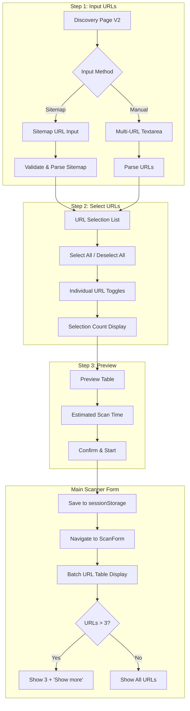
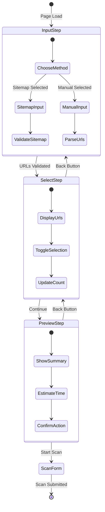
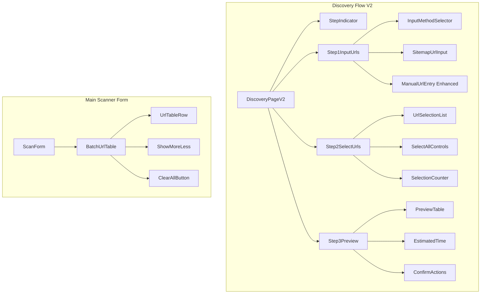
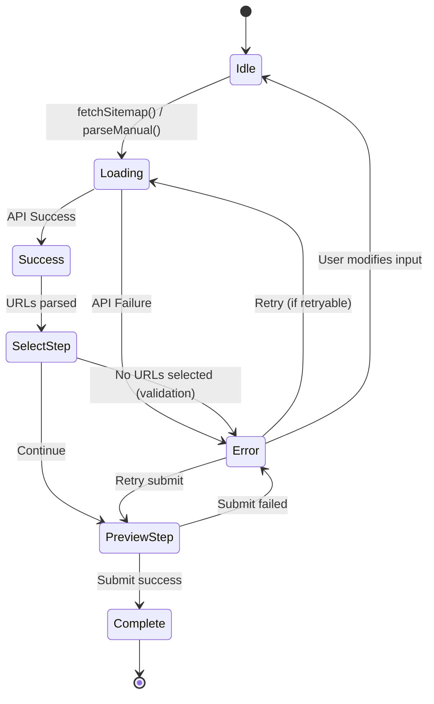
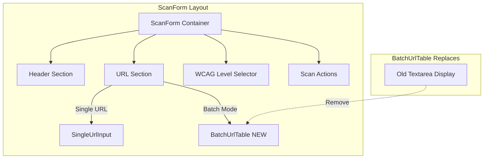

# Discovery Flow V2 - Design Document

## Overview

This design document outlines the architecture for redesigning the multi-page discovery flow from 4 steps to a clearer 3-step process (Input URLs → Select URLs → Preview), with two input methods (Sitemap and Manual), and an improved batch URL table display in the main scanner form with show more/less functionality.

### Design Goals
1. **Simplify user experience** - Reduce cognitive load with clearer step progression
2. **Leverage existing patterns** - Reuse established hooks, components, and API integrations
3. **Maintain backward compatibility** - Work with existing sessionStorage format and APIs
4. **Improve URL management** - Compact table display with show more/less mechanism

---

## Steering Document Alignment

### Technical Standards (tech.md)
- Uses React with TypeScript for type safety
- Follows existing hook patterns (`useDiscovery`, `useDiscoveryFlowStore`)
- Leverages Zustand for flow state management
- Uses existing API client patterns from `discovery-api.ts`
- Follows mobile-first responsive design approach

### Project Structure (structure.md)
- New components in `apps/web/src/components/features/discovery/`
- Hooks in `apps/web/src/hooks/`
- Store updates in `apps/web/src/stores/`
- Reuses UI components from `apps/web/src/components/ui/`

---

## Code Reuse Analysis

### Existing Components to Leverage

| Component | Location | How It Will Be Used |
|-----------|----------|---------------------|
| `StepIndicator` | `ui/step-indicator.tsx` | 3-step flow visualization |
| `DiscoveryModeSelector` | `discovery/DiscoveryModeSelector.tsx` | Adapt for Sitemap/Manual selection |
| `ManualUrlEntry` | `discovery/ManualUrlEntry.tsx` | Enhance for multi-URL textarea |
| `PageTree` | `discovery/PageTree.tsx` | Reuse for URL selection display |
| `SelectionCounter` | `ui/selection-counter.tsx` | Mobile sticky selection count |
| `ErrorDisplay` | `ui/error-display.tsx` | Standardized error rendering |
| `Badge` | `ui/badge.tsx` | Status indicators |
| `Button` | `ui/button.tsx` | Primary/secondary actions |

### Existing Hooks to Leverage

| Hook | Location | Purpose |
|------|----------|---------|
| `useDiscovery` | `hooks/useDiscovery.ts` | Core discovery state management |
| `useDiscoveryFlowStore` | `stores/discovery-store.ts` | Step navigation state |
| `useAnalytics` | `hooks/useAnalytics.ts` | Event tracking |

### Integration Points

| System | Integration Method |
|--------|-------------------|
| Discovery API | Existing `discovery-api.ts` endpoints |
| Batch API | Existing `batch-api.ts` for scan submission |
| ScanForm | sessionStorage `discovery:selectedPages` |
| Analytics | `useAnalyticsContext` hook |

---

## Architecture

### 3-Step Flow Architecture



### State Flow Diagram



### Component Hierarchy



---

## Components and Interfaces

### Component 1: DiscoveryPageV2
- **Purpose**: Main page component orchestrating the 3-step flow
- **Location**: `apps/web/src/app/discovery/page.tsx` (replaces current)
- **Interfaces**:
  ```typescript
  interface DiscoveryPageV2Props {
    // No props - uses hooks for state
  }

  type FlowStep = 'input' | 'select' | 'preview';
  ```
- **Dependencies**: `useDiscoveryFlowV2`, `StepIndicator`
- **Reuses**: Suspense boundary pattern, error handling from current page

### Component 2: Step1InputUrls
- **Purpose**: First step - input method selection and URL entry
- **Location**: `apps/web/src/components/features/discovery/Step1InputUrls.tsx`
- **Interfaces**:
  ```typescript
  interface Step1InputUrlsProps {
    onContinue: (urls: ParsedUrl[]) => void;
    isLoading: boolean;
  }

  type InputMethod = 'sitemap' | 'manual';

  interface ParsedUrl {
    url: string;
    title?: string;
    source: 'sitemap' | 'manual';
  }
  ```
- **Dependencies**: `InputMethodSelector`, `SitemapUrlInput`, `ManualUrlEntryEnhanced`
- **Reuses**: `DiscoveryModeSelector` pattern adapted for sitemap/manual

### Component 3: InputMethodSelector
- **Purpose**: Radio button group for selecting Sitemap vs Manual input
- **Location**: `apps/web/src/components/features/discovery/InputMethodSelector.tsx`
- **Interfaces**:
  ```typescript
  interface InputMethodSelectorProps {
    value: InputMethod;
    onChange: (method: InputMethod) => void;
    disabled?: boolean;
  }
  ```
- **Reuses**: Adapts `DiscoveryModeSelector` styling

### Component 4: SitemapUrlInput
- **Purpose**: Single URL input for sitemap location
- **Location**: `apps/web/src/components/features/discovery/SitemapUrlInput.tsx`
- **Interfaces**:
  ```typescript
  interface SitemapUrlInputProps {
    value: string;
    onChange: (url: string) => void;
    onSubmit: () => void;
    error?: string;
    isLoading: boolean;
  }
  ```
- **Dependencies**: Input, Button from UI library
- **Reuses**: URL validation patterns from existing discovery

### Component 5: ManualUrlEntryEnhanced
- **Purpose**: Textarea for multi-URL entry with format support
- **Location**: `apps/web/src/components/features/discovery/ManualUrlEntryEnhanced.tsx`
- **Interfaces**:
  ```typescript
  interface ManualUrlEntryEnhancedProps {
    value: string;
    onChange: (text: string) => void;
    onSubmit: () => void;
    error?: string;
    urlCount: number;
    maxUrls: number; // 50
  }
  ```
- **Dependencies**: Textarea, Button from UI library
- **Reuses**: Extends `ManualUrlEntry` with multi-line/semicolon parsing

### Component 6: Step2SelectUrls
- **Purpose**: Second step - URL selection with checkboxes
- **Location**: `apps/web/src/components/features/discovery/Step2SelectUrls.tsx`
- **Interfaces**:
  ```typescript
  interface Step2SelectUrlsProps {
    urls: ParsedUrl[];
    selectedIds: Set<string>;
    onSelectionChange: (ids: Set<string>) => void;
    onBack: () => void;
    onContinue: () => void;
  }
  ```
- **Dependencies**: `UrlSelectionList`, `SelectAllControls`, `SelectionCounter`
- **Reuses**: Selection patterns from `PageTree`

### Component 7: UrlSelectionList
- **Purpose**: Scrollable list of URLs with checkboxes
- **Location**: `apps/web/src/components/features/discovery/UrlSelectionList.tsx`
- **Interfaces**:
  ```typescript
  interface UrlSelectionListProps {
    urls: ParsedUrl[];
    selectedIds: Set<string>;
    onToggle: (id: string) => void;
    maxHeight?: string; // default: '400px'
  }
  ```
- **Dependencies**: Checkbox from UI library
- **Reuses**: `virtualized-list.tsx` for performance with 50 URLs

### Component 8: Step3Preview
- **Purpose**: Third step - preview and confirm before scanning
- **Location**: `apps/web/src/components/features/discovery/Step3Preview.tsx`
- **Interfaces**:
  ```typescript
  interface Step3PreviewProps {
    selectedUrls: ParsedUrl[];
    onBack: () => void;
    onStartScan: () => void;
    isSubmitting: boolean;
  }
  ```
- **Dependencies**: `PreviewTable`, `EstimatedTime`, `Button`
- **Reuses**: Table patterns from batch components

### Component 9: BatchUrlTable (New for ScanForm)
- **Purpose**: Compact table display with show more/less for batch URLs
- **Location**: `apps/web/src/components/features/batch/BatchUrlTable.tsx`
- **Interfaces**:
  ```typescript
  interface BatchUrlTableProps {
    urls: BatchUrl[];
    onRemove: (id: string) => void;
    onClearAll: () => void;
    initialDisplayCount?: number; // default: 3
  }

  interface BatchUrl {
    id: string;
    url: string;
    title?: string;
  }
  ```
- **Dependencies**: Table from UI library
- **Reuses**: Table styling from batch components

### Component 10: ShowMoreLess
- **Purpose**: Toggle button for expanding/collapsing URL list
- **Location**: `apps/web/src/components/ui/show-more-less.tsx`
- **Interfaces**:
  ```typescript
  interface ShowMoreLessProps {
    isExpanded: boolean;
    onToggle: () => void;
    hiddenCount: number; // Shows "+N more"
    className?: string;
  }
  ```
- **Dependencies**: Button, ChevronDown/Up icons
- **Reuses**: Button styling from UI library

---

## Data Models

### Discovery Flow State
```typescript
interface DiscoveryFlowV2State {
  // Current step
  currentStep: FlowStep;

  // Step 1 data
  inputMethod: InputMethod | null;
  sitemapUrl: string;
  manualInput: string;

  // Parsed URLs (after step 1)
  parsedUrls: ParsedUrl[];

  // Step 2 data
  selectedIds: Set<string>;

  // UI state
  isLoading: boolean;
  isSubmitting: boolean;
  error: string | null;
}

type FlowStep = 'input' | 'select' | 'preview';
type InputMethod = 'sitemap' | 'manual';

interface ParsedUrl {
  id: string; // Generated unique ID
  url: string;
  title?: string;
  source: 'sitemap' | 'manual';
}
```

### SessionStorage Format (Backward Compatible)
```typescript
// Key: 'discovery:selectedPages'
interface SelectedPagesStorage {
  discoveryId?: string; // Optional for V2 manual flow
  homepageUrl?: string;
  pages: Array<{
    id: string;
    url: string;
    title?: string;
  }>;
  source: 'sitemap' | 'manual'; // New field for V2
  timestamp: number;
}
```

### Batch URL Display State
```typescript
interface BatchUrlTableState {
  isExpanded: boolean;
  displayCount: number; // 3 when collapsed, all when expanded
}
```

---

## URL Parsing Logic

### Sitemap Parsing
```typescript
// Uses existing discovery API
POST /api/v1/discoveries
Body: { url: sitemapUrl, mode: 'auto' }

// Response contains pages array
interface DiscoveryResponse {
  id: string;
  status: 'pending' | 'running' | 'completed' | 'failed';
  pages: Array<{
    id: string;
    url: string;
    title?: string;
  }>;
}
```

### Manual URL Parsing
```typescript
function parseManualUrls(input: string): ParsedUrl[] {
  // Split by semicolons or newlines
  const lines = input
    .split(/[;\n]/)
    .map(line => line.trim())
    .filter(line => line.length > 0);

  // Validate and deduplicate
  const seen = new Set<string>();
  const urls: ParsedUrl[] = [];

  for (const line of lines) {
    if (isValidUrl(line) && !seen.has(line)) {
      seen.add(line);
      urls.push({
        id: generateId(),
        url: normalizeUrl(line),
        source: 'manual'
      });
    }
  }

  return urls.slice(0, 50); // Enforce max limit
}
```

---

## Error Handling

### Error Scenarios

| Scenario | Handling | User Impact |
|----------|----------|-------------|
| Invalid sitemap URL format | Inline validation error | Shows "Please enter a valid sitemap URL" |
| Sitemap fetch failed | Error display with retry | Shows "Failed to fetch sitemap. Please check the URL." |
| Sitemap parsing failed | Error display | Shows "Could not parse sitemap. Ensure it's valid XML." |
| No URLs found in sitemap | Warning display | Shows "No pages found in sitemap." |
| Manual URL invalid | Inline validation | Highlights invalid URLs in red |
| Manual URL exceeds limit | Warning + truncation | Shows "Maximum 50 URLs. Only first 50 will be used." |
| No URLs selected | Button disabled | "Continue" button disabled, shows "Select at least 1 URL" |
| Session storage full | Fallback to memory | Silent fallback, warns on page refresh |
| API timeout | Retry with backoff | Shows "Request timed out. Retrying..." |

### Error Display Pattern
```typescript
{error && (
  <div className="mb-6 p-4 bg-red-50 border border-red-200 rounded-md">
    <div className="flex items-start gap-3">
      <AlertCircle className="h-5 w-5 text-red-500 mt-0.5" />
      <div>
        <p className="text-sm font-medium text-red-800">{error}</p>
        {retryable && (
          <button
            onClick={onRetry}
            className="mt-2 text-sm text-red-600 underline"
          >
            Try again
          </button>
        )}
      </div>
    </div>
  </div>
)}
```

---

## Testing Strategy

### Unit Testing
- **Components**: Test each component in isolation with React Testing Library
  - `Step1InputUrls`: Test input method switching, validation
  - `Step2SelectUrls`: Test selection logic, select all/deselect all
  - `Step3Preview`: Test summary display, button states
  - `BatchUrlTable`: Test show more/less toggle, remove functionality
  - `ShowMoreLess`: Test expand/collapse, count display
- **Hooks**: Test `useDiscoveryFlowV2` state transitions
- **Utilities**: Test `parseManualUrls`, `validateUrl`, `generateId`

### Integration Testing
- Test complete flow from input → select → preview → ScanForm
- Test sessionStorage persistence across steps
- Test backward compatibility with existing sessionStorage format
- Test API integration for sitemap parsing

### End-to-End Testing (Playwright)
```typescript
// Test files to create/update:
// apps/web/e2e/discovery-v2-sitemap.spec.ts
// apps/web/e2e/discovery-v2-manual.spec.ts
// apps/web/e2e/discovery-v2-batch-table.spec.ts

test('sitemap discovery flow', async ({ page }) => {
  await page.goto('/discovery');
  await page.click('[data-testid="method-sitemap"]');
  await page.fill('[data-testid="sitemap-url"]', 'https://example.com/sitemap.xml');
  await page.click('[data-testid="continue-button"]');
  // ... verify step 2
});

test('manual URL entry with show more/less', async ({ page }) => {
  // Enter 5 URLs manually
  // Verify only 3 shown initially
  // Click "Show more (+2 more)"
  // Verify all 5 shown
  // Click "Show less"
  // Verify back to 3
});
```

### Accessibility Testing
- Keyboard navigation through all steps
- Screen reader announcements for step changes
- Focus management on step transitions
- ARIA labels for all interactive elements

---

## Migration Strategy

### Phase 1: Parallel Implementation
1. Create new components without modifying existing ones
2. New page at `/discovery-v2` for testing
3. Feature flag to toggle between old and new flows

### Phase 2: Integration
1. Update sessionStorage format with backward compatibility
2. Integrate with existing ScanForm
3. Add new BatchUrlTable to ScanForm

### Phase 3: Rollout
1. A/B test with analytics comparison
2. Gradual rollout via feature flag
3. Remove old discovery flow after validation

---

## Performance Considerations

### Optimizations
- Use `virtualized-list` for URL lists > 20 items
- Debounce manual URL parsing (300ms)
- Lazy load step components
- Memoize parsed URL lists

### Performance Targets (from NFR)
- Sitemap parsing: < 10 seconds
- URL list rendering: 50 URLs without lag (< 100ms)
- Selection state changes: < 100ms

---

## Analytics Events

### New Events to Track
```typescript
// Step 1
{ event: 'discovery_v2_method_selected', method: 'sitemap' | 'manual' }
{ event: 'discovery_v2_urls_parsed', count: number, method: string }

// Step 2
{ event: 'discovery_v2_selection_changed', selected: number, total: number }
{ event: 'discovery_v2_select_all_clicked' }
{ event: 'discovery_v2_deselect_all_clicked' }

// Step 3
{ event: 'discovery_v2_preview_viewed', url_count: number }
{ event: 'discovery_v2_scan_started', url_count: number, method: string }

// Batch URL Table
{ event: 'batch_table_show_more_clicked', hidden_count: number }
{ event: 'batch_table_show_less_clicked' }
{ event: 'batch_table_url_removed', remaining_count: number }
{ event: 'batch_table_clear_all_clicked', removed_count: number }
```

---

## State Management Implementation

### Zustand Store Definition
```typescript
// File: apps/web/src/stores/discovery-flow-v2-store.ts
import { create } from 'zustand';
import { persist } from 'zustand/middleware';

interface DiscoveryFlowV2Store {
  // State
  currentStep: FlowStep;
  inputMethod: InputMethod | null;
  sitemapUrl: string;
  manualInput: string;
  parsedUrls: ParsedUrl[];
  selectedIds: Set<string>;
  isLoading: boolean;
  isSubmitting: boolean;
  error: DiscoveryError | null;

  // Actions
  setCurrentStep: (step: FlowStep) => void;
  setInputMethod: (method: InputMethod) => void;
  setSitemapUrl: (url: string) => void;
  setManualInput: (input: string) => void;
  setParsedUrls: (urls: ParsedUrl[]) => void;
  setSelectedIds: (ids: Set<string>) => void;
  toggleSelection: (id: string) => void;
  selectAll: () => void;
  deselectAll: () => void;
  setLoading: (loading: boolean) => void;
  setSubmitting: (submitting: boolean) => void;
  setError: (error: DiscoveryError | null) => void;
  reset: () => void;

  // Computed
  canProceedToSelect: () => boolean;
  canProceedToPreview: () => boolean;
  getSelectedUrls: () => ParsedUrl[];
}

const initialState = {
  currentStep: 'input' as FlowStep,
  inputMethod: null,
  sitemapUrl: '',
  manualInput: '',
  parsedUrls: [],
  selectedIds: new Set<string>(),
  isLoading: false,
  isSubmitting: false,
  error: null,
};

export const useDiscoveryFlowV2Store = create<DiscoveryFlowV2Store>()(
  persist(
    (set, get) => ({
      ...initialState,

      setCurrentStep: (step) => set({ currentStep: step }),
      setInputMethod: (method) => set({ inputMethod: method, error: null }),
      setSitemapUrl: (url) => set({ sitemapUrl: url }),
      setManualInput: (input) => set({ manualInput: input }),
      setParsedUrls: (urls) => set({
        parsedUrls: urls,
        selectedIds: new Set(urls.map(u => u.id)), // Pre-select all
      }),
      setSelectedIds: (ids) => set({ selectedIds: ids }),
      toggleSelection: (id) => {
        const current = get().selectedIds;
        const next = new Set(current);
        if (next.has(id)) {
          next.delete(id);
        } else {
          next.add(id);
        }
        set({ selectedIds: next });
      },
      selectAll: () => set({ selectedIds: new Set(get().parsedUrls.map(u => u.id)) }),
      deselectAll: () => set({ selectedIds: new Set() }),
      setLoading: (loading) => set({ isLoading: loading }),
      setSubmitting: (submitting) => set({ isSubmitting: submitting }),
      setError: (error) => set({ error }),
      reset: () => set(initialState),

      canProceedToSelect: () => get().parsedUrls.length > 0,
      canProceedToPreview: () => get().selectedIds.size > 0,
      getSelectedUrls: () => {
        const { parsedUrls, selectedIds } = get();
        return parsedUrls.filter(u => selectedIds.has(u.id));
      },
    }),
    {
      name: 'discovery-flow-v2',
      partialize: (state) => ({
        inputMethod: state.inputMethod,
        sitemapUrl: state.sitemapUrl,
        manualInput: state.manualInput,
        parsedUrls: state.parsedUrls,
        selectedIds: Array.from(state.selectedIds), // Serialize Set
      }),
    }
  )
);
```

### Hook Implementation
```typescript
// File: apps/web/src/hooks/useDiscoveryFlowV2.ts
import { useCallback, useEffect } from 'react';
import { useRouter } from 'next/navigation';
import { useDiscoveryFlowV2Store } from '@/stores/discovery-flow-v2-store';
import { discoveryApi } from '@/lib/discovery-api';
import { parseManualUrls, validateUrl } from '@/lib/url-utils';
import { useAnalytics } from './useAnalytics';

export function useDiscoveryFlowV2() {
  const router = useRouter();
  const { track } = useAnalytics();
  const store = useDiscoveryFlowV2Store();

  // Fetch sitemap and parse URLs
  const fetchSitemap = useCallback(async () => {
    const { sitemapUrl, setLoading, setError, setParsedUrls, setCurrentStep } = store;

    if (!validateUrl(sitemapUrl)) {
      setError({ type: 'validation', message: 'Please enter a valid sitemap URL' });
      return;
    }

    setLoading(true);
    setError(null);

    try {
      const discovery = await discoveryApi.create({ url: sitemapUrl, mode: 'auto' });

      // Poll for completion
      const result = await pollDiscoveryStatus(discovery.id);

      if (result.status === 'completed' && result.pages.length > 0) {
        const urls = result.pages.map(p => ({
          id: p.id,
          url: p.url,
          title: p.title,
          source: 'sitemap' as const,
        }));
        setParsedUrls(urls);
        setCurrentStep('select');
        track({ event: 'discovery_v2_urls_parsed', count: urls.length, method: 'sitemap' });
      } else if (result.pages.length === 0) {
        setError({ type: 'empty', message: 'No pages found in sitemap.' });
      } else {
        setError({ type: 'api', message: 'Failed to parse sitemap.', retryable: true });
      }
    } catch (err) {
      setError({
        type: 'network',
        message: 'Failed to fetch sitemap. Please check the URL.',
        retryable: true,
      });
    } finally {
      setLoading(false);
    }
  }, [store, track]);

  // Parse manual URLs
  const parseManual = useCallback(() => {
    const { manualInput, setError, setParsedUrls, setCurrentStep } = store;

    const { urls, errors } = parseManualUrls(manualInput);

    if (errors.length > 0 && urls.length === 0) {
      setError({ type: 'validation', message: 'No valid URLs found. Check your input format.' });
      return;
    }

    if (urls.length > 50) {
      // Truncate and warn
      setError({ type: 'warning', message: `Maximum 50 URLs. Using first 50 of ${urls.length}.` });
    }

    setParsedUrls(urls.slice(0, 50));
    setCurrentStep('select');
    track({ event: 'discovery_v2_urls_parsed', count: Math.min(urls.length, 50), method: 'manual' });
  }, [store, track]);

  // Submit selection to sessionStorage and navigate
  const submitSelection = useCallback(async () => {
    const { setSubmitting, setError, getSelectedUrls, inputMethod } = store;

    setSubmitting(true);
    setError(null);

    try {
      const selectedUrls = getSelectedUrls();

      // Save to sessionStorage (backward compatible format)
      const storageData: SelectedPagesStorage = {
        pages: selectedUrls.map(u => ({ id: u.id, url: u.url, title: u.title })),
        source: inputMethod!,
        timestamp: Date.now(),
      };
      sessionStorage.setItem('discovery:selectedPages', JSON.stringify(storageData));

      track({ event: 'discovery_v2_scan_started', url_count: selectedUrls.length, method: inputMethod });

      // Navigate to main scanner
      router.push('/');
    } catch (err) {
      setError({ type: 'storage', message: 'Failed to save selection. Please try again.' });
    } finally {
      setSubmitting(false);
    }
  }, [store, router, track]);

  // Navigation helpers
  const goBack = useCallback(() => {
    const { currentStep, setCurrentStep } = store;
    if (currentStep === 'select') setCurrentStep('input');
    if (currentStep === 'preview') setCurrentStep('select');
    track({ event: 'discovery_v2_step_back', from: currentStep });
  }, [store, track]);

  const goToPreview = useCallback(() => {
    store.setCurrentStep('preview');
    track({ event: 'discovery_v2_preview_viewed', url_count: store.selectedIds.size });
  }, [store, track]);

  return {
    ...store,
    fetchSitemap,
    parseManual,
    submitSelection,
    goBack,
    goToPreview,
  };
}

// Polling helper with exponential backoff
async function pollDiscoveryStatus(id: string, maxAttempts = 30): Promise<DiscoveryResponse> {
  let attempts = 0;
  let delay = 1000;

  while (attempts < maxAttempts) {
    const result = await discoveryApi.getById(id);
    if (result.status === 'completed' || result.status === 'failed') {
      return result;
    }
    await new Promise(resolve => setTimeout(resolve, delay));
    delay = Math.min(delay * 1.5, 5000); // Max 5s between polls
    attempts++;
  }

  throw new Error('Timeout waiting for discovery to complete');
}
```

---

## Validation Module

### URL Validation Utilities
```typescript
// File: apps/web/src/lib/url-utils.ts

// URL validation regex (matches http/https URLs)
const URL_REGEX = /^https?:\/\/[^\s/$.?#].[^\s]*$/i;

export interface ValidationResult {
  urls: ParsedUrl[];
  errors: ValidationError[];
}

export interface ValidationError {
  line: number;
  value: string;
  message: string;
}

export function validateUrl(url: string): boolean {
  try {
    const parsed = new URL(url);
    return parsed.protocol === 'http:' || parsed.protocol === 'https:';
  } catch {
    return false;
  }
}

export function normalizeUrl(url: string): string {
  try {
    const parsed = new URL(url);
    // Remove trailing slash, lowercase hostname
    return `${parsed.protocol}//${parsed.hostname.toLowerCase()}${parsed.pathname.replace(/\/$/, '')}${parsed.search}`;
  } catch {
    return url;
  }
}

export function parseManualUrls(input: string): ValidationResult {
  const lines = input
    .split(/[;\n]/)
    .map((line, index) => ({ value: line.trim(), line: index + 1 }))
    .filter(({ value }) => value.length > 0);

  const seen = new Set<string>();
  const urls: ParsedUrl[] = [];
  const errors: ValidationError[] = [];

  for (const { value, line } of lines) {
    if (!validateUrl(value)) {
      errors.push({ line, value, message: 'Invalid URL format' });
      continue;
    }

    const normalized = normalizeUrl(value);
    if (seen.has(normalized)) {
      errors.push({ line, value, message: 'Duplicate URL' });
      continue;
    }

    seen.add(normalized);
    urls.push({
      id: generateId(),
      url: normalized,
      source: 'manual',
    });
  }

  return { urls, errors };
}

export function generateId(): string {
  return `url_${Date.now()}_${Math.random().toString(36).substr(2, 9)}`;
}

// Sanitize URL for display (prevent XSS)
export function sanitizeUrlForDisplay(url: string): string {
  return url
    .replace(/</g, '&lt;')
    .replace(/>/g, '&gt;')
    .replace(/"/g, '&quot;')
    .replace(/'/g, '&#x27;');
}
```

---

## Error Handling Flows

### Error Type Definitions
```typescript
// File: apps/web/src/types/discovery-errors.ts

export type DiscoveryErrorType =
  | 'validation'  // Client-side validation errors
  | 'network'     // Network/fetch failures
  | 'api'         // API returned error response
  | 'timeout'     // Request timeout
  | 'storage'     // SessionStorage errors
  | 'empty'       // No results found
  | 'warning';    // Non-blocking warnings

export interface DiscoveryError {
  type: DiscoveryErrorType;
  message: string;
  retryable?: boolean;
  details?: Record<string, unknown>;
}
```

### Error State Transition Diagram


### Retry Logic with Exponential Backoff
```typescript
// Retry configuration
const RETRY_CONFIG = {
  maxAttempts: 3,
  initialDelay: 1000,
  maxDelay: 10000,
  backoffMultiplier: 2,
};

async function withRetry<T>(
  operation: () => Promise<T>,
  onRetry?: (attempt: number, delay: number) => void
): Promise<T> {
  let lastError: Error;
  let delay = RETRY_CONFIG.initialDelay;

  for (let attempt = 1; attempt <= RETRY_CONFIG.maxAttempts; attempt++) {
    try {
      return await operation();
    } catch (err) {
      lastError = err as Error;
      if (attempt < RETRY_CONFIG.maxAttempts) {
        onRetry?.(attempt, delay);
        await new Promise(resolve => setTimeout(resolve, delay));
        delay = Math.min(delay * RETRY_CONFIG.backoffMultiplier, RETRY_CONFIG.maxDelay);
      }
    }
  }

  throw lastError!;
}
```

### Error Boundary Placement
```typescript
// File: apps/web/src/app/discovery/page.tsx
import { ErrorBoundary } from '@/components/ErrorBoundary';

export default function DiscoveryPage() {
  return (
    <ErrorBoundary
      fallback={<DiscoveryErrorFallback />}
      onError={(error) => {
        // Log to monitoring service
        console.error('Discovery flow error:', error);
      }}
    >
      <Suspense fallback={<DiscoverySkeleton />}>
        <DiscoveryFlowV2 />
      </Suspense>
    </ErrorBoundary>
  );
}

function DiscoveryErrorFallback() {
  return (
    <div className="p-8 text-center">
      <h2 className="text-xl font-semibold text-red-600">Something went wrong</h2>
      <p className="mt-2 text-gray-600">Please refresh the page and try again.</p>
      <button
        onClick={() => window.location.reload()}
        className="mt-4 px-4 py-2 bg-blue-600 text-white rounded"
      >
        Refresh Page
      </button>
    </div>
  );
}
```

---

## ScanForm Integration Details

### Integration Location
```
apps/web/src/components/features/scan/ScanForm.tsx
```

### Component Placement


### Integration Code Changes
```typescript
// File: apps/web/src/components/features/scan/ScanForm.tsx

// BEFORE (current implementation ~lines 137-160):
// const discoveryData = sessionStorage.getItem('discovery:selectedPages');
// ... textarea display

// AFTER (new implementation):
import { BatchUrlTable } from '@/components/features/batch/BatchUrlTable';

function ScanForm() {
  const [batchUrls, setBatchUrls] = useState<BatchUrl[]>([]);
  const [isBatchMode, setIsBatchMode] = useState(false);

  // Load batch URLs from sessionStorage on mount
  useEffect(() => {
    if (typeof window === 'undefined') return;

    const stored = sessionStorage.getItem('discovery:selectedPages');
    if (stored) {
      try {
        const data = JSON.parse(stored) as SelectedPagesStorage;
        if (data.pages && data.pages.length > 0) {
          setBatchUrls(data.pages);
          setIsBatchMode(true);
        }
      } catch (e) {
        console.error('Failed to parse discovery data:', e);
      }
    }
  }, []);

  // Handle URL removal
  const handleRemoveUrl = useCallback((id: string) => {
    setBatchUrls(prev => {
      const next = prev.filter(u => u.id !== id);
      // Update sessionStorage
      updateSessionStorage(next);
      // Revert to single mode if empty
      if (next.length === 0) {
        setIsBatchMode(false);
        sessionStorage.removeItem('discovery:selectedPages');
      }
      return next;
    });
  }, []);

  // Handle clear all
  const handleClearAll = useCallback(() => {
    setBatchUrls([]);
    setIsBatchMode(false);
    sessionStorage.removeItem('discovery:selectedPages');
  }, []);

  return (
    <form onSubmit={handleSubmit}>
      {/* URL Input Section */}
      <div className="space-y-4">
        {isBatchMode ? (
          <BatchUrlTable
            urls={batchUrls}
            onRemove={handleRemoveUrl}
            onClearAll={handleClearAll}
            initialDisplayCount={3}
          />
        ) : (
          <SingleUrlInput
            value={singleUrl}
            onChange={setSingleUrl}
            onDiscoveryClick={() => router.push('/discovery')}
          />
        )}
      </div>

      {/* ... rest of form */}
    </form>
  );
}
```

### SessionStorage Migration
```typescript
// Backward compatibility handler
function migrateSessionStorage(stored: string): SelectedPagesStorage | null {
  try {
    const data = JSON.parse(stored);

    // V1 format (old): { discoveryId, homepageUrl, pages }
    // V2 format (new): { pages, source, timestamp }

    if (!data.pages || !Array.isArray(data.pages)) {
      return null;
    }

    // Ensure V2 fields exist
    return {
      discoveryId: data.discoveryId,
      homepageUrl: data.homepageUrl,
      pages: data.pages,
      source: data.source || 'sitemap', // Default to sitemap for V1 data
      timestamp: data.timestamp || Date.now(),
    };
  } catch {
    return null;
  }
}
```

---

## Security Implementation

### Client-Side URL Sanitization
```typescript
// Applied in all URL display components
function UrlDisplay({ url }: { url: string }) {
  const sanitized = useMemo(() => sanitizeUrlForDisplay(url), [url]);

  return (
    <span
      className="truncate"
      title={sanitized}
      dangerouslySetInnerHTML={{ __html: sanitized }}
    />
  );
}

// Better approach: Use textContent (no HTML)
function SafeUrlDisplay({ url }: { url: string }) {
  return (
    <span className="truncate" title={url}>
      {url}
    </span>
  );
}
```

### SSRF Protection (Server-Side)
```typescript
// File: apps/api/src/modules/discovery/discovery.service.ts

const BLOCKED_HOSTS = [
  /^localhost$/i,
  /^127\.\d+\.\d+\.\d+$/,
  /^10\.\d+\.\d+\.\d+$/,
  /^172\.(1[6-9]|2\d|3[01])\.\d+\.\d+$/,
  /^192\.168\.\d+\.\d+$/,
  /^0\.0\.0\.0$/,
  /^::1$/,
  /^fe80:/i,
];

function validateSitemapUrl(url: string): boolean {
  try {
    const parsed = new URL(url);

    // Must be HTTP(S)
    if (!['http:', 'https:'].includes(parsed.protocol)) {
      return false;
    }

    // Block internal/private IPs
    for (const pattern of BLOCKED_HOSTS) {
      if (pattern.test(parsed.hostname)) {
        return false;
      }
    }

    // Block file:// and other dangerous protocols
    if (parsed.pathname.includes('..')) {
      return false;
    }

    return true;
  } catch {
    return false;
  }
}
```

### Input Validation on Load
```typescript
// Validate sessionStorage data before use
function loadAndValidateStoredUrls(): BatchUrl[] | null {
  const stored = sessionStorage.getItem('discovery:selectedPages');
  if (!stored) return null;

  try {
    const data = JSON.parse(stored);

    // Validate structure
    if (!data.pages || !Array.isArray(data.pages)) {
      sessionStorage.removeItem('discovery:selectedPages');
      return null;
    }

    // Validate each URL
    const validUrls = data.pages.filter((page: unknown) => {
      if (typeof page !== 'object' || page === null) return false;
      const p = page as Record<string, unknown>;
      return (
        typeof p.id === 'string' &&
        typeof p.url === 'string' &&
        validateUrl(p.url)
      );
    });

    if (validUrls.length === 0) {
      sessionStorage.removeItem('discovery:selectedPages');
      return null;
    }

    return validUrls;
  } catch {
    sessionStorage.removeItem('discovery:selectedPages');
    return null;
  }
}
```

---

## Feature Flag Configuration

### Environment Variable
```bash
# .env.local
NEXT_PUBLIC_DISCOVERY_V2_ENABLED=true
```

### Feature Flag Hook
```typescript
// File: apps/web/src/hooks/useFeatureFlags.ts

export function useFeatureFlags() {
  return {
    discoveryV2Enabled: process.env.NEXT_PUBLIC_DISCOVERY_V2_ENABLED === 'true',
  };
}

// Usage in routing
function DiscoverLink() {
  const { discoveryV2Enabled } = useFeatureFlags();
  const href = discoveryV2Enabled ? '/discovery' : '/discovery-legacy';

  return <Link href={href}>Discover Pages</Link>;
}
```

### A/B Test Success Criteria
| Metric | Target | Measurement |
|--------|--------|-------------|
| Flow completion rate | +20% vs current | Analytics funnel |
| Time to complete | -30% vs current | Session duration |
| Batch scan rate | +15% | Scans with >1 URL |
| Error rate | <5% | Error events / total sessions |

### Rollback Procedure
1. Set `NEXT_PUBLIC_DISCOVERY_V2_ENABLED=false`
2. Redeploy
3. Users automatically use legacy flow
4. SessionStorage format remains compatible
