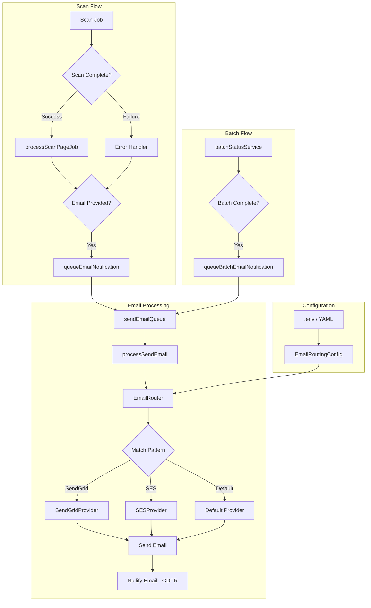
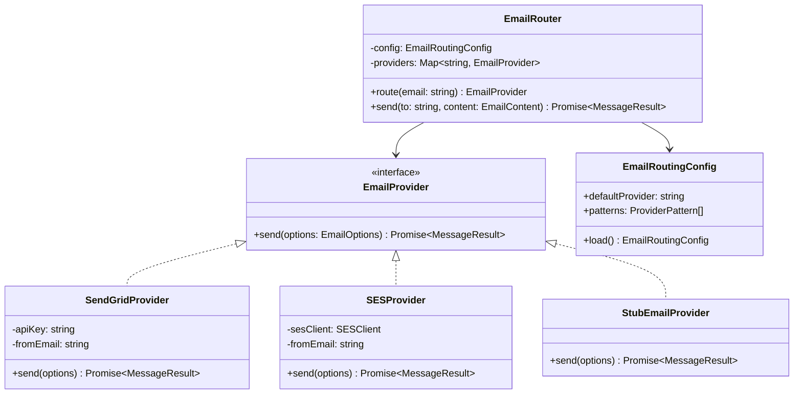
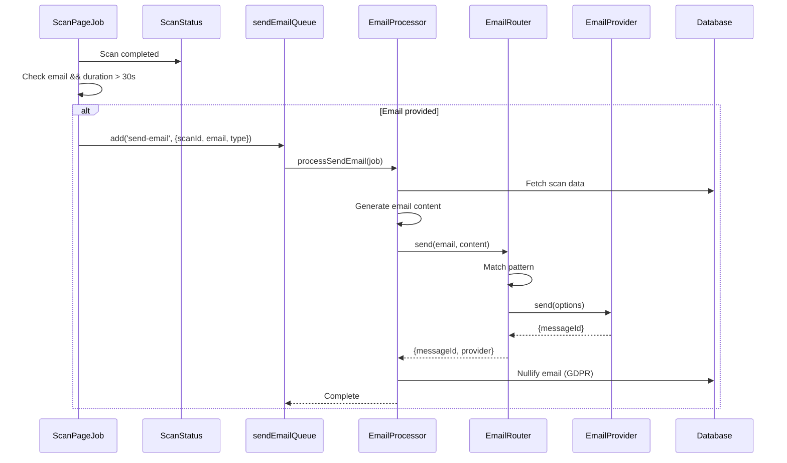
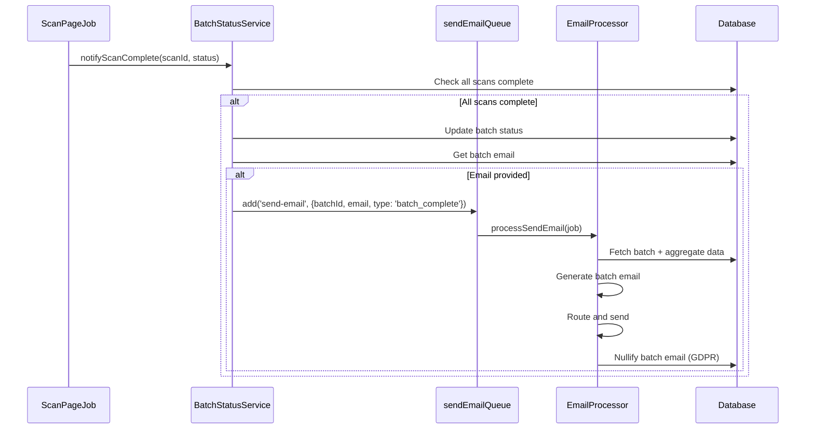

# Design Document: Email Scan Notification

## Overview

This feature enables users to receive accessibility scan results via email notification. The system supports both single scan and batch scan notifications with multi-provider email routing (SendGrid and AWS SES) configurable via environment variables or YAML configuration.

The design extends the existing email infrastructure which already includes:
- Email provider interface with SendGrid implementation
- Email templates for scan completion/failure
- BullMQ send-email queue
- Email processor with GDPR-compliant nullification

### Frontend Scope Clarification

**Note:** The frontend UI for email opt-in already exists in the codebase:
- `apps/web/src/components/features/scan/ScanForm.tsx` - Contains email input field with consent checkbox
- The Scan model already has an `email` field in the Prisma schema
- Existing frontend validation handles email format checking

This design focuses on the **backend implementation** for:
- Connecting scan completion events to email queue
- Multi-provider email routing (SendGrid + SES)
- Batch scan email notifications
- Configuration loading from .env/YAML

Frontend changes are **out of scope** for this design as the UI components already exist.

## Steering Document Alignment

### Technical Standards (tech.md)

| Standard | Compliance |
|----------|------------|
| **Node.js/TypeScript** | All new code in TypeScript with strict mode |
| **BullMQ** | Using existing send-email queue with 5 retry attempts |
| **Prisma ORM** | Extending existing Scan/BatchScan models |
| **Factory Pattern** | Email provider factory with routing logic |
| **Interface-based Design** | `EmailProvider` interface for provider abstraction |

### Project Structure (structure.md)

| Convention | Implementation |
|------------|----------------|
| **Module structure** | New files in existing `notifier/` directory |
| **Config files** | `.env` and `config/email-routing.yml` |
| **Naming** | kebab-case files, PascalCase classes, camelCase functions |
| **Test files** | `*.test.ts` colocated with implementation |

## Code Reuse Analysis

### Existing Components to Leverage

| Component | Location | Usage |
|-----------|----------|-------|
| **EmailProvider interface** | `apps/worker/src/processors/notifier/email-sender.ts` | Extend for SES provider |
| **SendGridProvider** | `apps/worker/src/processors/notifier/email-sender.ts` | Keep as-is |
| **Email templates** | `apps/worker/src/processors/notifier/email-templates.ts` | Add batch template |
| **sendEmailQueue** | `apps/api/src/shared/queue/queues.ts` | Use for job queueing |
| **processSendEmail** | `apps/worker/src/processors/send-email.processor.ts` | Extend for batch/routing |
| **batchStatusService** | `apps/worker/src/services/batch-status.service.ts` | Hook for batch completion |
| **queueEmailNotification** | `apps/worker/src/jobs/scan-page.job.ts` | Implement TODO |

### Integration Points

| System | Integration Method |
|--------|-------------------|
| **Scan completion** | Hook into `processScanPageJob` after status update |
| **Batch completion** | Hook into `batchStatusService.notifyScanComplete` |
| **Email queue** | Create queue instance in worker with same name (both connect to same Redis queue) |
| **Configuration** | Load from `process.env` or YAML file |

**Worker-API Queue Access Pattern:**
```typescript
// Worker creates its own queue instance pointing to same Redis queue
// Both API and Worker connect to the same Redis queue by name
import { Queue } from 'bullmq';
import { getBullMQConnection } from '../config/redis.js';

const sendEmailQueue = new Queue('send-email', {
  connection: getBullMQConnection(),
});
```

## Architecture

### System Architecture



### Email Provider Architecture



## Components and Interfaces

### Component 1: SESProvider

- **Purpose:** Send emails via AWS Simple Email Service
- **File:** `apps/worker/src/processors/notifier/ses-provider.ts`
- **Interfaces:**
  ```typescript
  class SESProvider implements EmailProvider {
    constructor(config: SESConfig);
    send(options: EmailOptions): Promise<{ messageId: string }>;
  }

  interface SESConfig {
    region: string;
    accessKeyId?: string;  // Optional if using IAM role
    secretAccessKey?: string;
    fromEmail: string;
  }
  ```
- **Dependencies:** `@aws-sdk/client-ses`
- **Reuses:** `EmailProvider` interface from `email-sender.ts`

### Component 2: EmailRouter

- **Purpose:** Route emails to appropriate provider based on pattern matching
- **File:** `apps/worker/src/processors/notifier/email-router.ts`
- **Interfaces:**
  ```typescript
  class EmailRouter {
    constructor(config: EmailRoutingConfig);

    // Find matching provider for email address
    route(email: string): EmailProvider;

    // Send email through routed provider
    send(to: string, content: EmailContent): Promise<{ messageId: string; provider: string }>;
  }

  interface EmailRoutingConfig {
    defaultProvider: 'SENDGRID' | 'SES';
    providers: {
      SENDGRID?: { patterns: string[] };
      SES?: { patterns: string[] };
    };
  }
  ```
- **Dependencies:** `EmailProvider` implementations
- **Reuses:** Pattern matching logic (minimatch or custom glob)

### Component 3: EmailConfigLoader

- **Purpose:** Load email routing configuration from .env or YAML
- **File:** `apps/worker/src/config/email-routing.config.ts`
- **Interfaces:**
  ```typescript
  function loadEmailRoutingConfig(): EmailRoutingConfig;

  // Environment variables:
  // EMAIL_DEFAULT_PROVIDER=SES
  // EMAIL_SENDGRID_PATTERNS=*@microsoft.com,*@outlook.com
  // EMAIL_SES_PATTERNS=*@*.edu,*@company.com

  // Or YAML file: config/email-routing.yml
  ```
- **Dependencies:** `js-yaml` (if using YAML)
- **Reuses:** Existing `env.ts` pattern

### Component 4: Batch Email Template

- **Purpose:** Generate email content for batch scan completion
- **File:** `apps/worker/src/processors/notifier/email-templates.ts` (extend)
- **Interfaces:**
  ```typescript
  // EmailContent is already defined in email-templates.ts
  // Re-export for use by other components
  export interface EmailContent {
    subject: string;
    html: string;
    text: string;
  }

  interface BatchCompleteEmailData {
    homepageUrl: string;
    totalUrls: number;
    completedCount: number;
    failedCount: number;
    totalIssues: number;
    criticalCount: number;
    seriousCount: number;
    moderateCount: number;
    minorCount: number;
    passedChecks: number;  // Consistent with single scan emails
    topCriticalUrls: Array<{ url: string; criticalCount: number }>;
    resultsUrl: string;
    pdfReportUrl?: string;
  }

  function getBatchCompleteEmail(data: BatchCompleteEmailData): EmailContent;
  ```
- **Reuses:** Existing template patterns
- **Note:** The `escapeHtml` function in `email-templates.ts` needs to be exported for reuse

### Component 5: Email Job Queue Integration

- **Purpose:** Connect scan/batch completion to email queue
- **Files:**
  - `apps/worker/src/jobs/scan-page.job.ts` (modify `queueEmailNotification`)
  - `apps/worker/src/services/batch-status.service.ts` (add email hook)
- **Interfaces:**
  ```typescript
  // In scan-page.job.ts
  async function queueEmailNotification(
    scanId: string,
    email: string,
    type: 'scan_complete' | 'scan_failed'
  ): Promise<void>;

  // In batch-status.service.ts - modify notifyScanComplete return type
  interface BatchCompletionResult {
    isComplete: boolean;
    batchId: string;
    email?: string;  // Add email to return value for notification
    status: BatchScanStatus;
  }

  // New function in batch-status.service.ts
  async function queueBatchEmailNotification(
    batchId: string,
    email: string
  ): Promise<void>;
  ```
- **Batch Email Retrieval:** The `notifyScanComplete` function must be updated to:
  1. Include `email` in the SELECT query for BatchScan
  2. Return the email in `BatchCompletionResult` when batch is complete
  3. Call `queueBatchEmailNotification` if email is present
- **Reuses:** Worker creates own queue instance connected to same Redis queue

### Component 6: Extended Email Processor

- **Purpose:** Handle both single scan and batch emails with routing
- **File:** `apps/worker/src/processors/send-email.processor.ts` (modify)
- **Interfaces:**
  ```typescript
  interface SendEmailJobData {
    scanId?: string;      // For single scan emails
    batchId?: string;     // For batch emails
    email: string;
    type: 'scan_complete' | 'scan_failed' | 'batch_complete';
  }
  ```
- **Reuses:** Existing processor structure, Prisma queries

## Data Models

### Extended Job Data Types

```typescript
// apps/api/src/shared/queue/types.ts

// EXISTING type (to be replaced):
// interface EmailJobData {
//   to: string;
//   template: string;
//   data: Record<string, unknown>;
//   subject?: string;
//   from?: string;
// }

// NEW type - replaces existing EmailJobData
// This is a breaking change but the existing type is not yet in use
interface EmailJobData {
  scanId?: string;      // For single scan emails
  batchId?: string;     // For batch emails
  email: string;        // Recipient email address
  type: 'scan_complete' | 'scan_failed' | 'batch_complete';
}

// The processor will:
// 1. Fetch scan/batch data using scanId or batchId
// 2. Generate email content using appropriate template
// 3. Send via routed provider
// This approach keeps job data minimal and fetches fresh data at processing time
```

### Email Routing Configuration Schema

```typescript
// apps/worker/src/config/email-routing.config.ts

interface EmailRoutingConfig {
  defaultProvider: 'SENDGRID' | 'SES';
  providers: {
    SENDGRID?: {
      apiKey: string;
      fromEmail: string;
      patterns: string[];
    };
    SES?: {
      region: string;
      fromEmail: string;
      patterns: string[];
    };
  };
}
```

### Database: BatchScan Email Field

The `BatchScan` model already has an `email` field in the Prisma schema. No schema changes needed for batch email storage.

## Sequence Diagrams

### Single Scan Email Flow



### Batch Completion Email Flow



## Error Handling

### Error Scenarios

| Scenario | Handling | User Impact |
|----------|----------|-------------|
| **Email provider API error** | Retry with same provider (5 attempts), do NOT fallback to another provider (per Req 6.5) | Delayed notification, possible failure |
| **Invalid email address** | Skip notification, log warning, nullify email anyway | No email sent |
| **Scan/batch not found** | Fail job, log error | No email sent |
| **Configuration error** | Fail fast on startup with clear error message | Service won't start |
| **No pattern match** | Use default provider (this is expected behavior, not an error) | Email sent via default |
| **Config parsing error** | Fail fast on startup, log parsing details | Service won't start |
| **GDPR nullification fails** | Log error, don't retry | Email stored longer than intended |
| **All retry attempts exhausted** | Mark job failed, nullify email anyway (per Req 5.3) | No email sent |

**Important per Requirement 6.5:** When a configured provider fails, the system SHALL:
1. Retry with the **same provider** using exponential backoff
2. **NOT** automatically fall back to another provider
3. After all retries exhausted, fail the job and nullify the email address

### Error Codes

```typescript
enum EmailErrorCode {
  SCAN_NOT_FOUND = 'SCAN_NOT_FOUND',
  BATCH_NOT_FOUND = 'BATCH_NOT_FOUND',
  INVALID_EMAIL = 'INVALID_EMAIL',
  PROVIDER_ERROR = 'PROVIDER_ERROR',
  CONFIG_ERROR = 'CONFIG_ERROR',
  SEND_FAILED = 'SEND_FAILED',
}
```

## Configuration

### Environment Variables

```bash
# Email Provider Credentials
SENDGRID_API_KEY=sg_xxxxxxxxxxxxx
AWS_SES_REGION=us-east-1
AWS_ACCESS_KEY_ID=AKIA...        # Optional if using IAM role
AWS_SECRET_ACCESS_KEY=xxxxx      # Optional if using IAM role

# Email Routing Configuration
EMAIL_DEFAULT_PROVIDER=SES
EMAIL_SENDGRID_PATTERNS=*@microsoft.com,*@outlook.com,*@hotmail.com
EMAIL_SES_PATTERNS=*@*.edu,*@company.com

# Email Sender
SMTP_FROM=noreply@adashield.com

# App URL (for email links)
APP_URL=https://app.adashield.com
```

### YAML Configuration (Alternative)

```yaml
# config/email-routing.yml
# Object-based structure matching TypeScript EmailRoutingConfig interface
email-routing:
  default-provider: SES

  providers:
    SENDGRID:
      patterns:
        - "*@microsoft.com"
        - "*@outlook.com"
        - "*@hotmail.com"

    SES:
      patterns:
        - "*@*.edu"
        - "*@company.com"
```

**Note:** The YAML structure uses object keys (SENDGRID, SES) rather than an array to match the TypeScript `EmailRoutingConfig.providers` interface definition.

## Testing Strategy

### Unit Testing

| Component | Test Focus | File |
|-----------|-----------|------|
| **SESProvider** | AWS SDK mocking, error handling | `ses-provider.test.ts` |
| **EmailRouter** | Pattern matching, provider selection | `email-router.test.ts` |
| **EmailConfigLoader** | .env parsing, YAML parsing, validation | `email-routing.config.test.ts` |
| **Batch template** | Content generation, escaping | `email-templates.test.ts` |

### Integration Testing

| Flow | Test Scenarios |
|------|---------------|
| **Single scan email** | Queue job, process, verify sent, verify nullified |
| **Batch email** | Complete batch, queue job, verify aggregate data |
| **Provider routing** | Verify correct provider selected per pattern |
| **Retry logic** | Simulate failures, verify exponential backoff |

### End-to-End Testing

| Scenario | Verification |
|----------|-------------|
| Submit scan with email | Receive email notification |
| Submit batch with email | Receive single batch summary email |
| Provider routing | Verify emails route to correct provider |

## Security Considerations

| Concern | Mitigation |
|---------|------------|
| **Email address exposure** | GDPR nullification after sending |
| **Provider credentials** | Environment variables, not in code |
| **Email injection** | HTML escaping in templates |
| **Spam abuse** | Rate limiting on scan submission |
| **Configuration tampering** | File system permissions on YAML |

## Performance Considerations

| Metric | Target | Implementation |
|--------|--------|----------------|
| **Email queue latency** | < 5 seconds | BullMQ with Redis |
| **Email delivery** | < 30 seconds | Provider SLAs |
| **Pattern matching** | < 1ms | Simple glob matching |
| **Config loading** | Once at startup | Cached in memory |

## Dependencies

### New NPM Packages

| Package | Version | Purpose |
|---------|---------|---------|
| `@aws-sdk/client-ses` | ^3.x | AWS SES integration |
| `minimatch` | ^9.x | Glob pattern matching |
| `js-yaml` | ^4.x | YAML config parsing (optional) |

### Existing Packages (Already Installed)

| Package | Usage |
|---------|-------|
| `bullmq` | Job queue |
| `@prisma/client` | Database access |
| `nodemailer` | Email transport (optional fallback) |

---

*Document Version: 1.1*
*Created: December 30, 2025*
*Updated: December 30, 2025*
*Feature: email-scan-notification*

### Changelog

**v1.1** - Validation fixes:
- Added Frontend Scope Clarification section
- Added Worker-API Queue Access Pattern example
- Fixed EmailJobData type compatibility (replacing existing unused type)
- Added `passedChecks` to BatchCompleteEmailData
- Added `EmailContent` interface re-export note
- Added `escapeHtml` export requirement note
- Fixed error handling to clarify no provider fallback per Req 6.5
- Standardized YAML configuration schema (object-based, not array)
- Added batch email retrieval logic to Component 5

**v1.0** - Initial design document
