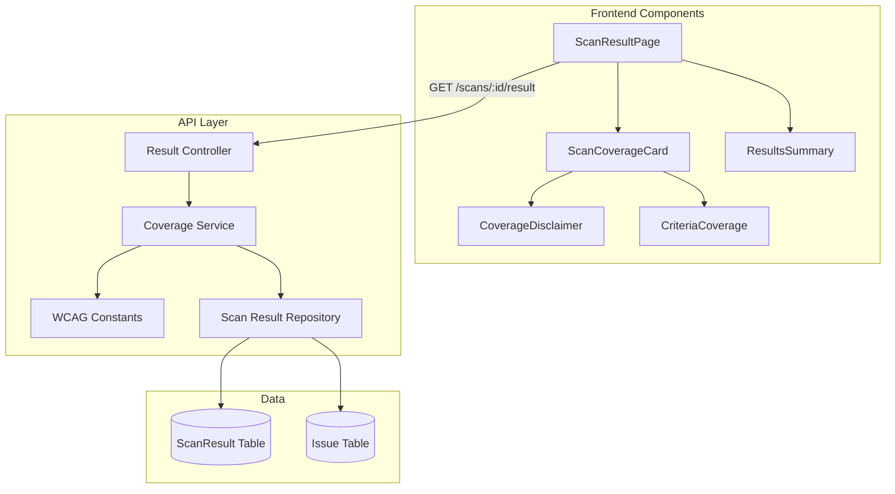

# Design Document: Enhanced Trust Indicators

## Overview

This feature enhances the scan results display to show differentiated trust indicators based on scan type (standard vs AI-enhanced) and provides visibility into WCAG criteria coverage. The design leverages existing component patterns (gradient styling for AI, amber styling for standard disclaimers) and integrates with the established data model.

## Steering Document Alignment

### Technical Standards (tech.md)
- Uses existing component patterns from `apps/web/src/components/features/`
- Follows TypeScript strict mode and existing interface patterns from `lib/api.ts`
- Integrates with existing WCAG constants from `packages/core/src/constants/wcag.constants.ts`

### Project Structure (structure.md)
- New components placed in `apps/web/src/components/features/compliance/`
- API enhancements in `apps/api/src/modules/results/`
- Shared types in `apps/web/src/lib/api.ts`

## Code Reuse Analysis

### Existing Components to Leverage
- **`CoverageDisclaimer.tsx`**: Will be enhanced to accept props for AI/standard differentiation
- **`AiSummarySection.tsx`**: Pattern reference for AI gradient styling (`from-purple-600 to-blue-600`)
- **`ResultsSummary.tsx`**: Pattern reference for card-based metric display
- **`AiStatusBadge.tsx`**: Reference for AI status state handling

### Existing Utilities to Leverage
- **`WCAG_CRITERIA`** constant: Complete mapping of 78 WCAG 2.1 criteria
- **`getCriteriaUpToLevel()`**: Function to get criteria count by conformance level
- **`AXE_RULE_TO_WCAG`**: Mapping from axe-core rules to WCAG criteria
- **`cn()` utility**: For className merging with Tailwind

### Integration Points
- **Scan Result API**: Add coverage metadata to `GET /api/v1/scans/:id/result`
- **Batch Summary API**: Add aggregated coverage to batch endpoints
- **ScanResult model**: Already has `passedChecks` and `inapplicableChecks` fields

## Architecture



## Components and Interfaces

### Component 1: ScanCoverageCard
- **Purpose:** Main container displaying all trust indicators in a single prominent card
- **Location:** `apps/web/src/components/features/compliance/ScanCoverageCard.tsx`
- **Interfaces:**
  ```typescript
  interface ScanCoverageCardProps {
    coveragePercentage: number;      // 57 or 80 (midpoint of 75-85)
    criteriaChecked: number;          // Unique WCAG criteria tested
    criteriaTotal: number;            // Total for conformance level
    passedChecks: number;             // From ScanResult
    isAiEnhanced: boolean;            // AI completed status
    wcagLevel: 'A' | 'AA' | 'AAA';    // Conformance level
    className?: string;
  }
  ```
- **Dependencies:** CoverageDisclaimer, CriteriaCoverage, lucide-react icons
- **Reuses:** Card styling patterns from ResultsSummary, gradient patterns from AiSummarySection

### Component 2: CoverageDisclaimer (Enhanced)
- **Purpose:** Display detection percentage with differentiation for AI vs standard scans
- **Location:** `apps/web/src/components/features/compliance/CoverageDisclaimer.tsx` (modify existing)
- **Interfaces:**
  ```typescript
  interface CoverageDisclaimerProps {
    isAiEnhanced?: boolean;           // Default: false
    aiStatus?: 'PENDING' | 'DOWNLOADED' | 'PROCESSING' | 'COMPLETED' | 'FAILED';
    className?: string;
  }
  ```
- **Dependencies:** lucide-react (Sparkles, Info icons)
- **Reuses:** Existing amber styling for standard, adds purple gradient for AI-enhanced

### Component 3: CriteriaCoverage
- **Purpose:** Display "X of Y criteria checked" with tooltip breakdown
- **Location:** `apps/web/src/components/features/compliance/CriteriaCoverage.tsx`
- **Interfaces:**
  ```typescript
  interface CriteriaCoverageProps {
    criteriaChecked: number;
    criteriaTotal: number;
    criteriaWithIssues?: number;      // Optional breakdown
    criteriaPassed?: number;          // Optional breakdown
    criteriaNotTestable?: number;     // Optional breakdown
    wcagLevel: 'A' | 'AA' | 'AAA';
    className?: string;
  }
  ```
- **Dependencies:** shadcn/ui Tooltip, Progress component
- **Reuses:** Tooltip patterns from existing components

### Component 4: CoverageService (API)
- **Purpose:** Calculate coverage metrics from scan results
- **Location:** `apps/api/src/modules/results/coverage.service.ts`
- **Interfaces:**
  ```typescript
  interface CoverageMetrics {
    coveragePercentage: number;
    criteriaChecked: number;
    criteriaTotal: number;
    isAiEnhanced: boolean;
    breakdown: {
      criteriaWithIssues: number;
      criteriaPassed: number;
      criteriaNotTestable: number;
    };
  }

  class CoverageService {
    calculateCoverage(
      scanResult: ScanResult,
      issues: Issue[],
      wcagLevel: WcagLevel,
      aiEnabled: boolean,
      aiStatus: AiStatus | null
    ): CoverageMetrics;
  }
  ```
- **Dependencies:** WCAG_CRITERIA, AXE_RULE_TO_WCAG from @adashield/core
- **Reuses:** Existing WCAG constant mappings

## Data Models

### API Response Enhancement

```typescript
// Enhanced ScanResultResponse (lib/api.ts)
export interface ScanResultResponse {
  // Existing fields...
  summary: {
    totalIssues: number;
    critical: number;
    serious: number;
    moderate: number;
    minor: number;
  };
  passedChecks: number;
  inapplicableChecks: number;

  // NEW: Coverage metrics (Requirement 4)
  coverage: {
    coveragePercentage: number;      // 57 for standard, 80 for AI-enhanced
    criteriaChecked: number;          // Unique WCAG criteria covered
    criteriaTotal: number;            // Total for conformance level
    isAiEnhanced: boolean;            // AI completed successfully
    breakdown: {
      criteriaWithIssues: number;
      criteriaPassed: number;
      criteriaNotTestable: number;
    };
  };
}
```

### WCAG Criteria Counts (Reference)

| Level | Criteria Count | Description |
|-------|---------------|-------------|
| A     | 30            | WCAG 2.1 Level A only |
| AA    | 50            | Level A + AA combined |
| AAA   | 78            | All WCAG 2.1 criteria |

## UI Design

### ScanCoverageCard Layout

```
┌─────────────────────────────────────────────────────────────────┐
│  📊 Scan Coverage                            [AI-Enhanced ✨]   │
├─────────────────────────────────────────────────────────────────┤
│                                                                 │
│  ┌─────────────────┐  ┌─────────────────┐  ┌─────────────────┐ │
│  │   75-85%        │  │   32 of 50      │  │      156        │ │
│  │   Detection     │  │   Criteria      │  │   Passed        │ │
│  │   Coverage      │  │   Checked       │  │   Checks        │ │
│  └─────────────────┘  └─────────────────┘  └─────────────────┘ │
│                                                                 │
│  ℹ️ AI-enhanced testing detects approximately 75-85% of WCAG   │
│  issues. Manual testing is recommended for complete compliance. │
│                                                                 │
└─────────────────────────────────────────────────────────────────┘
```

### Visual Differentiation

**Standard Scan (amber theme):**
- Background: `bg-amber-50 dark:bg-amber-950/20`
- Border: `border-amber-200 dark:border-amber-900`
- Text: "Automated testing detects approximately **57%** of WCAG issues"

**AI-Enhanced Scan (purple/gradient theme):**
- Background: `bg-gradient-to-r from-purple-50 to-blue-50`
- Border: `border-purple-200`
- Badge: Purple gradient with Sparkles icon
- Text: "AI-enhanced testing detects approximately **75-85%** of WCAG issues"

### CriteriaCoverage Tooltip Content

```
┌─────────────────────────────────────────┐
│  WCAG 2.1 Level AA Coverage             │
├─────────────────────────────────────────┤
│  ● 8 criteria with issues found         │
│  ● 24 criteria passed                   │
│  ● 18 criteria not testable by          │
│    automation                           │
├─────────────────────────────────────────┤
│  Total: 32 of 50 criteria checked       │
└─────────────────────────────────────────┘
```

## Error Handling

### Error Scenarios

1. **Coverage data unavailable:**
   - **Handling:** Return null coverage object, frontend shows graceful degradation (existing CoverageDisclaimer without metrics)
   - **User Impact:** Sees standard disclaimer without criteria counts

2. **Invalid WCAG level:**
   - **Handling:** Default to 'AA' level, log warning
   - **User Impact:** Criteria total defaults to 50

3. **AI status check fails:**
   - **Handling:** Treat as non-AI-enhanced scan
   - **User Impact:** Shows 57% coverage, no AI badge

4. **Empty issues array:**
   - **Handling:** Calculate based on passed/inapplicable checks only
   - **User Impact:** Shows criteria checked = passed + inapplicable mappings

## Testing Strategy

### Unit Testing
- **CoverageService.calculateCoverage()**: Test all combinations of AI status and WCAG levels
- **ScanCoverageCard**: Test rendering for standard vs AI-enhanced states
- **CriteriaCoverage**: Test tooltip content generation
- **CoverageDisclaimer**: Test all AI status variations

### Integration Testing
- **API endpoint**: Test coverage metrics in scan result response
- **Frontend hook**: Test useScanResult hook with new coverage fields
- **Component integration**: Test ScanCoverageCard in ScanResultPage

### End-to-End Testing
- **Standard scan flow**: Verify 57% and criteria counts display correctly
- **AI-enhanced scan flow**: Verify 75-85% and AI badge after AI completion
- **Batch scan summary**: Verify aggregated coverage across multiple scans

### Test Data
```typescript
// Standard scan result
const standardResult = {
  coverage: {
    coveragePercentage: 57,
    criteriaChecked: 32,
    criteriaTotal: 50,
    isAiEnhanced: false,
    breakdown: { criteriaWithIssues: 8, criteriaPassed: 24, criteriaNotTestable: 18 }
  }
};

// AI-enhanced scan result
const aiEnhancedResult = {
  coverage: {
    coveragePercentage: 80,
    criteriaChecked: 38,
    criteriaTotal: 50,
    isAiEnhanced: true,
    breakdown: { criteriaWithIssues: 10, criteriaPassed: 28, criteriaNotTestable: 12 }
  }
};
```

## Performance Considerations

- **Coverage calculation**: O(n) where n = number of issues, cached per request
- **WCAG criteria lookup**: O(1) using existing constant maps
- **API response size**: Adds ~200 bytes for coverage object
- **Frontend rendering**: Single additional component, minimal impact

## Accessibility Considerations

- All numeric values have `aria-label` descriptions
- Tooltip content accessible via keyboard (Tab + Enter)
- Color contrast meets WCAG AA for all text
- AI badge has `role="status"` and appropriate aria-label
- Progress indicators have screen reader-friendly descriptions
