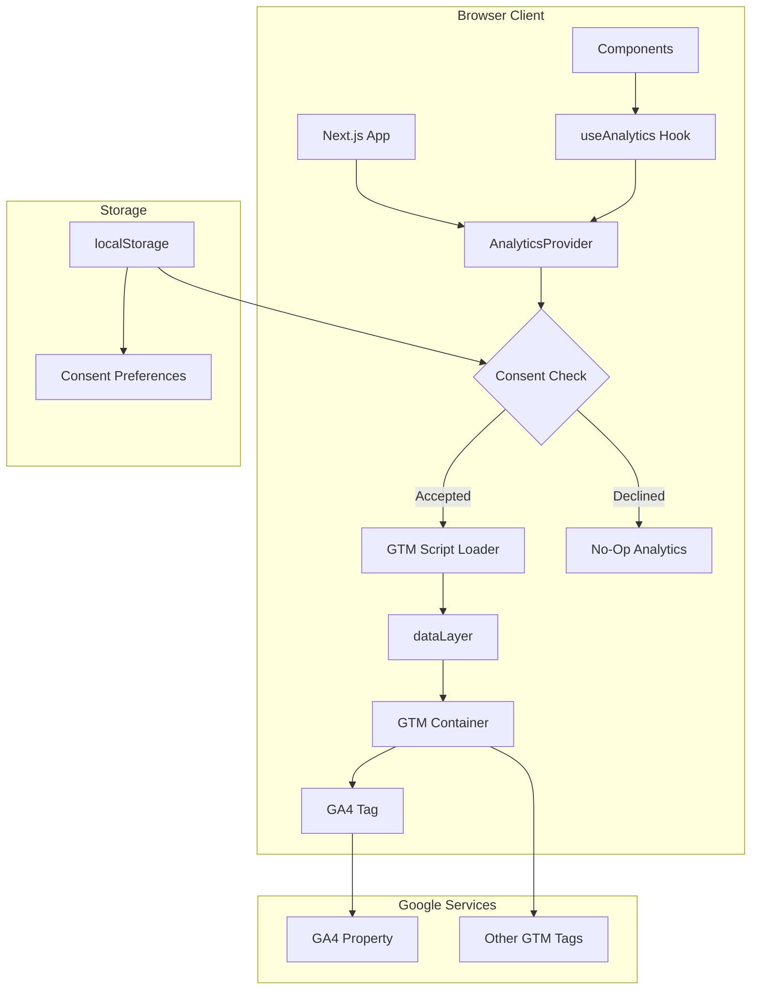
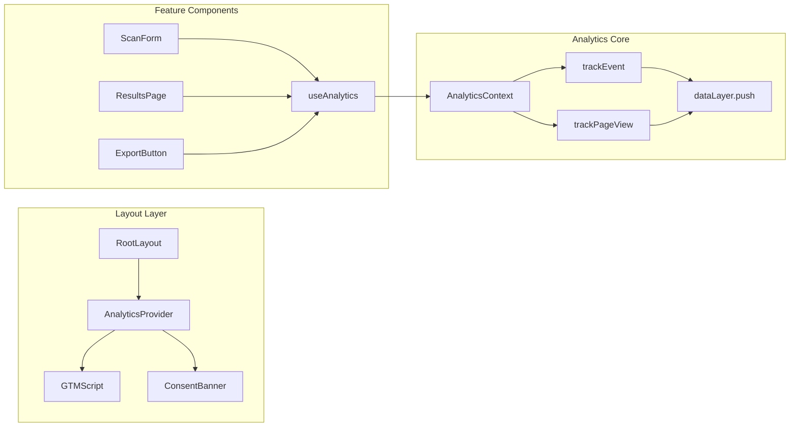
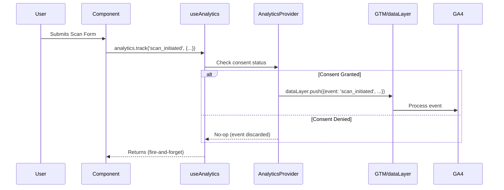

# Design Document: Google Analytics Integration

## Overview

This design describes the integration of Google Tag Manager (GTM) and Google Analytics 4 (GA4) into ADAShield's Next.js web application. The integration follows a privacy-first approach, building upon existing consent infrastructure and script loading patterns. The architecture emphasizes modularity, type safety, and graceful degradation.

## Steering Document Alignment

### Technical Standards (tech.md)

| Standard | Alignment |
|----------|-----------|
| **Next.js 14 App Router** | GTM loaded via Next.js Script component with `afterInteractive` strategy |
| **TypeScript Strict Mode** | Full type definitions for analytics events and dataLayer |
| **React 18 Hooks** | Custom `useAnalytics` hook for event tracking |
| **Zustand State** | Consent state managed in analytics store |
| **Environment Variables** | `NEXT_PUBLIC_*` pattern for client-side config |

### Project Structure (structure.md)

| Convention | Implementation |
|------------|----------------|
| **Kebab-case files** | `analytics.ts`, `gtm-script.tsx`, `use-analytics.ts` |
| **Feature directories** | `components/features/analytics/` |
| **Lib utilities** | `lib/analytics.ts`, `lib/gtm.ts` |
| **Hooks directory** | `hooks/useAnalytics.ts` |
| **Types directory** | `types/analytics.types.ts` (if complex) |

## Code Reuse Analysis

### Existing Components to Leverage

| Component | Location | How It Will Be Used |
|-----------|----------|---------------------|
| **CookieConsent** | `components/features/privacy/CookieConsent.tsx` | Extend for granular analytics consent |
| **env.ts** | `lib/env.ts` | Add GTM_ID, GA_MEASUREMENT_ID, ANALYTICS_ENABLED |
| **recaptcha.ts** | `lib/recaptcha.ts` | Reuse singleton script loading pattern for GTM |

### Integration Points

| Existing System | Integration Approach |
|-----------------|---------------------|
| **layout.tsx** | Add GTMScript component and AnalyticsProvider |
| **ScanForm.tsx** | Add analytics.track() calls at key submission points |
| **page.tsx (results)** | Track scan_completed when results load |
| **ExportButton** | Track report_exported on download |
| **localStorage** | Extend consent storage with analytics preferences |

## Architecture

### High-Level Architecture



### Component Architecture



### Event Flow



## Components and Interfaces

### Component 1: AnalyticsProvider

- **Purpose**: React context provider managing analytics state, consent, and GTM initialization
- **Location**: `apps/web/src/components/features/analytics/AnalyticsProvider.tsx`
- **Interfaces**:
  ```typescript
  interface AnalyticsProviderProps {
    children: React.ReactNode;
  }

  interface AnalyticsContextValue {
    isEnabled: boolean;
    consent: ConsentStatus;
    track: (event: AnalyticsEvent) => void;
    trackPageView: (path: string, title?: string) => void;
    setConsent: (status: ConsentStatus) => void;
  }
  ```
- **Dependencies**: React Context, Zustand store, GTM utilities
- **Reuses**: Consent storage pattern from `CookieConsent.tsx`

### Component 2: GTMScript

- **Purpose**: Conditionally loads GTM script based on consent and configuration
- **Location**: `apps/web/src/components/features/analytics/GTMScript.tsx`
- **Interfaces**:
  ```typescript
  interface GTMScriptProps {
    gtmId: string;
    enabled: boolean;
  }
  ```
- **Dependencies**: Next.js Script component, environment config
- **Reuses**: Script loading pattern from `recaptcha.ts`

### Component 3: Enhanced CookieConsent

- **Purpose**: Extended consent banner with granular analytics opt-in
- **Location**: `apps/web/src/components/features/privacy/CookieConsent.tsx` (modify existing)
- **Interfaces**:
  ```typescript
  interface ConsentStatus {
    essential: boolean;      // Always true
    analytics: boolean;      // User choice
    marketing: boolean;      // Future use
    timestamp: number;       // When consent was given
  }
  ```
- **Dependencies**: localStorage, AnalyticsContext
- **Reuses**: Existing CookieConsent component structure

### Component 4: useAnalytics Hook

- **Purpose**: React hook providing type-safe analytics tracking methods
- **Location**: `apps/web/src/hooks/useAnalytics.ts`
- **Interfaces**:
  ```typescript
  function useAnalytics(): {
    track: <T extends AnalyticsEventName>(
      event: T,
      params: AnalyticsEventParams[T]
    ) => void;
    trackPageView: (path: string, title?: string) => void;
    isEnabled: boolean;
  }
  ```
- **Dependencies**: AnalyticsContext
- **Reuses**: Hook patterns from `useScanEvents.ts`

### Component 5: Analytics Library

- **Purpose**: Core analytics utilities, event definitions, and GTM interface
- **Location**: `apps/web/src/lib/analytics.ts`
- **Interfaces**:
  ```typescript
  // Event tracking
  function trackEvent(event: AnalyticsEvent): void;
  function trackPageView(path: string, title?: string): void;

  // GTM interface
  function pushToDataLayer(data: DataLayerEvent): void;
  function initializeDataLayer(): void;

  // Consent management
  function getConsent(): ConsentStatus;
  function setConsent(status: ConsentStatus): void;
  function clearAnalyticsCookies(): void;
  ```
- **Dependencies**: Window.dataLayer, localStorage
- **Reuses**: Environment pattern from `env.ts`

## Data Models

### AnalyticsEvent

```typescript
// Base event structure
interface BaseAnalyticsEvent {
  event: string;
  timestamp: number;
  sessionId?: string;
}

// Scan events
interface ScanInitiatedEvent extends BaseAnalyticsEvent {
  event: 'scan_initiated';
  wcag_level: 'A' | 'AA' | 'AAA';
  scan_type: 'single' | 'batch';
  url_count: number;
}

interface ScanCompletedEvent extends BaseAnalyticsEvent {
  event: 'scan_completed';
  scan_duration_ms: number;
  issue_count_critical: number;
  issue_count_serious: number;
  issue_count_moderate: number;
  issue_count_minor: number;
  wcag_level: 'A' | 'AA' | 'AAA';
}

// Report events
interface ReportExportedEvent extends BaseAnalyticsEvent {
  event: 'report_exported';
  format: 'pdf' | 'json';
  report_type: 'single' | 'batch';
}

// Funnel events
interface FunnelEvent extends BaseAnalyticsEvent {
  event: 'funnel_scan_form_viewed' | 'funnel_scan_url_entered' |
         'funnel_scan_submitted' | 'funnel_scan_results_viewed' |
         'funnel_report_downloaded';
  funnel_session_id: string;
}

// Error events
interface ErrorEvent extends BaseAnalyticsEvent {
  event: 'error_api' | 'error_js';
  error_code?: string;
  error_message: string;
  error_context: string;
}

// Union type for all events
type AnalyticsEvent =
  | ScanInitiatedEvent
  | ScanCompletedEvent
  | ReportExportedEvent
  | FunnelEvent
  | ErrorEvent;
```

### ConsentStatus

```typescript
interface ConsentStatus {
  essential: boolean;       // Always true, required for app function
  analytics: boolean;       // GTM/GA4 tracking consent
  marketing: boolean;       // Future: marketing cookies
  timestamp: number;        // Unix timestamp of consent action
  version: string;          // Consent version for policy updates
}

// localStorage key
const CONSENT_STORAGE_KEY = 'adashield:consent';

// Default (no consent given yet)
const DEFAULT_CONSENT: ConsentStatus = {
  essential: true,
  analytics: false,
  marketing: false,
  timestamp: 0,
  version: '1.0',
};
```

### DataLayer Structure

```typescript
// GTM dataLayer interface
interface DataLayerEvent {
  event: string;
  [key: string]: unknown;
}

// Extend Window for TypeScript
declare global {
  interface Window {
    dataLayer: DataLayerEvent[];
    gtag?: (...args: unknown[]) => void;
  }
}
```

### Environment Configuration

```typescript
// Extended env.ts
export const env = {
  apiUrl: process.env['NEXT_PUBLIC_API_URL'] || 'http://localhost:3080',
  recaptchaSiteKey: process.env['NEXT_PUBLIC_RECAPTCHA_SITE_KEY'] || '',

  // Analytics configuration
  gtmId: process.env['NEXT_PUBLIC_GTM_ID'] || '',
  gaMeasurementId: process.env['NEXT_PUBLIC_GA_MEASUREMENT_ID'] || '',
  analyticsEnabled: process.env['NEXT_PUBLIC_ANALYTICS_ENABLED'] !== 'false',
  analyticsDebug: process.env['NODE_ENV'] === 'development',
} as const;
```

## File Structure

```
apps/web/src/
├── app/
│   └── layout.tsx                          # Add AnalyticsProvider wrapper
├── components/
│   └── features/
│       ├── analytics/
│       │   ├── index.ts                    # Public exports
│       │   ├── AnalyticsProvider.tsx       # Context provider
│       │   ├── GTMScript.tsx               # GTM script loader
│       │   └── PageViewTracker.tsx         # Auto page view tracking
│       └── privacy/
│           └── CookieConsent.tsx           # Enhanced with analytics consent
├── hooks/
│   └── useAnalytics.ts                     # Analytics hook
├── lib/
│   ├── analytics.ts                        # Core analytics utilities
│   ├── analytics.constants.ts              # Event names, config constants
│   └── env.ts                              # Extended with analytics config
└── types/
    └── analytics.types.ts                  # TypeScript definitions (optional)
```

## Error Handling

### Error Scenarios

| Scenario | Handling | User Impact |
|----------|----------|-------------|
| **GTM fails to load** | Log warning, disable tracking, app continues | None - app works normally |
| **Invalid GTM ID** | Skip initialization, log error | None - no tracking occurs |
| **dataLayer not available** | Create empty array, queue events | Slight delay in first events |
| **Consent storage fails** | Fall back to session storage, then memory | Consent asked again on return |
| **Event push fails** | Catch silently, log in development | None - events are fire-and-forget |
| **Network offline** | Events queued in dataLayer, sent when online | Delayed tracking (GTM handles) |

### Error Isolation Strategy

```typescript
// Wrapper for all analytics operations
function safeAnalyticsCall<T>(
  operation: () => T,
  fallback: T,
  context: string
): T {
  try {
    return operation();
  } catch (error) {
    if (env.analyticsDebug) {
      console.error(`[Analytics] ${context}:`, error);
    }
    return fallback;
  }
}

// Usage example
function trackEvent(event: AnalyticsEvent): void {
  safeAnalyticsCall(
    () => {
      if (!isEnabled()) return;
      pushToDataLayer(event);
    },
    undefined,
    `trackEvent(${event.event})`
  );
}
```

## Testing Strategy

### Unit Testing

| Component | Test Focus | Tools |
|-----------|-----------|-------|
| **useAnalytics** | Hook behavior, consent checks | Vitest, React Testing Library |
| **analytics.ts** | Event formatting, dataLayer push | Vitest, mock window.dataLayer |
| **AnalyticsProvider** | Context value, consent state | Vitest, React Testing Library |
| **GTMScript** | Conditional rendering, script props | Vitest, Next.js test utils |

**Example Test Cases**:
```typescript
// useAnalytics.test.ts
describe('useAnalytics', () => {
  it('should not track events when consent is denied', () => {
    // Mock consent as denied
    // Call track()
    // Assert dataLayer.push was not called
  });

  it('should track events when consent is granted', () => {
    // Mock consent as granted
    // Call track('scan_initiated', {...})
    // Assert dataLayer.push was called with correct event
  });

  it('should include timestamp in all events', () => {
    // Track any event
    // Assert timestamp property exists and is valid
  });
});
```

### Integration Testing

| Flow | Test Approach |
|------|---------------|
| **Consent → Tracking** | E2E test: accept consent, verify GTM loaded |
| **Scan → Event** | Integration: submit form, verify event in dataLayer |
| **Page Navigation** | E2E: navigate pages, verify page_view events |

### End-to-End Testing

```typescript
// analytics.spec.ts (Playwright)
test.describe('Analytics Integration', () => {
  test('should load GTM after consent acceptance', async ({ page }) => {
    await page.goto('/');

    // Verify GTM not loaded initially
    const gtmScriptBefore = await page.$('script[src*="googletagmanager"]');
    expect(gtmScriptBefore).toBeNull();

    // Accept cookies
    await page.click('button:has-text("Accept")');

    // Verify GTM loaded
    await page.waitForSelector('script[src*="googletagmanager"]');
  });

  test('should track scan_initiated event', async ({ page }) => {
    // Setup: Accept consent
    await page.goto('/');
    await page.click('button:has-text("Accept")');

    // Capture dataLayer
    const dataLayerBefore = await page.evaluate(() => window.dataLayer.length);

    // Submit scan form
    await page.fill('input[name="url"]', 'https://example.com');
    await page.click('button[type="submit"]');

    // Verify event pushed
    const dataLayerAfter = await page.evaluate(() => window.dataLayer);
    const scanEvent = dataLayerAfter.find(e => e.event === 'scan_initiated');
    expect(scanEvent).toBeDefined();
    expect(scanEvent.wcag_level).toBe('AA');
  });
});
```

## Performance Considerations

### Script Loading Strategy

```typescript
// GTMScript.tsx - Load after page interactive
<Script
  id="gtm-script"
  strategy="afterInteractive"
  src={`https://www.googletagmanager.com/gtm.js?id=${gtmId}`}
/>
```

### Bundle Impact

| Addition | Size (gzipped) | Notes |
|----------|---------------|-------|
| **Analytics lib** | ~1.5KB | Pure TypeScript, no deps |
| **Provider + Hook** | ~1KB | React context + hook |
| **GTM loader** | ~0.5KB | Next.js Script wrapper |
| **Total** | ~3KB | Well under 5KB target |

### Runtime Performance

- **Event tracking**: Fire-and-forget, no await
- **Consent check**: O(1) from Zustand store
- **DataLayer push**: Synchronous array push
- **No render blocking**: All analytics async

## Security Considerations

### Content Security Policy

```typescript
// next.config.js - CSP headers
const cspDirectives = {
  'script-src': [
    "'self'",
    'https://www.googletagmanager.com',
    'https://www.google-analytics.com',
  ],
  'connect-src': [
    "'self'",
    'https://www.google-analytics.com',
    'https://analytics.google.com',
  ],
  'img-src': [
    "'self'",
    'https://www.google-analytics.com',
  ],
};
```

### PII Protection

```typescript
// Sanitize URLs before tracking
function sanitizeUrl(url: string): string {
  try {
    const parsed = new URL(url);
    // Remove query params (may contain PII)
    return `${parsed.protocol}//${parsed.host}${parsed.pathname}`;
  } catch {
    return '[invalid-url]';
  }
}

// Sanitize error messages
function sanitizeError(message: string): string {
  // Remove potential email patterns
  return message.replace(/[\w.-]+@[\w.-]+\.\w+/g, '[email]')
    // Remove potential URLs with query strings
    .replace(/https?:\/\/[^\s]+\?[^\s]+/g, '[url-with-params]');
}
```

## Migration Notes

### Existing CookieConsent Changes

The current `CookieConsent.tsx` stores a simple string ('accepted'/'declined'). This will be migrated to the new `ConsentStatus` object:

```typescript
// Migration on first load
useEffect(() => {
  const oldConsent = localStorage.getItem('cookieConsent');
  if (oldConsent && !localStorage.getItem(CONSENT_STORAGE_KEY)) {
    // Migrate old consent to new format
    const newConsent: ConsentStatus = {
      essential: true,
      analytics: oldConsent === 'accepted',
      marketing: false,
      timestamp: Date.now(),
      version: '1.0',
    };
    localStorage.setItem(CONSENT_STORAGE_KEY, JSON.stringify(newConsent));
    localStorage.removeItem('cookieConsent'); // Clean up old key
  }
}, []);
```

---

*Created: December 2024*
*Version: 1.0*
*Status: Draft - Pending Review*
