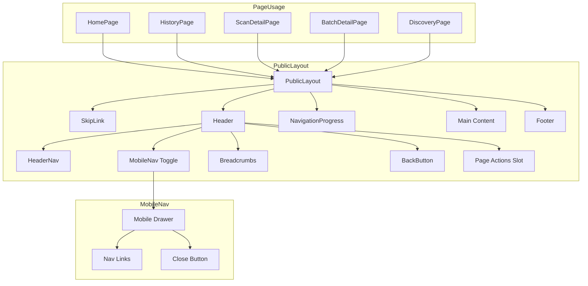
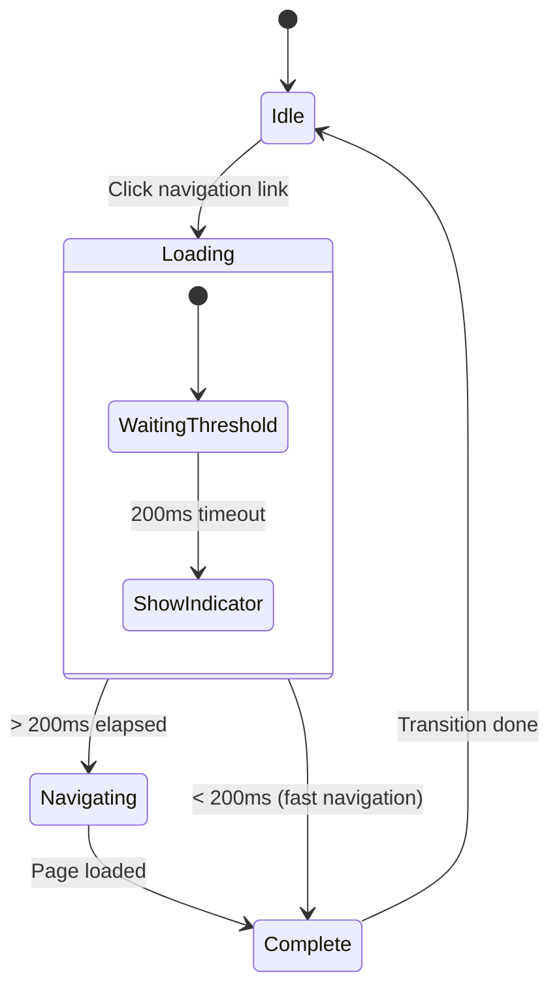
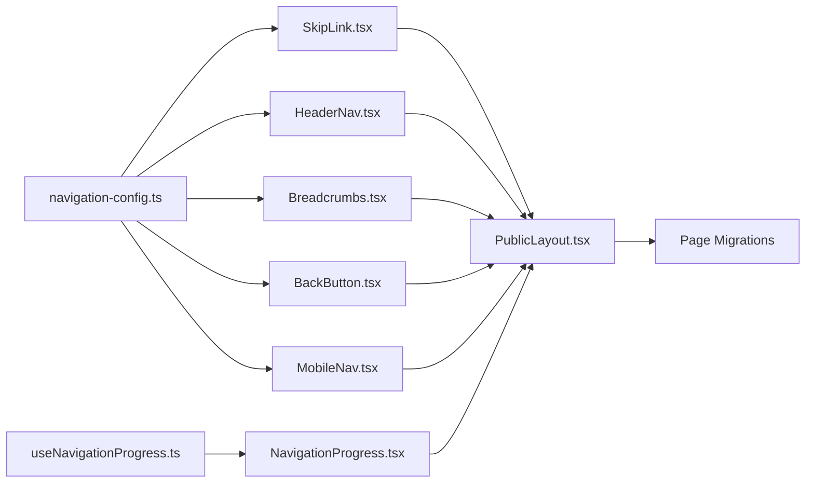

# Design Document: History & Scan Navigation UX Improvement

## Overview

This feature enhances navigation consistency and usability across all public-facing pages of ADAShield. The design introduces a unified `PublicLayout` component with consistent header navigation, breadcrumbs, back navigation, skip links, and mobile-responsive patterns. The implementation leverages existing patterns from the admin sidebar while maintaining the visual identity of the customer-facing experience.

## Steering Document Alignment

### Technical Standards (tech.md)

| Standard | Implementation |
|----------|----------------|
| **React 18 + Next.js 14** | All components use App Router patterns with `usePathname()`, `useRouter()` |
| **TypeScript strict mode** | Full type safety with interfaces for all props and navigation config |
| **TailwindCSS** | Styling follows existing utility-first patterns |
| **shadcn/ui** | Leverage existing Button, Tooltip components where applicable |
| **Zustand** | Optional navigation state store for loading indicators |
| **Performance** | Navigation components load < 100ms, use CSS sticky positioning |

### Project Structure (structure.md)

```
apps/web/src/
├── components/
│   ├── layouts/
│   │   ├── MainLayout.tsx           # DEPRECATED - kept for backward compat
│   │   ├── PublicLayout.tsx         # NEW - unified layout component
│   │   └── index.ts
│   ├── navigation/                   # NEW - navigation components
│   │   ├── Breadcrumbs.tsx
│   │   ├── BackButton.tsx
│   │   ├── HeaderNav.tsx
│   │   ├── MobileNav.tsx
│   │   ├── SkipLink.tsx
│   │   ├── NavigationProgress.tsx
│   │   └── index.ts
│   └── ui/
│       └── (existing components)
├── hooks/
│   └── useNavigationProgress.ts      # NEW - loading state hook
├── lib/
│   └── navigation-config.ts          # NEW - centralized nav config
└── stores/
    └── navigation-store.ts           # NEW - optional navigation state
```

## Code Reuse Analysis

### Existing Components to Leverage

| Component | Path | Reuse Strategy |
|-----------|------|----------------|
| **AdminSidebar** | `components/admin/AdminSidebar.tsx` | Copy accessibility patterns (`role="navigation"`, `aria-current`, keyboard support) |
| **StepIndicator** | `components/ui/step-indicator.tsx` | Reference keyboard navigation patterns (Arrow keys, focus management) |
| **MainLayout** | `components/layouts/MainLayout.tsx` | Extend structure, replace usage gradually |
| **Button** | `components/ui/button.tsx` | Use for back button and nav actions |
| **Tooltip** | `components/ui/tooltip.tsx` | Use for back button hover state |
| **cn() utility** | `lib/utils.ts` | Dynamic class composition |

### Existing Patterns to Follow

| Pattern | Source | Application |
|---------|--------|-------------|
| Active route detection | AdminSidebar:15-20 | Use `usePathname()` with exact/prefix matching |
| Navigation structure | AdminSidebar:22-45 | Array-based navigation config |
| Accessibility attributes | AdminSidebar:50-80 | `role`, `aria-label`, `aria-current` |
| Link rendering | AdminSidebar:82-95 | Next.js `Link` component usage |
| Mobile viewport detection | Various | `md:` Tailwind breakpoint (768px) |

### Integration Points

| System | Integration |
|--------|-------------|
| **Next.js Router** | `useRouter()` for programmatic navigation, `usePathname()` for active state |
| **SessionStorage** | Track referrer for smart back navigation |
| **Existing Pages** | Migrate from inline headers to PublicLayout |
| **Footer** | Reuse existing footer pattern from HomePage |

## Architecture

### Component Hierarchy



### Navigation Flow State Machine



## Components and Interfaces

### Component 1: PublicLayout

```typescript
interface PublicLayoutProps {
  children: React.ReactNode;
  /** Breadcrumb configuration - omit for pages without breadcrumbs */
  breadcrumbs?: BreadcrumbItem[];
  /** Show back button with optional custom destination */
  showBackButton?: boolean;
  backButtonHref?: string;
  backButtonLabel?: string;
  /** Custom actions to display in header (e.g., Export, Share buttons) */
  headerActions?: React.ReactNode;
  /** Page title for mobile header */
  pageTitle?: string;
  /** Whether header should be sticky on scroll */
  stickyHeader?: boolean;
}
```

- **Purpose**: Unified layout wrapper for all public pages with consistent navigation
- **Interfaces**: Accepts breadcrumbs, back button config, header actions, and page title
- **Dependencies**: HeaderNav, Breadcrumbs, BackButton, SkipLink, MobileNav, NavigationProgress
- **Reuses**: MainLayout structure, Footer pattern from HomePage

### Component 2: HeaderNav

```typescript
interface NavItem {
  label: string;
  href: string;
  icon?: React.ComponentType<{ className?: string }>;
}

interface HeaderNavProps {
  items?: NavItem[];
  className?: string;
}
```

- **Purpose**: Desktop navigation links in header (Home, History, Settings)
- **Interfaces**: Configurable nav items array with labels and hrefs
- **Dependencies**: Next.js Link, usePathname
- **Reuses**: AdminSidebar active state detection pattern

### Component 3: Breadcrumbs

```typescript
interface BreadcrumbItem {
  label: string;
  href?: string; // Omit for current page (non-clickable)
}

interface BreadcrumbsProps {
  items: BreadcrumbItem[];
  className?: string;
  /** Separator character/component */
  separator?: React.ReactNode;
  /** Truncate long breadcrumb labels */
  maxLabelLength?: number;
}
```

- **Purpose**: Show page hierarchy with clickable navigation to parent pages
- **Interfaces**: Array of breadcrumb items with optional href
- **Dependencies**: Next.js Link, cn utility
- **Reuses**: None (new component, but follows shadcn patterns)

### Component 4: BackButton

```typescript
interface BackButtonProps {
  /** Explicit destination, defaults to /history */
  href?: string;
  /** Tooltip label */
  label?: string;
  /** Use router.back() instead of explicit href */
  useBrowserBack?: boolean;
  className?: string;
}
```

- **Purpose**: Consistent back navigation with tooltip and smart destination detection
- **Interfaces**: Configurable href, label, and navigation strategy
- **Dependencies**: useRouter, Tooltip, Button, ArrowLeft icon
- **Reuses**: BatchDetailHeader back button pattern

### Component 5: MobileNav

```typescript
interface MobileNavProps {
  items: NavItem[];
  isOpen: boolean;
  onClose: () => void;
}
```

- **Purpose**: Mobile navigation drawer with hamburger menu toggle
- **Interfaces**: Same nav items as HeaderNav, open state, close callback
- **Dependencies**: useState, usePathname, Lucide icons
- **Reuses**: Accessibility patterns from AdminSidebar

### Component 6: SkipLink

```typescript
interface SkipLinkProps {
  /** Target element ID to skip to */
  targetId?: string;
  /** Link text */
  label?: string;
}
```

- **Purpose**: Accessibility skip link for keyboard users to bypass navigation
- **Interfaces**: Target element ID (defaults to "main-content")
- **Dependencies**: None (pure CSS + semantic HTML)
- **Reuses**: None (new component following WCAG patterns)

### Component 7: NavigationProgress

```typescript
interface NavigationProgressProps {
  /** Loading state from router events */
  isLoading: boolean;
}
```

- **Purpose**: Visual feedback during page transitions (progress bar in header)
- **Interfaces**: Loading state boolean
- **Dependencies**: useNavigationProgress hook
- **Reuses**: Progress component from shadcn/ui

## Data Models

### Navigation Configuration

```typescript
// lib/navigation-config.ts

interface NavConfig {
  /** Main navigation items for header */
  mainNav: NavItem[];
  /** Breadcrumb templates for each page pattern */
  breadcrumbTemplates: Record<string, BreadcrumbTemplate>;
}

interface BreadcrumbTemplate {
  /** Static items that always appear */
  items: BreadcrumbItem[];
  /** Dynamic segment resolver for parameterized routes */
  dynamicResolver?: (params: Record<string, string>) => BreadcrumbItem;
}

// Example configuration
const navigationConfig: NavConfig = {
  mainNav: [
    { label: 'Home', href: '/' },
    { label: 'History', href: '/history' },
    { label: 'Settings', href: '/settings' },
  ],
  breadcrumbTemplates: {
    '/history': {
      items: [
        { label: 'Home', href: '/' },
        { label: 'History' },
      ],
    },
    '/scan/[id]': {
      items: [
        { label: 'Home', href: '/' },
        { label: 'History', href: '/history' },
      ],
      dynamicResolver: (params) => ({ label: 'Scan Results' }),
    },
    '/batch/[id]': {
      items: [
        { label: 'Home', href: '/' },
        { label: 'History', href: '/history' },
      ],
      dynamicResolver: (params) => ({ label: 'Batch Results' }),
    },
    '/discovery': {
      items: [
        { label: 'Home', href: '/' },
        { label: 'Discover Pages' },
      ],
    },
  },
};
```

### Navigation State Store (Optional)

```typescript
// stores/navigation-store.ts

interface NavigationState {
  /** Is navigation transition in progress */
  isNavigating: boolean;
  /** Referrer page for smart back navigation */
  referrer: string | null;
  /** Mobile nav drawer open state */
  mobileNavOpen: boolean;

  // Actions
  setNavigating: (value: boolean) => void;
  setReferrer: (value: string | null) => void;
  toggleMobileNav: () => void;
  closeMobileNav: () => void;
}
```

## User Interface Specifications

### Desktop Layout (≥768px)

```
┌─────────────────────────────────────────────────────────────────┐
│ [Skip to main content] (visually hidden until focused)          │
├─────────────────────────────────────────────────────────────────┤
│ ┌─────────────────────────────────────────────────────────────┐ │
│ │ ADAShield          [Home] [History] [Settings]              │ │
│ └─────────────────────────────────────────────────────────────┘ │
│ ┌─────────────────────────────────────────────────────────────┐ │
│ │ [←] Home > History > Scan Results        [Export] [Share]   │ │
│ └─────────────────────────────────────────────────────────────┘ │
│ ┌─────────────────────────────────────────────────────────────┐ │
│ │                                                             │ │
│ │                    Main Content Area                        │ │
│ │                    (id="main-content")                      │ │
│ │                                                             │ │
│ └─────────────────────────────────────────────────────────────┘ │
│ ┌─────────────────────────────────────────────────────────────┐ │
│ │ © 2024 ADAShield    [Privacy Policy] [Settings]             │ │
│ └─────────────────────────────────────────────────────────────┘ │
└─────────────────────────────────────────────────────────────────┘
```

### Mobile Layout (<768px)

```
┌───────────────────────────────┐
│ [Skip to main content]        │
├───────────────────────────────┤
│ ☰  ADAShield          [←]     │
├───────────────────────────────┤
│ Home > ... > Scan Results     │
├───────────────────────────────┤
│                               │
│      Main Content Area        │
│                               │
├───────────────────────────────┤
│ © 2024 ADAShield              │
└───────────────────────────────┘

Mobile Nav Drawer (when ☰ tapped):
┌───────────────────────────────┐
│ ADAShield              [✕]    │
├───────────────────────────────┤
│ → Home                        │
│ → History                     │
│ → Settings                    │
│ → Privacy Policy              │
└───────────────────────────────┘
```

### Sticky Header Behavior

```
Initial scroll position:
┌─────────────────────────────────────────────────────────────┐
│ Header + Breadcrumb Bar (full height)                        │
└─────────────────────────────────────────────────────────────┘

After scrolling (sticky):
┌─────────────────────────────────────────────────────────────┐
│ Compact Header (logo + actions only)                         │
└─────────────────────────────────────────────────────────────┘
```

## Error Handling

### Error Scenarios

1. **Network Error During Navigation**
   - **Handling**: Catch navigation errors, display inline error toast
   - **User Impact**: "Navigation failed. Please try again." with retry button
   - **Recovery**: User can retry or use browser navigation

2. **Invalid/Non-existent Page (404)**
   - **Handling**: Next.js not-found.tsx with navigation options
   - **User Impact**: 404 page with links to Home and History
   - **Recovery**: Clear navigation paths back to working pages

3. **Breadcrumb Data Unavailable**
   - **Handling**: Graceful degradation - show page title only
   - **User Impact**: Minimal breadcrumb (just current page name)
   - **Recovery**: None needed, degraded state is acceptable

4. **Back Button Destination Unavailable**
   - **Handling**: Default to `/history` if referrer is invalid
   - **User Impact**: "Back to History" instead of smart back
   - **Recovery**: Transparent fallback, no user action needed

5. **Mobile Nav Fails to Close**
   - **Handling**: ESC key closes, click-outside closes, link click closes
   - **User Impact**: Multiple ways to dismiss drawer
   - **Recovery**: Refresh page as last resort

## Accessibility Specifications

### WCAG 2.2 AA Compliance

| Requirement | Implementation |
|-------------|----------------|
| **Skip Navigation** | SkipLink component, first focusable element, hidden until focused |
| **Keyboard Navigation** | All nav items focusable, Enter/Space activates links |
| **Focus Indicators** | Visible focus rings on all interactive elements (ring-2 ring-blue-500) |
| **Screen Reader Landmarks** | `role="navigation"` with `aria-label` on nav regions |
| **Current Page Indication** | `aria-current="page"` on active nav items |
| **Mobile Touch Targets** | Minimum 44x44px for all interactive elements |
| **Reduced Motion** | `prefers-reduced-motion` disables progress bar animation |

### ARIA Implementation

```tsx
// Skip Link
<a href="#main-content" className="sr-only focus:not-sr-only">
  Skip to main content
</a>

// Main Navigation
<nav role="navigation" aria-label="Main navigation">
  <Link href="/" aria-current={isHome ? 'page' : undefined}>Home</Link>
</nav>

// Breadcrumbs
<nav aria-label="Breadcrumb">
  <ol role="list">
    <li><Link href="/">Home</Link></li>
    <li aria-current="page">Scan Results</li>
  </ol>
</nav>

// Mobile Nav Toggle
<button
  aria-expanded={isOpen}
  aria-controls="mobile-nav-drawer"
  aria-label="Toggle navigation menu"
>
  <MenuIcon />
</button>

// Mobile Nav Drawer
<div
  id="mobile-nav-drawer"
  role="dialog"
  aria-modal="true"
  aria-label="Navigation menu"
>
```

## Testing Strategy

### Unit Testing

**Target Coverage: 90%**

| Component | Test Focus |
|-----------|------------|
| **Breadcrumbs** | Renders items correctly, handles empty array, truncation, click navigation |
| **BackButton** | Renders with tooltip, navigates to correct destination, handles missing href |
| **HeaderNav** | Renders all items, active state detection, keyboard navigation |
| **MobileNav** | Open/close behavior, focus trap, ESC key handling |
| **SkipLink** | Visible on focus, navigates to target, hidden when not focused |
| **PublicLayout** | Renders children, passes props correctly, sticky behavior |

### Integration Testing

| Flow | Test Scenario |
|------|---------------|
| **Navigation Flow** | Home → History → Scan Detail → Back → History |
| **Breadcrumb Navigation** | Click breadcrumb item navigates to correct page |
| **Mobile Navigation** | Open drawer, navigate, drawer closes |
| **Skip Link** | Focus skip link, activate, focus moves to main content |
| **Loading States** | Navigation shows progress bar after 200ms |

### End-to-End Testing

| Scenario | Playwright Test |
|----------|-----------------|
| **Desktop Navigation** | Navigate between all pages using header links |
| **Mobile Navigation** | Viewport 375px, use hamburger menu to navigate |
| **Keyboard Only** | Tab through all navigation, verify focus visible |
| **Screen Reader** | Verify landmarks and ARIA labels announced correctly |
| **Back Navigation** | Scan detail → back button → verify returns to history |
| **Breadcrumb Truncation** | Long page titles truncate correctly on mobile |

### Accessibility Testing

| Test Type | Tools |
|-----------|-------|
| **Automated** | axe-core via Playwright, jest-axe for unit tests |
| **Manual** | VoiceOver/NVDA testing for screen reader compatibility |
| **Keyboard** | Tab navigation verification in all browsers |
| **Color Contrast** | Verify 4.5:1 ratio for all text |

## Performance Considerations

### Bundle Size Impact

| Component | Estimated Size | Mitigation |
|-----------|----------------|------------|
| **PublicLayout** | ~2KB | Tree-shakeable, no heavy dependencies |
| **MobileNav** | ~1.5KB | Lazy load drawer content |
| **NavigationProgress** | ~0.5KB | CSS-based animation |
| **Total** | ~4KB | Minimal impact on bundle |

### Runtime Performance

| Metric | Target | Implementation |
|--------|--------|----------------|
| **Navigation Render** | < 100ms | Memoized components, minimal re-renders |
| **Sticky Header** | 60fps | CSS `position: sticky`, no JS scroll listeners |
| **Mobile Drawer** | < 16ms | CSS transforms, hardware acceleration |
| **Progress Bar** | Smooth | CSS animation with `will-change` |

## Migration Strategy

### Phase 1: Create New Components (Non-Breaking)

1. Create `components/navigation/` directory with all new components
2. Create `PublicLayout` that internally uses existing patterns
3. Add to exports but don't change existing pages

### Phase 2: Migrate Pages Incrementally

| Page | Migration Order | Reason |
|------|-----------------|--------|
| `/history` | 1 | Simple page, uses MainLayout already |
| `/discovery` | 2 | Has inline nav, moderate complexity |
| `/scan/[id]` | 3 | Complex with actions, needs back button |
| `/batch/[id]` | 4 | Similar to scan detail |
| `/` (HomePage) | 5 | Hero section needs special handling |

### Phase 3: Deprecate MainLayout

1. Mark `MainLayout` as deprecated with JSDoc
2. Update remaining usages
3. Remove after all migrations complete

## Implementation Dependencies

### Build Order



### Dependency Installation

No new npm dependencies required. Uses existing:
- `next/navigation` (useRouter, usePathname, Link)
- `lucide-react` (ArrowLeft, Menu, X icons)
- `@/components/ui/button`
- `@/components/ui/tooltip`
- `@/lib/utils` (cn utility)
