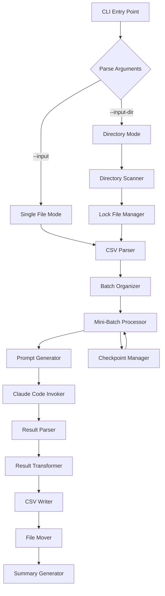

# Design Document: Local AI Scan CLI

## Overview

The Local AI Scan CLI is a Node.js command-line tool that processes pending accessibility scan URLs by invoking Claude Code CLI with Playwright MCP to perform real browser-based WCAG analysis. The tool supports both single-file and directory-based batch processing for cron automation.

## Steering Document Alignment

### Technical Standards (tech.md)
- **Language**: Node.js/TypeScript (consistent with existing codebase)
- **Package Manager**: pnpm (project standard)
- **Testing**: Vitest for unit tests (project standard)
- **Code Style**: ESLint + Prettier with project configuration

### Project Structure (structure.md)
- Tool will be located in `tools/ai-scan-cli/` directory
- Follows kebab-case for file names
- Uses TypeScript with strict mode

## Code Reuse Analysis

### Existing Components to Leverage
- **CSV Parsing**: Reference `apps/api/src/modules/ai-campaign/ai-queue.service.ts` for CSV parsing patterns
- **Issue Structure**: Define own Issue interface matching Prisma schema in `apps/api/prisma/schema.prisma` (Issue model lines 228-256)
- **UUID Generation**: Use `crypto.randomUUID()` (Node.js built-in)

### Integration Points
- **Input**: CSV exported from `/admin/ai/export` endpoint
- **Output**: CSV compatible with `/admin/ai/import` endpoint (same schema as `ai-queue.service.ts`)

## Architecture



## Components and Interfaces

### Component 1: CLI Entry Point (`src/cli.ts`)
- **Purpose**: Parse command-line arguments, validate inputs, orchestrate execution, handle graceful shutdown
- **Interfaces**:
  ```typescript
  interface CliOptions {
    input?: string;
    inputDir?: string;
    output: string;
    log?: string;
    batchSize: number;
    miniBatchSize: number;
    delay: number;
    startBatch: number;
    maxFiles?: number;
    promptTemplate?: string;
    resume: boolean;
    clearCheckpoint: boolean;
    dryRun: boolean;
    checkPrerequisites: boolean;
    verbose: boolean;
    quiet: boolean;
    jsonSummary: boolean;
  }

  interface ShutdownContext {
    checkpointManager: CheckpointManager;
    lockManager: LockManager;
    logger: Logger;
    isShuttingDown: boolean;
  }
  ```
- **Dependencies**: Commander.js for argument parsing
- **Reuses**: Argument parsing patterns from existing CLI tools
- **Implementation Details**:
  - **Graceful shutdown handling**: Register SIGINT/SIGTERM handlers to save state before exit
    ```typescript
    function setupGracefulShutdown(context: ShutdownContext): void {
      const shutdown = async (signal: string) => {
        if (context.isShuttingDown) return;  // Prevent double-shutdown
        context.isShuttingDown = true;

        context.logger.info(`Received ${signal}, shutting down gracefully...`);

        try {
          // Flush any buffered checkpoint data
          await context.checkpointManager.flush();
          context.logger.success('Checkpoint saved successfully');

          // Release lock if held
          await context.lockManager.releaseLock();
          context.logger.debug('Lock released');
        } catch (error) {
          context.logger.error(`Error during shutdown: ${error.message}`);
        }

        process.exit(0);
      };

      process.on('SIGINT', () => shutdown('SIGINT'));
      process.on('SIGTERM', () => shutdown('SIGTERM'));
    }
    ```
  - **Exit code handling**: Return appropriate exit codes based on processing result
    ```typescript
    function determineExitCode(summary: ProcessingSummary): number {
      if (summary.status === 'completed') return ExitCode.SUCCESS;
      if (summary.status === 'partial_failure') return ExitCode.PARTIAL_FAILURE;
      return ExitCode.COMPLETE_FAILURE;
    }
    ```

### Component 2: Prerequisites Checker (`src/prerequisites.ts`)
- **Purpose**: Validate Claude Code CLI and Playwright MCP are available
- **Interfaces**:
  ```typescript
  interface PrerequisiteResult {
    claudeInstalled: boolean;
    claudeVersion?: string;
    playwrightMcpConfigured: boolean;
    mcpServers: string[];
    errors: string[];
  }

  function checkPrerequisites(): Promise<PrerequisiteResult>;
  ```
- **Dependencies**: Child process execution
- **Reuses**: None (new component)
- **Implementation Details**:
  - Check Claude CLI: Execute `claude --version`, parse output for version string (e.g., "claude-code v1.0.0")
  - Check MCP servers: Execute `claude mcp list`, parse JSON output for server names
  - Look for "playwright" in MCP server list to verify Playwright MCP is configured
  - Installation instructions if Claude not found:
    ```
    Claude Code CLI is not installed.
    Install with: npm install -g @anthropic-ai/claude-code
    Then authenticate with: claude auth login
    ```
  - Warning if Playwright MCP not configured:
    ```
    Playwright MCP server is not configured.
    Add it to your Claude Code config: claude mcp add playwright
    ```

### Component 3: CSV Parser (`src/csv-parser.ts`)
- **Purpose**: Read and validate input CSV files
- **Interfaces**:
  ```typescript
  interface PendingScan {
    scanId: string;
    url: string;
    wcagLevel: 'A' | 'AA' | 'AAA';
    email?: string;
    createdAt?: string;
  }

  interface ParseResult {
    scans: PendingScan[];
    skipped: { row: number; reason: string }[];
    totalRows: number;
  }

  function parseInputCsv(filePath: string): Promise<ParseResult>;
  ```
- **Dependencies**: csv-parse library
- **Reuses**: CSV structure from `ai-queue.service.ts` export format

### Component 4: Batch Organizer (`src/batch-organizer.ts`)
- **Purpose**: Split scans into batches and mini-batches
- **Interfaces**:
  ```typescript
  interface Batch {
    batchNumber: number;
    scans: PendingScan[];
    miniBatches: MiniBatch[];
  }

  interface MiniBatch {
    miniBatchNumber: number;
    scans: PendingScan[];
  }

  function organizeBatches(
    scans: PendingScan[],
    batchSize: number,
    miniBatchSize: number
  ): Batch[];
  ```
- **Dependencies**: None
- **Reuses**: None (simple logic)

### Component 4.5: Mini-Batch Processor (`src/mini-batch-processor.ts`)
- **Purpose**: Process mini-batches sequentially with delay, retry logic, and checkpoint coordination
- **Interfaces**:
  ```typescript
  interface MiniBatchProcessorOptions {
    delay: number;              // Delay in seconds between mini-batches (default: 5)
    timeout: number;            // Timeout per mini-batch in ms (default: 180000)
    retries: number;            // Max retries per mini-batch (default: 3)
    verbose: boolean;           // Log prompts when true
    onProgress?: (progress: ProcessingProgress) => void;
  }

  interface ProcessingProgress {
    batchNumber: number;
    miniBatchNumber: number;
    totalMiniBatches: number;
    processedUrls: number;
    totalUrls: number;
    currentUrl?: string;
  }

  interface MiniBatchResult {
    miniBatchNumber: number;
    results: ScanResult[];
    failedScans: FailedScan[];
    durationMs: number;
    retryCount: number;
  }

  interface FailedScan {
    scanId: string;
    url: string;
    errorType: ErrorType;
    errorMessage: string;
  }

  class MiniBatchProcessor {
    constructor(
      promptGenerator: PromptGenerator,
      claudeInvoker: ClaudeCodeInvoker,
      resultParser: ResultParser,
      checkpointManager: CheckpointManager,
      logger: Logger,
      options: MiniBatchProcessorOptions
    );

    async processBatch(batch: Batch): Promise<MiniBatchResult[]>;
    async processMiniBatch(miniBatch: MiniBatch): Promise<MiniBatchResult>;
  }
  ```
- **Dependencies**: All processing components (PromptGenerator, ClaudeInvoker, ResultParser, CheckpointManager, Logger)
- **Reuses**: None (new orchestration component)
- **Implementation Details**:
  - **Delay handling**: After each mini-batch completion, wait `options.delay` seconds before starting next
    ```typescript
    await new Promise(resolve => setTimeout(resolve, options.delay * 1000));
    ```
  - **Verbose mode prompt logging**: When `options.verbose` is true, call `logger.debug()` with the generated prompt before invoking Claude Code
  - **Retry coordination**: Track retry count per mini-batch, apply exponential backoff
  - **Checkpoint integration**: After each successful mini-batch, call `checkpointManager.markProcessed(scanIds)`
  - **Rate limit handling**: When rate limit detected, log wait time and retry count before backing off
    ```typescript
    logger.warning(`Rate limit hit. Waiting ${waitTime}s before retry ${retryCount}/${maxRetries}`);
    ```

### Component 5: Prompt Generator (`src/prompt-generator.ts`)
- **Purpose**: Generate Claude Code prompts for WCAG scanning
- **Interfaces**:
  ```typescript
  interface PromptContext {
    scans: PendingScan[];
    wcagLevel: string;
  }

  interface TemplateValidationResult {
    valid: boolean;
    errors: string[];
    warnings: string[];
  }

  // Required placeholders that must be present in custom templates
  const REQUIRED_PLACEHOLDERS = ['{{#each scans}}', '{{wcagLevel}}', '{{this.url}}', '{{this.scanId}}'];

  function generatePrompt(context: PromptContext, templatePath?: string): string;
  function loadCustomTemplate(templatePath: string): Promise<string>;
  function validateTemplate(templateContent: string): TemplateValidationResult;
  function getDefaultTemplatePath(): string;
  ```
- **Dependencies**: File system for custom templates, Handlebars for template engine
- **Reuses**: None (new component)
- **Implementation Details**:
  - **Template validation**: Before using a custom template, validate it contains required placeholders
    ```typescript
    function validateTemplate(templateContent: string): TemplateValidationResult {
      const errors: string[] = [];
      const warnings: string[] = [];

      // Check required placeholders
      for (const placeholder of REQUIRED_PLACEHOLDERS) {
        if (!templateContent.includes(placeholder)) {
          errors.push(`Missing required placeholder: ${placeholder}`);
        }
      }

      // Try to compile with Handlebars to catch syntax errors
      try {
        Handlebars.compile(templateContent);
      } catch (error) {
        errors.push(`Template syntax error: ${error.message}`);
      }

      return { valid: errors.length === 0, errors, warnings };
    }
    ```
  - **Default template location**: Resolved relative to package installation path
    ```typescript
    function getDefaultTemplatePath(): string {
      return path.join(__dirname, '../templates/default-prompt.hbs');
    }
    ```
  - **Custom template loading**: Read file, validate, throw if invalid
    ```typescript
    async function loadCustomTemplate(templatePath: string): Promise<string> {
      const content = await fs.readFile(templatePath, 'utf-8');
      const validation = validateTemplate(content);
      if (!validation.valid) {
        throw new Error(`Invalid template: ${validation.errors.join(', ')}`);
      }
      return content;
    }
    ```

### Component 6: Claude Code Invoker (`src/claude-invoker.ts`)
- **Purpose**: Execute `claude -p` commands and capture output
- **Interfaces**:
  ```typescript
  enum ErrorType {
    TIMEOUT = 'TIMEOUT',
    RATE_LIMIT = 'RATE_LIMIT',
    PROCESS_CRASH = 'PROCESS_CRASH',
    INVALID_OUTPUT = 'INVALID_OUTPUT',
    UNKNOWN = 'UNKNOWN'
  }

  interface InvocationResult {
    success: boolean;
    output: string;
    error?: string;
    errorType?: ErrorType;
    durationMs: number;
  }

  interface InvokerOptions {
    timeout: number;      // Default: 180000 (3 min)
    retries: number;      // Default: 3
    retryDelay: number;   // Default: 5000
  }

  function invokeClaudeCode(
    prompt: string,
    options: InvokerOptions
  ): Promise<InvocationResult>;
  ```
- **Dependencies**: Child process execution
- **Reuses**: None (new component)
- **Implementation Details**:
  - Command execution: `claude -p "<prompt>" --output-format json`
  - Error type detection:
    - TIMEOUT: Process exceeds timeout limit (child_process timeout)
    - RATE_LIMIT: Output contains "rate limit" or "429" or exit code 429
    - PROCESS_CRASH: Non-zero exit code other than timeout/rate limit
    - INVALID_OUTPUT: Process succeeds but output is not valid JSON
  - Exponential backoff formula:
    - For general retries: `delay = baseDelay * (2 ^ attemptNumber)` (5s, 10s, 20s)
    - For rate limits: `delay = rateLimitBaseDelay * (2 ^ attemptNumber)` (60s, 120s, 240s)
  - Signal handling: Catch SIGTERM/SIGINT to kill child process cleanly

### Component 7: Result Parser (`src/result-parser.ts`)
- **Purpose**: Parse Claude Code JSON output, handle markdown extraction
- **Interfaces**:
  ```typescript
  interface ScanResult {
    scanId: string;
    url: string;
    pageTitle: string;
    issues: Issue[];
    summary: string;
    remediationPlan: string;
    status: 'COMPLETED' | 'FAILED';
    errorMessage?: string;
  }

  // Issue interface defined in src/types.ts - matches Prisma Issue model
  // Note: Issues from Claude Code are NEW issues discovered during AI scan
  // They need new UUIDs since they don't exist in the database yet
  interface Issue {
    id: string;                              // Generated UUID for NEW AI-discovered issues
    ruleId: string;                          // e.g., "color-contrast"
    wcagCriteria: string[];                  // e.g., ["1.4.3"]
    impact: 'CRITICAL' | 'SERIOUS' | 'MODERATE' | 'MINOR';
    description: string;                     // WCAG requirement description
    helpText: string;                        // How to fix guidance
    helpUrl: string;                         // Link to documentation (required, use "" if none)
    htmlSnippet: string;                     // The problematic HTML
    cssSelector: string;                     // CSS path to element
    aiExplanation: string;                   // Plain English explanation
    aiFixSuggestion: string;                 // Code fix with example
    aiPriority: number;                      // 1-10 business impact score
  }

  function parseClaudeOutput(output: string): ScanResult[];
  function extractJsonFromMarkdown(text: string): string | null;
  function normalizeIssue(rawIssue: unknown): Issue;
  ```
- **Dependencies**: None
- **Reuses**: Issue structure modeled after Prisma schema `Issue` model
- **Implementation Details**:
  - JSON extraction regex: `/```(?:json)?\s*([\s\S]*?)```/` to find markdown code blocks
  - If direct JSON.parse fails, try extracting from markdown
  - If extraction fails, try finding array pattern: `/\[\s*\{[\s\S]*\}\s*\]/`
  - **Issue ID generation**: Generate UUID for each AI-discovered issue using `crypto.randomUUID()`
    - These are NEW issues found by AI analysis, not updates to existing axe-core issues
    - The import API creates new Issue records with these UUIDs
  - **helpUrl normalization**: If Claude returns undefined/null helpUrl, set to empty string ""
    ```typescript
    function normalizeIssue(rawIssue: unknown): Issue {
      const issue = rawIssue as Record<string, unknown>;
      return {
        id: crypto.randomUUID(),
        ruleId: String(issue.ruleId || 'unknown'),
        wcagCriteria: Array.isArray(issue.wcagCriteria) ? issue.wcagCriteria : [],
        impact: validateImpact(issue.impact),
        description: String(issue.description || ''),
        helpText: String(issue.helpText || ''),
        helpUrl: String(issue.helpUrl || ''),  // Required field, default to empty string
        htmlSnippet: String(issue.htmlSnippet || ''),
        cssSelector: String(issue.cssSelector || ''),
        aiExplanation: String(issue.aiExplanation || ''),
        aiFixSuggestion: String(issue.aiFixSuggestion || ''),
        aiPriority: Number(issue.aiPriority) || 5,
      };
    }
    ```

### Component 8: Result Transformer (`src/result-transformer.ts`)
- **Purpose**: Transform parsed results to import-compatible format
- **Interfaces**:
  ```typescript
  interface ImportRow {
    scan_id: string;
    url: string;
    page_title: string;
    wcag_level: string;
    ai_summary: string;
    ai_remediation_plan: string;
    ai_model: string;
    total_issues: number;
    critical_count: number;
    serious_count: number;
    moderate_count: number;
    minor_count: number;
    issues_with_ai_json: string;    // JSON string of AI-discovered issues
    status: string;
    error_message: string;
  }

  function transformToImportFormat(results: ScanResult[]): ImportRow[];
  function countIssuesByImpact(issues: Issue[]): ImpactCounts;
  ```
- **Dependencies**: None
- **Reuses**: Import schema from `ai-queue.service.ts`
- **Implementation Details**:
  - **Field mapping**:
    - `scan_id` → preserved from input
    - `summary` → `ai_summary`
    - `remediationPlan` → `ai_remediation_plan`
    - `issues` → `issues_with_ai_json` (JSON.stringify)
  - **ai_model value**: Always set to `"claude-code-playwright"`
  - **Issue counts**: Calculate from issues array by impact level

### Component 9: CSV Writer (`src/csv-writer.ts`)
- **Purpose**: Write results to output CSV with proper escaping
- **Interfaces**:
  ```typescript
  interface WriteOptions {
    append: boolean;
    outputPath: string;
    permissions?: number;  // File permissions (default: 0o644)
  }

  function writeCsv(rows: ImportRow[], options: WriteOptions): Promise<void>;
  function generateOutputPath(inputFile: string, outputDir?: string): string;
  function generateDefaultOutputPath(): string;
  ```
- **Dependencies**: csv-stringify library
- **Reuses**: None
- **Implementation Details**:
  - **Default output path generation**:
    ```typescript
    function generateDefaultOutputPath(): string {
      const timestamp = new Date().toISOString().replace(/[:.]/g, '-').slice(0, 19);
      return `./ai-scan-results-${timestamp}.csv`;
    }

    function generateOutputPath(inputFile: string, outputDir?: string): string {
      if (!outputDir) {
        return generateDefaultOutputPath();
      }
      const inputBasename = path.basename(inputFile, '.csv');
      const timestamp = new Date().toISOString().replace(/[:.]/g, '-').slice(0, 19);
      return path.join(outputDir, `ai-results-${inputBasename}-${timestamp}.csv`);
    }
    ```
  - **File permissions**: Set output file to 644 (readable by others for import)
    ```typescript
    await fs.chmod(outputPath, 0o644);
    ```
  - **Streaming write**: Append results after each batch to prevent data loss
  - **CSV escaping**: Properly escape JSON strings with quotes and special characters

### Component 10: Checkpoint Manager (`src/checkpoint-manager.ts`)
- **Purpose**: Track progress for resume capability
- **Interfaces**:
  ```typescript
  interface Checkpoint {
    inputFile: string;
    processedScanIds: string[];
    lastBatch: number;
    lastMiniBatch: number;
    startedAt: string;
    updatedAt: string;
  }

  function loadCheckpoint(checkpointPath: string): Promise<Checkpoint | null>;
  function saveCheckpoint(checkpoint: Checkpoint, path: string): Promise<void>;
  function clearCheckpoint(path: string): Promise<void>;
  function markProcessed(scanIds: string[]): void;  // Buffer in memory
  function flush(): Promise<void>;  // Write buffered changes to disk
  ```
- **Dependencies**: File system
- **Reuses**: None
- **Implementation Details**:
  - **Atomic writes**: Write to temp file, then rename (prevents corruption on crash)
    ```typescript
    async function saveCheckpoint(checkpoint: Checkpoint, path: string): Promise<void> {
      const tempPath = `${path}.tmp.${process.pid}`;
      checkpoint.updatedAt = new Date().toISOString();

      // Write to temp file
      await fs.writeFile(tempPath, JSON.stringify(checkpoint, null, 2), 'utf-8');

      // Atomic rename (POSIX guarantees atomicity for rename on same filesystem)
      await fs.rename(tempPath, path);
    }
    ```
  - **Resume logic**: Skip scan_ids already in `checkpoint.processedScanIds` array without re-validation
  - **Buffered writes**: Use `markProcessed()` to buffer in memory, `flush()` to write to disk
    - Reduces I/O overhead when processing many mini-batches
    - Flush is called after each batch completion or on SIGINT

### Component 11: Lock File Manager (`src/lock-manager.ts`)
- **Purpose**: Prevent concurrent execution in directory mode
- **Interfaces**:
  ```typescript
  interface LockInfo {
    pid: number;
    startedAt: string;
    hostname?: string;  // Optional: for distributed environments
  }

  function acquireLock(lockPath: string): Promise<boolean>;
  function releaseLock(lockPath: string): Promise<void>;
  function isProcessRunning(pid: number): boolean;
  function isLockStale(lockPath: string, maxAgeMs?: number): Promise<boolean>;
  ```
- **Dependencies**: File system, process utilities
- **Reuses**: None
- **Implementation Details**:
  - **Atomic lock acquisition**: Use exclusive file creation flag to prevent race conditions
    ```typescript
    async function acquireLock(lockPath: string): Promise<boolean> {
      const lockInfo: LockInfo = {
        pid: process.pid,
        startedAt: new Date().toISOString(),
        hostname: os.hostname(),
      };

      try {
        // Use 'wx' flag for exclusive creation - fails if file exists
        await fs.writeFile(lockPath, JSON.stringify(lockInfo, null, 2), { flag: 'wx' });
        return true;
      } catch (error) {
        if (error.code === 'EEXIST') {
          // Lock file exists - check if stale
          const isStale = await isLockStale(lockPath);
          if (isStale) {
            await fs.unlink(lockPath);
            return acquireLock(lockPath);  // Retry after removing stale lock
          }
          return false;  // Lock held by another running process
        }
        throw error;  // Unexpected error
      }
    }
    ```
  - **Stale lock detection**: A lock is stale if the PID doesn't exist OR lock file is >24 hours old
    ```typescript
    async function isLockStale(lockPath: string, maxAgeMs = 24 * 60 * 60 * 1000): Promise<boolean> {
      try {
        const content = await fs.readFile(lockPath, 'utf-8');
        const lockInfo: LockInfo = JSON.parse(content);

        // Check if process is running
        if (!isProcessRunning(lockInfo.pid)) {
          return true;  // Process dead, lock is stale
        }

        // Check lock age
        const lockAge = Date.now() - new Date(lockInfo.startedAt).getTime();
        if (lockAge > maxAgeMs) {
          return true;  // Lock too old, consider stale
        }

        return false;
      } catch {
        return true;  // Cannot read lock file, consider stale
      }
    }
    ```
  - **Cross-platform process detection**:
    ```typescript
    function isProcessRunning(pid: number): boolean {
      try {
        // Sending signal 0 checks if process exists without actually signaling
        process.kill(pid, 0);
        return true;
      } catch (error) {
        return error.code === 'EPERM';  // EPERM means process exists but we lack permission
      }
    }
    ```

### Component 12: Directory Scanner (`src/directory-scanner.ts`)
- **Purpose**: Scan input directory for CSV files
- **Interfaces**:
  ```typescript
  interface ScannerResult {
    files: string[];
    totalFound: number;
  }

  function scanDirectory(dirPath: string, maxFiles?: number): Promise<ScannerResult>;
  function moveFile(source: string, destDir: string): Promise<void>;
  function ensureSubdirectories(baseDir: string): Promise<void>;
  ```
- **Dependencies**: File system
- **Reuses**: None

### Component 13: Logger (`src/logger.ts`)
- **Purpose**: Handle logging with color support and quiet mode
- **Interfaces**:
  ```typescript
  interface LoggerOptions {
    quiet: boolean;
    verbose: boolean;
    logFile?: string;
  }

  class Logger {
    info(message: string): void;
    success(message: string): void;
    warning(message: string): void;
    error(message: string): void;
    debug(message: string): void;
    progress(current: number, total: number, message: string): void;
  }

  function createLogger(options: LoggerOptions): Logger;
  ```
- **Dependencies**: chalk for colors, ora for spinners (optional)
- **Reuses**: None

### Component 14: Summary Generator (`src/summary-generator.ts`)
- **Purpose**: Generate JSON summary for cron mode output
- **Interfaces**:
  ```typescript
  interface ProcessingSummary {
    status: 'completed' | 'partial_failure' | 'complete_failure';
    files_processed: number;
    total_urls: number;
    successful: number;
    failed: number;
    skipped: number;
    duration_seconds: number;
    output_files: string[];
    failed_files: string[];
    errors: string[];
  }

  function generateSummary(
    results: ProcessingContext
  ): ProcessingSummary;

  function printJsonSummary(summary: ProcessingSummary): void;
  ```
- **Dependencies**: None
- **Reuses**: None
- **Implementation Details**:
  - Generate summary at end of processing
  - Print to stdout when `--json-summary` is enabled
  - Status determination:
    - `completed`: all files processed, all URLs successful
    - `partial_failure`: some files processed or some URLs failed
    - `complete_failure`: no files processed or all URLs failed

## Data Models

### Input CSV Schema (from export)
```csv
scan_id,url,email,wcag_level,issues_json,created_at,page_title
"uuid","https://example.com","","AA","[...]","2026-01-03T08:54:01.205Z",""
```

### Output CSV Schema (for import)
```csv
scan_id,url,page_title,wcag_level,ai_summary,ai_remediation_plan,ai_model,total_issues,critical_count,serious_count,moderate_count,minor_count,issues_with_ai_json,status,error_message
"uuid","https://example.com","Example Site","AA","Summary...","Plan...","claude-code-playwright",5,1,2,1,1,"[...]","COMPLETED",""
```

### Checkpoint File Schema
```json
{
  "inputFile": "/path/to/input.csv",
  "processedScanIds": ["uuid1", "uuid2"],
  "lastBatch": 2,
  "lastMiniBatch": 3,
  "startedAt": "2026-01-03T10:00:00.000Z",
  "updatedAt": "2026-01-03T10:15:00.000Z"
}
```

### Lock File Schema
```json
{
  "pid": 12345,
  "startedAt": "2026-01-03T10:00:00.000Z"
}
```

### Exit Codes (`src/types.ts`)
```typescript
export const ExitCode = {
  SUCCESS: 0,             // All processing completed successfully
  PARTIAL_FAILURE: 1,     // Some URLs failed, but processing completed
  COMPLETE_FAILURE: 2,    // Critical error, no processing completed
  LOCK_EXISTS: 3,         // Another instance is already running
  PREREQUISITES_MISSING: 4,  // Claude CLI or Playwright MCP not found
} as const;

export type ExitCodeType = typeof ExitCode[keyof typeof ExitCode];

// Exit code descriptions for logging
export const ExitCodeDescription: Record<number, string> = {
  0: 'All processing completed successfully',
  1: 'Some URLs failed, but processing completed',
  2: 'Critical error, no processing completed',
  3: 'Another instance is already running (lock file exists)',
  4: 'Prerequisites missing (Claude CLI or Playwright MCP not found)',
};
```

## Claude Code Prompt Template

```
You are an accessibility auditor using Playwright MCP to scan web pages for WCAG {{wcagLevel}} compliance.

## Instructions

For each URL below:
1. Use the Playwright MCP browser_navigate tool to load the page
2. Use browser_snapshot to capture the page structure
3. Analyze the page for WCAG {{wcagLevel}} accessibility issues
4. Focus on these common issue categories:
   - Color contrast (WCAG 1.4.3, 1.4.11)
   - Image alt text (WCAG 1.1.1)
   - Link text clarity (WCAG 2.4.4, 4.1.2)
   - Heading structure (WCAG 1.3.1, 2.4.6)
   - Form labels (WCAG 1.3.1, 3.3.2)
   - Keyboard accessibility (WCAG 2.1.1)
   - Focus indicators (WCAG 2.4.7)

## URLs to Scan

{{#each scans}}
{{@index}}. URL: {{this.url}}
   scan_id: {{this.scanId}}
{{/each}}

## Required Output Format

Return a JSON array (no markdown, no code blocks) with one object per URL:

[
  {
    "scan_id": "original-scan-id",
    "url": "https://example.com",
    "page_title": "Page Title from <title> tag",
    "issues": [
      {
        "ruleId": "color-contrast",
        "wcagCriteria": ["1.4.3"],
        "impact": "SERIOUS",
        "description": "Elements must have sufficient color contrast",
        "helpText": "Ensure the contrast ratio between foreground and background colors meets WCAG 2 AA requirements (4.5:1 for normal text, 3:1 for large text)",
        "htmlSnippet": "<p class=\"low-contrast\">Text here</p>",
        "cssSelector": "p.low-contrast",
        "aiExplanation": "This paragraph text is difficult to read because the gray text (#777) on white background has a contrast ratio of only 4.48:1, which fails WCAG AA requirements for normal-sized text.",
        "aiFixSuggestion": "Change the text color to #595959 or darker to achieve a contrast ratio of at least 4.5:1. Example: .low-contrast { color: #595959; }",
        "aiPriority": 7
      }
    ],
    "summary": "This page has 3 accessibility issues: 1 serious color contrast problem, 1 moderate missing alt text, and 1 minor link text issue. The color contrast issue affects readability for users with low vision.",
    "remediationPlan": "1. [HIGH] Fix color contrast on .low-contrast elements\n2. [MEDIUM] Add alt text to logo image\n3. [LOW] Improve link text for 'click here' links"
  }
]

## Impact Levels
- CRITICAL: Blocks access entirely (missing form labels, keyboard traps)
- SERIOUS: Significant barrier (color contrast, missing alt text)
- MODERATE: Causes difficulty (unclear headings, redundant links)
- MINOR: Minor inconvenience (minor contrast issues, verbose alt text)

## Priority Scoring (1-10)
- 9-10: Critical issues blocking core functionality
- 7-8: Serious issues affecting many users
- 5-6: Moderate issues affecting some users
- 3-4: Minor issues with low impact
- 1-2: Very minor cosmetic issues

Return ONLY the JSON array. No explanations, no markdown formatting.
```

## Error Handling

### Error Scenarios

1. **CSV Parsing Error**
   - **Handling**: Log error, mark file as failed, continue to next file
   - **User Impact**: File moved to `failed/` directory with error in log

2. **Claude Code Timeout**
   - **Handling**: Retry up to 3 times with exponential backoff (5s, 10s, 20s)
   - **User Impact**: Mini-batch marked as failed after all retries

3. **Rate Limit Error**
   - **Handling**: Wait with exponential backoff starting at 60s, retry
   - **User Impact**: Processing slows down, logged with wait time

4. **Invalid JSON Output**
   - **Handling**: Try extracting from markdown code blocks, then mark as failed
   - **User Impact**: Scans marked as FAILED in output CSV

5. **URL Unreachable**
   - **Handling**: Claude Code reports error, captured in result
   - **User Impact**: Scan marked as FAILED with URL_UNREACHABLE error

6. **Lock File Exists**
   - **Handling**: Check if PID is running, remove if stale
   - **User Impact**: Clear message about concurrent instance

7. **Disk Full**
   - **Handling**: Catch write errors, log, exit gracefully
   - **User Impact**: Partial results preserved, checkpoint saved

## Testing Strategy

### Unit Testing
- **CSV Parser**: Test with valid/invalid CSVs, edge cases (empty, malformed JSON)
- **Batch Organizer**: Test batch splitting with various sizes
- **Result Parser**: Test JSON parsing, markdown extraction
- **Checkpoint Manager**: Test save/load/resume logic
- **Lock Manager**: Test acquire/release/stale detection

### Integration Testing
- **End-to-end flow**: Process sample CSV through entire pipeline
- **Resume capability**: Start, interrupt, resume with checkpoint
- **Directory mode**: Multiple files, lock file behavior
- **Error recovery**: Simulate Claude Code failures, verify retry logic

### End-to-End Testing
- **Real Claude Code invocation**: Test with actual Playwright MCP
- **Import compatibility**: Verify output CSV works with admin import
- **Cron simulation**: Test quiet mode, JSON summary, exit codes

## File Structure

```
tools/ai-scan-cli/
├── src/
│   ├── cli.ts                    # Entry point with graceful shutdown
│   ├── prerequisites.ts          # Claude CLI checks
│   ├── csv-parser.ts             # CSV reading
│   ├── batch-organizer.ts        # Batch splitting
│   ├── mini-batch-processor.ts   # Mini-batch orchestration with delay/retry
│   ├── prompt-generator.ts       # Prompt template with validation
│   ├── claude-invoker.ts         # Claude Code execution
│   ├── result-parser.ts          # JSON parsing with issue normalization
│   ├── result-transformer.ts     # Format conversion
│   ├── csv-writer.ts             # CSV output with permissions
│   ├── checkpoint-manager.ts     # Resume support with atomic writes
│   ├── lock-manager.ts           # Concurrent execution with atomic locks
│   ├── directory-scanner.ts      # Directory mode
│   ├── logger.ts                 # Logging with color support
│   ├── summary-generator.ts      # JSON summary output
│   └── types.ts                  # Shared types, exit codes
├── templates/
│   └── default-prompt.hbs        # Default prompt template
├── tests/
│   ├── csv-parser.test.ts
│   ├── batch-organizer.test.ts
│   ├── mini-batch-processor.test.ts
│   ├── result-parser.test.ts
│   ├── checkpoint-manager.test.ts
│   ├── lock-manager.test.ts
│   ├── summary-generator.test.ts
│   └── integration.test.ts
├── package.json
├── tsconfig.json
└── README.md
```

## Dependencies

| Package        | Version  | Purpose                      |
|----------------|----------|------------------------------|
| commander      | ^11.0.0  | CLI argument parsing         |
| csv-parse      | ^5.5.0   | CSV reading                  |
| csv-stringify  | ^6.4.0   | CSV writing                  |
| handlebars     | ^4.7.0   | Prompt templating            |
| chalk          | ^5.3.0   | Terminal colors              |
| ora            | ^7.0.0   | Progress spinners (optional) |

### Dev Dependencies

| Package        | Version  | Purpose              |
|----------------|----------|----------------------|
| typescript     | ^5.3.0   | TypeScript compiler  |
| vitest         | ^1.0.0   | Testing framework    |
| @types/node    | ^20.0.0  | Node.js types        |

---

*Last Updated: January 2026*
*Version: 3.0*
