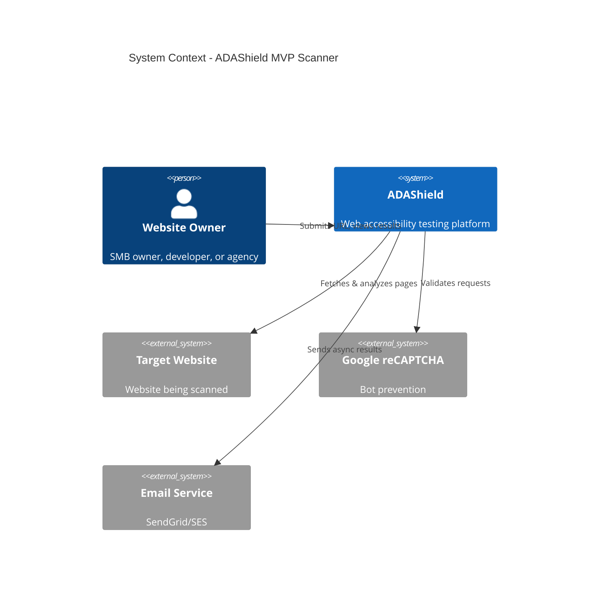
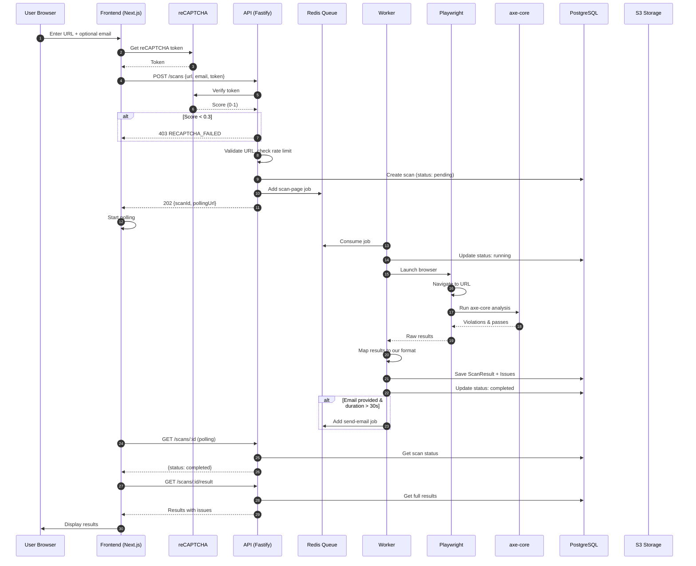
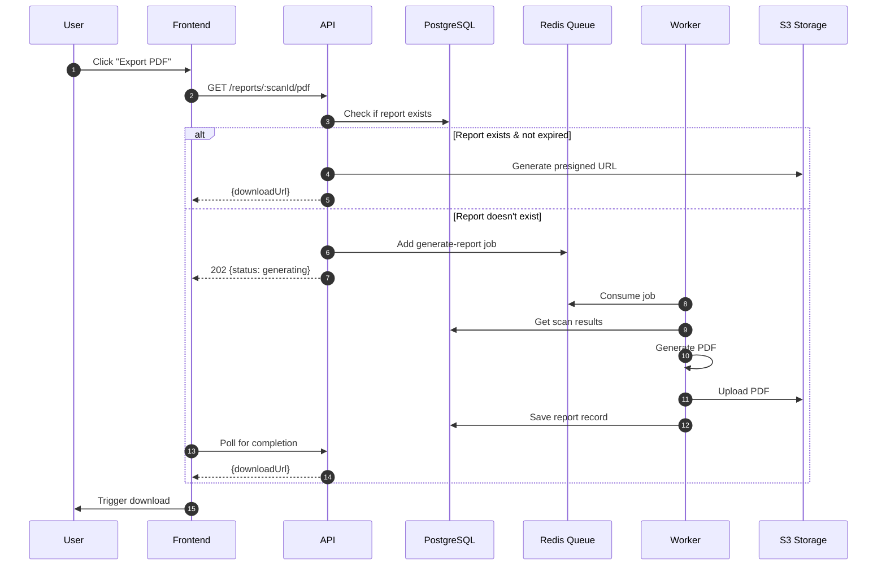
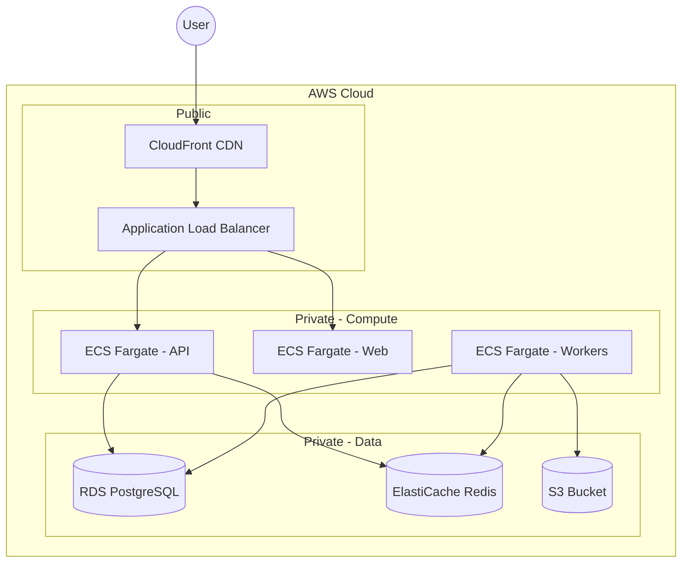

# MVP Scanner - Design Document

## Document Information

| Field | Value |
|-------|-------|
| **Feature Name** | MVP Scanner |
| **Spec ID** | mvp-scanner |
| **Version** | 1.3 |
| **Status** | Draft |
| **Created** | 2024-12-25 |
| **Author** | Claude Code |
| **Requirements Version** | 1.1 |

---

## 1. Architecture Overview

### 1.1 System Context



### 1.2 High-Level Architecture

```
┌─────────────────────────────────────────────────────────────────────────────┐
│                              PRESENTATION LAYER                              │
│  ┌─────────────────────────────────────────────────────────────────────────┐│
│  │                     Next.js 14 Frontend (apps/web)                      ││
│  │  ┌──────────┐  ┌──────────┐  ┌──────────┐  ┌──────────┐                ││
│  │  │  Scan    │  │  Results │  │  History │  │  Export  │                ││
│  │  │  Form    │  │  View    │  │  List    │  │  Report  │                ││
│  │  └──────────┘  └──────────┘  └──────────┘  └──────────┘                ││
│  └─────────────────────────────────────────────────────────────────────────┘│
└─────────────────────────────────────────────────────────────────────────────┘
                                      │ HTTPS
                                      ▼
┌─────────────────────────────────────────────────────────────────────────────┐
│                                API LAYER                                     │
│  ┌─────────────────────────────────────────────────────────────────────────┐│
│  │                    Fastify API Server (apps/api)                        ││
│  │  ┌──────────┐  ┌──────────┐  ┌──────────┐  ┌──────────┐                ││
│  │  │  /scans  │  │ /results │  │ /reports │  │  /health │                ││
│  │  └──────────┘  └──────────┘  └──────────┘  └──────────┘                ││
│  │         │                                                               ││
│  │  ┌──────────────────────────────────────────────────────────┐          ││
│  │  │  Middleware: reCAPTCHA │ Rate Limit │ Validation │ CORS  │          ││
│  │  └──────────────────────────────────────────────────────────┘          ││
│  └─────────────────────────────────────────────────────────────────────────┘│
└─────────────────────────────────────────────────────────────────────────────┘
                                      │
                    ┌─────────────────┼─────────────────┐
                    ▼                 ▼                 ▼
┌──────────────────────┐  ┌──────────────────┐  ┌──────────────────────┐
│     PostgreSQL       │  │      Redis       │  │         S3           │
│   (Scan Results)     │  │  (Queue/Cache)   │  │   (PDF Reports)      │
└──────────────────────┘  └──────────────────┘  └──────────────────────┘
                                      │
                                      ▼
┌─────────────────────────────────────────────────────────────────────────────┐
│                              WORKER LAYER                                    │
│  ┌─────────────────────────────────────────────────────────────────────────┐│
│  │                   BullMQ Workers (apps/worker)                          ││
│  │  ┌──────────────┐  ┌──────────────┐  ┌──────────────┐                  ││
│  │  │  scan-page   │  │ gen-report   │  │ send-email   │                  ││
│  │  │    Job       │  │    Job       │  │    Job       │                  ││
│  │  └──────────────┘  └──────────────┘  └──────────────┘                  ││
│  │         │                                                               ││
│  │  ┌──────────────────────────────────────────────────────────┐          ││
│  │  │  Playwright + Chromium  │  axe-core  │  PDFKit           │          ││
│  │  └──────────────────────────────────────────────────────────┘          ││
│  └─────────────────────────────────────────────────────────────────────────┘│
└─────────────────────────────────────────────────────────────────────────────┘
```

### 1.3 Key Design Decisions

| Decision | Choice | Rationale |
|----------|--------|-----------|
| Queue-based scanning | BullMQ | Scans are long-running (10-60s), prevents request timeouts |
| Guest mode first | Cookie-based sessions | Lower friction, per requirements |
| Rate limiting | Per-URL + fingerprint | Prevents abuse without requiring auth |
| PDF generation | Server-side (PDFKit) | Consistent formatting, no client dependency |

### 1.4 Steering Document Alignment

**Technical Standards (tech.md):**
- **Backend Framework**: Fastify as specified in tech.md
- **Database**: PostgreSQL + Prisma ORM per tech.md
- **Queue System**: BullMQ + Redis as documented
- **Browser Automation**: Playwright + Chromium per tech.md
- **TypeScript**: Strict mode enabled per tech.md standards
- **Testing**: Vitest for unit tests, Playwright for E2E

**Project Structure (structure.md):**
- **Monorepo**: pnpm workspaces with `apps/` and `packages/`
- **Module Pattern**: Feature-based modules (scans, reports, health)
- **Naming Conventions**: kebab-case files, PascalCase components
- **Import Order**: Node built-ins → External packages → Internal packages → Relative

### 1.5 Code Reuse Analysis

This is a **greenfield implementation** with no existing codebase to leverage.

**Future Integration Points:**
| Feature | Target Phase | Integration Point |
|---------|--------------|-------------------|
| User Authentication | Phase 2 | Replace guest sessions with user accounts |
| Billing System | Phase 2 | Gate scan limits by subscription tier |
| Multi-page Scanning | Phase 2 | Extend scan-page worker with crawling |
| AI Fix Suggestions | Phase 3 | Consume scan results, generate AI-powered remediation |
| Team Workspaces | Phase 3 | Add organization/team layer above users |

---

## 2. Component Design

### 2.1 Frontend Components (apps/web)

```
apps/web/src/
├── app/                          # Next.js App Router
│   ├── page.tsx                  # Landing + scan form
│   ├── scan/[id]/page.tsx        # Scan results view
│   ├── history/page.tsx          # Scan history list
│   ├── privacy/page.tsx          # Privacy policy (GDPR)
│   ├── settings/page.tsx         # Session settings, data deletion
│   └── api/                      # API routes (if needed)
│
├── components/
│   ├── features/
│   │   ├── scan/
│   │   │   ├── ScanForm.tsx          # URL input + email + reCAPTCHA
│   │   │   ├── ScanProgress.tsx      # Progress indicator
│   │   │   └── ScanStatus.tsx        # Status polling component
│   │   ├── results/
│   │   │   ├── ResultsSummary.tsx    # Issue count by severity
│   │   │   ├── IssueList.tsx         # Filterable issue list
│   │   │   ├── IssueCard.tsx         # Individual issue details
│   │   │   └── IssueCode.tsx         # Code snippet display
│   │   ├── export/
│   │   │   ├── ExportButton.tsx      # PDF/JSON export trigger
│   │   │   └── ExportOptions.tsx     # Format selection
│   │   ├── history/
│   │   │   ├── HistoryList.tsx       # Past scans list
│   │   │   └── HistoryCard.tsx       # Individual scan summary
│   │   ├── privacy/                  # GDPR compliance components
│   │   │   ├── CookieConsent.tsx     # Cookie consent banner (EU)
│   │   │   ├── EmailConsentCheckbox.tsx  # Email opt-in checkbox
│   │   │   ├── DataDeletionButton.tsx    # GDPR erasure request
│   │   │   └── PrivacyPolicyLink.tsx     # Footer privacy link
│   │   └── compliance/               # Transparency components
│   │       └── CoverageDisclaimer.tsx    # 57% coverage warning
│   │
│   ├── ui/                       # shadcn/ui components
│   └── layouts/
│       └── MainLayout.tsx        # Header, footer, nav
│
├── hooks/
│   ├── useScan.ts                # Scan mutation + polling
│   ├── useScanResult.ts          # Fetch scan results
│   ├── useScanHistory.ts         # Fetch history from session
│   └── useExport.ts              # Trigger export download
│
├── lib/
│   ├── api-client.ts             # Axios/fetch wrapper
│   ├── recaptcha.ts              # reCAPTCHA integration
│   └── session.ts                # Guest session management
│
└── stores/
    └── scanStore.ts              # Zustand store for scan state
```

### 2.2 API Components (apps/api)

```
apps/api/src/
├── index.ts                      # Fastify server entry
├── config/
│   ├── env.ts                    # Environment variables
│   ├── database.ts               # Prisma client config
│   └── redis.ts                  # Redis connection
│
├── modules/
│   ├── scans/
│   │   ├── scan.controller.ts    # POST /scans, GET /scans/:id
│   │   ├── scan.service.ts       # Business logic
│   │   ├── scan.repository.ts    # Database operations
│   │   ├── scan.schema.ts        # Zod validation
│   │   ├── scan.types.ts         # TypeScript types
│   │   └── index.ts              # Module exports
│   │
│   ├── results/
│   │   ├── result.controller.ts  # GET /results/:scanId
│   │   ├── result.service.ts     # Result formatting
│   │   └── index.ts
│   │
│   ├── reports/
│   │   ├── report.controller.ts  # GET /reports/:scanId/:format
│   │   ├── report.service.ts     # PDF/JSON generation
│   │   └── index.ts
│   │
│   └── health/
│       └── health.controller.ts  # GET /health
│
├── shared/
│   ├── database/
│   │   └── prisma.ts             # Prisma client singleton
│   ├── queue/
│   │   ├── queue.service.ts      # BullMQ producer
│   │   └── queues.ts             # Queue definitions
│   ├── middleware/
│   │   ├── recaptcha.ts          # reCAPTCHA validation
│   │   ├── rate-limit.ts         # Per-URL rate limiting
│   │   ├── session.ts            # Guest session handling
│   │   └── error-handler.ts      # Global error handling
│   └── utils/
│       ├── url-validator.ts      # URL validation + SSRF prevention
│       └── fingerprint.ts        # Browser fingerprint extraction
│
└── plugins/
    ├── cors.ts                   # CORS configuration
    ├── helmet.ts                 # Security headers
    └── swagger.ts                # OpenAPI documentation
```

### 2.3 Worker Components (apps/worker)

```
apps/worker/src/
├── index.ts                      # Worker entry point
├── jobs/
│   ├── scan-page.job.ts          # Main scanning job
│   ├── generate-report.job.ts    # PDF generation job
│   └── send-email.job.ts         # Email notification job
│
├── processors/
│   ├── scanner/
│   │   ├── page-scanner.ts       # Playwright + axe-core
│   │   ├── axe-runner.ts         # axe-core execution
│   │   └── result-mapper.ts      # Map axe results to our format
│   ├── reporter/
│   │   ├── pdf-generator.ts      # PDFKit report generation
│   │   └── json-exporter.ts      # JSON formatting
│   └── notifier/
│       └── email-sender.ts       # SendGrid/SES integration
│
└── utils/
    ├── browser-pool.ts           # Playwright browser management
    └── retry-handler.ts          # Job retry logic
```

### 2.4 Shared Package (packages/core)

```
packages/core/src/
├── scanner/
│   ├── axe-wrapper.ts            # axe-core abstraction
│   ├── scan-options.ts           # Scan configuration
│   └── index.ts
│
├── types/
│   ├── scan.types.ts             # Scan-related types
│   ├── issue.types.ts            # Issue/violation types
│   ├── report.types.ts           # Report types
│   └── index.ts
│
├── constants/
│   ├── wcag.constants.ts         # WCAG criteria mappings
│   ├── severity.constants.ts     # Severity levels
│   ├── fix-guides.constants.ts   # Fix recommendations by rule
│   └── index.ts
│
└── utils/
    ├── wcag-mapper.ts            # Map axe rules to WCAG
    ├── severity-mapper.ts        # Map axe impact to severity
    └── fix-guide-mapper.ts       # Map axe rules to fix recommendations
```

### 2.5 Fix Recommendation System

Fix recommendations are generated from axe-core's built-in help text, enhanced with our curated fix guides.

```typescript
// packages/core/src/constants/fix-guides.constants.ts

export const FIX_GUIDES: Record<string, FixGuide> = {
    'color-contrast': {
        summary: 'Ensure text has sufficient color contrast',
        codeExample: `/* Before: Low contrast */
.text { color: #777; background: #fff; }

/* After: WCAG AA compliant (4.5:1 ratio) */
.text { color: #595959; background: #fff; }`,
        steps: [
            'Check current contrast ratio using a tool like WebAIM Contrast Checker',
            'Adjust foreground or background color to achieve 4.5:1 ratio for normal text',
            'For large text (18pt+), minimum ratio is 3:1',
        ],
        wcagLink: 'https://www.w3.org/WAI/WCAG21/Understanding/contrast-minimum.html',
    },
    'image-alt': {
        summary: 'Add descriptive alt text to images',
        codeExample: `<!-- Before: Missing alt -->


<!-- After: Descriptive alt text -->
`,
        steps: [
            'Identify the purpose of the image (informative, decorative, functional)',
            'Write alt text that conveys the same information the image provides',
            'Keep alt text concise (under 125 characters when possible)',
            'For decorative images, use alt="" (empty alt attribute)',
        ],
        wcagLink: 'https://www.w3.org/WAI/WCAG21/Understanding/non-text-content.html',
    },
    // ... additional rules
};

interface FixGuide {
    summary: string;
    codeExample: string;
    steps: string[];
    wcagLink: string;
}
```

### 2.6 Progress Tracking Design

Scan progress is tracked via Redis and updated at key milestones during execution.

```typescript
// Progress stages and their weights
const PROGRESS_STAGES = {
    QUEUED: 0,
    BROWSER_LAUNCHING: 10,
    PAGE_LOADING: 25,
    PAGE_LOADED: 40,
    AXE_RUNNING: 60,
    AXE_COMPLETE: 80,
    SAVING_RESULTS: 90,
    COMPLETED: 100,
};

// Worker updates progress at each stage
async function updateScanProgress(
    scanId: string,
    stage: keyof typeof PROGRESS_STAGES,
    estimatedSecondsRemaining?: number
): Promise<void> {
    await redis.hset(`scan_status:${scanId}`, {
        status: stage === 'COMPLETED' ? 'completed' : 'running',
        progress: PROGRESS_STAGES[stage],
        estimatedTime: estimatedSecondsRemaining ?? null,
        updatedAt: new Date().toISOString(),
    });
    await redis.expire(`scan_status:${scanId}`, 3600); // 1 hour TTL
}

// API polls Redis for status
async function getScanProgress(scanId: string): Promise<ScanProgress> {
    const cached = await redis.hgetall(`scan_status:${scanId}`);
    if (cached) {
        return {
            status: cached.status,
            progress: parseInt(cached.progress, 10),
            estimatedTime: cached.estimatedTime ? parseInt(cached.estimatedTime, 10) : null,
        };
    }
    // Fallback to database
    const scan = await prisma.scan.findUnique({ where: { id: scanId } });
    return { status: scan?.status ?? 'unknown', progress: null, estimatedTime: null };
}
```

**Progress Flow:**
```
[0%] QUEUED → [10%] BROWSER_LAUNCHING → [25%] PAGE_LOADING
→ [40%] PAGE_LOADED → [60%] AXE_RUNNING → [80%] AXE_COMPLETE
→ [90%] SAVING_RESULTS → [100%] COMPLETED
```

---

## 3. Database Design

### 3.1 Entity Relationship Diagram

```mermaid
erDiagram
    GUEST_SESSION ||--o{ SCAN : has
    USER ||--o{ SCAN : owns
    SCAN ||--|| SCAN_RESULT : produces
    SCAN_RESULT ||--o{ ISSUE : contains
    SCAN ||--o{ REPORT : generates

    GUEST_SESSION {
        uuid id PK
        string fingerprint
        string session_token
        timestamp created_at
        timestamp expires_at
    }

    USER {
        uuid id PK
        string email UK
        string password_hash
        string name
        enum tier "free|starter|pro|enterprise"
        timestamp created_at
        timestamp updated_at
    }

    SCAN {
        uuid id PK
        uuid guest_session_id FK "nullable"
        uuid user_id FK "nullable"
        string url
        string email "nullable - for async notification"
        enum status "pending|running|completed|failed"
        enum wcag_level "A|AA|AAA"
        int duration_ms
        timestamp created_at
        timestamp completed_at
    }

    SCAN_RESULT {
        uuid id PK
        uuid scan_id FK UK
        int total_issues
        int critical_count
        int serious_count
        int moderate_count
        int minor_count
        int passes_count
        jsonb metadata "browser, viewport, etc"
        timestamp created_at
    }

    ISSUE {
        uuid id PK
        uuid scan_result_id FK
        string rule_id "axe rule ID"
        string wcag_criteria "1.4.3, 2.4.4, etc"
        enum impact "critical|serious|moderate|minor"
        string description
        string help_text
        string help_url
        string html_snippet
        string css_selector
        jsonb nodes "affected elements array"
        timestamp created_at
    }

    REPORT {
        uuid id PK
        uuid scan_id FK
        enum format "pdf|json"
        string storage_key "S3 key"
        string storage_url "presigned URL"
        int file_size_bytes
        timestamp created_at
        timestamp expires_at
    }
```

### 3.2 Prisma Schema

```prisma
// prisma/schema.prisma

generator client {
    provider = "prisma-client-js"
}

datasource db {
    provider = "postgresql"
    url      = env("DATABASE_URL")
}

model GuestSession {
    id           String   @id @default(uuid()) @db.Uuid
    fingerprint  String
    sessionToken String   @unique @map("session_token")
    createdAt    DateTime @default(now()) @map("created_at")
    expiresAt    DateTime @map("expires_at")
    scans        Scan[]

    @@index([fingerprint])
    @@index([expiresAt])
    @@map("guest_sessions")
}

model User {
    id           String   @id @default(uuid()) @db.Uuid
    email        String   @unique
    passwordHash String?  @map("password_hash")
    name         String?
    tier         UserTier @default(FREE)
    createdAt    DateTime @default(now()) @map("created_at")
    updatedAt    DateTime @updatedAt @map("updated_at")
    scans        Scan[]

    @@map("users")
}

enum UserTier {
    FREE
    STARTER
    PRO
    ENTERPRISE
}

model Scan {
    id             String        @id @default(uuid()) @db.Uuid
    guestSessionId String?       @map("guest_session_id") @db.Uuid
    userId         String?       @map("user_id") @db.Uuid
    url            String
    email          String?
    status         ScanStatus    @default(PENDING)
    wcagLevel      WcagLevel     @default(AA) @map("wcag_level")
    durationMs     Int?          @map("duration_ms")
    errorMessage   String?       @map("error_message")
    createdAt      DateTime      @default(now()) @map("created_at")
    completedAt    DateTime?     @map("completed_at")

    guestSession   GuestSession? @relation(fields: [guestSessionId], references: [id])
    user           User?         @relation(fields: [userId], references: [id])
    result         ScanResult?
    reports        Report[]

    @@index([guestSessionId])
    @@index([userId])
    @@index([url])
    @@index([status])
    @@index([createdAt])
    @@map("scans")
}

enum ScanStatus {
    PENDING
    RUNNING
    COMPLETED
    FAILED
}

enum WcagLevel {
    A
    AA
    AAA
}

model ScanResult {
    id            String   @id @default(uuid()) @db.Uuid
    scanId        String   @unique @map("scan_id") @db.Uuid
    totalIssues   Int      @map("total_issues")
    criticalCount Int      @map("critical_count")
    seriousCount  Int      @map("serious_count")
    moderateCount Int      @map("moderate_count")
    minorCount    Int      @map("minor_count")
    passesCount   Int      @map("passes_count")
    metadata      Json?
    createdAt     DateTime @default(now()) @map("created_at")

    scan   Scan    @relation(fields: [scanId], references: [id], onDelete: Cascade)
    issues Issue[]

    @@map("scan_results")
}

model Issue {
    id           String      @id @default(uuid()) @db.Uuid
    scanResultId String      @map("scan_result_id") @db.Uuid
    ruleId       String      @map("rule_id")
    wcagCriteria String?     @map("wcag_criteria")
    impact       IssueImpact
    description  String
    helpText     String      @map("help_text")
    helpUrl      String?     @map("help_url")
    htmlSnippet  String?     @map("html_snippet")
    cssSelector  String?     @map("css_selector")
    nodes        Json?
    createdAt    DateTime    @default(now()) @map("created_at")

    scanResult ScanResult @relation(fields: [scanResultId], references: [id], onDelete: Cascade)

    @@index([scanResultId])
    @@index([impact])
    @@index([ruleId])
    @@map("issues")
}

enum IssueImpact {
    CRITICAL
    SERIOUS
    MODERATE
    MINOR
}

model Report {
    id           String       @id @default(uuid()) @db.Uuid
    scanId       String       @map("scan_id") @db.Uuid
    format       ReportFormat
    storageKey   String       @map("storage_key")
    storageUrl   String?      @map("storage_url")
    fileSizeBytes Int?        @map("file_size_bytes")
    createdAt    DateTime     @default(now()) @map("created_at")
    expiresAt    DateTime?    @map("expires_at")

    scan Scan @relation(fields: [scanId], references: [id], onDelete: Cascade)

    @@index([scanId])
    @@map("reports")
}

enum ReportFormat {
    PDF
    JSON
}
```

### 3.3 Redis Data Structures

```typescript
// Rate Limiting
// Key: rate_limit:{url_hash}:{fingerprint}
// Type: String (counter)
// TTL: 1 hour
// Value: scan count

// Session Storage
// Key: session:{session_token}
// Type: Hash
// TTL: 24 hours
// Fields: { fingerprint, created_at, scan_ids[] }

// Scan Status Cache
// Key: scan_status:{scan_id}
// Type: Hash
// TTL: 1 hour
// Fields: { status, progress, estimated_time }
```

---

## 4. API Design

### 4.1 API Endpoints

| Method | Endpoint | Description | Auth |
|--------|----------|-------------|------|
| POST | `/api/v1/scans` | Create new scan | reCAPTCHA |
| GET | `/api/v1/scans/:id` | Get scan status | Session |
| GET | `/api/v1/scans/:id/result` | Get scan results | Session |
| GET | `/api/v1/scans` | List user's scans (history) | Session |
| GET | `/api/v1/reports/:scanId/:format` | Download report | Session |
| DELETE | `/api/v1/sessions/:token` | Anonymize session data (GDPR) | Session |
| GET | `/api/v1/health` | Health check | None |

### 4.2 Request/Response Schemas

#### POST /api/v1/scans

**Request:**
```typescript
interface CreateScanRequest {
    url: string;                    // Required: URL to scan
    email?: string;                 // Optional: for async notification
    wcagLevel?: 'A' | 'AA' | 'AAA'; // Default: 'AA'
    recaptchaToken: string;         // Required: reCAPTCHA v3 token
}
```

**Response (202 Accepted):**
```typescript
interface CreateScanResponse {
    data: {
        id: string;                 // Scan UUID
        url: string;
        status: 'pending';
        wcagLevel: string;
        createdAt: string;          // ISO timestamp
        estimatedDuration: number;  // Seconds
    };
    meta: {
        pollingUrl: string;         // URL to check status
        pollingInterval: number;    // Recommended interval (ms)
    };
}
```

#### GET /api/v1/scans/:id

**Response (200 OK):**
```typescript
interface ScanStatusResponse {
    data: {
        id: string;
        url: string;
        status: 'pending' | 'running' | 'completed' | 'failed';
        progress?: number;          // 0-100 when running
        wcagLevel: string;
        durationMs?: number;        // When completed
        errorMessage?: string;      // When failed
        createdAt: string;
        completedAt?: string;
    };
}
```

#### GET /api/v1/scans/:id/result

**Response (200 OK):**
```typescript
interface ScanResultResponse {
    data: {
        scanId: string;
        url: string;
        summary: {
            totalIssues: number;
            bySeverity: {
                critical: number;
                serious: number;
                moderate: number;
                minor: number;
            };
            passesCount: number;
        };
        issues: Array<{
            id: string;
            ruleId: string;
            wcagCriteria: string | null;
            impact: 'critical' | 'serious' | 'moderate' | 'minor';
            description: string;
            helpText: string;
            helpUrl: string | null;
            element: {
                htmlSnippet: string;
                cssSelector: string;
            };
            instanceCount: number;
        }>;
        metadata: {
            scannedAt: string;
            durationMs: number;
            wcagLevel: string;
            axeCoreVersion: string;
            browserInfo: string;
        };
    };
    meta: {
        coverageNote: string;       // "Automated testing detects ~57% of issues"
        exportUrls: {
            pdf: string;
            json: string;
        };
    };
}
```

#### GET /api/v1/scans (Scan History)

**Request (Query Parameters):**
```typescript
interface ListScansRequest {
    page?: number;              // Default: 1
    limit?: number;             // Default: 10, max: 50
    status?: 'pending' | 'running' | 'completed' | 'failed';
    sortBy?: 'createdAt' | 'url' | 'totalIssues';
    sortOrder?: 'asc' | 'desc'; // Default: 'desc'
}
```

**Response (200 OK):**
```typescript
interface ListScansResponse {
    data: Array<{
        id: string;
        url: string;
        status: 'pending' | 'running' | 'completed' | 'failed';
        wcagLevel: string;
        summary?: {              // Only for completed scans
            totalIssues: number;
            criticalCount: number;
            seriousCount: number;
        };
        createdAt: string;
        completedAt?: string;
    }>;
    meta: {
        page: number;
        limit: number;
        totalCount: number;
        totalPages: number;
    };
}
```

#### DELETE /api/v1/sessions/:token (GDPR Data Anonymization)

**Response (200 OK):**
```typescript
interface AnonymizeSessionResponse {
    data: {
        message: string;        // "Session anonymized successfully"
        anonymizedAt: string;   // ISO timestamp when anonymization occurred
        scansPreserved: number; // Count of scans preserved for analytics
        reportsDeleted: number; // Count of reports deleted from S3
    };
}
```

### 4.3 Error Responses

```typescript
interface ErrorResponse {
    error: {
        code: string;               // Machine-readable code
        message: string;            // Human-readable message
        details?: Record<string, unknown>;
    };
    meta?: {
        requestId: string;
    };
}

// Error codes
const ERROR_CODES = {
    VALIDATION_ERROR: 400,
    INVALID_URL: 400,
    RECAPTCHA_FAILED: 403,
    RATE_LIMIT_EXCEEDED: 429,
    SCAN_NOT_FOUND: 404,
    SCAN_FAILED: 500,
    URL_UNREACHABLE: 502,
};
```

---

## 5. Sequence Diagrams

### 5.1 Scan Flow



### 5.2 Report Export Flow



---

## 6. Security Design

### 6.1 Input Validation & SSRF Prevention

```typescript
// URL Validation (SSRF Prevention with DNS Rebinding Protection)
import { isIP } from 'net';
import dns from 'dns/promises';

async function validateUrl(url: string): Promise<{ valid: boolean; error?: string }> {
    // Step 1: Parse and validate URL format
    let parsed: URL;
    try {
        parsed = new URL(url);
    } catch {
        return { valid: false, error: 'Invalid URL format' };
    }

    // Step 2: Protocol check
    if (!['http:', 'https:'].includes(parsed.protocol)) {
        return { valid: false, error: 'Only HTTP/HTTPS protocols are supported' };
    }

    // Step 3: Hostname pattern check (before DNS resolution)
    const blockedPatterns = [
        /^localhost$/i,
        /\.local$/i,
        /\.internal$/i,
        /\.localhost$/i,
    ];
    if (blockedPatterns.some(p => p.test(parsed.hostname))) {
        return { valid: false, error: 'Internal URLs are not allowed' };
    }

    // Step 4: DNS Resolution (prevents DNS rebinding attacks)
    const resolvedIPs = await dns.resolve4(parsed.hostname).catch(() => []);
    if (resolvedIPs.length === 0) {
        return { valid: false, error: 'Could not resolve hostname' };
    }

    // Step 5: Check resolved IPs against blocklist
    const isPrivateIP = (ip: string): boolean => {
        const parts = ip.split('.').map(Number);
        return (
            parts[0] === 127 ||                           // Loopback
            parts[0] === 10 ||                            // Class A private
            (parts[0] === 172 && parts[1] >= 16 && parts[1] <= 31) || // Class B private
            (parts[0] === 192 && parts[1] === 168) ||     // Class C private
            parts[0] === 0 ||                             // Current network
            (parts[0] === 169 && parts[1] === 254)        // Link-local
        );
    };

    if (resolvedIPs.some(isPrivateIP)) {
        return { valid: false, error: 'URL resolves to private IP address' };
    }

    return { valid: true };
}
```

### 6.2 Redirect Validation in Playwright

```typescript
// Prevent redirects to internal IPs during scan
async function scanPageWithRedirectProtection(url: string): Promise<ScanResult> {
    const browser = await browserPool.acquire();
    const context = await browser.newContext();
    const page = await context.newPage();

    // Track all redirects
    const visitedUrls: string[] = [];

    page.on('response', async (response) => {
        const responseUrl = response.url();
        visitedUrls.push(responseUrl);

        // Validate each redirect destination
        const validation = await validateUrl(responseUrl);
        if (!validation.valid) {
            await page.close();
            throw new SecurityError(`Redirect to blocked URL: ${responseUrl}`);
        }
    });

    try {
        await page.goto(url, {
            waitUntil: 'networkidle',
            timeout: 60000,  // 60s max per FR-006
        });

        // Run axe-core analysis
        const results = await runAxeAnalysis(page);
        return results;
    } finally {
        await context.close();
        browserPool.release(browser);
    }
}
```

### 6.3 HTML Snippet Sanitization

```typescript
import DOMPurify from 'isomorphic-dompurify';

// Sanitize HTML snippets before storage to prevent XSS
function sanitizeHtmlSnippet(html: string): string {
    // Remove potentially dangerous content
    const sanitized = DOMPurify.sanitize(html, {
        ALLOWED_TAGS: [
            'div', 'span', 'p', 'a', 'img', 'button', 'input', 'label',
            'h1', 'h2', 'h3', 'h4', 'h5', 'h6', 'ul', 'ol', 'li',
            'table', 'tr', 'td', 'th', 'thead', 'tbody', 'form',
            'nav', 'header', 'footer', 'main', 'article', 'section',
        ],
        ALLOWED_ATTR: [
            'class', 'id', 'href', 'src', 'alt', 'title', 'type',
            'name', 'value', 'placeholder', 'aria-*', 'role', 'tabindex',
        ],
        FORBID_TAGS: ['script', 'style', 'iframe', 'object', 'embed'],
        FORBID_ATTR: ['onclick', 'onerror', 'onload', 'onmouseover'],
    });

    // Truncate to reasonable length
    const MAX_SNIPPET_LENGTH = 500;
    return sanitized.length > MAX_SNIPPET_LENGTH
        ? sanitized.substring(0, MAX_SNIPPET_LENGTH) + '...'
        : sanitized;
}
```

### 6.4 Session Cookie Security

```typescript
// Secure session cookie configuration
const sessionCookieOptions = {
    httpOnly: true,          // Not accessible via JavaScript
    secure: process.env.NODE_ENV === 'production', // HTTPS only in prod
    sameSite: 'lax' as const, // CSRF protection
    maxAge: 24 * 60 * 60 * 1000, // 24 hours
    path: '/',
    domain: process.env.COOKIE_DOMAIN,
};

// Generate secure session token
function generateSessionToken(): string {
    return crypto.randomBytes(32).toString('base64url');
}
```

### 6.5 Rate Limiting Strategy

```typescript
// Per-URL rate limiting
const rateLimitConfig = {
    guest: {
        maxRequests: 10,
        windowMs: 60 * 60 * 1000,  // 1 hour
        keyGenerator: (req) => {
            const urlHash = hash(normalizeUrl(req.body.url));
            const fingerprint = req.fingerprint || req.ip;
            return `rate_limit:${urlHash}:${fingerprint}`;
        },
    },
    authenticated: {
        maxRequests: 100,          // Based on tier
        windowMs: 60 * 60 * 1000,
        keyGenerator: (req) => `rate_limit:user:${req.userId}`,
    },
};
```

### 6.6 reCAPTCHA Integration

```typescript
// Middleware
async function validateRecaptcha(req, reply) {
    const { recaptchaToken } = req.body;

    const response = await fetch(
        'https://www.google.com/recaptcha/api/siteverify',
        {
            method: 'POST',
            body: new URLSearchParams({
                secret: process.env.RECAPTCHA_SECRET_KEY,
                response: recaptchaToken,
                remoteip: req.ip,
            }),
        }
    );

    const data = await response.json();

    if (!data.success || data.score < 0.3) {
        throw new ForbiddenError('RECAPTCHA_FAILED', 'Bot detected');
    }

    req.recaptchaScore = data.score;
}
```

---

## 7. Performance Considerations

### 7.1 Optimization Strategies

| Area | Strategy | Target |
|------|----------|--------|
| **Scan Speed** | Playwright browser pool, reuse contexts | < 30s p95 |
| **API Response** | Redis caching for status polling | < 200ms |
| **PDF Generation** | Pre-generate on completion, cache in S3 | < 10s |
| **Database** | Indexes on frequently queried columns | < 50ms queries |
| **Frontend** | SSR for initial load, client polling for updates | < 2s FCP |

### 7.2 Browser Pool Configuration

```typescript
// Playwright browser pool for workers
const browserPoolConfig = {
    maxBrowsers: 10,           // Max concurrent browsers
    maxPagesPerBrowser: 5,     // Pages per browser before restart
    browserTimeout: 60000,     // 60s max per page
    launchOptions: {
        headless: true,
        args: [
            '--disable-gpu',
            '--disable-dev-shm-usage',
            '--disable-setuid-sandbox',
            '--no-sandbox',
        ],
    },
};
```

### 7.3 Caching Strategy

```typescript
// Redis cache keys
const CACHE_KEYS = {
    // Scan status (short TTL for polling)
    scanStatus: (id: string) => `cache:scan:${id}:status`,
    scanStatusTTL: 30,  // 30 seconds

    // Full results (longer TTL after completion)
    scanResult: (id: string) => `cache:scan:${id}:result`,
    scanResultTTL: 3600,  // 1 hour

    // Report URL (presigned, expires with URL)
    reportUrl: (scanId: string, format: string) =>
        `cache:report:${scanId}:${format}`,
    reportUrlTTL: 3600,  // 1 hour
};
```

---

## 8. Error Handling

### 8.1 Error Categories

| Category | HTTP Status | Handling |
|----------|-------------|----------|
| Validation errors | 400 | Return field-level errors |
| Auth/reCAPTCHA | 403 | Clear message, no retry |
| Rate limiting | 429 | Include retry-after header |
| URL unreachable | 502 | Suggest checking URL |
| Scan timeout | 504 | Suggest simpler page |
| Internal errors | 500 | Log, return generic message |

### 8.2 Job Retry Strategy

```typescript
const jobRetryConfig = {
    'scan-page': {
        attempts: 3,
        backoff: {
            type: 'exponential',
            delay: 5000,  // 5s, 10s, 20s
        },
        removeOnComplete: true,
        removeOnFail: false,  // Keep for debugging
    },
    'generate-report': {
        attempts: 2,
        backoff: { type: 'fixed', delay: 3000 },
    },
    'send-email': {
        attempts: 5,
        backoff: { type: 'exponential', delay: 10000 },
    },
};
```

---

## 9. Monitoring & Observability

### 9.1 Key Metrics

| Metric | Type | Alert Threshold |
|--------|------|-----------------|
| `scan.duration_ms` | Histogram | p95 > 30000 |
| `scan.success_rate` | Gauge | < 95% |
| `queue.depth` | Gauge | > 100 |
| `queue.processing_time` | Histogram | p95 > 60000 |
| `api.response_time` | Histogram | p95 > 200 |
| `error.rate` | Counter | > 1% |

### 9.2 Structured Logging

```typescript
// Log format
interface LogEntry {
    timestamp: string;
    level: 'debug' | 'info' | 'warn' | 'error';
    message: string;
    context: {
        requestId?: string;
        scanId?: string;
        userId?: string;
        url?: string;
        duration?: number;
    };
    error?: {
        name: string;
        message: string;
        stack: string;
    };
}
```

---

## 10. GDPR Compliance Design

### 10.1 Data Handling Strategy

**Approach**: Anonymization/Pseudonymization instead of hard deletion to preserve analytics data.

| Data Type | Storage | Retention | GDPR Action |
|-----------|---------|-----------|-------------|
| Guest sessions | PostgreSQL | Indefinite (anonymized) | Anonymize PII, keep structure |
| Scan results | PostgreSQL | Indefinite | Keep intact for analytics |
| Issues | PostgreSQL | Indefinite | Keep intact for analytics |
| Email addresses | PostgreSQL | Until scan complete | Nullify after email sent |
| Browser fingerprints | Redis only | 1 hour | Auto-expire (never persisted) |
| PDF reports | S3 | 90 days | Auto-delete via lifecycle |
| IP addresses | Not stored | N/A | Never persisted |

### 10.2 Database Schema Updates for Anonymization

```prisma
// Add to GuestSession model
model GuestSession {
    id           String    @id @default(uuid()) @db.Uuid
    fingerprint  String                          // Anonymized: "ANON_FP_xxxxx"
    sessionToken String    @unique @map("session_token")
    email        String?                         // Anonymized: null
    createdAt    DateTime  @default(now()) @map("created_at")
    expiresAt    DateTime  @map("expires_at")
    anonymizedAt DateTime? @map("anonymized_at") // Set when anonymized
    scans        Scan[]

    @@index([fingerprint])
    @@index([expiresAt])
    @@index([anonymizedAt])
    @@map("guest_sessions")
}

// Add to Scan model
model Scan {
    // ... existing fields ...
    email        String?                         // Anonymized: null
    anonymizedAt DateTime? @map("anonymized_at") // Set when anonymized
    // ... rest of model
}
```

### 10.3 Anonymization Constants

```typescript
// packages/core/src/constants/gdpr.constants.ts

export const ANONYMIZATION = {
    // Prefix for anonymized fingerprints
    FINGERPRINT_PREFIX: 'ANON_FP_',

    // Generate anonymized fingerprint (preserves uniqueness for analytics)
    generateAnonFingerprint: (originalId: string): string => {
        const hash = crypto.createHash('sha256')
            .update(originalId + process.env.ANON_SALT)
            .digest('hex')
            .substring(0, 12);
        return `ANON_FP_${hash}`;
    },

    // Placeholder values
    EMAIL_PLACEHOLDER: null,  // Emails are nullified, not replaced

    // Fields that are anonymized vs deleted
    ANONYMIZED_FIELDS: ['fingerprint', 'sessionToken', 'email'],
    PRESERVED_FIELDS: ['scans', 'scanResults', 'issues', 'reports'],
};
```

### 10.4 Privacy Features

```typescript
// Email handling - same as before, nullify after sending
async function handleScanEmail(scan: Scan): Promise<void> {
    if (scan.email) {
        // Send result email
        await sendResultEmail(scan);

        // Nullify email immediately after sending
        await prisma.scan.update({
            where: { id: scan.id },
            data: { email: null },
        });
    }
}

// Data anonymization endpoint (GDPR right to erasure via pseudonymization)
// DELETE /api/v1/sessions/:token
async function anonymizeSession(sessionToken: string): Promise<AnonymizeResult> {
    const session = await prisma.guestSession.findUnique({
        where: { sessionToken },
        include: {
            scans: {
                include: { result: true, reports: true },
            },
        },
    });

    if (!session) {
        throw new NotFoundError('Session not found');
    }

    // Check if already anonymized
    if (session.anonymizedAt) {
        return {
            message: 'Session already anonymized',
            anonymizedAt: session.anonymizedAt,
        };
    }

    // Generate anonymized values
    const anonFingerprint = ANONYMIZATION.generateAnonFingerprint(session.id);
    const anonSessionToken = `anon_${crypto.randomBytes(16).toString('hex')}`;
    const anonymizedAt = new Date();

    // Perform anonymization in transaction
    await prisma.$transaction([
        // Anonymize session
        prisma.guestSession.update({
            where: { id: session.id },
            data: {
                fingerprint: anonFingerprint,
                sessionToken: anonSessionToken,
                anonymizedAt,
            },
        }),
        // Nullify emails on all scans
        prisma.scan.updateMany({
            where: { guestSessionId: session.id },
            data: {
                email: null,
                anonymizedAt,
            },
        }),
        // Delete generated reports from S3 (contain potentially identifying URLs)
        ...session.scans.flatMap(scan =>
            scan.reports.map(report =>
                prisma.report.delete({ where: { id: report.id } })
            )
        ),
    ]);

    // Also delete report files from S3
    const reportKeys = session.scans.flatMap(s => s.reports.map(r => r.storageKey));
    if (reportKeys.length > 0) {
        await s3Client.send(new DeleteObjectsCommand({
            Bucket: process.env.S3_BUCKET,
            Delete: { Objects: reportKeys.map(Key => ({ Key })) },
        }));
    }

    return {
        message: 'Session anonymized successfully',
        anonymizedAt,
        scansPreserved: session.scans.length,
        reportsDeleted: reportKeys.length,
    };
}

interface AnonymizeResult {
    message: string;
    anonymizedAt: Date;
    scansPreserved?: number;
    reportsDeleted?: number;
}
```

### 10.5 API Response Update

```typescript
// DELETE /api/v1/sessions/:token response
interface AnonymizeSessionResponse {
    data: {
        message: string;        // "Session anonymized successfully"
        anonymizedAt: string;   // ISO timestamp
        scansPreserved: number; // Count of scans kept for analytics
        reportsDeleted: number; // Count of reports deleted from S3
    };
}
```

### 10.6 Analytics Data Preservation

After anonymization, the following data remains available for analytics:

| Data | Example After Anonymization | Analytics Use |
|------|----------------------------|---------------|
| Fingerprint | `ANON_FP_a1b2c3d4e5f6` | Unique session counting |
| Scan URLs | `https://example.com` | Most scanned domains |
| Scan results | 15 issues, 3 critical | Issue severity distribution |
| Issues by rule | `color-contrast`: 5 | Most common violations |
| Scan duration | 12500ms | Performance metrics |
| Timestamps | `2024-12-25T10:30:00Z` | Usage patterns over time |
| WCAG level | `AA` | Target level preferences |

**What's removed/anonymized**:
- Original fingerprint → Hashed, non-reversible
- Session token → Replaced with random token
- Email addresses → Nullified (set to null)
- PDF/JSON reports → Deleted from S3 (may contain identifying info in headers)
```

---

## 11. Integration Points

### 11.1 External Services

| Service | Purpose | SDK/Library |
|---------|---------|-------------|
| Google reCAPTCHA v3 | Bot prevention | REST API |
| SendGrid / AWS SES | Email notifications | @sendgrid/mail / @aws-sdk/client-ses |
| AWS S3 | Report storage | @aws-sdk/client-s3 |
| Sentry | Error tracking | @sentry/node |

### 11.2 Internal Package Dependencies

```
apps/api
  └── packages/core (types, constants)

apps/web
  └── packages/core (types only)

apps/worker
  └── packages/core (scanner, types, constants)
```

---

## 12. Deployment Architecture



---

## 13. Testing Strategy

### 13.1 Test Coverage Targets

| Test Type | Coverage Target | Focus Areas |
|-----------|-----------------|-------------|
| **Unit Tests** | 80%+ | Services, utilities, mappers |
| **Integration Tests** | 70%+ | API endpoints, database operations |
| **E2E Tests** | Critical paths | Scan flow, export, history |

### 13.2 Unit Testing Approach

```typescript
// Example: scan.service.test.ts
describe('ScanService', () => {
    describe('createScan', () => {
        it('should validate URL before creating scan', async () => {
            const result = await scanService.createScan({
                url: 'http://localhost:8080',  // Should be blocked
                recaptchaToken: 'valid-token',
            });
            expect(result.error).toBe('Internal URLs are not allowed');
        });

        it('should create scan and queue job for valid URL', async () => {
            const result = await scanService.createScan({
                url: 'https://example.com',
                recaptchaToken: 'valid-token',
            });
            expect(result.scanId).toBeDefined();
            expect(mockQueue.add).toHaveBeenCalledWith('scan-page', expect.any(Object));
        });
    });
});

// Example: fix-guide-mapper.test.ts
describe('FixGuideMapper', () => {
    it('should return fix guide for known axe rules', () => {
        const guide = getFixGuide('color-contrast');
        expect(guide.summary).toContain('color contrast');
        expect(guide.codeExample).toBeDefined();
    });

    it('should return default guide for unknown rules', () => {
        const guide = getFixGuide('unknown-rule');
        expect(guide.summary).toBe('Review this accessibility issue');
    });
});
```

### 13.3 Integration Testing

```typescript
// Example: scan.api.test.ts
describe('POST /api/v1/scans', () => {
    it('should return 403 for low reCAPTCHA score', async () => {
        mockRecaptcha.mockResolvedValue({ success: true, score: 0.1 });

        const response = await app.inject({
            method: 'POST',
            url: '/api/v1/scans',
            payload: { url: 'https://example.com', recaptchaToken: 'token' },
        });

        expect(response.statusCode).toBe(403);
        expect(response.json().error.code).toBe('RECAPTCHA_FAILED');
    });

    it('should return 429 when rate limit exceeded', async () => {
        // Make 11 requests (limit is 10)
        for (let i = 0; i < 11; i++) {
            await app.inject({
                method: 'POST',
                url: '/api/v1/scans',
                payload: { url: 'https://example.com', recaptchaToken: 'token' },
            });
        }

        // 11th request should be rate limited
        const response = await app.inject({...});
        expect(response.statusCode).toBe(429);
    });
});
```

### 13.4 E2E Testing (Playwright)

```typescript
// Example: scan-flow.e2e.test.ts
test.describe('Scan Flow', () => {
    test('should complete full scan and display results', async ({ page }) => {
        // 1. Navigate to home page
        await page.goto('/');

        // 2. Enter URL and submit
        await page.fill('[data-testid="url-input"]', 'https://example.com');
        await page.click('[data-testid="scan-button"]');

        // 3. Wait for scan to complete (with progress updates)
        await expect(page.locator('[data-testid="progress-bar"]')).toBeVisible();
        await expect(page.locator('[data-testid="results-summary"]')).toBeVisible({
            timeout: 60000,  // Allow 60s for scan
        });

        // 4. Verify results display
        await expect(page.locator('[data-testid="issue-count"]')).toHaveText(/\d+ issues/);

        // 5. Test export functionality
        const [download] = await Promise.all([
            page.waitForEvent('download'),
            page.click('[data-testid="export-pdf"]'),
        ]);
        expect(download.suggestedFilename()).toMatch(/.*\.pdf$/);
    });

    test('should show error for invalid URL', async ({ page }) => {
        await page.goto('/');
        await page.fill('[data-testid="url-input"]', 'not-a-valid-url');
        await page.click('[data-testid="scan-button"]');

        await expect(page.locator('[data-testid="error-message"]')).toContainText('Invalid URL');
    });
});
```

### 13.5 Security Testing

| Test Case | Description | Expected Result |
|-----------|-------------|-----------------|
| SSRF Prevention | Attempt scan of `http://localhost` | 400 - Internal URLs blocked |
| DNS Rebinding | Attempt scan of domain resolving to private IP | 400 - Private IP blocked |
| XSS Prevention | HTML snippet with `<script>` tag | Sanitized output |
| Rate Limiting | 11 scans in 1 hour | 429 on 11th request |
| reCAPTCHA Bypass | Invalid token submission | 403 - Bot detected |

### 13.6 Performance Testing

```typescript
// Load testing with k6
import http from 'k6/http';
import { check, sleep } from 'k6';

export const options = {
    stages: [
        { duration: '1m', target: 50 },   // Ramp up to 50 users
        { duration: '5m', target: 50 },   // Stay at 50 users
        { duration: '1m', target: 100 },  // Ramp up to 100 users
        { duration: '5m', target: 100 },  // Stay at 100 users
        { duration: '1m', target: 0 },    // Ramp down
    ],
    thresholds: {
        http_req_duration: ['p(95)<200'],  // 95% of requests < 200ms
        http_req_failed: ['rate<0.01'],    // Error rate < 1%
    },
};

export default function () {
    const res = http.get('http://localhost:3000/api/v1/health');
    check(res, { 'status is 200': (r) => r.status === 200 });
    sleep(1);
}
```

---

## Revision History

| Version | Date | Author | Changes |
|---------|------|--------|---------|
| 1.0 | 2024-12-25 | Claude Code | Initial design |
| 1.1 | 2024-12-25 | Claude Code | Added fix recommendation system, progress tracking, scan history API, enhanced security (DNS rebinding, redirect validation, HTML sanitization), testing strategy |
| 1.2 | 2024-12-25 | Claude Code | Updated GDPR compliance to use anonymization/pseudonymization instead of hard deletion to preserve analytics data |
| 1.3 | 2024-12-25 | Claude Code | Added Steering Document Alignment, Code Reuse Analysis sections; added GDPR frontend components (CookieConsent, EmailConsent, DataDeletion); added CoverageDisclaimer component; added privacy/settings pages |

---

*Aligned with: requirements.md v1.1, tech.md, structure.md*
