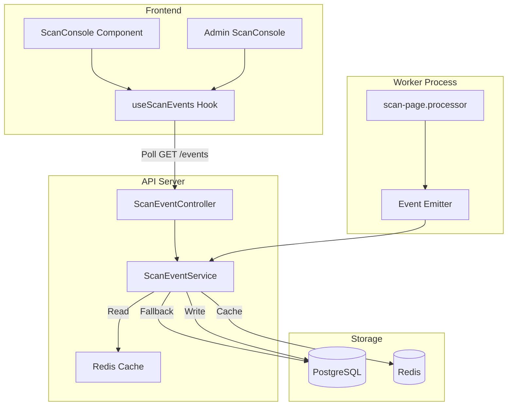
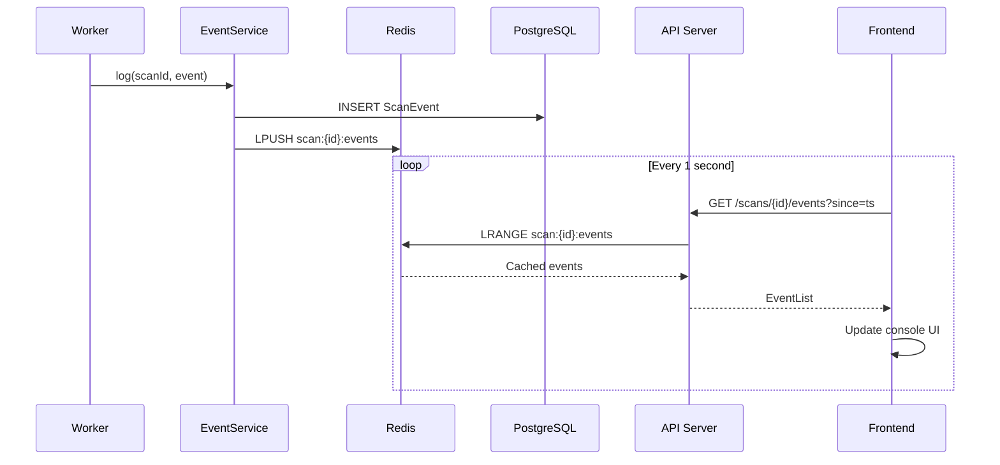
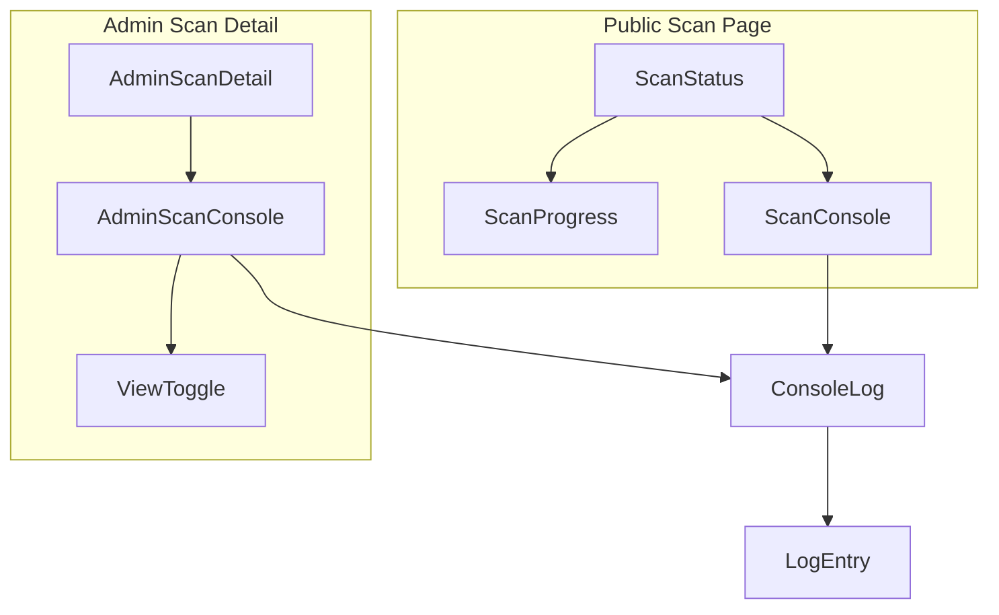

# Design - Scan Console Logger

## Overview

The Scan Console Logger provides real-time visibility into the accessibility scanning process through a terminal-style logging component. The system captures scan events from the worker, stores them in PostgreSQL with Redis caching, and streams them to the frontend via a polling API. Two console views are provided: a simplified public view and an enhanced admin view with full debugging capabilities.

## Steering Document Alignment

### Technical Standards (tech.md)

| Standard | Implementation |
|----------|----------------|
| **Backend** | Node.js + TypeScript + Fastify |
| **Database** | PostgreSQL via Prisma ORM |
| **Cache** | Redis for real-time event retrieval |
| **Frontend** | React + Next.js + TypeScript |
| **State** | Zustand for console state management |
| **Styling** | TailwindCSS + shadcn/ui components |
| **Queue** | BullMQ integration for worker events |

### Project Structure (structure.md)

| Component | Location | Convention |
|-----------|----------|------------|
| Event types | `apps/api/src/modules/scans/scan-event.types.ts` | kebab-case.ts |
| Event schema | `apps/api/src/modules/scans/scan-event.schema.ts` | Zod validation |
| Event service | `apps/api/src/modules/scans/scan-event.service.ts` | Module pattern |
| Event controller | `apps/api/src/modules/scans/scan-event.controller.ts` | Route handlers |
| Prisma model | `apps/api/prisma/schema.prisma` | PascalCase model |
| Public console | `apps/web/src/components/features/scan/ScanConsole.tsx` | PascalCase.tsx |
| Admin console | `apps/web/src/components/admin/ScanConsole.tsx` | PascalCase.tsx |
| Console hook | `apps/web/src/hooks/useScanEvents.ts` | React Query hook |
| Redis keys | `apps/api/src/shared/constants/redis-keys.ts` | Existing pattern |

## Code Reuse Analysis

### Existing Components to Leverage

| Component | Path | How Used |
|-----------|------|----------|
| **ScanStatus.tsx** | `apps/web/src/components/features/scan/` | Embed console component, reuse polling pattern |
| **useScan hook** | `apps/web/src/hooks/useScan.ts` | Base pattern for useScanEvents hook |
| **scan.service.ts** | `apps/api/src/modules/scans/` | Add event logging calls |
| **queue.service.ts** | `apps/api/src/shared/queue/` | Emit events from job handlers |
| **redis-keys.ts** | `apps/api/src/shared/constants/` | Add SCAN_EVENTS key pattern |
| **scan-page.processor.ts** | `apps/worker/src/processors/` | Emit events during processing |

### Integration Points

| System | Integration Method |
|--------|-------------------|
| **Scan Creation** | Call `scanEventService.log()` in `scan.service.ts` |
| **Worker Processing** | Call `scanEventService.log()` in processor |
| **Status Polling** | Add events endpoint parallel to status endpoint |
| **Admin Scan View** | Embed AdminScanConsole in scan detail page |

## Architecture

### System Architecture



### Event Flow Sequence



### Console Component Hierarchy



## Components and Interfaces

### Backend Components

#### ScanEventService

**Purpose**: Central service for logging and retrieving scan events

**File**: `apps/api/src/modules/scans/scan-event.service.ts`

```typescript
interface ScanEventService {
  // Log a new event (writes to DB + Redis)
  log(input: CreateScanEventInput): Promise<ScanEvent>;

  // Get events for a scan (reads from Redis, falls back to DB)
  getEvents(scanId: string, options?: GetEventsOptions): Promise<ScanEvent[]>;

  // Get events since timestamp (for polling)
  getEventsSince(scanId: string, since: Date, isAdmin?: boolean): Promise<ScanEvent[]>;

  // Cleanup old events (called by scheduled job)
  archiveOldEvents(olderThan: Date): Promise<number>;
}
```

**Dependencies**: PrismaClient, Redis client, Logger

**Reuses**: Redis client from `getRedisClient()`, Prisma from shared database

#### ScanEventController

**Purpose**: HTTP endpoint for event retrieval

**File**: `apps/api/src/modules/scans/scan-event.controller.ts`

**Endpoints**:

| Method | Path | Description |
|--------|------|-------------|
| GET | `/api/v1/scans/:scanId/events` | Get events with polling support |

**Query Parameters**:
- `since` (ISO timestamp): Return events after this time
- `limit` (number): Max events to return (default: 50)

**Response**: `{ success: true, data: { events: ScanEvent[], lastTimestamp: string } }`

**Rate Limiting**: 100 requests per minute per session/IP

**Authentication/Authorization**:
```typescript
// Admin check via existing auth middleware
const isAdmin = request.adminUser !== undefined;

// For public users, verify scan ownership via session
if (!isAdmin) {
  const scan = await scanService.findById(scanId);
  if (scan.guestSessionId !== request.session?.id) {
    throw new UnauthorizedError('Cannot access this scan');
  }
}
```

#### Zod Validation Schemas

**File**: `apps/api/src/modules/scans/scan-event.schema.ts`

```typescript
import { z } from 'zod';

export const scanEventTypeSchema = z.enum([
  'INIT', 'QUEUE', 'FETCH', 'ANALYSIS', 'RESULT', 'ERROR', 'DEBUG'
]);

export const logLevelSchema = z.enum([
  'DEBUG', 'INFO', 'SUCCESS', 'WARNING', 'ERROR'
]);

export const createScanEventSchema = z.object({
  scanId: z.string().uuid(),
  type: scanEventTypeSchema,
  level: logLevelSchema,
  message: z.string().min(1).max(500),
  metadata: z.record(z.unknown()).optional(),
  adminOnly: z.boolean().default(false)
});

export const getEventsQuerySchema = z.object({
  since: z.string().datetime().optional(),
  limit: z.coerce.number().min(1).max(200).default(50)
});
```

#### Worker Event Integration

**Purpose**: Emit events during scan processing

**File**: `apps/worker/src/processors/scan-page.processor.ts`

**Dependency Injection**: Worker imports shared ScanEventService

```typescript
import { ScanEventService } from '../services/scan-event.service';

export async function processScanPage(job: Job<ScanPageJobData>) {
  const { scanId, url, wcagLevel } = job.data;
  const scanEventService = new ScanEventService(prisma, redis);

  // INIT stage
  await scanEventService.log({
    scanId,
    type: 'QUEUE',
    level: 'INFO',
    message: 'Processing started',
    metadata: { workerId: process.env.WORKER_ID, attempt: job.attemptsMade },
    adminOnly: true  // Worker details are admin-only
  });

  // FETCH stage
  await scanEventService.log({
    scanId,
    type: 'FETCH',
    level: 'INFO',
    message: `Fetching page: ${url}`,
    metadata: { url }
  });

  try {
    const loadTime = await fetchPage(url);
    await scanEventService.log({
      scanId,
      type: 'FETCH',
      level: 'SUCCESS',
      message: `Page loaded successfully (${loadTime}ms)`,
      metadata: { loadTime }
    });
  } catch (error) {
    await scanEventService.log({
      scanId,
      type: 'ERROR',
      level: 'ERROR',
      message: 'Failed to load page',
      metadata: {
        error: error.message,
        stack: error.stack  // Admin-only via metadata
      },
      adminOnly: true
    });
    // Also log user-friendly version
    await scanEventService.log({
      scanId,
      type: 'ERROR',
      level: 'ERROR',
      message: 'Page could not be loaded. It may be blocking automated access.'
    });
    throw error;
  }

  // ANALYSIS stages...
  await scanEventService.log({
    scanId,
    type: 'ANALYSIS',
    level: 'INFO',
    message: 'Running accessibility checks...'
  });

  // Per-category logging
  for (const category of wcagCategories) {
    await scanEventService.log({
      scanId,
      type: 'ANALYSIS',
      level: 'INFO',
      message: `Checking: ${category.name}`
    });

    const issues = await checkCategory(category);
    if (issues.length > 0) {
      await scanEventService.log({
        scanId,
        type: 'ANALYSIS',
        level: 'WARNING',
        message: `Found ${issues.length} issues in ${category.name}`,
        metadata: { category: category.id, issueCount: issues.length }
      });
    }
  }

  // RESULT stage
  await scanEventService.log({
    scanId,
    type: 'RESULT',
    level: 'SUCCESS',
    message: `Scan completed! Found ${totalIssues} accessibility issues`
  });
}
```

### Frontend Components

#### ScanConsole (Public)

**Purpose**: Terminal-style log display for public users

**File**: `apps/web/src/components/features/scan/ScanConsole.tsx`

**Props**:
```typescript
interface ScanConsoleProps {
  scanId: string;
  isExpanded?: boolean;
  onToggle?: () => void;
  maxEntries?: number; // Default: 50
}
```

**Features**:
- Dark terminal-style background
- Color-coded log levels (green/amber/red)
- Timestamp display (HH:MM:SS)
- Auto-scroll with manual scroll detection
- Collapsible panel
- Filters out adminOnly events

**Reuses**: shadcn/ui ScrollArea, existing Tailwind theme

#### AdminScanConsole

**Purpose**: Enhanced console with full debugging info

**File**: `apps/web/src/components/admin/ScanConsole.tsx`

**Props**:
```typescript
interface AdminScanConsoleProps {
  scanId: string;
  defaultView?: 'user' | 'full'; // Default: 'full'
}
```

**Additional Features**:
- View toggle (User View / Full View)
- Shows all log levels including DEBUG
- Displays adminOnly events with distinct styling
- Stack trace expansion
- Performance metrics display
- Copy log button

#### useScanEvents Hook (React Query)

**Purpose**: Poll for scan events with automatic refresh using React Query

**File**: `apps/web/src/hooks/useScanEvents.ts`

**Implementation**:
```typescript
import { useQuery } from '@tanstack/react-query';
import { useState, useCallback } from 'react';
import { api } from '@/lib/api';

interface UseScanEventsOptions {
  pollInterval?: number;  // Default: 1000ms
  isAdmin?: boolean;      // Show admin events
  enabled?: boolean;      // Enable/disable polling
}

export function useScanEvents(
  scanId: string,
  scanStatus: ScanStatus,  // From useScan hook
  options: UseScanEventsOptions = {}
) {
  const { pollInterval = 1000, isAdmin = false, enabled = true } = options;
  const [lastTimestamp, setLastTimestamp] = useState<string | null>(null);

  // Stop polling when scan is complete
  const shouldPoll = enabled &&
    scanStatus !== 'COMPLETED' &&
    scanStatus !== 'FAILED';

  const query = useQuery({
    queryKey: ['scan-events', scanId, lastTimestamp, isAdmin],
    queryFn: async () => {
      const response = await api.scans.getEvents(scanId, {
        since: lastTimestamp,
        isAdmin
      });
      return response;
    },
    refetchInterval: shouldPoll ? pollInterval : false,
    enabled: enabled && !!scanId,
    staleTime: 500,  // Consider data fresh for 500ms
    onSuccess: (data) => {
      if (data.lastTimestamp) {
        setLastTimestamp(data.lastTimestamp);
      }
    }
  });

  // Accumulate events across polls
  const [allEvents, setAllEvents] = useState<ScanEvent[]>([]);

  useEffect(() => {
    if (query.data?.events) {
      setAllEvents(prev => [...prev, ...query.data.events]);
    }
  }, [query.data?.events]);

  return {
    events: allEvents,
    isLoading: query.isLoading,
    error: query.error,
    lastTimestamp,
    refetch: query.refetch
  };
}
```

**Reuses**: React Query pattern from tech.md, similar to useScan hook structure

#### LogEntry Component

**Purpose**: Single log entry with level-based styling

**File**: `apps/web/src/components/features/scan/LogEntry.tsx`

**Props**:
```typescript
interface LogEntryProps {
  event: ScanEvent;
  isAdmin?: boolean;
  showMetadata?: boolean;
}
```

## Data Models

### ScanEvent (Prisma Model)

```prisma
model ScanEvent {
  id        String   @id @default(uuid())
  scanId    String
  scan      Scan     @relation(fields: [scanId], references: [id], onDelete: Cascade)

  type      ScanEventType
  level     LogLevel
  message   String
  metadata  Json?
  adminOnly Boolean  @default(false)

  createdAt DateTime @default(now())

  @@index([scanId, createdAt])
  @@index([createdAt])  // For cleanup job
}
```

### Scan Model Enhancement

Add the following fields to existing `Scan` model for event summary persistence:

```prisma
model Scan {
  // ... existing fields ...

  // New: Event relationship
  events       ScanEvent[]

  // New: Aggregated event summary (populated when events are archived)
  eventSummary Json?  // { totalEvents, errorCount, lastEventAt, duration }

  @@index([status, updatedAt])  // For finding scans to cleanup
}

enum ScanEventType {
  INIT
  QUEUE
  FETCH
  ANALYSIS
  RESULT
  ERROR
  DEBUG
}

enum LogLevel {
  DEBUG
  INFO
  SUCCESS
  WARNING
  ERROR
}
```

### TypeScript Types

**File**: `apps/api/src/modules/scans/scan-event.types.ts`

```typescript
export interface ScanEvent {
  id: string;
  scanId: string;
  type: ScanEventType;
  level: LogLevel;
  message: string;
  metadata?: Record<string, unknown>;
  adminOnly: boolean;
  createdAt: Date;
}

export interface CreateScanEventInput {
  scanId: string;
  type: ScanEventType;
  level: LogLevel;
  message: string;
  metadata?: Record<string, unknown>;
  adminOnly?: boolean;
}

export interface GetEventsOptions {
  since?: Date;
  limit?: number;
  includeAdminOnly?: boolean;
}
```

### Redis Cache Structure

**Key Pattern**: `scan:{scanId}:events`

**Data Structure**: Redis List (LPUSH/LRANGE)

```typescript
// Each list item is JSON stringified:
{
  id: string;
  type: ScanEventType;
  level: LogLevel;
  message: string;
  metadata?: object;
  adminOnly: boolean;
  createdAt: string; // ISO timestamp
}
```

**TTL**: 24 hours (86400 seconds)

**Operations**:
- `LPUSH` - Add new event to head
- `LRANGE 0 99` - Get last 100 events
- `LTRIM 0 199` - Keep max 200 events in cache

## Error Handling

### Error Scenarios

| Scenario | Handling | User Impact |
|----------|----------|-------------|
| **Redis unavailable** | Fall back to database queries | Slightly slower updates |
| **Database write fails** | Log error, continue scan | Events may be missing |
| **Polling request fails** | Retry with exponential backoff | Temporary stale data |
| **Invalid scanId** | Return 404 | Error message in console |
| **Rate limit exceeded** | Return 429, queue retry | Polling paused briefly |

### Error Recovery

```typescript
// In ScanEventService.log()
try {
  await this.prisma.scanEvent.create({ data });
  await this.cacheEvent(scanId, event);
} catch (error) {
  // Log but don't throw - scan must continue
  logger.error('Failed to log scan event', { scanId, error });
}
```

### Frontend Error Handling

```typescript
// In useScanEvents hook
if (error) {
  // Show error in console component
  return [{
    id: 'error',
    type: 'ERROR',
    level: 'WARNING',
    message: 'Unable to fetch latest updates. Retrying...',
    createdAt: new Date()
  }];
}
```

## Testing Strategy

### Unit Testing

| Component | Test Focus | Tools |
|-----------|------------|-------|
| ScanEventService | Event creation, Redis caching, fallback logic | Vitest, Redis mock |
| ScanEventController | Request validation, response format | Vitest, Fastify inject |
| LogEntry | Rendering, color coding, timestamp format | Vitest, React Testing Library |
| useScanEvents | Polling logic, state management | Vitest, MSW for mocking |

### Integration Testing

| Flow | Test Scenario |
|------|---------------|
| Event lifecycle | Create event → Cache → Retrieve → Display |
| Admin filtering | Verify adminOnly events hidden from public |
| Polling | Verify incremental updates with `since` param |
| Error handling | Verify graceful degradation on failures |

### End-to-End Testing

| Scenario | Test Steps |
|----------|------------|
| Public scan | Start scan → View console → Verify events appear |
| Admin view | Login as admin → View scan → Toggle views → Verify debug logs |
| Persistence | Complete scan → Refresh page → Verify history loads |

**Tools**: Playwright for E2E, matching existing test patterns

### Performance Testing

| Metric | Test Approach | Target |
|--------|---------------|--------|
| Event latency | Timestamp comparison (worker → frontend) | < 500ms |
| Console render | React profiler with 200+ events | < 100ms render |
| API response | Load test with 100 concurrent requests | < 100ms p95 |
| Polling overhead | Memory/CPU monitoring during 5min session | < 10MB memory |

**Tools**: k6 for load testing, React DevTools Profiler

### Accessibility Testing

| Test | Validation |
|------|------------|
| WCAG keyboard | Tab navigation through console, focus visible |
| Screen reader | ARIA live regions announce new events |
| Color contrast | All log level colors meet 4.5:1 ratio |
| High contrast mode | Console visible in Windows High Contrast |
| Reduced motion | Disable auto-scroll animation |

**Tools**: Playwright axe-core integration, manual screen reader testing
