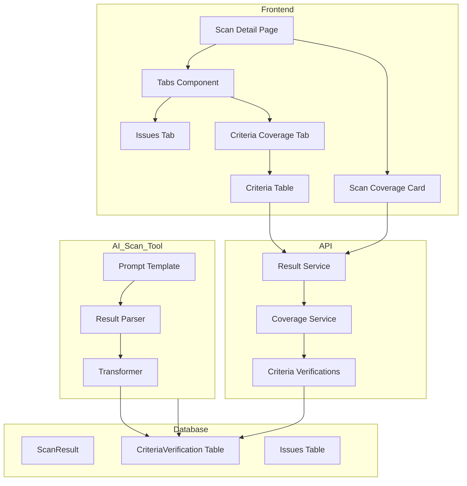

# Design Document: WCAG Criteria Coverage Table

## Overview

This feature adds a comprehensive WCAG criteria coverage table to the scan detail UI, enhances the AI scan tool to verify additional criteria, and updates the Scan Coverage card to display accurate statistics. The design follows existing patterns in the codebase while introducing new data structures for criteria verification tracking.

## Steering Document Alignment

### Technical Standards (tech.md)
- Uses React with TypeScript for frontend components
- Follows existing API patterns with Prisma/PostgreSQL
- Leverages Radix UI components (Tabs, Tooltip, Table)
- Uses TailwindCSS for styling consistent with design system

### Project Structure (structure.md)
- Frontend components in `apps/web/src/components/features/compliance/`
- API services in `apps/api/src/modules/results/`
- Shared types in `packages/core/src/types/`
- AI scan CLI in `tools/ai-scan-cli/`

## Code Reuse Analysis

### Existing Components to Leverage
- **ScanCoverageCard**: Extend to use new criteria verification data
- **CriteriaCoverage**: Reuse tooltip pattern for status explanations
- **IssueList**: Reuse for filtered issue display
- **Tabs (Radix UI)**: Use existing UI component for tabbed interface
- **Table (UI)**: Use existing table components with styling

### Existing Services to Extend
- **CoverageService**: Extend to compute from criteria verifications
- **ResultService**: Include criteriaVerifications in response
- **AI Scan CLI**: Extend prompt template for criteria verification

### Integration Points
- **Scan Results API**: Add criteriaVerifications to response
- **Database**: New CriteriaVerification model
- **AI Import API**: Accept AI-verified criteria data

## Architecture



## Components and Interfaces

### Component 1: CriteriaVerification Data Model

- **Purpose:** Store per-criterion verification status for each scan
- **Location:** `packages/core/src/types/criteria.types.ts`

```typescript
export type CriteriaStatus =
  | 'PASS'           // Verified passing by axe-core
  | 'FAIL'           // Issues found by axe-core
  | 'AI_VERIFIED_PASS'   // Verified passing by AI
  | 'AI_VERIFIED_FAIL'   // Issues found by AI
  | 'NOT_TESTED';        // Cannot be automated

export type ScannerSource =
  | 'axe-core'
  | string           // Dynamic AI model name from scan result (e.g., 'claude-opus-4', 'gpt-4', etc.)
  | 'axe-core + AI'
  | 'N/A';

// Note: AI model name is retrieved from ScanResult.aiModel field, NOT hardcoded

export interface CriteriaVerification {
  criterionId: string;      // e.g., "1.1.1"
  status: CriteriaStatus;
  scanner: ScannerSource;
  issueIds?: string[];      // References to issues if FAIL
  confidence?: number;      // AI confidence score (0-100)
  reasoning?: string;       // AI reasoning (admin only)
}

export interface CriteriaVerificationSummary {
  criteriaChecked: number;
  criteriaTotal: number;
  criteriaWithIssues: number;
  criteriaPassed: number;
  criteriaAiVerified: number;
  criteriaNotTested: number;
}
```

- **Reuses:** Existing `WCAGCriterion` interface from `wcag.constants.ts`

### Component 2: Enhanced Coverage Service

- **Purpose:** Compute accurate coverage from criteria verifications
- **Location:** `apps/api/src/modules/results/coverage.service.ts`
- **Extends:** Existing `CoverageService` class

```typescript
interface EnhancedCoverageMetrics {
  // ACTUAL computed coverage - NOT theoretical percentages
  coveragePercentage: number;  // = (criteriaChecked / criteriaTotal) * 100
  criteriaChecked: number;     // Count of Pass + Fail + AI_VERIFIED_PASS + AI_VERIFIED_FAIL
  criteriaTotal: number;       // Total for WCAG level (30/50/78)
  isAiEnhanced: boolean;
  criteriaVerifications: CriteriaVerification[];
  summary: CriteriaVerificationSummary;
}

class CoverageService {
  // NEW: Build verifications from scan data + AI results
  buildCriteriaVerifications(
    scanResult: ScanResultData,
    issues: Issue[],
    wcagLevel: WcagLevel,
    aiVerifications?: CriteriaVerification[]
  ): CriteriaVerification[] {
    // 1. Get all criteria for the WCAG level
    // 2. Map axe-core passed rules to criteria (status: PASS)
    // 3. Map issues to criteria (status: FAIL)
    // 4. Merge AI verifications (AI takes precedence, no double-counting)
    // 5. Mark remaining as NOT_TESTED
  }

  // UPDATED: Calculate ACTUAL coverage from verifications
  calculateCoverageFromVerifications(
    verifications: CriteriaVerification[],
    wcagLevel: WcagLevel
  ): EnhancedCoverageMetrics {
    const criteriaTotal = getCriteriaUpToLevel(wcagLevel).length;

    // Count by status
    const passed = verifications.filter(v => v.status === 'PASS').length;
    const failed = verifications.filter(v => v.status === 'FAIL').length;
    const aiPassed = verifications.filter(v => v.status === 'AI_VERIFIED_PASS').length;
    const aiFailed = verifications.filter(v => v.status === 'AI_VERIFIED_FAIL').length;
    const notTested = verifications.filter(v => v.status === 'NOT_TESTED').length;

    const criteriaChecked = passed + failed + aiPassed + aiFailed;

    // ACTUAL percentage - not theoretical
    const coveragePercentage = Math.round((criteriaChecked / criteriaTotal) * 100);

    return {
      coveragePercentage,  // e.g., 36% for 18/50, 72% for 36/50
      criteriaChecked,
      criteriaTotal,
      isAiEnhanced: aiPassed + aiFailed > 0,
      criteriaVerifications: verifications,
      summary: {
        criteriaChecked,
        criteriaTotal,
        criteriaWithIssues: failed + aiFailed,
        criteriaPassed: passed + aiPassed,
        criteriaAiVerified: aiPassed + aiFailed,
        criteriaNotTested: notTested,
      }
    };
  }

  // BACKWARD COMPATIBILITY: Compute from legacy data
  computeVerificationsFromLegacyData(
    scanResult: ScanResultData,
    issues: Issue[],
    wcagLevel: WcagLevel
  ): CriteriaVerification[] {
    // For old scans without stored verifications
    // 1. Extract wcagCriteria from issues → FAIL
    // 2. Map passed axe rules via AXE_RULE_TO_WCAG → PASS
    // 3. Remaining criteria → NOT_TESTED
  }
}
```

- **Reuses:** `WCAG_CRITERIA`, `AXE_RULE_TO_WCAG`, `getCriteriaUpToLevel` from constants

### Component 3: Criteria Coverage Table Component

- **Purpose:** Display all WCAG criteria with status in a sortable/filterable table
- **Location:** `apps/web/src/components/features/compliance/CriteriaTable.tsx`

```typescript
interface CriteriaTableProps {
  verifications: CriteriaVerification[];
  wcagLevel: WcagLevel;
  onCriterionClick?: (criterionId: string) => void;
  isAdmin?: boolean;
}

interface CriteriaTableState {
  sortBy: 'id' | 'status' | 'name';
  sortOrder: 'asc' | 'desc';
  filterStatus: CriteriaStatus | 'all';
  filterLevel: 'A' | 'AA' | 'all';
}
```

- **Reuses:** `Table`, `TableHeader`, `TableRow` from UI components
- **Reuses:** `Badge` component for status display
- **Reuses:** `Tooltip` for "Not Tested" explanations

### Component 4: Tabbed Scan Results Container

- **Purpose:** Container component with tabs for Issues and Criteria Coverage
- **Location:** `apps/web/src/components/features/compliance/ScanResultsTabs.tsx`

```typescript
interface ScanResultsTabsProps {
  issues: Issue[];
  verifications: CriteriaVerification[];
  wcagLevel: WcagLevel;
  defaultTab?: 'issues' | 'criteria';
  onTabChange?: (tab: string) => void;
  isAdmin?: boolean;
}
```

- **Reuses:** Radix UI `Tabs` component
- **Reuses:** `IssueList` component for issues tab

### Component 4b: Issue Filtering Flow

- **Purpose:** Enable navigation from criteria table to filtered issues
- **Pattern:** State lifting with callback props

```typescript
// State management in ScanResultsTabs
interface FilterState {
  criterionId: string | null;  // null = show all issues
}

// Flow: CriteriaTable → ScanResultsTabs → IssueList
// 1. User clicks failed criterion in CriteriaTable
// 2. CriteriaTable calls onCriterionClick(criterionId)
// 3. ScanResultsTabs:
//    - Sets filterState.criterionId = criterionId
//    - Switches activeTab to 'issues'
// 4. IssueList receives filtered issues:
//    issues.filter(i => i.wcagCriteria.includes(filterState.criterionId))

// CriteriaTable interaction
const handleCriterionClick = (criterionId: string, status: CriteriaStatus) => {
  if (status === 'FAIL' || status === 'AI_VERIFIED_FAIL') {
    onCriterionClick?.(criterionId);  // Notify parent
  }
};

// ScanResultsTabs state management
const [filterCriterion, setFilterCriterion] = useState<string | null>(null);
const [activeTab, setActiveTab] = useState<'issues' | 'criteria'>('issues');

const handleCriterionClick = (criterionId: string) => {
  setFilterCriterion(criterionId);
  setActiveTab('issues');  // Switch to issues tab
};

const handleClearFilter = () => {
  setFilterCriterion(null);
};

// Filtered issues for IssueList
const filteredIssues = filterCriterion
  ? issues.filter(i => i.wcagCriteria?.includes(filterCriterion))
  : issues;
```

### Component 4c: Admin Criteria Table

- **Purpose:** Extended table for admin view with AI confidence and reasoning
- **Location:** `apps/web/src/components/features/compliance/CriteriaTableAdmin.tsx`

```typescript
interface CriteriaTableAdminProps extends CriteriaTableProps {
  // Admin-only: always show confidence and reasoning columns
}

// Additional columns for admin view:
// | ... | Confidence | Reasoning |
// | ... | [====85%] | "The page maintains..." (expandable) |

// Admin-specific features:
// 1. Confidence displayed as progress bar (0-100)
// 2. Reasoning shown in expandable row or tooltip
// 3. Export includes confidence and reasoning data
```

### Component 5: AI Scan Enhancement

- **Purpose:** Extend AI scan to verify additional WCAG criteria
- **Location:** `tools/ai-scan-cli/templates/issue-enhancement-prompt.hbs` (extended)
- **New Types:** `tools/ai-scan-cli/src/types.ts`

```typescript
// Add to existing types.ts
export interface AiCriteriaVerification {
  criterionId: string;
  status: 'AI_VERIFIED_PASS' | 'AI_VERIFIED_FAIL';
  confidence: number;  // 0-100, validated
  reasoning: string;   // Max 1000 chars
}

// Extended AI output structure
export interface AiScanOutput {
  scanId: string;
  summary: string;
  remediationPlan: string;
  aiEnhancements: AiIssueEnhancement[];
  // NEW: Criteria verifications
  criteriaVerifications?: AiCriteriaVerification[];
}
```

**Prompt Template Extension:**

```handlebars
## Additional Criteria Verification

Beyond enhancing the existing issues, please also verify the following WCAG criteria
that cannot be tested by automated tools. For each criterion, determine if the page
passes or fails based on your analysis of the HTML content and accessibility tree.

### Criteria to Verify

{{#each untestableCriteria}}
- **{{this.id}}** - {{this.title}}: {{this.description}}
{{/each}}

### Output Format for Criteria Verification

Add a "criteriaVerifications" array to your JSON response:

{
  "criteriaVerifications": [
    {
      "criterionId": "1.3.2",
      "status": "AI_VERIFIED_PASS",
      "confidence": 85,
      "reasoning": "The page maintains meaningful reading sequence..."
    },
    {
      "criterionId": "2.4.7",
      "status": "AI_VERIFIED_FAIL",
      "confidence": 70,
      "reasoning": "Focus indicator is not visible on interactive elements..."
    }
  ]
}

**Rules:**
- Only include criteria you can confidently assess
- Confidence must be 0-100 (higher = more certain)
- Keep reasoning under 200 words
- If unsure, do NOT include the criterion (leave as NOT_TESTED)
```

**Result Parser Extension:**

```typescript
// tools/ai-scan-cli/src/result-parser.ts
export function parseCriteriaVerifications(
  output: unknown
): AiCriteriaVerification[] {
  // Extract and validate criteriaVerifications from AI response
  // Validate confidence is 0-100
  // Truncate reasoning to 1000 chars
  // Filter out invalid entries
}
```

- **Extends:** Existing `issue-enhancement-prompt.hbs`
- **Note:** AI model name stored in result comes from CLI config, not hardcoded

## Data Models

### Database Schema Extension

```prisma
model CriteriaVerification {
  id            String   @id @default(uuid())
  scanResultId  String
  criterionId   String   // e.g., "1.1.1"
  status        String   // PASS, FAIL, AI_VERIFIED_PASS, AI_VERIFIED_FAIL, NOT_TESTED
  scanner       String   // axe-core, claude-opus-4, N/A
  confidence    Int?     // AI confidence 0-100
  reasoning     String?  // AI reasoning text
  createdAt     DateTime @default(now())

  scanResult    ScanResult @relation(fields: [scanResultId], references: [id])
  issues        Issue[]    @relation("CriteriaIssues")

  @@unique([scanResultId, criterionId])
  @@index([scanResultId])
}
```

### API Response Extension

```typescript
interface ScanResultResponse {
  // ... existing fields ...
  coverage: {
    coveragePercentage: number;  // Actual computed percentage
    criteriaChecked: number;
    criteriaTotal: number;
    isAiEnhanced: boolean;
    breakdown: {
      criteriaWithIssues: number;
      criteriaPassed: number;
      criteriaAiVerified: number;
      criteriaNotTested: number;
    };
    verifications: CriteriaVerification[];  // NEW: Full verification list
  };
}
```

## UI Design

### Tabbed Interface Layout

```
┌─────────────────────────────────────────────────────────────────┐
│  Scan Coverage Card (updated with accurate stats)               │
│  ┌──────────────┐ ┌──────────────┐ ┌──────────────┐            │
│  │ 72%          │ │ 36 of 50     │ │ 45           │            │
│  │ Detection    │ │ Criteria     │ │ Passed       │            │
│  │ Coverage     │ │ Checked      │ │ Checks       │            │
│  └──────────────┘ └──────────────┘ └──────────────┘            │
└─────────────────────────────────────────────────────────────────┘

┌─────────────────────────────────────────────────────────────────┐
│  [Issues (12)]  [Criteria Coverage (36/50)]                     │
├─────────────────────────────────────────────────────────────────┤
│                                                                  │
│  Criteria Coverage Tab Content:                                  │
│                                                                  │
│  Filter: [All Status ▼] [All Levels ▼]   Showing 50 of 50       │
│                                                                  │
│  ┌────────┬──────────────────────┬────────────┬─────────────┐   │
│  │ ID     │ Name                 │ Status     │ Scanner     │   │
│  ├────────┼──────────────────────┼────────────┼─────────────┤   │
│  │ 1.1.1  │ Non-text Content     │ ❌ Fail(3) │ axe-core    │   │
│  │ 1.2.1  │ Audio-only (Pre...)  │ ✅ Pass    │ claude-opus │   │
│  │ 1.3.1  │ Info and Relations   │ ❌ Fail(5) │ axe-core    │   │
│  │ 1.3.2  │ Meaningful Sequence  │ 🔍 AI Pass │ claude-opus │   │
│  │ 1.3.3  │ Sensory Character... │ ⚪ N/A     │ N/A         │   │
│  │ ...    │ ...                  │ ...        │ ...         │   │
│  └────────┴──────────────────────┴────────────┴─────────────┘   │
│                                                                  │
└─────────────────────────────────────────────────────────────────┘
```

### Status Badge Styles

| Status | Badge | Color | Icon |
|--------|-------|-------|------|
| Pass | `bg-green-100 text-green-800` | Green | ✅ |
| Fail | `bg-red-100 text-red-800` | Red | ❌ |
| AI Verified Pass | `bg-blue-100 text-blue-800` | Blue | 🔍 |
| AI Verified Fail | `bg-orange-100 text-orange-800` | Orange | ⚠️ |
| Not Tested | `bg-gray-100 text-gray-600` | Gray | ⚪ |

### Scanner Column Display

```typescript
// Scanner name is dynamic, loaded from scan result
function getScannerDisplay(verification: CriteriaVerification, aiModel?: string): string {
  switch (verification.scanner) {
    case 'axe-core':
      return 'axe-core';
    case 'axe-core + AI':
      return `axe-core + ${aiModel || 'AI'}`;  // e.g., "axe-core + claude-opus-4"
    case 'N/A':
      return 'N/A';
    default:
      // AI model name from scan result
      return aiModel || verification.scanner;  // e.g., "claude-opus-4", "gpt-4"
  }
}
```

### Custom Sorting Logic

```typescript
// Sort order per Requirement 7.1: Fail first, then Not Tested, then Pass
const STATUS_SORT_ORDER: Record<CriteriaStatus, number> = {
  'FAIL': 0,
  'AI_VERIFIED_FAIL': 1,
  'NOT_TESTED': 2,
  'AI_VERIFIED_PASS': 3,
  'PASS': 4,
};

function sortByStatus(a: CriteriaVerification, b: CriteriaVerification): number {
  return STATUS_SORT_ORDER[a.status] - STATUS_SORT_ORDER[b.status];
}

function sortById(a: CriteriaVerification, b: CriteriaVerification): number {
  // Sort numerically: 1.1.1 < 1.2.1 < 2.1.1
  const aParts = a.criterionId.split('.').map(Number);
  const bParts = b.criterionId.split('.').map(Number);

  for (let i = 0; i < Math.max(aParts.length, bParts.length); i++) {
    const diff = (aParts[i] || 0) - (bParts[i] || 0);
    if (diff !== 0) return diff;
  }
  return 0;
}
```

## Error Handling

### Error Scenarios

1. **Criteria verifications not available (old scans)**
   - **Handling:** Compute verifications from issues + passed checks (backward compatibility)
   - **User Impact:** Table still displays with computed data, badge shows "Estimated"

2. **AI scan fails to verify criteria**
   - **Handling:** Mark criteria as NOT_TESTED, log error
   - **User Impact:** Criteria shows "Not Tested" status, no false positives

3. **Database migration fails**
   - **Handling:** Feature flag to disable criteria table, fallback to old UI
   - **User Impact:** Old scan coverage card shown until migration completes

4. **Large number of criteria (AAA level)**
   - **Handling:** Virtualized table rendering for 78+ rows
   - **User Impact:** Smooth scrolling, no performance degradation

## Testing Strategy

### Unit Testing
- `CoverageService.buildCriteriaVerifications()` - Test all status combinations
- `CoverageService.calculateCoverageFromVerifications()` - Test accuracy
- `CriteriaTable` component - Test rendering, sorting, filtering
- AI prompt template parsing - Test JSON extraction

### Integration Testing
- API endpoint returns correct verifications
- Criteria table links to filtered issues correctly
- Tab navigation preserves state
- Admin view shows additional fields

### End-to-End Testing
- Complete scan flow with criteria verification
- AI scan updates criteria coverage
- Export includes criteria data
- Mobile responsiveness

## Migration Strategy

### Phase 1: Database Migration
1. Add `CriteriaVerification` table
2. Backfill existing scans with computed verifications (optional)

### Phase 2: API Updates
1. Extend `ResultService` to include verifications
2. Update `CoverageService` calculations
3. Add backward compatibility for missing data

### Phase 3: Frontend Deployment
1. Deploy tabbed interface with feature flag
2. Enable for beta users
3. Full rollout after validation

### Phase 4: AI Scan Enhancement
1. Update prompt template
2. Extend result parser
3. Deploy to AI scan CLI

---

**Created**: 2026-01-18
**Status**: Draft - Pending Approval
