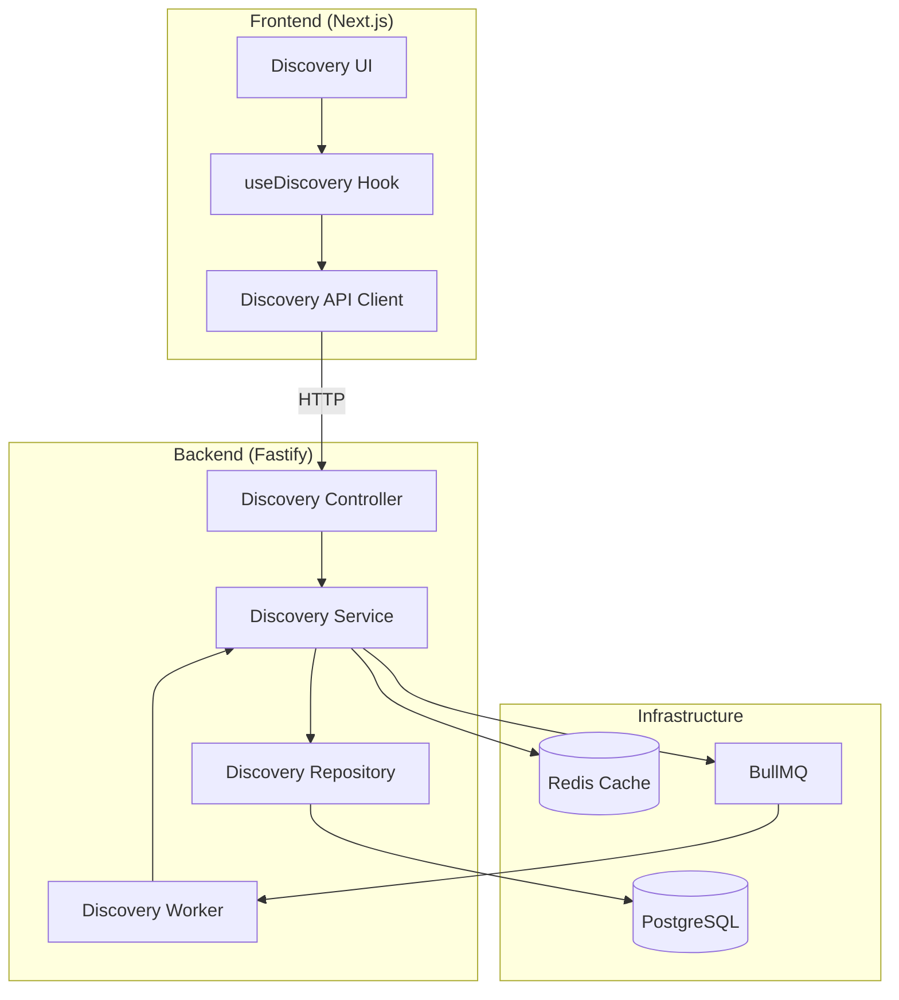
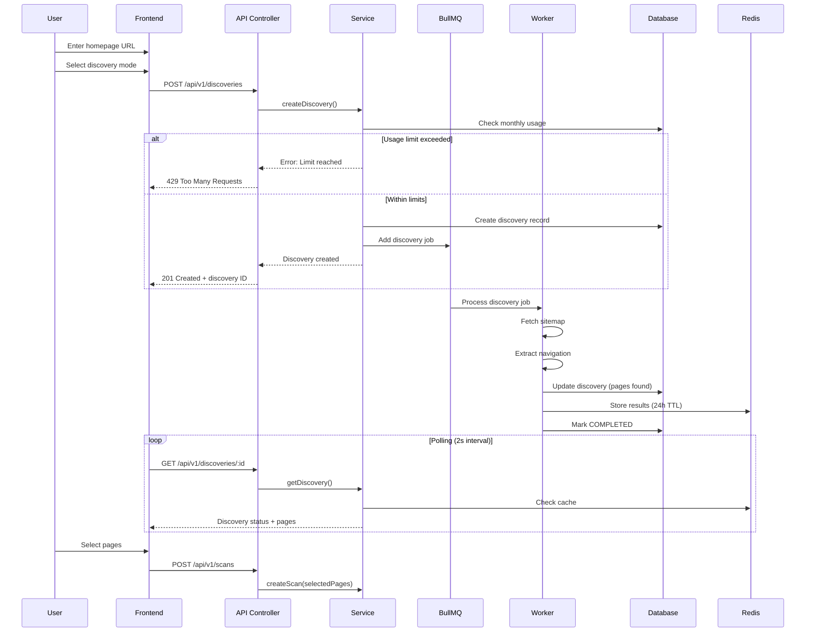
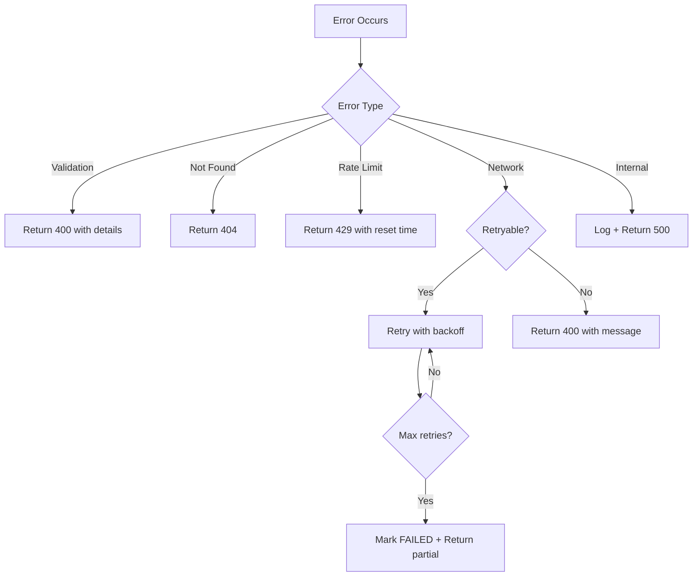

# Design Document: Website Skeleton Discovery

## Overview

Website Skeleton Discovery is a feature that extracts website structure (navigation menus, sitemap.xml, internal links) from a homepage URL before accessibility scanning begins. The feature enables users to visualize their site structure, select pages for scanning, and seamlessly transition to scan creation.

This document defines the technical architecture, data models, API contracts, and component designs following the established codebase patterns.

## Steering Document Alignment

### Technical Standards (tech.md)

| Standard | Implementation |
|----------|----------------|
| **Backend Framework** | Fastify with TypeScript |
| **Validation** | Zod schemas with runtime validation |
| **Database** | Prisma ORM with PostgreSQL |
| **Job Queue** | BullMQ for background discovery jobs |
| **Caching** | Redis for discovery results (24h TTL) |
| **API Format** | REST with JSON, consistent error responses |

### Project Structure (structure.md)

```
apps/
├── api/src/modules/discovery/     # Backend discovery module
│   ├── index.ts                   # Module exports
│   ├── discovery.controller.ts    # HTTP handlers
│   ├── discovery.service.ts       # Business logic
│   ├── discovery.repository.ts    # Data access
│   ├── discovery.schema.ts        # Zod validation
│   ├── discovery.types.ts         # TypeScript types
│   ├── discovery.worker.ts        # BullMQ job processor
│   └── discovery.test.ts          # Tests
│
└── web/src/
    ├── components/features/discovery/  # Discovery UI components
    │   ├── DiscoveryModeSelector.tsx
    │   ├── DiscoveryProgress.tsx
    │   ├── CachedResultsPrompt.tsx   # Cache usage prompt
    │   ├── PageTree.tsx
    │   ├── PageTreeNode.tsx
    │   ├── ManualUrlEntry.tsx
    │   └── DiscoveryResults.tsx
    ├── hooks/
    │   ├── useDiscovery.ts         # Discovery state management
    │   └── useDiscoveryPolling.ts  # Real-time status polling
    └── lib/
        └── discovery-api.ts        # API client methods
```

## Code Reuse Analysis

### Existing Components to Leverage

| Component | Location | Usage |
|-----------|----------|-------|
| **Session Middleware** | `middleware/session.ts` | Authentication & user context |
| **Rate Limit Middleware** | `middleware/rateLimit.ts` | API rate limiting |
| **Queue Service** | `services/queue/` | BullMQ job management |
| **Redis Client** | `services/redis.ts` | Caching layer |
| **API Response Helpers** | `utils/response.ts` | Consistent response format |
| **Scan Types** | `modules/scans/scan.types.ts` | Status enums, scan integration |

### Integration Points

| System | Integration |
|--------|-------------|
| **Scan Module** | Discovery results feed into scan creation |
| **Session System** | User context for usage tracking |
| **Job Queue** | Background processing for discovery |
| **Redis Cache** | Cached discovery results |

## Architecture

### System Architecture



### Discovery Flow



## Components and Interfaces

### Backend Components

#### 1. Discovery Controller

**Purpose:** Handle HTTP requests for discovery operations

**Endpoints:**
| Method | Path | Description |
|--------|------|-------------|
| `POST` | `/api/v1/discoveries` | Create new discovery |
| `GET` | `/api/v1/discoveries/:id` | Get discovery status & results |
| `DELETE` | `/api/v1/discoveries/:id` | Cancel discovery |
| `POST` | `/api/v1/discoveries/:id/pages` | Add single manual URL |
| `POST` | `/api/v1/discoveries/:id/pages/batch` | Add multiple manual URLs |
| `DELETE` | `/api/v1/discoveries/:id/pages/:pageId` | Remove manual URL |

**Dependencies:** Session middleware, rate limit middleware, discovery service

#### 2. Discovery Service

**Purpose:** Business logic for discovery operations

**Interfaces:**
```typescript
interface DiscoveryService {
  createDiscovery(sessionId: string, input: CreateDiscoveryInput): Promise<Discovery>;
  getDiscovery(discoveryId: string): Promise<DiscoveryWithPages>;
  cancelDiscovery(discoveryId: string): Promise<void>;
  addManualUrl(discoveryId: string, url: string): Promise<DiscoveredPage>;
  removeManualUrl(discoveryId: string, pageId: string): Promise<void>;
  checkUsageLimit(sessionId: string): Promise<UsageLimitResult>;
  incrementUsage(sessionId: string): Promise<void>;
}
```

**Dependencies:** Discovery repository, queue service, Redis cache

#### 3. Discovery Repository

**Purpose:** Data access layer for discovery entities

**Interfaces:**
```typescript
interface DiscoveryRepository {
  create(data: CreateDiscoveryData): Promise<Discovery>;
  findById(id: string): Promise<Discovery | null>;
  findByIdWithPages(id: string): Promise<DiscoveryWithPages | null>;
  updateStatus(id: string, status: DiscoveryStatus, error?: string): Promise<Discovery>;
  addPages(discoveryId: string, pages: CreatePageData[]): Promise<DiscoveredPage[]>;
  removePage(discoveryId: string, pageId: string): Promise<void>;
  getMonthlyUsage(sessionId: string): Promise<number>;
  incrementMonthlyUsage(sessionId: string): Promise<void>;
}
```

**Dependencies:** Prisma client

#### 4. Discovery Worker

**Purpose:** Background job processor for discovery operations

**Responsibilities:**
- Fetch and parse sitemap.xml
- Extract navigation links from homepage
- Validate and deduplicate discovered URLs
- Update discovery status and pages
- Cache results in Redis

**Dependencies:** HTTP client (axios), cheerio (HTML parsing), Redis, repository

#### 5. Discovery Worker Configuration

**BullMQ Job Options:**
```typescript
const DISCOVERY_JOB_OPTIONS = {
  attempts: 3,                    // Max retry attempts
  backoff: {
    type: 'exponential',
    delay: 1000,                  // Initial delay 1s
  },
  timeout: 30000,                 // 30 second job timeout
  removeOnComplete: {
    age: 86400,                   // Keep completed jobs for 24h
    count: 1000,                  // Max 1000 completed jobs
  },
  removeOnFail: {
    age: 604800,                  // Keep failed jobs for 7 days
  },
};
```

**Timeout Hierarchy:**
| Operation | Timeout | Retry |
|-----------|---------|-------|
| Total job | 30s | 3x exponential |
| Sitemap fetch | 10s | 2x |
| Navigation fetch | 5s | 2x |
| Per-page fetch (crawl) | 5s | 1x |

**Worker Responsibilities (Detailed):**
1. **Check robots.txt** - Parse `/robots.txt` for Disallow rules, respect crawl-delay
2. **Fetch sitemap** - Try `/sitemap.xml`, `/sitemap_index.xml`, then `robots.txt` Sitemap directive
3. **Parse sitemap** - Stream XML parsing with `fast-xml-parser`, limit to maxPages
4. **Fetch homepage** - Single request with 5s timeout
5. **Extract navigation** - Use cheerio with priority selectors
6. **Deduplicate URLs** - Normalize and merge results
7. **Update database** - Batch insert pages, update status
8. **Cache results** - Store in Redis with 24h TTL
9. **Emit events** - Log completion/failure metrics

**Outbound Request Rate Limiting:**
```typescript
// Use p-limit for concurrent request throttling
import pLimit from 'p-limit';

const domainLimiter = pLimit(10);  // Max 10 concurrent requests per domain
const requestDelay = 100;          // 100ms between requests (10 req/sec)
```

**Redirect Handling:**
- Max redirects: 5
- Validate each redirect URL against SSRF rules
- Stop if redirect leaves target domain

### Frontend Components

#### 1. DiscoveryModeSelector

**Purpose:** Allow user to choose between Auto Discover and Manual Entry modes

**Props:**
```typescript
interface DiscoveryModeSelectorProps {
  mode: 'auto' | 'manual';
  onModeChange: (mode: 'auto' | 'manual') => void;
  disabled?: boolean;
}
```

**Accessibility:** Keyboard navigation, ARIA radio group

#### 2. DiscoveryProgress

**Purpose:** Display real-time discovery progress

**Props:**
```typescript
interface DiscoveryProgressProps {
  status: DiscoveryStatus;
  phase: 'sitemap' | 'navigation' | 'complete';
  pagesFound: number;
  onCancel: () => void;
}
```

**Accessibility:** Live region announcements, progress indicators

#### 3. CachedResultsPrompt

**Purpose:** Prompt user to use cached discovery results or refresh

**Props:**
```typescript
interface CachedResultsPromptProps {
  cachedAt: string;              // ISO timestamp of cache
  homepageUrl: string;
  onUseCached: () => void;
  onRefresh: () => void;
  isRefreshing?: boolean;
}
```

**Behavior:**
- Displayed when discovery cache exists for the URL
- Shows "Use cached results from [date] at [time]?" message
- Two buttons: "Use Cached" (primary) and "Refresh" (secondary)
- Refresh button shows loading state during re-discovery

**Accessibility:** Focus trap, keyboard accessible buttons, screen reader announcement

#### 4. PageTree

**Purpose:** Display discovered pages in hierarchical tree structure

**Props:**
```typescript
interface PageTreeProps {
  pages: DiscoveredPage[];
  selectedIds: Set<string>;
  onSelectionChange: (selectedIds: Set<string>) => void;
  expandedIds: Set<string>;
  onExpandChange: (expandedIds: Set<string>) => void;
  onAnnounce?: (message: string) => void;  // Screen reader announcements
}
```

**ARIA Attributes:**
```tsx
// Tree container
<div
  role="tree"
  aria-label="Discovered pages"
  aria-multiselectable="true"
>
  {/* Tree items */}
</div>

// Tree item (folder)
<div
  role="treeitem"
  aria-expanded={isExpanded}
  aria-selected={isSelected}
  aria-level={depth + 1}
  aria-setsize={siblingCount}
  aria-posinset={position}
  tabIndex={isFocused ? 0 : -1}
>
  {children}
</div>

// Tree group (children container)
<div role="group">
  {childItems}
</div>
```

**Keyboard Navigation Implementation:**
```typescript
const handleKeyDown = (event: KeyboardEvent, nodeId: string) => {
  switch (event.key) {
    case 'ArrowDown':
      // Move to next visible node (sibling or first child if expanded)
      event.preventDefault();
      focusNextNode(nodeId);
      break;
    case 'ArrowUp':
      // Move to previous visible node
      event.preventDefault();
      focusPreviousNode(nodeId);
      break;
    case 'ArrowRight':
      // If collapsed folder: expand
      // If expanded folder: move to first child
      // If leaf: no action
      event.preventDefault();
      if (isFolder(nodeId)) {
        if (!isExpanded(nodeId)) {
          expandNode(nodeId);
          announce(`${getNodeLabel(nodeId)} expanded`);
        } else {
          focusFirstChild(nodeId);
        }
      }
      break;
    case 'ArrowLeft':
      // If expanded folder: collapse
      // If collapsed or leaf: move to parent
      event.preventDefault();
      if (isExpanded(nodeId)) {
        collapseNode(nodeId);
        announce(`${getNodeLabel(nodeId)} collapsed`);
      } else {
        focusParent(nodeId);
      }
      break;
    case 'Enter':
    case ' ':
      // Toggle selection
      event.preventDefault();
      toggleSelection(nodeId);
      announce(isSelected(nodeId)
        ? `${getNodeLabel(nodeId)} deselected`
        : `${getNodeLabel(nodeId)} selected`
      );
      break;
    case 'Home':
      event.preventDefault();
      focusFirstNode();
      break;
    case 'End':
      event.preventDefault();
      focusLastVisibleNode();
      break;
    case '*':
      // Expand all siblings
      event.preventDefault();
      expandAllSiblings(nodeId);
      announce('All items expanded');
      break;
  }
};
```

**Live Region for Announcements:**
```tsx
// Visually hidden live region for screen reader announcements
<div
  role="status"
  aria-live="polite"
  aria-atomic="true"
  className="sr-only"
>
  {announcement}
</div>
```

**Virtual Scrolling (react-window):**
```typescript
import { VariableSizeList } from 'react-window';

// Use react-window for trees with 100+ items
<VariableSizeList
  height={400}
  itemCount={flattenedNodes.length}
  itemSize={getItemHeight}  // Dynamic based on content
  width="100%"
>
  {TreeRow}
</VariableSizeList>
```

#### 5. ManualUrlEntry

**Purpose:** Allow users to manually add URLs

**Props:**
```typescript
interface ManualUrlEntryProps {
  homepageDomain: string;
  onAddUrl: (url: string) => Promise<void>;
  onAddMultiple: (urls: string[]) => Promise<AddUrlResult[]>;
  pageLimit: number;
  currentPageCount: number;
}
```

**Accessibility:** Form labels, error announcements

#### 6. DiscoveryResults

**Purpose:** Container component combining tree view, selection controls, and scan initiation

**Props:**
```typescript
interface DiscoveryResultsProps {
  discoveryId: string;
  onStartScan: (selectedPageIds: string[]) => void;
}
```

**Features:**
- Displays CachedResultsPrompt when cache exists
- Shows PageTree with selection controls
- Displays selection summary: count, estimated scan time
- "Select All" and "Deselect All" buttons
- "Start Scan" button (disabled when no selection)

**Estimated Scan Time Calculation:**
```typescript
// Average scan time per page (from historical data)
const AVG_SCAN_TIME_PER_PAGE_MS = 15000;  // 15 seconds
const PARALLEL_SCAN_FACTOR = 3;            // 3 pages scanned in parallel

function estimateScanTime(selectedPageCount: number): string {
  const totalMs = (selectedPageCount / PARALLEL_SCAN_FACTOR) * AVG_SCAN_TIME_PER_PAGE_MS;
  const minutes = Math.ceil(totalMs / 60000);

  if (minutes < 1) return 'Less than 1 minute';
  if (minutes === 1) return 'About 1 minute';
  if (minutes > 30) return 'Over 30 minutes';
  return `About ${minutes} minutes`;
}
```

**Large Scan Warning:**
```tsx
{estimatedMinutes > 30 && (
  <Alert variant="warning">
    Large scan - consider reducing selection for faster results
  </Alert>
)}
```

### Custom Hooks

#### useDiscovery

**Purpose:** Manage discovery state with polling

```typescript
interface UseDiscoveryReturn {
  discovery: DiscoveryWithPages | null;
  isLoading: boolean;
  error: string | null;
  createDiscovery: (input: CreateDiscoveryInput) => Promise<string>;
  cancelDiscovery: () => Promise<void>;
  addManualUrl: (url: string) => Promise<void>;
  removeManualUrl: (pageId: string) => Promise<void>;
  refetch: () => Promise<void>;
}

function useDiscovery(discoveryId?: string, options?: UseDiscoveryOptions): UseDiscoveryReturn;
```

## Data Models

### Database Schema (Prisma)

```prisma
// Discovery status enum
enum DiscoveryStatus {
  PENDING
  RUNNING
  COMPLETED
  FAILED
  CANCELLED
}

// Discovery source enum
enum PageSource {
  SITEMAP
  NAVIGATION
  CRAWLED
  MANUAL
}

// Discovery mode enum
enum DiscoveryMode {
  AUTO
  MANUAL
}

// Discovery phase enum
enum DiscoveryPhase {
  SITEMAP
  NAVIGATION
  CRAWLING
}

// Main discovery entity
model Discovery {
  id            String           @id @default(uuid()) @db.Uuid
  sessionId     String           @db.Uuid
  homepageUrl   String           @db.VarChar(2048)
  mode          DiscoveryMode    @default(AUTO)
  status        DiscoveryStatus  @default(PENDING)

  // Configuration (MVP hardcoded, Post-MVP from plan)
  maxPages      Int              @default(10)
  maxDepth      Int              @default(1)

  // Progress tracking
  phase         DiscoveryPhase?

  // Timestamps
  createdAt     DateTime         @default(now()) @db.Timestamptz
  updatedAt     DateTime         @updatedAt @db.Timestamptz
  completedAt   DateTime?        @db.Timestamptz
  cachedAt      DateTime?        @db.Timestamptz  // When results were cached

  // Result flags
  partialResults Boolean         @default(false)  // True if discovery was interrupted

  // Error handling
  errorMessage  String?          @db.Text
  errorCode     String?          @db.VarChar(50)

  // Relations
  pages         DiscoveredPage[]

  // Indexes
  @@index([sessionId, createdAt])
  @@index([status])
  @@map("discoveries")
}

// Discovered page entity
model DiscoveredPage {
  id            String       @id @default(uuid()) @db.Uuid
  discoveryId   String       @db.Uuid

  url           String       @db.VarChar(2048)
  title         String?      @db.VarChar(500)
  source        PageSource
  depth         Int          @default(0)

  // Metadata
  httpStatus    Int?         // HTTP status code when fetched
  contentType   String?      @db.VarChar(100)

  // Timestamps
  createdAt     DateTime     @default(now()) @db.Timestamptz

  // Relations
  discovery     Discovery    @relation(fields: [discoveryId], references: [id], onDelete: Cascade)

  // Indexes
  @@unique([discoveryId, url])
  @@index([discoveryId])
  @@map("discovered_pages")
}

// Monthly usage tracking
model DiscoveryUsage {
  id            String       @id @default(uuid()) @db.Uuid
  sessionId     String       @db.Uuid
  month         DateTime     @db.Date  // First day of month

  discoveryCount Int         @default(0)
  pagesDiscovered Int        @default(0)

  createdAt     DateTime     @default(now()) @db.Timestamptz
  updatedAt     DateTime     @updatedAt @db.Timestamptz

  @@unique([sessionId, month])
  @@index([sessionId])
  @@map("discovery_usage")
}
```

### TypeScript Types

```typescript
// discovery.types.ts

// Status enum
export type DiscoveryStatus = 'PENDING' | 'RUNNING' | 'COMPLETED' | 'FAILED' | 'CANCELLED';

// Mode enum
export type DiscoveryMode = 'auto' | 'manual';

// Phase enum
export type DiscoveryPhase = 'SITEMAP' | 'NAVIGATION' | 'CRAWLING';

// Page source enum
export type PageSource = 'sitemap' | 'navigation' | 'crawled' | 'manual';

// Discovery entity
export interface Discovery {
  id: string;
  sessionId: string;
  homepageUrl: string;
  mode: DiscoveryMode;
  status: DiscoveryStatus;
  maxPages: number;
  maxDepth: number;
  phase: DiscoveryPhase | null;
  createdAt: string;
  updatedAt: string;
  completedAt: string | null;
  cachedAt: string | null;
  partialResults: boolean;
  errorMessage: string | null;
  errorCode: string | null;
}

// Discovered page entity
export interface DiscoveredPage {
  id: string;
  discoveryId: string;
  url: string;
  title: string | null;
  source: PageSource;
  depth: number;
  httpStatus: number | null;
  contentType: string | null;
  createdAt: string;
}

// Discovery with pages (for API responses)
export interface DiscoveryWithPages extends Discovery {
  pages: DiscoveredPage[];
  pageCount: number;
}

// Create discovery input
export interface CreateDiscoveryInput {
  homepageUrl: string;
  mode: DiscoveryMode;
}

// Add URL result
export interface AddUrlResult {
  url: string;
  success: boolean;
  error?: string;
  page?: DiscoveredPage;
}

// Usage limit result
export interface UsageLimitResult {
  allowed: boolean;
  currentUsage: number;
  limit: number;
  reason?: string;
}
```

### Zod Schemas

```typescript
// discovery.schema.ts
import { z } from 'zod';

// Discovery mode enum
export const discoveryModeSchema = z.enum(['auto', 'manual']);

// Discovery status enum
export const discoveryStatusSchema = z.enum([
  'PENDING', 'RUNNING', 'COMPLETED', 'FAILED', 'CANCELLED'
]);

// Page source enum
export const pageSourceSchema = z.enum(['sitemap', 'navigation', 'crawled', 'manual']);

// URL validation with SSRF protection
const safeUrlSchema = z.string()
  .url({ message: 'Invalid URL format' })
  .max(2048, { message: 'URL too long (max 2048 characters)' })
  .refine((url) => {
    try {
      const parsed = new URL(url);
      // Block private/internal IPs
      const hostname = parsed.hostname.toLowerCase();
      if (hostname === 'localhost' ||
          hostname.startsWith('127.') ||
          hostname.startsWith('10.') ||
          hostname.startsWith('192.168.') ||
          hostname.match(/^172\.(1[6-9]|2[0-9]|3[0-1])\./) ||
          hostname === '0.0.0.0') {
        return false;
      }
      // Only allow http/https
      return ['http:', 'https:'].includes(parsed.protocol);
    } catch {
      return false;
    }
  }, { message: 'URL not allowed (internal addresses blocked)' })
  .transform((url) => url.trim().toLowerCase());

// Create discovery request
export const createDiscoverySchema = z.object({
  homepageUrl: safeUrlSchema,
  mode: discoveryModeSchema.default('auto'),
});

// Add manual URL request
export const addManualUrlSchema = z.object({
  url: safeUrlSchema,
});

// Add multiple URLs request
export const addMultipleUrlsSchema = z.object({
  urls: z.array(safeUrlSchema).min(1).max(100),
});

// Discovery ID param
export const discoveryIdParamSchema = z.object({
  id: z.string().uuid({ message: 'Invalid discovery ID' }),
});

// Page ID param
export const pageIdParamSchema = z.object({
  pageId: z.string().uuid({ message: 'Invalid page ID' }),
});

// Discovery response
export const discoveryResponseSchema = z.object({
  id: z.string().uuid(),
  sessionId: z.string().uuid(),
  homepageUrl: z.string(),
  mode: discoveryModeSchema,
  status: discoveryStatusSchema,
  maxPages: z.number(),
  maxDepth: z.number(),
  phase: z.string().nullable(),
  createdAt: z.string(),
  updatedAt: z.string(),
  completedAt: z.string().nullable(),
  errorMessage: z.string().nullable(),
  errorCode: z.string().nullable(),
  pages: z.array(z.object({
    id: z.string().uuid(),
    url: z.string(),
    title: z.string().nullable(),
    source: pageSourceSchema,
    depth: z.number(),
  })),
  pageCount: z.number(),
});

// Inferred types
export type CreateDiscoveryInput = z.infer<typeof createDiscoverySchema>;
export type AddManualUrlInput = z.infer<typeof addManualUrlSchema>;
export type DiscoveryResponse = z.infer<typeof discoveryResponseSchema>;
```

## API Contracts

### POST /api/v1/discoveries

Create a new discovery job.

**Request:**
```json
{
  "homepageUrl": "https://example.com",
  "mode": "auto"
}
```

**Response (201 Created):**
```json
{
  "success": true,
  "data": {
    "id": "uuid",
    "sessionId": "uuid",
    "homepageUrl": "https://example.com",
    "mode": "auto",
    "status": "PENDING",
    "maxPages": 10,
    "maxDepth": 1,
    "phase": null,
    "createdAt": "2024-01-01T00:00:00Z",
    "updatedAt": "2024-01-01T00:00:00Z",
    "completedAt": null,
    "errorMessage": null,
    "errorCode": null,
    "pages": [],
    "pageCount": 0
  }
}
```

**Error Responses:**
- `400 Bad Request`: Invalid URL format
- `429 Too Many Requests`: Monthly limit exceeded

### GET /api/v1/discoveries/:id

Get discovery status and results.

**Query Parameters:**
| Parameter | Type | Default | Description |
|-----------|------|---------|-------------|
| `refresh` | boolean | false | Bypass cache and trigger fresh discovery |

**Request Examples:**
```
GET /api/v1/discoveries/uuid-here           # Use cache if available
GET /api/v1/discoveries/uuid-here?refresh=true  # Force fresh discovery
```

**Response (200 OK):**
```json
{
  "success": true,
  "data": {
    "id": "uuid",
    "status": "COMPLETED",
    "phase": null,
    "partialResults": false,
    "pages": [
      {
        "id": "uuid",
        "url": "https://example.com",
        "title": "Home",
        "source": "navigation",
        "depth": 0
      },
      {
        "id": "uuid",
        "url": "https://example.com/about",
        "title": "About Us",
        "source": "sitemap",
        "depth": 0
      }
    ],
    "pageCount": 2
  },
  "meta": {
    "cached": true,
    "cachedAt": "2024-01-01T00:00:00Z"
  }
}
```

**Response Headers:**
```
X-RateLimit-Limit: 60
X-RateLimit-Remaining: 59
X-RateLimit-Reset: 1704067260
Cache-Control: private, max-age=0
```

### DELETE /api/v1/discoveries/:id

Cancel a running discovery.

**Response (200 OK):**
```json
{
  "success": true,
  "message": "Discovery cancelled"
}
```

### POST /api/v1/discoveries/:id/pages

Add manual URL to discovery (single URL).

**Request:**
```json
{
  "url": "https://example.com/custom-page"
}
```

**Response (201 Created):**
```json
{
  "success": true,
  "data": {
    "id": "uuid",
    "url": "https://example.com/custom-page",
    "title": null,
    "source": "manual",
    "depth": 0
  }
}
```

**Error Responses:**
- `400 Bad Request`: Invalid URL, domain mismatch, or page limit exceeded
- `404 Not Found`: Discovery not found
- `409 Conflict`: URL already exists in discovery

### POST /api/v1/discoveries/:id/pages/batch

Add multiple manual URLs to discovery (batch operation).

**Request:**
```json
{
  "urls": [
    "https://example.com/page1",
    "https://example.com/page2",
    "https://other.com/page3"
  ]
}
```

**Response (201 Created):**
```json
{
  "success": true,
  "data": {
    "added": [
      { "id": "uuid", "url": "https://example.com/page1", "source": "manual" },
      { "id": "uuid", "url": "https://example.com/page2", "source": "manual" }
    ],
    "failed": [
      { "url": "https://other.com/page3", "error": "URL must be on same domain" }
    ],
    "summary": {
      "requested": 3,
      "added": 2,
      "failed": 1
    }
  }
}
```

**Note:** Batch endpoint processes all URLs and returns results for each. Partial success is allowed.

## Error Handling

### Error Codes

| Code | HTTP Status | Description |
|------|-------------|-------------|
| `INVALID_URL` | 400 | URL format invalid or blocked |
| `DOMAIN_MISMATCH` | 400 | Manual URL not on same domain |
| `URL_TOO_LONG` | 400 | URL exceeds 2048 characters |
| `DISCOVERY_NOT_FOUND` | 404 | Discovery ID not found |
| `PAGE_NOT_FOUND` | 404 | Page ID not found |
| `USAGE_LIMIT_EXCEEDED` | 429 | Monthly discovery limit reached |
| `PAGE_LIMIT_EXCEEDED` | 400 | Max pages per discovery reached |
| `DISCOVERY_FAILED` | 500 | Discovery job failed |
| `SITEMAP_TOO_LARGE` | 400 | Sitemap exceeds 50MB |
| `SITEMAP_PARSE_ERROR` | 400 | Malformed sitemap XML |
| `HOMEPAGE_UNREACHABLE` | 400 | Cannot fetch homepage |
| `TIMEOUT` | 408 | Discovery operation timed out |

### Error Response Format

```json
{
  "success": false,
  "error": "Human-readable error message",
  "code": "ERROR_CODE",
  "details": {
    "field": "homepageUrl",
    "reason": "URL blocked (internal address)"
  }
}
```

### Error Handling Flow



## Caching Strategy

### Redis Cache Structure

```
# Discovery results cache
discovery:{discoveryId}:result -> JSON (DiscoveryWithPages)
  TTL: 24 hours

# Usage counter cache
discovery:usage:{sessionId}:{YYYY-MM} -> Integer (count)
  TTL: 32 days (auto-expires after month)

# Rate limit tracking
discovery:ratelimit:{sessionId} -> Integer (request count)
  TTL: 1 minute (sliding window)
```

### Cache Invalidation

| Event | Action |
|-------|--------|
| Discovery completes | Cache result with 24h TTL |
| Manual URL added | Invalidate discovery cache |
| Manual URL removed | Invalidate discovery cache |
| User requests refresh | Bypass cache, re-fetch |

## Security Considerations

### SSRF Protection

1. Block private IP ranges (10.x, 172.16-31.x, 192.168.x, 127.x)
2. Block localhost and 0.0.0.0
3. Only allow http/https protocols
4. Validate URL after redirect resolution
5. Set request timeout (30 seconds)

**IP Validation Algorithm:**
```typescript
function isPrivateIP(hostname: string): boolean {
  // Check for localhost variations
  if (hostname === 'localhost' || hostname === '0.0.0.0') return true;

  // IPv4 pattern matching
  const ipv4 = hostname.match(/^(\d+)\.(\d+)\.(\d+)\.(\d+)$/);
  if (ipv4) {
    const [, a, b] = ipv4.map(Number);
    if (a === 127) return true;                    // 127.0.0.0/8
    if (a === 10) return true;                     // 10.0.0.0/8
    if (a === 192 && b === 168) return true;       // 192.168.0.0/16
    if (a === 172 && b >= 16 && b <= 31) return true;  // 172.16.0.0/12
    if (a === 169 && b === 254) return true;       // 169.254.0.0/16 (link-local)
  }

  return false;
}
```

### Robots.txt Compliance

**Parser Implementation:**
```typescript
interface RobotsTxtRules {
  disallowedPaths: string[];
  crawlDelay: number | null;
  sitemapUrls: string[];
}

async function parseRobotsTxt(baseUrl: string): Promise<RobotsTxtRules> {
  const robotsUrl = new URL('/robots.txt', baseUrl).href;
  const response = await fetchWithTimeout(robotsUrl, 5000);

  if (!response.ok) {
    return { disallowedPaths: [], crawlDelay: null, sitemapUrls: [] };
  }

  const text = await response.text();
  return parseRobotsTxtContent(text, 'ADAShield');  // Our user-agent
}

function isPathAllowed(path: string, rules: RobotsTxtRules): boolean {
  return !rules.disallowedPaths.some(
    disallowed => path.startsWith(disallowed)
  );
}
```

### Domain Validation (Same-Origin Check)

**Algorithm for Manual URL Validation:**
```typescript
function isSameDomain(homepageUrl: string, targetUrl: string): boolean {
  try {
    const homepage = new URL(homepageUrl);
    const target = new URL(targetUrl);

    // Normalize hostnames (lowercase, remove www prefix for comparison)
    const normalizeHost = (host: string) =>
      host.toLowerCase().replace(/^www\./, '');

    const homepageHost = normalizeHost(homepage.hostname);
    const targetHost = normalizeHost(target.hostname);

    // Exact match required (subdomains are different domains)
    return homepageHost === targetHost;
  } catch {
    return false;
  }
}

// Examples:
// isSameDomain('https://example.com', 'https://example.com/page') -> true
// isSameDomain('https://www.example.com', 'https://example.com/page') -> true
// isSameDomain('https://example.com', 'https://sub.example.com/page') -> false
// isSameDomain('https://example.com', 'https://other.com/page') -> false
```

### XSS Prevention

1. Sanitize page titles before storage
2. Escape HTML in API responses
3. Use React's automatic escaping in frontend
4. Content-Security-Policy headers

**Title Sanitization:**
```typescript
import DOMPurify from 'isomorphic-dompurify';

function sanitizeTitle(title: string | null): string | null {
  if (!title) return null;
  // Remove HTML tags and limit length
  const clean = DOMPurify.sanitize(title, { ALLOWED_TAGS: [] });
  return clean.slice(0, 500).trim() || null;
}
```

### XML Bomb Protection

1. Limit sitemap file size (50MB max)
2. Limit XML entity expansion
3. Disable external entity processing
4. Set parsing timeout

**Secure XML Parser Configuration:**
```typescript
import { XMLParser } from 'fast-xml-parser';

const secureParser = new XMLParser({
  ignoreAttributes: false,
  parseTagValue: true,
  parseAttributeValue: false,
  trimValues: true,
  // Security settings
  allowBooleanAttributes: false,
  processEntities: false,        // Disable entity expansion
  htmlEntities: false,           // Disable HTML entities
  stopNodes: ['*.script'],       // Stop at script tags
});

// Size limit check before parsing
async function parseSitemapSafely(content: string): Promise<SitemapData> {
  const sizeInBytes = Buffer.byteLength(content, 'utf8');
  if (sizeInBytes > 50 * 1024 * 1024) {  // 50MB limit
    throw new Error('SITEMAP_TOO_LARGE');
  }
  return secureParser.parse(content);
}
```

### Rate Limiting

| Endpoint | Limit | Window |
|----------|-------|--------|
| POST /discoveries | 10/minute | per session |
| GET /discoveries/:id | 60/minute | per session |
| POST /discoveries/:id/pages | 30/minute | per session |
| POST /discoveries/:id/pages/batch | 5/minute | per session |

**Rate Limit Headers (all responses):**
```
X-RateLimit-Limit: 60
X-RateLimit-Remaining: 57
X-RateLimit-Reset: 1704067260
```

## Testing Strategy

### Unit Testing

**Service Layer:**
- `createDiscovery` with valid/invalid inputs
- `checkUsageLimit` boundary cases
- URL validation and sanitization
- Error code mapping
- Domain validation (same-origin checks)

**Worker:**
- Sitemap parsing (valid, malformed, empty)
- Navigation extraction (various HTML structures)
- URL deduplication logic
- Error handling and recovery
- Robots.txt parsing and compliance
- Timeout handling

**Security Functions:**
- SSRF protection (private IP blocking)
- XSS sanitization
- XML bomb detection
- Redirect validation

### Integration Testing

**Repository:**
- CRUD operations with test database
- Usage tracking across month boundaries
- Cascade delete behavior
- Concurrent access patterns

**API Endpoints:**
- Request validation
- Authentication requirements
- Error response format
- Rate limiting behavior
- Rate limit header verification

**BullMQ Integration:**
- Job creation and queuing
- Job processing completion
- Job failure and retry behavior
- Job cancellation
- Dead letter queue handling
- Worker crash recovery

**Cache Layer (Redis):**
- Cache hit scenarios
- Cache miss scenarios
- Cache invalidation on manual URL changes
- Cache expiration (24h TTL)
- Redis unavailable fallback

### End-to-End Testing

**User Flows:**
1. Auto discovery: Enter URL → View progress → See results → Select pages → Start scan
2. Manual entry: Enter URL → Add manual URLs → Mixed results → Start scan
3. Error handling: Invalid URL → Error message → Retry
4. Usage limit: Exceed limit → Upgrade prompt
5. Cache behavior: Repeat discovery → Use cached → Refresh option
6. Cancellation: Start discovery → Cancel → Partial results

**Accessibility:**
- Keyboard navigation through tree
- Screen reader announcements (live regions)
- Focus management
- Color contrast validation
- ARIA attribute verification

**Security Testing:**
- SSRF bypass attempts (IP encoding, DNS rebinding)
- XML bomb payloads
- XSS in page titles
- Rate limit enforcement
- Session validation

**Load Testing:**
- 10 concurrent discoveries
- 10,000 URL sitemap parsing
- 100+ page tree rendering
- Redis connection pool exhaustion

## Performance Considerations

### MVP Targets (10 pages, depth 1)

| Operation | Target | Approach |
|-----------|--------|----------|
| Sitemap fetch | <5s | Stream parsing, size limit |
| Navigation extraction | <5s | Single page, efficient selectors |
| Total discovery | <30s | Parallel sitemap + nav |
| Tree render | <2s | Virtual scrolling for 100+ |
| Cached API response | <200ms | Redis with connection pooling |

### Optimizations

1. **Streaming sitemap parser**: Process large sitemaps without loading entirely in memory
2. **Request pooling**: Limit concurrent HTTP requests to target domain (10 max)
3. **Virtual scrolling**: Render only visible tree nodes
4. **Debounced search**: Filter tree without re-rendering on each keystroke
5. **Optimistic UI**: Show manual URLs immediately, validate async

## Monitoring & Observability

### Metrics

| Metric | Type | Description |
|--------|------|-------------|
| `discovery.created` | Counter | Discoveries created |
| `discovery.completed` | Counter | Successful discoveries |
| `discovery.failed` | Counter | Failed discoveries |
| `discovery.cancelled` | Counter | Cancelled discoveries |
| `discovery.duration_ms` | Histogram | Discovery job duration |
| `discovery.pages_found` | Histogram | Pages per discovery |
| `discovery.cache_hit_ratio` | Gauge | Cache effectiveness |
| `discovery.usage_limit_hit` | Counter | Usage limit rejections |

### Logging

```typescript
// Structured log format
{
  "level": "info",
  "timestamp": "2024-01-01T00:00:00Z",
  "correlationId": "uuid",
  "service": "discovery-worker",
  "event": "discovery.completed",
  "discoveryId": "uuid",
  "sessionId": "uuid",
  "duration_ms": 15234,
  "pages_found": 8,
  "sources": { "sitemap": 5, "navigation": 3 }
}
```

### Alerts

| Alert | Condition | Severity |
|-------|-----------|----------|
| High failure rate | >10% failures in 5min | Warning |
| Worker backlog | >100 pending jobs | Warning |
| Worker crash | Process exit | Critical |
| Cache unavailable | Redis connection failed | Critical |

## Migration Plan

### Phase 1: Database Setup
1. Create Prisma migration for new tables
2. Run migration in staging
3. Verify indexes and constraints

### Phase 2: Backend Implementation
1. Implement repository layer
2. Implement service layer
3. Implement controller routes
4. Implement worker

### Phase 3: Frontend Implementation
1. Create discovery API client
2. Implement useDiscovery hook
3. Build UI components
4. Integrate with scan creation

### Phase 4: Testing & Deployment
1. Run full test suite
2. Deploy to staging
3. User acceptance testing
4. Production rollout

## Appendix

### Sitemap Parsing Reference

Standard sitemap locations to check:
1. `/sitemap.xml`
2. `/sitemap_index.xml`
3. From `robots.txt` Sitemap directive

Supported formats:
- XML Sitemap (standard)
- Sitemap Index (references multiple sitemaps)
- RSS/Atom feeds (fallback)

### Navigation Extraction Selectors

Priority order for finding navigation:
1. `<nav>` semantic element
2. `[role="navigation"]` ARIA role
3. `<header>` containing links
4. Common class patterns: `.nav`, `.menu`, `.navigation`
5. `<ul>` with multiple `<a>` children in header area

### Tree View Keyboard Shortcuts

| Key | Action |
|-----|--------|
| `↑` / `↓` | Move between items |
| `←` | Collapse folder / Move to parent |
| `→` | Expand folder / Move to first child |
| `Enter` / `Space` | Toggle selection |
| `Home` | Move to first item |
| `End` | Move to last item |
| `*` | Expand all |
